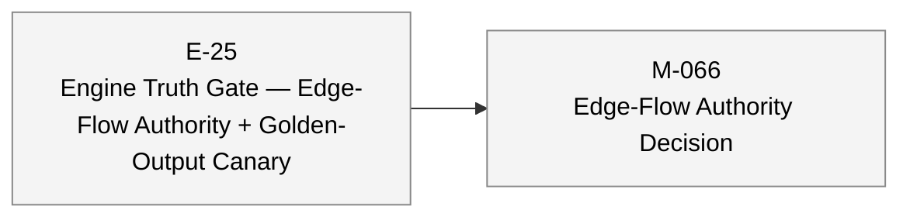

# aiwf status — 2026-05-02

_169 entities · 0 errors · 0 warnings_

## In flight

_(no active epics)_

## Roadmap

### E-13 — Path Analysis & Subgraph Queries _(proposed)_

_(no milestones)_

### E-15 — Telemetry Ingestion, Topology Inference, and Canonical Bundles _(proposed)_

_(no milestones)_

### E-22 — Time Machine — Model Fit & Chunked Evaluation _(proposed)_

_(no milestones)_

### E-25 — Engine Truth Gate — Edge-Flow Authority + Golden-Output Canary _(proposed)_

- **M-066** — Edge-Flow Authority Decision _(draft)_

## Open decisions

_(none)_

## Open gaps

| ID | Title | Discovered in |
|----|-------|---------------|
| G-001 | Path Analysis / Path Filters |  |
| G-002 | Summary Helpers (Edge/Path Analytics) |  |
| G-003 | Dependency Constraint Enforcement (Deferred M-10.03) |  |
| G-004 | dag-map Layout Quality (Svelte UI) |  |
| G-005 | dag-map Features Needed for Svelte UI M5+ |  |
| G-006 | Svelte UI: SVG Performance at Scale |  |
| G-007 | Client-Side Route Derivation for layoutFlow |  |
| G-008 | Router Convergence Guard (Deferred from Phase 1) |  |
| G-009 | Parallelism \`object?\` Typing (Deferred from Phase 1) |  |
| G-010 | Legacy / Compatibility Surface Cleanup |  |
| G-011 | Continuous Prediction / Crystal Ball Usage Pattern |  |
| G-012 | Streaming Epic Not Formalized |  |
| G-013 | E-18 Model Calibration Needs Crystal Ball Design Input |  |
| G-014 | Deferred deletion: Engine \`POST /v1/run\` and \`POST /v1/graph\` |  |
| G-016 | Rust Engine Parity — Evaluation Core Gaps |  |
| G-017 | E-18 Optimization Constraints (no owner milestone) |  |
| G-018 | \`IModelEvaluator\` Series-Key Shape Divergence |  |
| G-019 | Sim-generated model shape vs. Rust engine compiler expectations |  |
| G-020 | Ultrareview findings on \`epic/E-21-svelte-workbench-and-analysis\` (2026-04-20) |  |
| G-022 | Heatmap view — deferred enhancements (m-E21-06 Q&A, 2026-04-23) |  |
| G-023 | Topology DAG has no keyboard nav or ARIA structure (m-E21-06 AC12 homework) |  |
| G-024 | Data-viz palette not validated for color-blindness (m-E21-06 AC12 homework) |  |
| G-025 | Bidirectional card ↔ view selection (reverse cross-link) |  |
| G-026 | Heatmap sliding-window scrubber (Blazor-parity zoom-and-pan) |  |
| G-032 | \`transportation-basic\` regressed: \`edge_flow_mismatch_incoming\` × 3 after E-24 unification |  |
| G-033 | Tests are too weak: surveyed-output-only canaries cannot detect drift; need deterministic golden-output assertions |  |

## Warnings

_(none)_

## Recent activity

| Date | Actor | Verb | Detail |
|------|-------|------|--------|
| 2026-05-02 | human/peter | rename | aiwf rename E-25 slug -> engine-truth-gate |
| 2026-05-02 | human/peter | add | aiwf add epic E-25 'Engine Truth Gate — Edge-Flow Authority + Golden-Output Canary' |
| 2026-05-02 | human/peter | promote | aiwf promote M-062/AC-7 open -> met |
| 2026-05-02 | human/peter | promote | aiwf promote M-062/AC-6 open -> met |
| 2026-05-02 | human/peter | promote | aiwf promote M-062/AC-5 open -> met |

