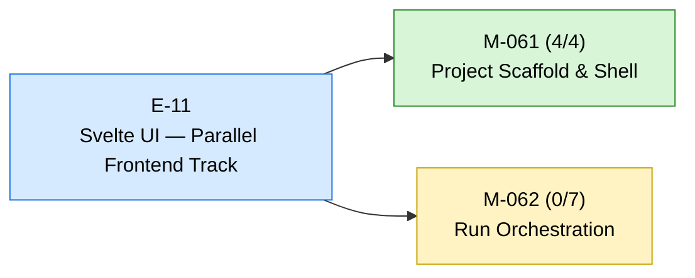
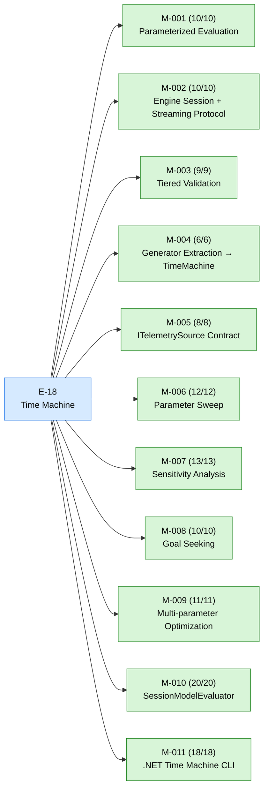

# aiwf status — 2026-05-01

_166 entities · 0 errors · 4 warnings · run `aiwf check` for details_

## In flight

### E-11 — Svelte UI — Parallel Frontend Track _(active)_

- ✓ **M-061** — Project Scaffold & Shell _(done)_ — ACs 4/4 met
- → **M-062** — Run Orchestration _(in_progress)_ — ACs 0/7 met (7 open)

### E-18 — Time Machine _(active)_

- ✓ **M-001** — Parameterized Evaluation _(done)_ — ACs 10/10 met
- ✓ **M-002** — Engine Session + Streaming Protocol _(done)_ — ACs 10/10 met
- ✓ **M-003** — Tiered Validation _(done)_ — ACs 9/9 met
- ✓ **M-004** — Generator Extraction → TimeMachine _(done)_ — ACs 6/6 met
- ✓ **M-005** — ITelemetrySource Contract _(done)_ — ACs 8/8 met
- ✓ **M-006** — Parameter Sweep _(done)_ — ACs 12/12 met
- ✓ **M-007** — Sensitivity Analysis _(done)_ — ACs 13/13 met
- ✓ **M-008** — Goal Seeking _(done)_ — ACs 10/10 met
- ✓ **M-009** — Multi-parameter Optimization _(done)_ — ACs 11/11 met
- ✓ **M-010** — SessionModelEvaluator _(done)_ — ACs 20/20 met
- ✓ **M-011** — .NET Time Machine CLI _(done)_ — ACs 18/18 met

## Roadmap

### E-13 — Path Analysis & Subgraph Queries _(proposed)_

_(no milestones)_

### E-15 — Telemetry Ingestion, Topology Inference, and Canonical Bundles _(proposed)_

_(no milestones)_

### E-22 — Time Machine — Model Fit & Chunked Evaluation _(proposed)_

_(no milestones)_

## Open decisions

_(none)_

## Open gaps

| ID | Title | Discovered in |
|----|-------|---------------|
| G-001 | Path Analysis / Path Filters |  |
| G-002 | Summary Helpers (Edge/Path Analytics) |  |
| G-003 | Dependency Constraint Enforcement (Deferred M-10.03) |  |
| G-004 | dag-map Layout Quality (Svelte UI) |  |
| G-005 | dag-map Features Needed for Svelte UI M5+ |  |
| G-006 | Svelte UI: SVG Performance at Scale |  |
| G-007 | Client-Side Route Derivation for layoutFlow |  |
| G-008 | Router Convergence Guard (Deferred from Phase 1) |  |
| G-009 | Parallelism \`object?\` Typing (Deferred from Phase 1) |  |
| G-010 | Legacy / Compatibility Surface Cleanup |  |
| G-011 | Continuous Prediction / Crystal Ball Usage Pattern |  |
| G-012 | Streaming Epic Not Formalized |  |
| G-013 | E-18 Model Calibration Needs Crystal Ball Design Input |  |
| G-014 | Deferred deletion: Engine \`POST /v1/run\` and \`POST /v1/graph\` |  |
| G-016 | Rust Engine Parity — Evaluation Core Gaps |  |
| G-017 | E-18 Optimization Constraints (no owner milestone) |  |
| G-018 | \`IModelEvaluator\` Series-Key Shape Divergence |  |
| G-019 | Sim-generated model shape vs. Rust engine compiler expectations |  |
| G-020 | Ultrareview findings on \`epic/E-21-svelte-workbench-and-analysis\` (2026-04-20) |  |
| G-021 | \`.codex/\` missing from framework adapter-ignore list (2026-04-20) |  |
| G-022 | Heatmap view — deferred enhancements (m-E21-06 Q&A, 2026-04-23) |  |
| G-023 | Topology DAG has no keyboard nav or ARIA structure (m-E21-06 AC12 homework) |  |
| G-024 | Data-viz palette not validated for color-blindness (m-E21-06 AC12 homework) |  |
| G-025 | Bidirectional card ↔ view selection (reverse cross-link) |  |
| G-026 | Heatmap sliding-window scrubber (Blazor-parity zoom-and-pan) |  |
| G-030 | FFI-based engine evaluator (alternative to subprocess) |  |
| G-031 | Backend language choice for session service |  |
| G-032 | \`transportation-basic\` regressed: \`edge_flow_mismatch_incoming\` × 3 after E-24 unification |  |
| G-033 | Tests are too weak: surveyed-output-only canaries cannot detect drift; need deterministic golden-output assertions |  |

## Warnings

| Code | Entity | Path | Message |
|------|--------|------|---------|
| gap-resolved-has-resolver | G-015 | work/gaps/G-015-silent-no-op-self-match-false-positives-in-m-e19-02-and-m-e19-03-grep-guard-scripts.md | gap is marked addressed but addressed_by is empty |
| gap-resolved-has-resolver | G-027 | work/gaps/G-027-provenanceembedder-parallel-cli-path-sim-dead-code.md | gap is marked addressed but addressed_by is empty |
| gap-resolved-has-resolver | G-028 | work/gaps/G-028-griddefinition-starttimeutc-runtime-side-rename-engine.md | gap is marked addressed but addressed_by is empty |
| gap-resolved-has-resolver | G-029 | work/gaps/G-029-template-layer-legacy-aliases-sim-authoring-time.md | gap is marked addressed but addressed_by is empty |

## Recent activity

| Date | Actor | Verb | Detail |
|------|-------|------|--------|
| 2026-05-01 | human/peter | import | import(spike): 15 epics + 65 milestones + 53 decisions + 33 gaps |

