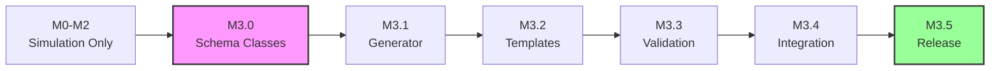
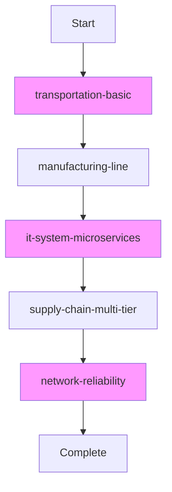

# FlowTime-Sim Time-Travel Implementation Plan
## Chapter 3: Implementation Milestones & Tasks

**Last Updated:** October 9, 2025

---

## 3.1 Milestone Overview

**Note:** M0-M2 completed (simulation-only). All time-travel work is M3.x.

### Versioning Strategy

**Current (M3.x):**
- Schema Version: **1.0** (no breaking changes)
- Model Version: **1.1** (time-travel support)
- Topology: **OPTIONAL** (backward compatible)
- Validation: Conditional (if topology present, validate it)

**Future (Engine schema 1.1):**
- Schema Version: **1.1** (breaking changes)
- Topology: **REQUIRED**



---

## 3.2 M3.0: Schema Foundation

**Objective:** Implement Window and Topology schema classes

**Dependencies:** None

### Tasks

#### M3.0.1: Verification Spike - Parameter Substitution

**Objective:** Verify nested object parameter substitution works

**Implementation:**
1. Create test template:
```yaml
parameters:
  - name: serviceName
    default: "Order"
  - name: startTime
    default: "2025-10-07T00:00:00Z"

window:
  start: ${startTime}

topology:
  nodes:
    - id: ${serviceName}Service
      semantics:
        arrivals: ${serviceName}_arrivals
```

2. Test current SubstituteParameters() method
3. Document findings and any required changes

**Success Criteria:**
- ✅ Nested substitution works OR clear refactoring plan identified

---

#### M3.0.2: Performance Baseline

**Objective:** Establish baseline metrics

**Implementation:**
1. Install BenchmarkDotNet
2. Create `tests/FlowTime.Sim.Benchmarks` project
3. Implement benchmarks:
   - Template loading
   - Parameter substitution
   - Model generation
4. Record baseline results
5. Configure CI integration

**Success Criteria:**
- ✅ Benchmark suite runs successfully
- ✅ Baseline metrics documented

---

#### M3.0.3: Create Feature Branch

**Implementation:**
1. Create branch: `feature/time-travel-m3`
2. Update README with M3.x scope
3. Configure branch protection

**Success Criteria:**
- ✅ Branch created and protected

---

#### M3.0.4: TemplateWindow Class

**Implementation:**

Create `src/FlowTime.Sim.Core/Templates/TemplateWindow.cs`:

```csharp
namespace FlowTime.Sim.Core.Templates
{
    /// <summary>
    /// Absolute time window for time-travel functionality.
    /// </summary>
    public class TemplateWindow
    {
        /// <summary>ISO-8601 UTC timestamp</summary>
        public string Start { get; set; } = string.Empty;
        
        /// <summary>Timezone (must be "UTC")</summary>
        public string Timezone { get; set; } = "UTC";
    }
}
```

Update `Template.cs`:
```csharp
public class Template
{
    // Existing properties...
    
    /// <summary>
    /// Optional window for time-travel (model 1.1+)
    /// </summary>
    public TemplateWindow? Window { get; set; }
    
    /// <summary>
    /// Optional model version (1.1 = time-travel support)
    /// </summary>
    public string? ModelVersion { get; set; }
}
```

**Tests:**
- Serialization/deserialization
- Null handling
- Round-trip YAML conversion

**Success Criteria:**
- ✅ Class compiles and serializes correctly
- ✅ Tests pass

---

#### M3.0.5: Topology Classes

**Implementation:**

Create classes:
- `TemplateTopology.cs`
- `TopologyNode.cs`
- `NodeSemantics.cs`
- `TopologyEdge.cs`
- `UIHint.cs`

**TemplateTopology.cs:**
```csharp
public class TemplateTopology
{
    public List<TopologyNode> Nodes { get; set; } = new();
    public List<TopologyEdge> Edges { get; set; } = new();
}
```

**TopologyNode.cs:**
```csharp
public class TopologyNode
{
    public string Id { get; set; } = string.Empty;
    public string Kind { get; set; } = string.Empty;
    public string? Group { get; set; }
    public UIHint? Ui { get; set; }
    public NodeSemantics Semantics { get; set; } = new();
}
```

**NodeSemantics.cs:**
```csharp
public class NodeSemantics
{
    public string? Arrivals { get; set; }
    public string? Served { get; set; }
    public string? Errors { get; set; }
    public string? Capacity { get; set; }
    public string? Queue { get; set; }
    public string? ExternalDemand { get; set; }
    public double? Q0 { get; set; }
    public double? SlaMin { get; set; }
}
```

**TopologyEdge.cs:**
```csharp
public class TopologyEdge
{
    public string From { get; set; } = string.Empty;
    public string To { get; set; } = string.Empty;
    public double Weight { get; set; } = 1.0;
}
```

**UIHint.cs:**
```csharp
public class UIHint
{
    public int X { get; set; }
    public int Y { get; set; }
}
```

**Tests:**
- Complete topology serialization
- Null semantics handling
- Empty edges list
- Complex nested structures

**Success Criteria:**
- ✅ All classes compile
- ✅ Serialization works
- ✅ Nullable types handled

---

#### M3.0.6: Update TemplateNode

**Implementation:**

Add to `TemplateNode.cs`:
```csharp
/// <summary>Initial value for stateful nodes with SHIFT</summary>
public double? Initial { get; set; }

/// <summary>File source URI (e.g., file:telemetry/data.csv)</summary>
public string? Source { get; set; }
```

**Tests:**
- Initial condition serialization
- Source field serialization
- Interaction with existing fields

**Success Criteria:**
- ✅ Fields serialize correctly
- ✅ Backward compatible with existing nodes

---

#### M3.0.7: Integration Tests

**Implementation:**

Create `tests/FlowTime.Sim.Tests/Templates/SchemaIntegrationTests.cs`:

Test scenarios:
- Complete template with all sections
- Template with window only
- Template with topology only
- Template with neither (backward compatible)
- Round-trip serialization

**Success Criteria:**
- ✅ All integration tests pass
- ✅ Backward compatibility verified

---

### M3.0 Exit Criteria

- ✅ All schema classes implemented and tested
- ✅ Parameter substitution verified
- ✅ Performance baseline established
- ✅ Code review completed
- ✅ Tests achieve high coverage
- ✅ Backward compatibility maintained

**Deliverables:**
- 6 new schema classes
- Updated Template.cs and TemplateNode.cs
- Comprehensive test suite
- Spike report
- Benchmark baseline

---

## 3.3 M3.1: Generator Updates

**Objective:** Preserve window/topology in generated models

**Dependencies:** M3.0 complete

### Tasks

#### M3.1.1: Update ConvertToEngineSchema

**Implementation:**

Modify `NodeBasedTemplateService.cs`:

```csharp
private string ConvertToEngineSchema(string yaml)
{
    var lines = yaml.Split('\n');
    var result = new List<string>();
    bool inMetadataSection = false;
    bool inParametersSection = false;
    int sectionIndentLevel = 0;
    
    foreach (var line in lines)
    {
        var trimmed = line.TrimStart();
        var indentLevel = line.Length - trimmed.Length;
        
        // Skip metadata section
        if (trimmed == "metadata:")
        {
            inMetadataSection = true;
            sectionIndentLevel = indentLevel;
            continue;
        }
        
        // Skip parameters section
        if (trimmed == "parameters:")
        {
            inParametersSection = true;
            sectionIndentLevel = indentLevel;
            continue;
        }
        
        // PRESERVE window section
        if (trimmed == "window:")
        {
            inMetadataSection = false;
            inParametersSection = false;
        }
        
        // PRESERVE topology section
        if (trimmed == "topology:")
        {
            inMetadataSection = false;
            inParametersSection = false;
        }
        
        // Check if exiting skip sections
        if ((inMetadataSection || inParametersSection) && 
            indentLevel <= sectionIndentLevel && 
            !string.IsNullOrWhiteSpace(trimmed))
        {
            inMetadataSection = false;
            inParametersSection = false;
        }
        
        // Skip lines in excluded sections
        if (inMetadataSection || inParametersSection)
            continue;
        
        result.Add(line);
    }
    
    return string.Join('\n', result);
}
```

**Tests:**
- Template with window → output has window
- Template with topology → output has topology
- Template without window/topology → unchanged
- Metadata/parameters removed correctly

**Success Criteria:**
- ✅ Window preserved
- ✅ Topology preserved
- ✅ Metadata/parameters removed
- ✅ Old templates still work

---

#### M3.1.2: Add ModelVersion to Output

**Implementation:**

Update generation to include modelVersion:

```csharp
private Template AddModelVersion(Template template)
{
    // If template has window or topology, set modelVersion to 1.1
    if (template.Window != null || template.Topology != null)
    {
        template.ModelVersion = "1.1";
    }
    else
    {
        // Old templates without time-travel features
        template.ModelVersion = "1.0"; // Or omit?
    }
    
    return template;
}
```

**Tests:**
- Template with topology → modelVersion: 1.1
- Template without topology → modelVersion: 1.0 (or null?)
- Correct YAML output

**Success Criteria:**
- ✅ ModelVersion set appropriately
- ✅ Engine can read modelVersion field

---

#### M3.1.3: Parameter Substitution Validation

**Implementation:**

Based on M3.0.1 spike results:
- If nested substitution works → add comprehensive tests
- If refactoring needed → implement enhanced substitution

Test all substitution scenarios:
- `window.start: ${startTime}`
- `topology.nodes[*].id: ${serviceName}Service`
- `semantics.arrivals: ${serviceName}_arrivals`
- Array values with parameters

**Success Criteria:**
- ✅ Parameters work in all sections
- ✅ String interpolation works
- ✅ Comprehensive test coverage

---

#### M3.1.4: End-to-End Generation Tests

**Implementation:**

Create `GenerationE2ETests.cs`:

```csharp
[TestMethod]
public void GenerateModel_WithTopology_ProducesValidModel()
{
    var service = new NodeBasedTemplateService(validator);
    var parameters = new Dictionary<string, object>
    {
        ["bins"] = 6,
        ["startTime"] = "2025-10-07T00:00:00Z"
    };
    
    var model = service.GenerateModel("test-template", parameters);
    
    Assert.IsNotNull(model.Window);
    Assert.IsNotNull(model.Topology);
    Assert.AreEqual("1.1", model.ModelVersion);
}

[TestMethod]
public void GenerateModel_WithoutTopology_ProducesLegacyModel()
{
    var service = new NodeBasedTemplateService(validator);
    var model = service.GenerateModel("old-template", new Dictionary<string, object>());
    
    Assert.IsNull(model.Window);
    Assert.IsNull(model.Topology);
    Assert.AreEqual("1.0", model.ModelVersion); // Or null?
}
```

**Success Criteria:**
- ✅ End-to-end generation works
- ✅ Model versioning correct
- ✅ All scenarios tested

---

#### M3.1.5: Performance Verification

**Implementation:**

Re-run benchmarks from M3.0.2:
- Compare with baseline
- Identify any performance regressions
- Document results

**Success Criteria:**
- ✅ Performance within acceptable limits
- ✅ Results documented

---

### M3.1 Exit Criteria

- ✅ ConvertToEngineSchema preserves window/topology
- ✅ ModelVersion added to output
- ✅ Parameter substitution works everywhere
- ✅ E2E tests pass
- ✅ Performance acceptable
- ✅ Code review completed

**Deliverables:**
- Updated NodeBasedTemplateService
- E2E test suite
- Performance comparison report

---

## 3.4 M3.2: Template Updates

**Objective:** Update all 5 built-in templates to support time-travel (model 1.1)

**Dependencies:** M3.1 complete

### Strategy

All templates will be updated to include:
- `modelVersion: 1.1`
- `window` section with startTime parameter
- `topology` section with appropriate node types
- Proper semantic mappings



### Tasks

#### M3.2.1: transportation-basic Template

**Objective:** Simplest template with 1 service node

**Implementation:**

```yaml
schemaVersion: 1
modelVersion: 1.1

metadata:
  id: transportation-basic
  title: Basic Transportation System

parameters:
  - name: bins
    type: integer
    default: 6
  - name: startTime
    type: string
    default: "2025-10-07T00:00:00Z"

window:
  start: ${startTime}
  timezone: "UTC"

grid:
  bins: ${bins}
  binSize: 60
  binUnit: minutes

topology:
  nodes:
    - id: TransportService
      kind: service
      group: Transportation
      semantics:
        arrivals: passenger_demand
        served: passengers_served
        capacity: vehicle_capacity
  edges: []

nodes:
  - id: passenger_demand
    kind: const
    values: [10, 15, 20, 25, 18, 12]
  
  - id: vehicle_capacity
    kind: const
    values: [15, 18, 25, 30, 22, 16]
  
  - id: passengers_served
    kind: expr
    expr: "MIN(passenger_demand, vehicle_capacity)"

outputs:
  - series: passenger_demand
    as: demand.csv
  - series: passengers_served
    as: served.csv
```

**Tests:**
- Generation with default parameters
- Generation with custom parameters
- Validation passes
- Correct modelVersion in output

**Success Criteria:**
- ✅ Template generates valid model
- ✅ Topology has 1 service node
- ✅ All semantic references valid

---

#### M3.2.2: manufacturing-line Template

**Objective:** Pipeline topology with sequential stages

**Key Features:**
- 3-4 service nodes (production stages)
- Sequential edges showing flow
- Each stage has capacity

**Topology Structure:**
```yaml
topology:
  nodes:
    - id: Stage1_Cutting
      kind: service
      semantics:
        arrivals: raw_material_input
        served: cut_parts_output
        capacity: cutting_capacity
    
    - id: Stage2_Assembly
      kind: service
      semantics:
        arrivals: cut_parts_output
        served: assembled_units
        capacity: assembly_capacity
    
    - id: Stage3_QualityCheck
      kind: service
      semantics:
        arrivals: assembled_units
        served: quality_passed
        capacity: qc_capacity
        errors: quality_failures
  
  edges:
    - from: "Stage1_Cutting:out"
      to: "Stage2_Assembly:in"
    - from: "Stage2_Assembly:out"
      to: "Stage3_QualityCheck:in"
```

**Success Criteria:**
- ✅ Pipeline topology with 3+ stages
- ✅ Sequential edges correct
- ✅ Error tracking in QC stage

---

#### M3.2.3: it-system-microservices Template

**Objective:** Multi-tier system with service and queue nodes

**Key Features:**
- Load balancer (service)
- Auth service (service)
- Database queue (queue) - demonstrates stateful node
- Initial condition for queue depth
- SLA threshold

**Topology Structure:**
```yaml
topology:
  nodes:
    - id: LoadBalancer
      kind: service
      group: Infrastructure
      ui: { x: 100, y: 200 }
      semantics:
        arrivals: user_requests
        served: load_balanced_requests
        capacity: lb_capacity
    
    - id: AuthService
      kind: service
      group: Authentication
      ui: { x: 300, y: 200 }
      semantics:
        arrivals: load_balanced_requests
        served: authenticated_requests
        capacity: auth_capacity
    
    - id: DatabaseQueue
      kind: queue
      group: Database
      ui: { x: 500, y: 200 }
      semantics:
        arrivals: authenticated_requests
        served: db_processed
        queue: db_queue_depth
        capacity: db_capacity
        q0: 0
        sla_min: 5.0
  
  edges:
    - from: "LoadBalancer:out"
      to: "AuthService:in"
    - from: "AuthService:out"
      to: "DatabaseQueue:in"
```

**Stateful Node:**
```yaml
- id: db_queue_depth
  kind: expr
  expr: "MAX(0, SHIFT(db_queue_depth, 1) + authenticated_requests - db_processed)"
  initial: 0
```

**Success Criteria:**
- ✅ Demonstrates queue node type
- ✅ Initial condition present
- ✅ SLA threshold included
- ✅ UI hints for layout

---

#### M3.2.4: supply-chain-multi-tier Template

**Objective:** Complex routing with weighted edges

**Key Features:**
- Multiple external suppliers
- Central warehouse (router)
- Multiple retailers
- Weighted edges for flow distribution

**Topology Structure:**
```yaml
topology:
  nodes:
    - id: Supplier_A
      kind: external
      semantics:
        external_demand: supplier_a_deliveries
    
    - id: Supplier_B
      kind: external
      semantics:
        external_demand: supplier_b_deliveries
    
    - id: Warehouse
      kind: router
      semantics:
        arrivals: total_warehouse_arrivals
        served: warehouse_shipments
        capacity: warehouse_capacity
    
    - id: Retailer_North
      kind: service
      semantics:
        arrivals: north_region_demand
        served: north_region_sales
        capacity: north_capacity
    
    - id: Retailer_South
      kind: service
      semantics:
        arrivals: south_region_demand
        served: south_region_sales
        capacity: south_capacity
  
  edges:
    - from: "Supplier_A:out"
      to: "Warehouse:in"
      weight: 0.6
    - from: "Supplier_B:out"
      to: "Warehouse:in"
      weight: 0.4
    - from: "Warehouse:out"
      to: "Retailer_North:in"
      weight: 0.7
    - from: "Warehouse:out"
      to: "Retailer_South:in"
      weight: 0.3
```

**Success Criteria:**
- ✅ Multi-tier topology
- ✅ External nodes as suppliers
- ✅ Router node with weighted edges
- ✅ Weights demonstrate flow distribution

---

#### M3.2.5: network-reliability Template

**Objective:** Graph topology with redundant paths

**Key Features:**
- Multiple network nodes
- Redundant paths (multiple edges between nodes)
- Failure tracking (errors)

**Success Criteria:**
- ✅ Graph topology (not linear)
- ✅ Redundant paths shown
- ✅ Error tracking demonstrated

---

#### M3.2.6: Template Test Suite

**Implementation:**

For each template:
- Generate with default parameters
- Generate with custom parameters
- Verify modelVersion = 1.1
- Verify window present
- Verify topology present and valid
- Verify all semantic references exist

**Success Criteria:**
- ✅ All 5 templates generate successfully
- ✅ All template tests pass
- ✅ Template documentation updated

---

### M3.2 Exit Criteria

- ✅ All 5 templates updated to model 1.1
- ✅ Each demonstrates unique topology pattern
- ✅ All semantic mappings valid
- ✅ Template tests pass
- ✅ Documentation updated
- ✅ Code review completed

**Deliverables:**
- 5 updated template YAMLs
- Template test suite
- Updated template documentation

---

## 3.5 M3.3: Validation Framework

**Objective:** Comprehensive validation for topology (when present)

**Dependencies:** M3.2 complete

**Note:** Validation is CONDITIONAL - only validates topology if it exists (backward compatible)

### Tasks

#### M3.3.1: Validation Interface

**Implementation:**

Create `src/FlowTime.Sim.Core/Validation/IValidator.cs`:

```csharp
public interface IValidator
{
    ValidationResult Validate(Template template);
}

public class ValidationResult
{
    public bool IsValid => !Errors.Any();
    public List<ValidationError> Errors { get; set; } = new();
    public List<ValidationWarning> Warnings { get; set; } = new();
    
    public void Merge(ValidationResult other)
    {
        Errors.AddRange(other.Errors);
        Warnings.AddRange(other.Warnings);
    }
}

public class ValidationError
{
    public string Code { get; set; } = string.Empty;
    public string Message { get; set; } = string.Empty;
    public string Path { get; set; } = string.Empty;
    public string? Suggestion { get; set; }
}
```

**Success Criteria:**
- ✅ Interface clear and extensible
- ✅ Supports multiple errors/warnings

---

#### M3.3.2: WindowValidator

**Implementation:**

```csharp
public class WindowValidator : IValidator
{
    public ValidationResult Validate(Template template)
    {
        var result = new ValidationResult();
        
        // If no window, skip (backward compatible)
        if (template.Window == null)
            return result;
        
        ValidateStartFormat(template, result);
        ValidateTimezone(template, result);
        ValidateAlignment(template, result);
        
        return result;
    }
    
    // Implementation details in Chapter 5
}
```

**Error Codes:**
- WIN001: start is empty
- WIN002: Invalid ISO-8601 format
- WIN003: Not UTC (missing Z)
- WIN004: Invalid timezone
- WIN005: Not aligned to bin boundary

**Success Criteria:**
- ✅ All error codes implemented
- ✅ Clear error messages
- ✅ Null window handled (skip validation)

---

#### M3.3.3: TopologyValidator

**Implementation:**

```csharp
public class TopologyValidator : IValidator
{
    public ValidationResult Validate(Template template)
    {
        var result = new ValidationResult();
        
        // If no topology, skip (backward compatible)
        if (template.Topology == null)
            return result;
        
        ValidateNodeIDs(template, result);
        ValidateNodeKinds(template, result);
        ValidateKindSpecificRequirements(template, result);
        
        return result;
    }
}
```

**Error Codes:**
- TOP001: Duplicate node ID
- TOP002: Empty node ID
- TOP003: Missing kind
- TOP004: Invalid kind
- TOP005-013: Kind-specific requirement violations

**Success Criteria:**
- ✅ Node uniqueness validated
- ✅ Kind-specific rules enforced
- ✅ Null topology handled

---

#### M3.3.4: SemanticValidator

**Implementation:**

Validates semantic references point to existing nodes:

```csharp
public class SemanticValidator : IValidator
{
    public ValidationResult Validate(Template template)
    {
        var result = new ValidationResult();
        
        if (template.Topology == null)
            return result;
        
        var nodeIds = template.Nodes.Select(n => n.Id).ToHashSet();
        
        foreach (var topNode in template.Topology.Nodes)
        {
            ValidateSemanticReferences(topNode, nodeIds, result);
        }
        
        ValidateQ0Consistency(template, result);
        
        return result;
    }
}
```

**Error Codes:**
- SEM001: Reference to unknown node
- SEM002: q0 vs initial mismatch
- SEM003: Conflicting semantic roles

**Success Criteria:**
- ✅ All semantic references validated
- ✅ Helpful suggestions for typos
- ✅ Consistency checks pass

---

#### M3.3.5: EdgeValidator

**Implementation:**

Validates edges and detects cycles:

```csharp
public class EdgeValidator : IValidator
{
    public ValidationResult Validate(Template template)
    {
        var result = new ValidationResult();
        
        if (template.Topology == null || !template.Topology.Edges.Any())
            return result;
        
        ValidateEdgeReferences(template, result);
        ValidateSelfLoops(template, result);
        ValidateCycles(template, result);
        ValidateWeightSums(template, result);
        
        return result;
    }
}
```

**Error Codes:**
- EDG001: Unknown source node
- EDG002: Unknown target node
- EDG003: Self-loop
- EDG004: Undelayed cycle
- EDG005: Weight sum warning

**Success Criteria:**
- ✅ Edge references validated
- ✅ Cycle detection works
- ✅ Allows delayed cycles (with SHIFT)

---

#### M3.3.6: ValidationOrchestrator

**Implementation:**

```csharp
public class ValidationOrchestrator
{
    private readonly List<IValidator> _validators;
    
    public ValidationOrchestrator()
    {
        _validators = new List<IValidator>
        {
            new WindowValidator(),
            new TopologyValidator(),
            new SemanticValidator(),
            new EdgeValidator(),
            new ParameterValidator()
        };
    }
    
    public ValidationResult ValidateAll(Template template)
    {
        var result = new ValidationResult();
        
        foreach (var validator in _validators)
        {
            var validatorResult = validator.Validate(template);
            result.Merge(validatorResult);
        }
        
        return result;
    }
}
```

**Success Criteria:**
- ✅ All validators coordinated
- ✅ Errors accumulated
- ✅ Performance acceptable

---

#### M3.3.7: Integration with Template Service

**Implementation:**

Update `NodeBasedTemplateService`:

```csharp
public string GenerateModel(string templateId, Dictionary<string, object> parameters)
{
    // Load template
    var template = LoadTemplate(templateId);
    
    // Substitute parameters
    var yaml = SubstituteParameters(template, parameters);
    template = ParseTemplate(yaml);
    
    // Validate (conditional on topology presence)
    var orchestrator = new ValidationOrchestrator();
    var result = orchestrator.ValidateAll(template);
    
    if (!result.IsValid)
    {
        throw new ValidationException(FormatErrors(result.Errors));
    }
    
    // Convert and return
    return ConvertToEngineSchema(yaml);
}
```

**Success Criteria:**
- ✅ Validation runs before generation
- ✅ Clear error messages
- ✅ Templates without topology skip topology validation

---

### M3.3 Exit Criteria

- ✅ All validators implemented
- ✅ Error catalog complete (29 error codes)
- ✅ Integration with template service
- ✅ Conditional validation works (backward compatible)
- ✅ Performance acceptable
- ✅ Tests pass
- ✅ Code review completed

**Deliverables:**
- 4 validator classes
- ValidationOrchestrator
- Integrated validation
- Error catalog documentation

---

## 3.6 M3.4: Integration & Testing

**Objective:** Verify generated models work with Engine M3.x

**Dependencies:** M3.3 complete, Engine M3.x available

### Tasks

#### M3.4.1: Engine Integration Tests

**Implementation:**

```csharp
[TestClass]
[TestCategory("EngineIntegration")]
public class EngineIntegrationTests
{
    [TestMethod]
    public async Task GeneratedModel_LoadsInEngine()
    {
        // Generate model from template
        var model = GenerateModel("transportation-basic");
        
        // POST to Engine
        var response = await EngineClient.PostAsync("/v1/runs", model);
        
        // Verify accepted
        Assert.IsTrue(response.IsSuccessStatusCode);
        var runId = await response.Content.ReadAsStringAsync();
        Assert.IsFalse(string.IsNullOrEmpty(runId));
    }
    
    [TestMethod]
    public async Task StateAPI_ReturnsTopology()
    {
        var runId = await CreateRun("transportation-basic");
        
        // Call /state API
        var state = await EngineClient.GetAsync($"/v1/runs/{runId}/state?bin=0");
        var stateData = await state.Content.ReadAsJsonAsync();
        
        // Verify topology in response
        Assert.IsNotNull(stateData.topology);
        Assert.IsNotNull(stateData.topology.nodes);
        Assert.IsTrue(stateData.topology.nodes.Count > 0);
    }
}
```

**Success Criteria:**
- ✅ Models load without errors
- ✅ /state API returns topology
- ✅ Timestamps computed correctly

---

#### M3.4.2: Performance Benchmarks

**Implementation:**

Compare with baseline from M3.0.2:
- Template loading
- Parameter substitution
- Model generation
- Validation overhead

**Success Criteria:**
- ✅ Performance within acceptable limits
- ✅ No major regressions
- ✅ Results documented

---

#### M3.4.3: Backward Compatibility Tests

**Implementation:**

```csharp
[TestMethod]
public void OldTemplate_WithoutTopology_StillWorks()
{
    var oldTemplate = @"
schemaVersion: 1
grid:
  bins: 6
nodes:
  - id: demand
    kind: const
    values: [10, 20, 30, 40, 50, 60]
";
    
    var template = ParseTemplate(oldTemplate);
    var orchestrator = new ValidationOrchestrator();
    
    // Should NOT fail validation (topology is optional)
    var result = orchestrator.ValidateAll(template);
    Assert.IsTrue(result.IsValid);
    
    // Should generate with modelVersion 1.0 (or null)
    var model = GenerateModel(template);
    Assert.IsFalse(model.Contains("window:"));
    Assert.IsFalse(model.Contains("topology:"));
}
```

**Success Criteria:**
- ✅ Old templates work unchanged
- ✅ Validation skips topology checks for old templates
- ✅ ModelVersion correctly set

---

### M3.4 Exit Criteria

- ✅ Engine integration tests pass
- ✅ Performance acceptable
- ✅ Backward compatibility verified
- ✅ All test categories pass

**Deliverables:**
- Engine integration test suite
- Performance report
- Backward compatibility test suite

---

## 3.7 M3.5: Documentation & Release

**Objective:** Complete documentation and prepare release

**Dependencies:** M3.4 complete

### Tasks

#### M3.5.1: Update Template Authoring Guide

**Content:**
- Model version 1.1 overview
- Window section specification
- Topology section specification
- Node kinds and semantics
- Example templates
- Best practices

**Success Criteria:**
- ✅ Guide covers all new features
- ✅ Examples demonstrate each topology pattern
- ✅ Clear migration path for existing templates

---

#### M3.5.2: API Documentation

**Content:**
- Updated schema documentation
- ModelVersion field explanation
- Validation error reference
- Breaking vs non-breaking changes

**Success Criteria:**
- ✅ All API changes documented
- ✅ Schema reference complete

---

#### M3.5.3: Validation Error Catalog

**Content:**
- All 29 error codes
- Description for each error
- Example that triggers error
- How to fix

**Success Criteria:**
- ✅ Complete error catalog
- ✅ Examples for each error
- ✅ Fix guidance provided

---

#### M3.5.4: Release Notes

**Content:**
- Model version 1.1 announcement
- Time-travel functionality overview
- Schema changes summary
- Backward compatibility notes
- Migration guide (if needed)

**Success Criteria:**
- ✅ Release notes complete
- ✅ Clear communication of changes

---

### M3.5 Exit Criteria

- ✅ All documentation updated
- ✅ Examples demonstrate time-travel features
- ✅ Validation errors cataloged
- ✅ Release notes prepared
- ✅ Ready for deployment

**Deliverables:**
- Updated template authoring guide
- API documentation
- Validation error catalog
- Release notes

---

## 3.8 Implementation Checklist

### M3.0 Checklist
- [ ] Parameter substitution spike complete
- [ ] Performance baseline established
- [ ] Feature branch created
- [ ] All schema classes implemented
- [ ] Tests pass
- [ ] Code review completed

### M3.1 Checklist
- [ ] ConvertToEngineSchema updated
- [ ] ModelVersion added to output
- [ ] Parameter substitution validated
- [ ] E2E tests pass
- [ ] Performance verified

### M3.2 Checklist
- [ ] transportation-basic updated
- [ ] manufacturing-line updated
- [ ] it-system-microservices updated
- [ ] supply-chain-multi-tier updated
- [ ] network-reliability updated
- [ ] All template tests pass

### M3.3 Checklist
- [ ] WindowValidator implemented
- [ ] TopologyValidator implemented
- [ ] SemanticValidator implemented
- [ ] EdgeValidator implemented
- [ ] ValidationOrchestrator complete
- [ ] Integration with template service

### M3.4 Checklist
- [ ] Engine integration tests pass
- [ ] Performance benchmarks complete
- [ ] Backward compatibility verified

### M3.5 Checklist
- [ ] Template authoring guide updated
- [ ] API documentation complete
- [ ] Validation error catalog created
- [ ] Release notes prepared

---

**End of Chapter 3**

**Next:** Chapter 4 - Schema Extensions Reference