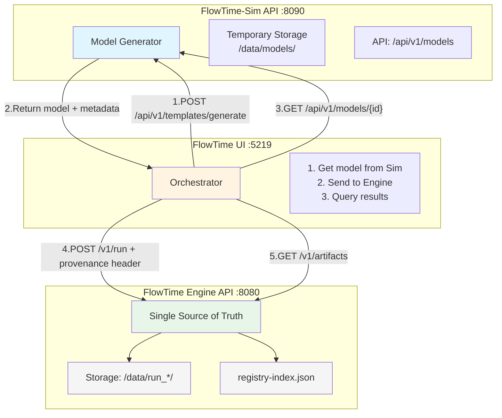
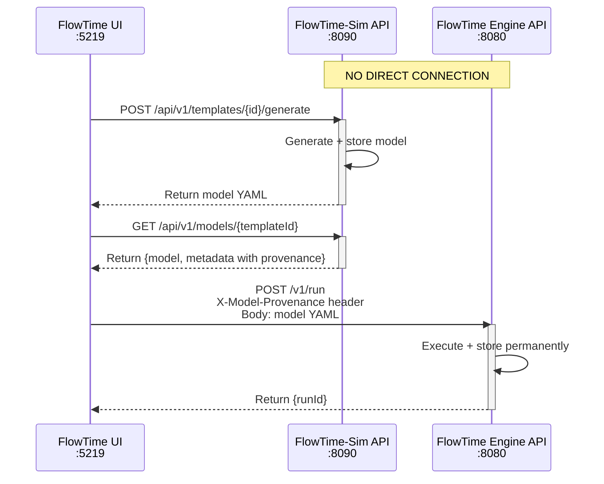
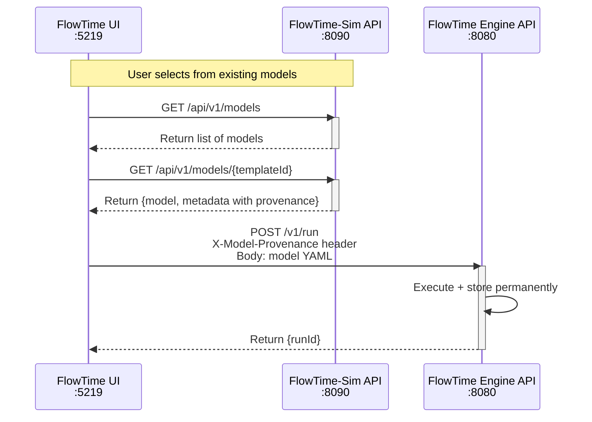
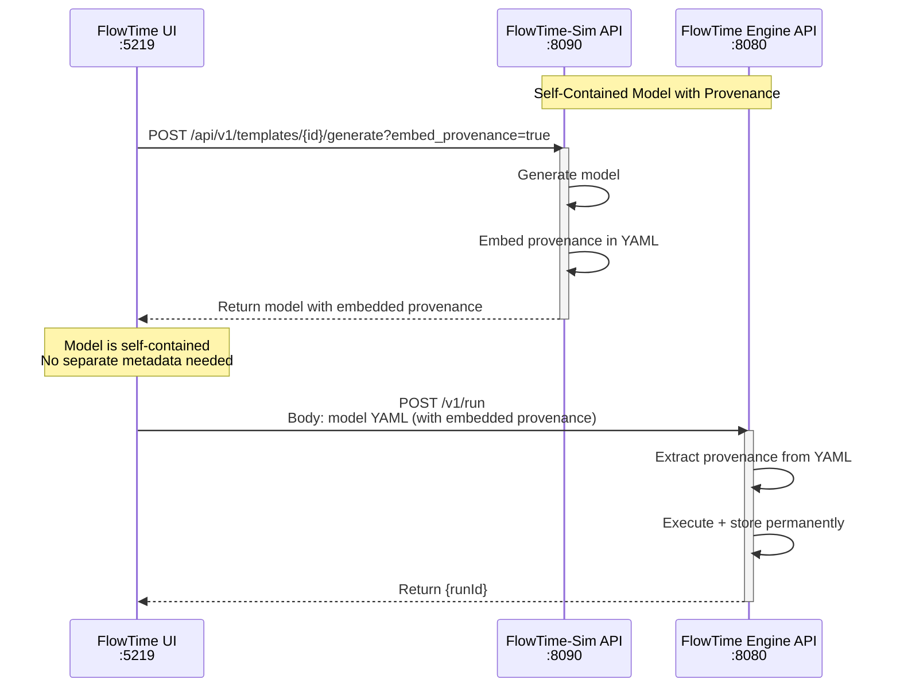
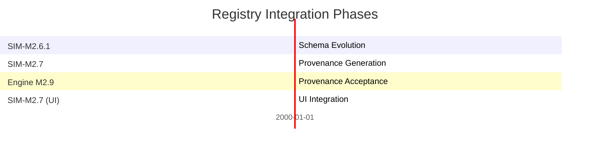

# Registry Integration: Single Source of Truth

**Status:** Proposed Architecture  
**Supersedes:** Original model-provenance.md dual-registry approach

---

## Executive Summary

**KISS Principle:** Engine owns the artifacts registry. Sim stores generated models temporarily for UI retrieval, then UI sends models WITH provenance to Engine for execution and permanent storage.

**Key Insight:** Why maintain two registries when Engine already has one? Sim provides temporary storage for UI workflows, Engine stores and executes them permanently.

---

## Current State Analysis

### ✅ What Engine Already Has (M2.7)

Engine has a **working, production-ready** artifacts registry with the following capabilities:

**Endpoints already available:**
```bash
GET  /v1/artifacts                    # List all artifacts
GET  /v1/artifacts?type=run           # Filter by type
GET  /v1/artifacts?search=text        # Search artifacts
POST /v1/artifacts/index              # Rebuild index
GET  /v1/artifacts/{id}               # Get specific artifact
GET  /v1/artifacts/{id}/files         # List artifact files
GET  /v1/artifacts/{id}/files/{name}  # Download file
```

**Registry structure:**
```
/data/
├── registry-index.json          # ✅ Already exists
├── run_*/                       # ✅ Already managed
│   ├── manifest.json
│   ├── run.json
│   ├── spec.yaml
│   └── series/
└── models/                      # 🆕 Add for Sim-generated models
    └── {model_id}/
        ├── model.yaml           # Model content
        ├── provenance.json      # Sim metadata
        └── catalog.json         # Model catalog
```

### ❌ What Original Provenance Doc Proposed (OVER-ENGINEERED)

The original `model-provenance.md` proposed:

```
❌ Separate Sim model registry (/data/models/ in SIM repo)
❌ Sim registry-index.json
❌ Sim /api/v1/models endpoints
❌ Cross-registry synchronization
❌ Registry health monitoring between services
❌ Duplicate storage of models
```

**Problems with dual-registry approach:**
- Complexity: Two registries to maintain
- Synchronization: Cross-service coordination needed
- Duplication: Models stored in both places
- Coupling: Services tightly coupled via registry sync
- Failure modes: What if sync fails? Which is source of truth?

---

## KISS Architecture: Single Registry

### Core Principle

**Engine is the source of truth for all artifacts (models + runs + telemetry).**

Sim is a **model generator with temporary storage** that:
1. Generates model YAML from templates
2. Creates provenance metadata (templateId, parameters, modelHash, timestamp)
3. Stores models temporarily in `/data/models/{templateId}/{hashPrefix}/`
4. Exposes models via API for UI retrieval (`/api/v1/models`)
5. UI retrieves model + metadata from Sim
6. UI posts to Engine `/v1/run` with model + provenance
7. Engine stores everything permanently in its registry

### Architecture Diagram

**CRITICAL: Sim and Engine DO NOT talk to each other directly. UI orchestrates everything.**



### Service Communication Sequence

**Option 1: Generate and Execute Immediately**



**Option 2: Retrieve and Execute Existing Model**



**Option 3: Generate with Embedded Provenance**



**Key Points:** 
- UI can choose immediate `/generate` response OR retrieve from Sim's temporary storage
- Provenance can be delivered separately (header) OR embedded (in YAML)
- Embedded provenance creates self-contained model files

### Service Responsibilities

```mermaid
graph LR
    subgraph "Sim Responsibilities"
        S1[Generate model YAML]
        S2[Create provenance metadata]
        S3[Store models temporarily]
        S4[Expose via /models API]
    end
    
    subgraph "Sim Does NOT"
        SN1[❌ Call Engine API]
        SN2[❌ Store permanently]
        SN3[❌ Maintain artifact registry]
    end
    
    subgraph "Engine Responsibilities"
        E1[Execute models]
        E2[Store artifacts]
        E3[Maintain registry]
        E4[Serve via API]
    end
    
    subgraph "UI Responsibilities"
        U1[Orchestrate workflow]
        U2[Capture provenance]
        U3[Display results]
    end
    
    style S1 fill:#e1f5ff
    style S2 fill:#e1f5ff
    style S3 fill:#e1f5ff
    style SN1 fill:#ffebee
    style SN2 fill:#ffebee
    style SN3 fill:#ffebee
    style E1 fill:#e8f5e9
    style E2 fill:#e8f5e9
    style E3 fill:#e8f5e9
    style E4 fill:#e8f5e9
    style U1 fill:#fff4e1
    style U2 fill:#fff4e1
    style U3 fill:#fff4e1
```



---

## Provenance Metadata (SIM-M2.7)

### Overview

Provenance metadata enables complete traceability from template to execution run. Every model generated by FlowTime-Sim includes metadata that tracks its origin, parameters, and generation context.

### Metadata Schema

**JSON Structure** (Schema Version 1):

```json
{
  "source": "flowtime-sim",
  "modelId": "model_20251002T103045Z_a3f8c2d1",
  "templateId": "it-system-microservices",
  "templateVersion": "1.0",
  "templateTitle": "IT System with Microservices",
  "parameters": {
    "requestRate": 150,
    "bins": 12,
    "binMinutes": 60,
    "seed": 42
  },
  "generatedAt": "2025-10-02T10:30:45.1234567Z",
  "generator": "flowtime-sim/0.5.0",
  "schemaVersion": "1"
}
```

**Field Descriptions:**

| Field | Type | Description |
|-------|------|-------------|
| `source` | string | Always "flowtime-sim" for Sim-generated models |
| `modelId` | string | Unique identifier: `model_{timestamp}_{hash}` |
| `templateId` | string | Source template identifier |
| `templateVersion` | string | Template version (currently "1.0") |
| `templateTitle` | string | Human-readable template name |
| `parameters` | object | Parameters used (empty `{}` if defaults) |
| `generatedAt` | string | ISO8601 UTC timestamp with subsecond precision |
| `generator` | string | Format: `flowtime-sim/{version}` |
| `schemaVersion` | string | Provenance schema version (currently "1") |

### Model ID Format

**Pattern:** `model_{timestamp}_{hash}`

**Example:** `model_20251002T103045Z_a3f8c2d1`

**Components:**
- `model_` - Fixed prefix
- `{timestamp}` - UTC ISO8601 basic format (YYYYMMDDTHHmmssZ)
- `{hash}` - First 8 hex characters of SHA-256 hash

**Properties:**
- **Uniqueness**: Timestamp ensures uniqueness even with identical parameters
- **Determinism**: Same template + parameters = same hash portion
- **Traceability**: Can track multiple runs of the same logical configuration
- **Culture-invariant**: Uses InvariantCulture throughout

**Hash Calculation:**
```
Input: "{templateId}:{sortedParametersJson}"
Example: "transportation-basic:{"bins":12,"seed":42}"
Algorithm: SHA-256
Output: First 8 hex characters
```

### Provenance Flow

```mermaid
sequenceDiagram
    participant UI
    participant Sim as FlowTime-Sim
    participant Engine as FlowTime Engine
    
    UI->>Sim: POST /api/v1/templates/{id}/generate
    activate Sim
    Sim->>Sim: 1. Generate model YAML
    Sim->>Sim: 2. Create provenance metadata
    Sim->>Sim: 3. Calculate model ID hash
    Sim-->>UI: {model, provenance}
    deactivate Sim
    
    Note over UI: UI captures provenance.modelId
    
    UI->>Engine: POST /v1/run (model YAML)
    activate Engine
    Note over UI,Engine: Provenance can be sent as:<br/>- HTTP header<br/>- Embedded in YAML<br/>- Separate file
    Engine->>Engine: Execute and store
    Engine-->>UI: {runId}
    deactivate Engine
    
    Note over Engine: Stored: runId → modelId → provenance
```



### Delivery Modes

**Mode 1: Separate Provenance** (Default)

```
POST /api/v1/templates/{id}/generate
Response:
{
  "model": "schemaVersion: 1\ngrid:\n  bins: 12\n...",
  "provenance": { /* metadata object */ }
}
```

UI receives model and provenance separately, can forward provenance to Engine via HTTP header or store separately.

**Mode 2: Embedded Provenance**

```
POST /api/v1/templates/{id}/generate?embed_provenance=true
Response:
{
  "model": "schemaVersion: 1\n\n# === Model Provenance ===\nprovenance:\n  source: flowtime-sim\n  modelId: model_...\n\ngrid:\n  bins: 12\n...",
  "provenance": { /* same metadata also in response */ }
}
```

Provenance embedded as structured YAML section. Model is self-contained.

**Mode 3: CLI Separate File**

```bash
flow-sim generate --id transportation-basic \
  --out model.yaml \
  --provenance provenance.json
```

Generates two files: clean model YAML + separate provenance JSON.

### Traceability Chain


**Query Flow:**
1. Given a `runId`, query Engine for run details → get `modelId`
2. Given `modelId`, query Engine for provenance → get `templateId` and `parameters`
3. Can regenerate exact same model using original template + parameters
4. Enables "run again with same configuration" feature

### Schema Evolution

**Current:** Schema Version 1

All provenance includes `"schemaVersion": "1"`.

**Future Considerations:**
- If schema evolves, `schemaVersion` will increment
- Breaking changes documented in release notes
- Consumers should validate `schemaVersion` field

---

## Implementation Details

### Sim Changes: Generate Provenance Only

**What Sim needs to add:**

- `ProvenanceMetadata` class with fields:
  - `source`: "flowtime-sim"
  - `model_id`: model_{timestamp}_{hash}
  - `template_id`, `template_version`, `template_title`
  - `parameters`: user-provided values
  - `generated_at`: timestamp
  - `sim_version`, `schema_version`

- Enhanced `/generate` endpoint response format:
  - `model`: YAML content string
  - `provenance`: ProvenanceMetadata object

**Sim API flow (Separate Provenance):**

```bash
# 1. Generate model with parameters
POST /api/v1/templates/it-system-microservices/generate
Content-Type: application/json

{
  "parameters": {
    "bins": 12,
    "binSize": 1,
    "binUnit": "hours",
    "loadBalancerCapacity": 300
  }
}

# 2. Sim responds with model + provenance separately
HTTP/1.1 200 OK
Content-Type: application/json

{
  "model": "schemaVersion: 1\ngrid:\n  bins: 12\n...",
  "provenance": {
    "source": "flowtime-sim",
    "model_id": "model_20251001T120000Z_abc123",
    "template_id": "it-system-microservices",
    "template_version": "1.0",
    "parameters": { "bins": 12, "binSize": 1, "binUnit": "hours", ... },
    "generated_at": "2025-10-01T12:00:00Z",
    "sim_version": "0.5.0",
    "schema_version": "1"
  }
}

# 3. UI/CLI posts to Engine with header
POST http://engine:8080/v1/run
Content-Type: application/x-yaml
X-Model-Provenance: {"source":"flowtime-sim","model_id":"model_20251001T120000Z_abc123",...}

schemaVersion: 1
grid:
  bins: 12
  binSize: 1
  binUnit: hours
nodes:
  - id: load-balancer
    ...
```

**Sim API flow (Embedded Provenance):**

```bash
# 1. Generate model with embed_provenance=true
POST /api/v1/templates/it-system-microservices/generate?embed_provenance=true
Content-Type: application/json

{
  "parameters": {
    "bins": 12,
    "binSize": 1,
    "binUnit": "hours",
    "loadBalancerCapacity": 300
  }
}

# 2. Sim responds with embedded provenance in model YAML
HTTP/1.1 200 OK
Content-Type: application/json

{
  "model": "schemaVersion: 1\n\nprovenance:\n  source: flowtime-sim\n  model_id: model_20251001T120000Z_abc123\n  ...\n\ngrid:\n  bins: 12\n  ..."
}

# 3. UI/CLI posts self-contained model to Engine
POST http://engine:8080/v1/run
Content-Type: application/x-yaml

schemaVersion: 1

provenance:
  source: flowtime-sim
  model_id: model_20251001T120000Z_abc123
  template_id: it-system-microservices
  template_version: "1.0"
  generated_at: "2025-10-01T12:00:00Z"
  generator: "flowtime-sim/0.5.0"
  schema_version: "1"
  parameters:
    bins: 12
    binSize: 1
    binUnit: hours
    loadBalancerCapacity: 300

grid:
  bins: 12
  binSize: 1
  binUnit: hours
nodes:
  - id: load-balancer
    ...
```

**What Sim DOES provide:**
- ✅ Temporary model storage (for UI retrieval)
- ✅ Model retrieval API (`/api/v1/models`)
- ✅ Metadata with provenance information
- ✅ Hash-based model deduplication

**Sim Model Storage API:**

```bash
# List all generated models
GET /api/v1/models

Response:
{
  "models": [
    {
      "templateId": "it-system-microservices",
      "path": "/data/models/it-system-microservices/abc12345/model.yaml",
      "size": 2048,
      "modifiedUtc": "2025-10-01T12:00:00Z",
      "contentType": "application/x-yaml",
      "modelHash": "sha256:abc123..."
    }
  ]
}

# Get specific model by template ID (returns most recent)
GET /api/v1/models/{templateId}

Response:
{
  "templateId": "it-system-microservices",
  "model": "schemaVersion: 1\\ngrid:\\n  bins: 12\\n...",
  "path": "/data/models/it-system-microservices/abc12345/model.yaml",
  "size": 2048,
  "modifiedUtc": "2025-10-01T12:00:00Z",
  "modelHash": "sha256:abc123..."
}
```

**Metadata Storage:**

Each model has accompanying `metadata.json`:
```json
{
  "templateId": "it-system-microservices",
  "parameters": {
    "bins": 12,
    "binSize": 1,
    "binUnit": "hours",
    "loadBalancerCapacity": 300
  },
  "modelHash": "sha256:abc123...",
  "generatedAtUtc": "2025-10-01T12:00:00.000Z"
}
```

**What Sim does NOT need:**
- ❌ Permanent artifact storage (Engine's job)
- ❌ Artifact registry index (Engine's job)
- ❌ Cross-service synchronization
- ❌ Health monitoring
- ❌ Run execution capabilities

### Engine Changes: Accept and Store Provenance

**Enhanced `/v1/run` endpoint:**

Engine supports TWO provenance delivery methods:

**Option 1: HTTP Header**
```
X-Model-Provenance: <JSON provenance metadata>
```

**Option 2: Embedded in YAML**
```yaml
schemaVersion: 1

provenance:
  source: flowtime-sim
  model_id: model_...
  # ... provenance fields

grid:
  # ... model spec
```

Processing flow:
1. Parse model YAML (existing)
2. Extract provenance from header OR embedded section (new)
3. Execute model (existing)
4. Store artifacts including provenance (enhanced)
5. Update registry (existing)

**Enhanced artifact storage structure:**

```
/data/run_{timestamp}_{hash}/
├── spec.yaml          # Model from Sim
├── provenance.json    # 🆕 NEW: Sim metadata
├── manifest.json      # Execution metadata
├── run.json           # Run info
└── series/            # Telemetry data
```

**Enhanced registry metadata:**

Registry index entries now include:
- `source`: "flowtime-sim" or "engine"
- `metadata.template_id`: Template identifier
- `metadata.template_title`: Human-readable template name
- `metadata.model_id`: Unique model identifier from Sim
- `metadata.sim_version`: Version of Sim that generated model
- `metadata.parameters`: Template parameters used

---

## Query Capabilities

### Finding Sim-Generated Models

```bash
# All artifacts from Sim
GET /v1/artifacts?source=flowtime-sim

# Artifacts from specific template
GET /v1/artifacts?metadata.template_id=it-system-microservices

# Artifacts with specific parameter values
GET /v1/artifacts?search=binSize:1

# Compare runs from same template
GET /v1/artifacts?metadata.template_id=manufacturing-line&sortBy=created
```

### Provenance Traceability

```bash
# Get specific run with full provenance
GET /v1/artifacts/{runId}

# Response includes provenance in metadata:
{
  "id": "run_20251001T120000Z_abc123",
  "type": "run",
  "source": "flowtime-sim",
  "created": "2025-10-01T12:00:00Z",
  "metadata": {
    "template_id": "it-system-microservices",
    "template_title": "IT System - Microservices",
    "model_id": "model_20251001T115959Z_def456",
    "sim_version": "0.5.0",
    "parameters": {
      "bins": 12,
      "binSize": 1,
      "binUnit": "hours",
      "loadBalancerCapacity": 300
    }
  }
}

# Download provenance file directly
GET /v1/artifacts/{runId}/files/provenance.json
```

---

## Benefits of KISS Architecture

### Comparison Matrix

```mermaid
graph TD
    subgraph "KISS Benefits"
        B1[✅ Single registry<br/>Engine owns it]
        B2[✅ No synchronization<br/>complexity]
        B3[✅ No duplicate<br/>storage]
        B4[✅ Clear ownership<br/>Engine = artifacts<br/>Sim = generation]
        B5[✅ Stateless Sim<br/>scales horizontally]
        B6[✅ Single source<br/>of truth]
    end
    
    subgraph "Dual-Registry Problems"
        P1[❌ Two registries<br/>to maintain]
        P2[❌ Cross-service<br/>synchronization]
        P3[❌ Models stored<br/>twice]
        P4[❌ Unclear<br/>source of truth]
        P5[❌ Stateful Sim<br/>scaling issues]
        P6[❌ Sync failures<br/>possible]
    end
    
    style B1 fill:#e8f5e9
    style B2 fill:#e8f5e9
    style B3 fill:#e8f5e9
    style B4 fill:#e8f5e9
    style B5 fill:#e8f5e9
    style B6 fill:#e8f5e9
    style P1 fill:#ffebee
    style P2 fill:#ffebee
    style P3 fill:#ffebee
    style P4 fill:#ffebee
    style P5 fill:#ffebee
    style P6 fill:#ffebee
```



### ✅ Simplicity
- **Single registry** (Engine owns it)
- **No synchronization** complexity
- **No duplicate storage**
- **Clear ownership** (Engine = artifacts, Sim = generation)

### ✅ Reliability
- **Single source of truth**
- **No sync failures**
- **Provenance always with run**
- **Standard Engine backup/restore**

### ✅ Scalability
- **Stateless Sim** (can scale horizontally)
- **Engine registry** already optimized
- **No cross-service coordination**

### ✅ Maintainability
- **Leverage existing Engine registry** (don't reinvent)
- **Standard REST API** (no custom protocols)
- **Clear separation** (Sim generates, Engine executes/stores)

---

## Migration from Dual-Registry Proposal

### What Changes in SIM-M2.6.1 (Schema Evolution)

**Schema updates only:**
- ✅ Remove `binMinutes` conversion layer
- ✅ Support `binSize`/`binUnit` format natively
- ✅ Update templates and examples

### What Changes in SIM-M2.7 (Provenance Integration)

**Already Implemented (v0.4.0):**
- ✅ Temporary model storage (`/data/models/{templateId}/{hashPrefix}/`)
- ✅ Model retrieval API (`GET /api/v1/models`, `GET /api/v1/models/{templateId}`)
- ✅ Metadata storage with provenance (`metadata.json` with templateId, parameters, modelHash, timestamp)
- ✅ Hash-based model deduplication

**Enhance in SIM-M2.7:**
- ✅ Add additional provenance fields to metadata.json (template version, template title, schema version, sim version)
- ✅ Enhanced `/generate` endpoint to return provenance in response body
- ✅ Support embedded provenance via `?embed_provenance=true` query parameter
- ✅ CLI option to save provenance separately (`--provenance <file>`)
- ✅ CLI option to embed provenance in model YAML (`--embed-provenance`)
- ✅ Document UI workflows for model retrieval and reuse

**Provenance Delivery Options:**
- **Separate**: Return `{model, provenance}` separately (default)
- **Embedded**: Return model with provenance section embedded in YAML (`?embed_provenance=true`)
- **Choice**: UI/CLI can choose which method to use

**Don't implement:**
- ❌ Permanent artifact storage (Engine's job)
- ❌ Artifact registry index like Engine's (Engine's job)
- ❌ Cross-service synchronization
- ❌ Health monitoring between services

**Add to Engine (M2.9 coordination):**
- ✅ Accept `X-Model-Provenance` header in Engine `/v1/run`
- ✅ Accept embedded provenance in model YAML (alternative method)
- ✅ Store `provenance.json` in run artifacts
- ✅ Enhanced registry metadata extraction
- ✅ UI support for provenance display

**Don't implement:**
- ❌ Separate Sim registry service
- ❌ Auto-registration workflow
- ❌ Cross-service sync

---

## Implementation Phases



### Phase 1: SIM-M2.6.1 - Schema Evolution
**Scope:** Update to binSize/binUnit format

- [ ] Remove `binMinutes` conversion layer
- [ ] Update templates to use `binSize`/`binUnit`
- [ ] Update examples and tests
- [ ] Update documentation

### Phase 2: SIM-M2.7 - Provenance Generation (Sim-Side)
**Scope:** Enhance provenance metadata generation

- [ ] Enhance metadata.json with additional provenance fields
- [ ] Generate unique `model_id` for each model
- [ ] Enhance `/api/v1/templates/{id}/generate` to return provenance
- [ ] Update CLI to optionally save model + provenance locally
- [ ] Add provenance unit tests

### Phase 3: Engine M2.9 - Provenance Acceptance (Engine-Side)
**Scope:** Accept and store provenance from Sim  
**Note:** Coordinate with Engine team

- [ ] Accept `X-Model-Provenance` header in `/v1/run`
- [ ] Store `provenance.json` in run artifacts
- [ ] Enhanced registry scanning for provenance
- [ ] Add provenance to artifact metadata
- [ ] Update registry tests

### Phase 4: SIM-M2.7 - Integration & UI (Cross-Service)
**Scope:** UI orchestration and provenance queries

- [ ] UI: Retrieve models from Sim `/api/v1/models`
- [ ] UI: Extract provenance from Sim metadata
- [ ] UI: Send model + provenance to Engine `/v1/run`
- [ ] UI: Display provenance in run details
- [ ] UI: Filter runs by template/parameters
- [ ] End-to-end integration tests

---

## Comparison: Dual-Registry vs KISS

| Aspect | Dual-Registry (Original) | KISS (Proposed) |
|--------|-------------------------|-----------------|
| **Registries** | 2 (Sim + Engine) | 1 (Engine only) |
| **Storage** | Models in Sim, Runs in Engine | Temporary in Sim, Permanent in Engine |
| **Synchronization** | Required (complex) | None needed |
| **Source of Truth** | Unclear (which registry?) | Clear (Engine) |
| **Sim Complexity** | High (registry management) | Low (temporary storage + API) |
| **Failure Modes** | Sync failures, conflicts | Standard HTTP errors |
| **Scalability** | Limited (stateful Sim) | High (temporary storage) |
| **Implementation** | Complex (4-6 weeks) | Simpler (2-3 weeks) |
| **Code Complexity** | ~2000 LOC | ~300 LOC |
| **Maintenance** | High (2 systems) | Low (1 system) |

**Complexity reduction:** ~85% less code than dual-registry approach

---

## Open Questions

### Q1: What if Engine is unavailable when generating model?

**Answer:** Sim returns model + provenance to UI/CLI. User can:
- Save locally for later
- Retry sending to Engine when available
- Use Sim CLI to generate and store locally for template development

**CLI workflow:**
```bash
# Generate and save locally (Engine not needed)
flowtime-sim generate --template it-system --output model.yaml --provenance provenance.json

# Later, send to Engine manually
curl -X POST http://engine:8080/v1/run \
  -H "Content-Type: application/x-yaml" \
  -H "X-Model-Provenance: $(cat provenance.json)" \
  --data-binary @model.yaml
```

### Q2: Should Sim keep ANY local storage?

**Answer:** Optional local cache for template development only:
- NOT a registry (just filesystem output)
- CLI: `--out model.yaml` saves locally
- Service: Memory-only (no persistence)
- UI orchestration decides when to persist (via Engine)

### Q3: How to find models without running them?

**Answer:** Use Engine registry with `source=sim` filter:
```bash
# List all Sim-generated models (even if not run yet)
GET /v1/artifacts?source=flowtime-sim

# Models are stored when first run is executed
```

**Future enhancement (M2.8+):** Engine could accept `POST /v1/models` to store model without executing:
```bash
# Store model without running (future)
POST /v1/models
X-Model-Provenance: {...}
Content-Type: application/x-yaml

schemaVersion: 1
grid: ...
```

This would enable "model library" use cases where users want to save models before running them.

---

## Recommendation

**✅ Adopt KISS Architecture:**
- Implement in **SIM-M2.6.1** (schema evolution)
- Implement in **SIM-M2.7** (provenance generation)
- Coordinate with **Engine M2.9** (provenance acceptance)
- Complete in **SIM-M2.7** (UI integration)

**Benefits:**
- Simpler implementation (2-3 weeks vs 4-6 weeks for dual-registry)
- Complexity reduction (~85% less code than dual-registry approach)
- Temporary Sim storage supports UI workflows
- Engine remains single source of truth

---

## Status

- **Status:** Proposed - awaiting approval
- **Supersedes:** `model-provenance.md` dual-registry design
- **Next Steps:** 
  1. Review this proposal
  2. Update SIM-M2.6.1 milestone doc
  3. Update SIM-M2.7 milestone doc
  4. Coordinate with Engine team for M2.9

---

## Related Documents

- **SIM-M2.6.1 Milestone**: `docs/milestones/SIM-M2.6.1.md`
- **SIM-M2.7 Milestone**: `docs/milestones/SIM-M2.7.md`
- **KISS Analysis**: `docs/architecture/SIM-M2.7-KISS-ANALYSIS.md`
- **Engine Registry**: FileSystemArtifactRegistry in flowtime-vnext
- **Engine M2.7 Milestone**: `docs/milestones/M2.7.md` (flowtime-vnext)
