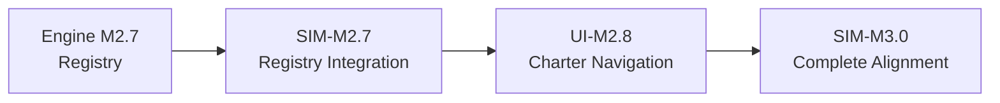

# FlowTime-Sim Charter Transition Strategic Plan

**Status:** 🎯 **Active Development Plan**  
**Last Updated:** September 21, 2025  
**Owner:** FlowTime-Sim Team  
**Dependencies:** FlowTime-Engine Charter Milestones (M2.7-M2.9)

---

## Executive Summary

This plan documents the strategic decision to **prioritize FlowTime-Engine charter foundation** (M2.7-M2.9) before completing FlowTime-Sim charter alignment (SIM-M2.6). This approach minimizes UI disruption and ensures proper infrastructure dependencies while establishing a stable charter ecosystem.

## Current State Assessment

### ✅ **Completed Foundation (Pre-Charter)**
- **SIM-M0**: Core foundations with deterministic evaluation
- **SIM-M1**: Contracts parity with artifact standardization  
- **SIM-M2**: Artifact structure (`run.json`, `manifest.json`, `series/index.json`, CSV files)
- **SIM-CAT-M2**: Catalog.v1 requirement with stable component IDs
- **SIM-SVC-M2**: Minimal HTTP service with artifact endpoints
- **SIM-M2.1**: PMF generator support (Released 2025-09-11, tag: M2.1-v0.3.0)

### ⚠️ **Charter Alignment Gap (Critical Issue)**
- **SIM-M2.6**: Marked as "🔄 IN PROGRESS" but **NOT charter-compliant**
- **Service violation**: Still generates telemetry via `/v1/sim/run` endpoint
- **Template violation**: Creates simulation data instead of model artifacts  
- **API violation**: No model export functionality implemented
- **UI violation**: Expects telemetry generation, not model authoring

### 🏗️ **Infrastructure Dependency**
- **SIM-M2.6 requires Engine M2.7 Registry** to be meaningful
- Registry integration is core to charter compliance
- Model artifacts need established registry for discovery
- Cross-platform workflow depends on registry foundation

## Strategic Decision: Engine-First Development

### **Rationale**

#### 1. **Infrastructure Dependencies**


**Key Insight**: SIM-M2.6 charter compliance **requires** Engine M2.7 Registry to have meaning. Model export without registry integration is incomplete.

#### 2. **UI Breaking Change Management**
- **Current UI**: Expects telemetry from Sim (charter violation)
- **Charter UI**: Restructures everything for artifacts-centric workflow
- **Decision**: One major transition (charter) vs multiple partial breaks

#### 3. **Charter Milestone Sequence Alignment**
```
Engine M2.7 (Registry) → UI-M2.7 (Registry UI) → 
SIM-M2.7 (Registry Integration) → UI-M2.8 (Charter Navigation) →
Engine M2.9 (Compare) → UI-M2.9 (Compare UI) → SIM-M3.0 (Complete Charter)
```

## Development Phases

### **Phase 1: Complete FlowTime-Engine Charter Foundation** 
**Timeline:** Next 4-6 weeks  
**Focus Repository:** `/workspaces/flowtime-vnext`

#### **Milestone Sequence:**
1. **Engine M2.7 - Artifacts Registry** 
   - File-based registry with JSON metadata
   - Registry discovery and health monitoring
   - KISS implementation with clear extension points

2. **Engine M2.8 - Registry Integration & API Enhancement**
   - Enhanced registry management
   - Registry synchronization and conflict resolution
   - API improvements for registry operations

3. **UI-M2.7 - Artifacts Registry UI**
   - Registry browser and management interface  
   - Artifact discovery and selection
   - Registry health monitoring dashboard

4. **UI-M2.8 - Charter Navigation & Tab Structure**
   - Charter-compliant navigation structure
   - Tab system for Models → Runs → Artifacts → Learn
   - Unified registry integration across workflow

#### **Success Criteria:**
- ✅ Engine has stable file-based registry
- ✅ UI can browse and manage registry artifacts
- ✅ Charter navigation structure implemented
- ✅ Existing Engine functionality preserved and enhanced

### **Phase 2: Charter-Compliant SIM Integration**
**Timeline:** After Phase 1 completion  
**Focus Repository:** `/workspaces/flowtime-sim-vnext`

#### **Milestone Sequence:**
1. **SIM-M2.6 Charter Completion - Model Authoring Platform**
   - Refactor service to **remove telemetry generation**
   - Implement **model export** (no execution)
   - Add **structure validation** (no computation)
   - Update CLI for model authoring workflow

2. **SIM-M2.7 - Registry Integration**  
   - Integrate with established Engine M2.7 Registry
   - Auto-register generated model artifacts
   - Registry synchronization and health monitoring
   - Cross-platform model discovery

3. **UI-M2.9 - Compare Workflow UI**
   - Enhanced compare interface consuming charter backend
   - Scenario comparison with Engine execution
   - Charter-compliant workflow integration

4. **SIM-M3.0 - Complete Charter Alignment**
   - Full charter compliance verification
   - Cross-platform workflows via unified registry  
   - Template library and wizard integration
   - Charter boundaries validated and maintained

#### **Success Criteria:**
- ✅ Sim creates model artifacts (NO telemetry generation)  
- ✅ Models discoverable in Engine registry
- ✅ UI provides model authoring in charter navigation
- ✅ Cross-platform workflows operational
- ✅ Charter boundaries strictly maintained

## Implementation Strategy

### **Current State Preservation**
```bash
# Maintain working SIM-M2.1 functionality
cd /workspaces/flowtime-sim-vnext
git checkout main
# Keep PMF generation working for current needs
# Defer SIM-M2.6 completion until Phase 2
```

### **Engine Charter Priority**
```bash
# Focus on flowtime-vnext charter foundation  
cd /workspaces/flowtime-vnext
git checkout main
# Implement M2.7 Artifacts Registry first
# Build UI charter navigation (UI-M2.7, UI-M2.8)
```

### **UI Transition Management**
During Phase 1, update UI to show:
- ✅ **Engine features**: Fully functional with charter navigation
- ⚠️ **Simulation features**: "Temporarily unavailable during charter upgrade"
- 📋 **Guidance**: "Use Engine features for current workflows"

This provides **continuity** while avoiding charter violations.

## Risk Mitigation

### **High Risk: Charter Compliance**
- **Risk**: Incomplete SIM-M2.6 blocks Engine development
- **Mitigation**: Phase 1 establishes Engine independence from Sim charter violations
- **Validation**: Engine M2.7-M2.9 works without Sim dependency

### **Medium Risk: UI Disruption**  
- **Risk**: Multiple UI breaking changes during transition
- **Mitigation**: Single major transition to charter navigation
- **Validation**: Mode toggle preserves Engine functionality during Sim refactor

### **Low Risk: Technical Integration**
- **Risk**: Registry integration complexity
- **Mitigation**: KISS file-based implementation with clear patterns
- **Validation**: Proven artifact patterns from completed milestones

## Success Metrics

### **Phase 1 Completion Criteria:**
- [ ] Engine M2.7 Registry operational with file-based storage
- [ ] UI-M2.7 Registry browser functional
- [ ] UI-M2.8 Charter navigation implemented  
- [ ] Engine workflows fully charter-compliant
- [ ] Zero dependency on Sim charter violations

### **Phase 2 Completion Criteria:**
- [ ] SIM-M2.6 charter compliance (NO telemetry generation)
- [ ] SIM-M2.7 registry integration operational
- [ ] Cross-platform model discovery working
- [ ] UI charter workflows complete (Models → Runs → Artifacts → Learn)
- [ ] Charter boundaries validated and maintained

### **Overall Success Criteria:**
- [ ] **One major UI transition** instead of multiple breaking changes
- [ ] **Stable charter ecosystem** with Engine+Sim integration
- [ ] **Infrastructure first** approach validates dependency management
- [ ] **Charter compliance** maintained across all components

## Next Actions

1. **Immediate (Next Week)**:
   - Focus development effort on `/workspaces/flowtime-vnext`
   - Begin Engine M2.7 Artifacts Registry implementation
   - Document registry file format and discovery patterns

2. **Short Term (2-3 weeks)**:
   - Complete Engine M2.7 Registry foundation
   - Implement UI-M2.7 Registry browser interface
   - Validate registry health monitoring

3. **Medium Term (4-6 weeks)**:
   - Complete UI-M2.8 Charter navigation 
   - Finalize Engine M2.8 registry enhancements
   - Prepare SIM-M2.6 charter refactor planning

4. **Long Term (Phase 2)**:
   - Execute SIM-M2.6 charter-compliant refactor
   - Implement SIM-M2.7 registry integration
   - Complete cross-platform charter workflows

---

## References

- [FlowTime-Sim Charter v1.0](flowtime-sim-charter.md)
- [FlowTime-Engine Charter](../../flowtime-vnext/docs/flowtime-engine-charter.md)
- [SIM-M2.6 Milestone Documentation](milestones/SIM-M2.6.md)
- [Charter Roadmap](../../flowtime-vnext/docs/milestones/CHARTER-ROADMAP.md)

---

**Document Status**: ✅ **Strategic Plan Approved**  
**Next Review**: After Phase 1 Milestone Completion
