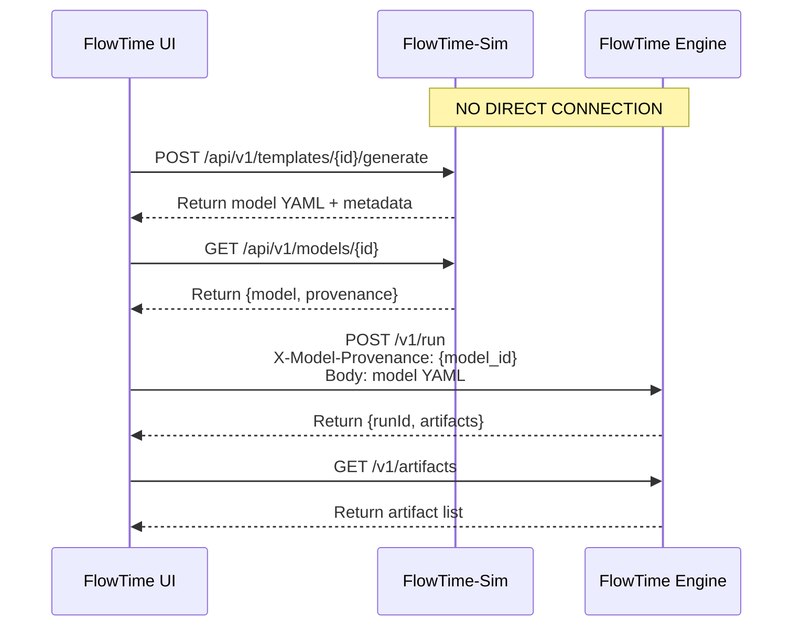

# FlowTime Engine Roadmap

**Status:** Active  
**Last Updated:** October 2, 2025  
**Purpose:** Clear roadmap aligned with KISS architecture, recent milestones, and actual system capabilities

---

## Executive Summary

FlowTime Engine is a **deterministic execution and telemetry generation platform** that evaluates flow models on canonical time grids. It's part of a three-component ecosystem:

- **FlowTime-Sim**: Model authoring and template generation (generates models with provenance)
- **FlowTime Engine**: Model execution and artifact generation (executes models, stores artifacts permanently)
- **FlowTime UI**: Orchestration and visualization (coordinates Sim ↔ Engine workflows, visualizes results)

**Key Architecture Principle (KISS)**: 
- **Engine owns the single artifacts registry** (models + runs + telemetry)
- **Sim provides temporary model storage** for UI workflows
- **UI orchestrates everything** - Sim and Engine do NOT communicate directly

---

## Current State

### ✅ Completed Capabilities

| Milestone | Status | Key Achievements |
|-----------|--------|------------------|
| **M0-M2.0** | ✅ Complete | Core engine, expression evaluation, basic UI |
| **M2.6** | ✅ Complete (v0.6.0) | Export system (CSV, NDJSON, Parquet) |
| **M2.7** | ✅ Complete (v0.6.0) | Artifacts registry with file-based storage |
| **M2.8** | ✅ Complete | Enhanced registry APIs, query capabilities |
| **UI-M2.8 Phase 1** | ✅ Complete | Template API integration, Sim API migration |

### 🔄 In Progress

| Milestone | Status | Current Phase |
|-----------|--------|---------------|
| **M2.9** | 🔄 In Progress | **Phase 0 Complete** - TDD test setup done (158 tests, 4,148 lines)<br/>**Phase 1 Next** - Schema documentation updates<br/>**Phase 2 Pending** - Engine implementation |

### 📋 Upcoming

| Milestone | Status | Focus |
|-----------|--------|-------|
| **M2.9 Completion** | 🔄 In Progress | Schema evolution (binSize/binUnit), PMF nodes, RNG, provenance |
| **M3.0** | 📋 Next | Backlog & Latency Modeling (single-queue, Little's Law) |

---

## Architecture Context

### KISS Principle: Single Registry

**Who Owns What:**

```
FlowTime-Sim (/workspaces/flowtime-sim-vnext)
├── Generates models from templates
├── Creates provenance metadata (template_id, parameters, model_id)
├── Stores models TEMPORARILY in /data/models/
└── Exposes GET /api/v1/models/{id} for UI retrieval

FlowTime UI (:5219)
├── ORCHESTRATES everything (Sim ↔ Engine)
├── Gets model + provenance from Sim
├── Posts model + provenance to Engine
└── Queries Engine for results

FlowTime Engine (/workspaces/flowtime-vnext)
├── SINGLE SOURCE OF TRUTH for all artifacts
├── Executes models deterministically
├── Stores PERMANENTLY: models + runs + telemetry
├── Registry: /data/registry-index.json
└── Artifacts: /data/{run_*|models/*}/
```

**No Direct Communication**: Sim and Engine do NOT talk directly. UI coordinates all workflows.

### Communication Flow



---

## Milestone Details

### M2.9: Schema Evolution & Provenance (🔄 In Progress)

**Goal**: Complete schema evolution and provenance tracking for full model traceability.

#### Status: Phase 0 Complete ✅

**Completed Work:**
- ✅ 158 comprehensive tests created (4,148 lines of test code)
- ✅ TDD setup with RED state confirmed (tests compile, fail as expected)
- ✅ Schema documentation updated (target-model-schema.yaml/md)
- ✅ Deprecation notices on legacy schemas
- ✅ Architecture documents aligned with KISS

**Test Coverage:**
- TimeGrid evolution (binSize/binUnit): 18 tests
- Schema validation: 33 tests  
- PMF compilation pipeline: 34 tests
- RNG/PCG32 algorithm: 33 tests
- API provenance support: 40 tests

#### Phase 1: Schema Documentation ✅ Complete

**Completed:**
- ✅ target-model-schema.yaml with provenance field
- ✅ target-model-schema.md with provenance documentation
- ✅ manifest.schema.json with provenance reference
- ✅ Deprecated legacy schemas (engine-input-schema.*, sim-model-output-schema.*)
- ✅ README.md updated to reference unified schema

#### Phase 2: Engine Implementation (📋 Next)

**Implementation Order:**
1. **TimeGrid Evolution** - Add TimeUnit enum, binSize/binUnit constructor
2. **Model Parser** - Parse new schema format, validate schemaVersion
3. **PMF Compilation** - 4-phase pipeline (validation, grid alignment, compilation, provenance)
4. **RNG/PCG32** - Deterministic random number generator
5. **Provenance Support** - Parse header/embedded provenance, store provenance.json
6. **Hash Calculation** - Exclude provenance from model_hash

**Expected Outcome**: All 158 tests pass (GREEN state)

#### Phase 3: FlowTime-Sim Alignment (📋 Coordinate with Sim team)

**Sim Changes Needed:**
- Remove binSize/binUnit → binMinutes conversion
- Output target-model-schema format directly
- Embed provenance in generated models (optional, alongside header)

**Timeline**: Coordinate with Sim M2.7-M2.9 milestones

#### Phase 4: Validation & Documentation

**Final Steps:**
- Integration testing between Sim and Engine
- Update examples and documentation
- User migration guide
- Release notes

---

### M2.10: Compare Workflow (� Deferred)

**Original Goal**: Side-by-side comparison of runs, telemetry, and models.

**Status**: **Deferred pending charter workflow re-evaluation**

**Why Deferred:**
- Charter navigation system postponed (UI-M2.8 Phase 2+)
- Compare functionality requires reimagined charter paradigm
- Current focus on core modeling capabilities (M3.0+)

**What M2.9 Already Provides:**
- ✅ Model provenance tracking (template_id, model_id, parameters)
- ✅ Model storage in Engine registry
- ✅ Model discovery via artifacts API
- ✅ Model deduplication via model_hash

**Note**: Basic comparison workflows can be implemented later without requiring a separate milestone. After M2.9, focus shifts to M3.0 (modeling capabilities).

---

## Future Milestones

### Advanced Engine Capabilities

**M3.0: Backlog & Latency Modeling**
- Single-queue backlog tracking
- Little's Law latency calculations
- Service time distribution modeling

**M3.1: Scenarios & Parameter Sweeps**
- Multi-scenario execution
- Parameter sweep workflows
- Statistical comparison

### Cross-Platform Integration

**UI-M3.0: Cross-Platform Charter**
- Unified UI spanning Engine and Sim
- Embedded model authoring
- Cross-platform workflows

**SIM-M3.0: Charter Alignment**
- Model artifacts integration
- Seamless Engine ↔ Sim workflows

### Advanced Capabilities (Future)

**M4.0+: Advanced Modeling**
- Routing & network modeling
- Multi-queue systems
- Batch processing & temporal windows

**M5.0+: Enterprise Features**
- Real-time data integration
- Machine learning integration
- Cloud-native deployment

---

## Technology Stack

### Backend (.NET 9)
- **API Style**: Minimal APIs (`.MapPost()`, `.MapGet()`) in Program.cs
- **No Controllers**: Direct route handlers with dependency injection
- **Storage**: File-based artifacts (/data/ directory)
- **Registry**: JSON index (registry-index.json)

### Frontend (Blazor Server)
- **UI Framework**: Blazor Server with MudBlazor
- **Architecture**: Orchestrator pattern (UI coordinates Sim ↔ Engine)
- **API Integration**: HTTP client calls to both services

### Testing Strategy
- **Core Tests**: No web dependencies, deterministic, fast
- **API Tests**: WebApplicationFactory<Program> for Minimal APIs
- **Integration Tests**: Full workflow tests (UI → Sim → Engine)
- **TDD Approach**: Tests first (RED), then implementation (GREEN)

---

## Development Principles

### 1. KISS Architecture
- Single registry (Engine owns it)
- No direct service-to-service communication
- UI orchestrates workflows
- Temporary vs permanent storage clearly separated

### 2. Determinism
- Same model + seed → same results
- Reproducible artifacts
- Exact numeric assertions in tests

### 3. Test-Driven Development
- Comprehensive tests before implementation
- RED → GREEN → REFACTOR cycle
- No time estimates in documentation

### 4. Schema Evolution
- Versioned schemas (schemaVersion: 1)
- Additive changes preferred
- Clear deprecation strategy

### 5. Provenance Tracking
- Complete model lineage (template → model → run)
- Metadata in artifacts
- Permanent storage in Engine registry

---

## Success Metrics

### Technical Metrics
- **Registry Performance**: <200ms queries for 10K+ artifacts
- **Determinism**: 100% reproducible runs
- **Test Coverage**: >90% for core execution engine
- **API Reliability**: 99%+ success rate

### User Experience Metrics
- **Workflow Continuity**: Zero regression in existing features
- **Artifact Discoverability**: All runs/models findable in registry
- **Cross-Platform Integration**: Seamless Sim → Engine workflows

---

## Archived Documents

For historical context, see `docs/archive/`:
- **ROADMAP-2025-01.md** - January 2025 charter-focused roadmap (outdated status)
- **ROADMAP-LEGACY.md** - Pre-charter milestone structure
- **CHARTER-ROADMAP.md** - Charter implementation sequence (superseded by this roadmap)

### Superseded Schema Documents

The following schema documents are deprecated:
- **engine-input-schema.md** - Use `target-model-schema.md` instead
- **engine-input.schema.json** - Use `target-model-schema.yaml` instead
- **sim-model-output-schema.md** - Unified to `target-model-schema.md`

---

## Getting Started

### For Developers
1. Review this ROADMAP.md for current direction
2. Check M2.9 milestone document for detailed implementation plan
3. See tests in tests/FlowTime.Tests/ and tests/FlowTime.Api.Tests/Provenance/
4. Follow TDD: tests exist, make them pass
5. Use Minimal APIs pattern (not controllers)

### For Stakeholders
1. **Current Focus**: M2.9 schema evolution (Phase 0 complete, Phase 2 next)
2. **Architecture**: KISS principle with single registry
3. **Next Milestone**: M3.0 (Backlog & Latency Modeling) after M2.9
4. **Integration**: Sim ↔ UI ↔ Engine coordination via UI orchestration

### For Users
1. Continue using existing workflows (no disruption)
2. New provenance features coming in M2.9
3. Backlog & latency modeling coming in M3.0 (next)
4. Cross-platform integration (future)

---

**Next Actions:**
1. ✅ Review and discuss ROADMAP.md
2. ✅ Update/retire outdated documents (archived)
3. 📋 Complete M2.9 Phase 2 implementation
4. 📋 Plan M3.0 backlog & latency modeling

---

**Roadmap Status:** ✅ Active  
**Current Milestone:** M2.9 (Phase 0 ✅ Complete, Phase 2 📋 Next)  
**Architecture:** KISS - Single Registry in Engine
