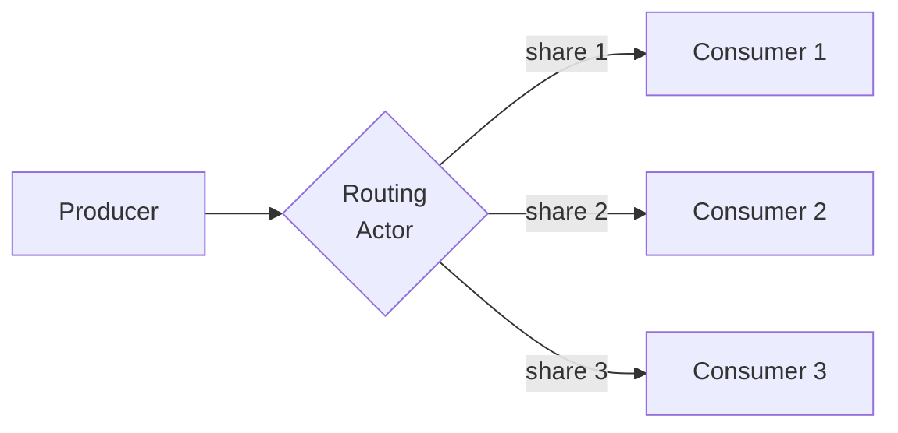

## Context

FlowTime models real physical systems in which work flows from producers to consumers. At every fan-out point — a producer with more than one outgoing edge — a routing decision must be made: how does the producer's outflow apportion across the downstream consumers? Until this ADR, the engine had no single, written rule that said *which surface of the model is normative for that decision* and *what the engine must reject when the rule is violated*.

The question reached the engine through gap [G-0032](../../work/gaps/G-0032-transportation-basic-regressed-edge-flow-mismatch-incoming-3-after-e-24-unification.md), which surfaced a latent inconsistency in nine shipped templates after E-0024's schema unification: edge weights and consumer-side `expr` arithmetic disagreed about how a producer's outflow should split. G-0032 framed the resolution as a choice between three options:

1. **Edge weights win** — the static weights declared on the producer's outgoing edges are normative; consumer-side arithmetic that disagrees is wrong.
2. **Expr authority wins** — the consumer's `expr`-authored arrivals are normative; per-edge `flowVolume` becomes advisory.
3. **Both must agree** — the author declares the same fact twice and tooling enforces consistency.

Milestone [M-0066](../../work/epics/E-0025-engine-truth-gate/M-0066-edge-flow-authority-decision.md) widened this framing during its working session. The original three options are all answers to the same prior question: *who is allowed to author routing information at all?* The widened framing names three classes of physical systems FlowTime exists to model — class 1 (producer-side push routing), class 2 (consumer-side pull / capacity-aware allocation), class 3 (edge-as-channel / static-weight routing) — and asks the policy to assign each class a single authoritative surface. The taxonomy backbone lives at [`docs/architecture/flow-authority-policy.md`](../architecture/flow-authority-policy.md); this ADR ratifies the policy formally.

The decision rests on two independent lines of evidence:

- **Flow-purity argument.** A consumer that hard-codes `arrivals = served * 0.25` embeds peer knowledge in an actor that, by FlowTime's actor model, must not have peer knowledge. Such a model is not telemetry-replayable, is not invariant under peer addition, and cannot express capacity-aware allocation without reaching into peer state — at which point the consumer is a router masquerading as one. The argument is structural, not preferential.
- **Footprint analysis.** M-0066 walked all three G-0032 options against representative templates and counted the diff. The cost evidence and the purity argument agree: option 1 (edge weights win) wins on engineering cost as well as first principles. The full preserved analysis lives in M-0066 under [Footprint analysis (M-0066's working artefact)](../../work/epics/E-0025-engine-truth-gate/M-0066-edge-flow-authority-decision.md#footprint-analysis-m-0066s-working-artefact) — see the "Option footprint summary" table and the "Read of the evidence" subsection for the bucketed engine-LOC magnitudes and per-template diff estimates that informed this decision.

The actor model the policy presupposes:

At every fan-out point exactly one routing actor decides. The routing actor may be the producer itself (push), an explicit router node, a future capacity-aware allocator, or a static rule encoded on the edges. *Which* role plays the routing actor depends on the class.

## Decision

FlowTime's flow-authority policy is the **three-class taxonomy**, with one normative authority surface per class:

| Class | Routing actor | Authority surface | Engine status |
|---|---|---|---|
| 1 — producer-side push | `kind: router` node | router node specification | Supported today; **immediate authority for class 1** |
| 2 — consumer-side pull / capacity-aware | capacity-aware allocator (future) | future allocator-node specification | **Not surfaced today** \| **deferred** — see [G-0038](../../work/gaps/G-0038-class-2-capacity-aware-allocator-deferred-from-m-066-flow-authority-policy.md) |
| 3 — edge-as-channel / static-weight | static rule on edges | producer-outgoing edge `weight` | Supported today; **authoritative for class 3 (structural)** |

The hard constraint: **at every producer-fan-out point, exactly one routing authority is active.** Zero authorities or more than one authority at a single fan-out point is a modeling error and must be rejected by the engine's gates.

Authority assignment per class:

- **Class 1 — `kind: router` node is the immediate edge-flow authority.** The router node is the routing actor for class-1 fan-outs. It holds the routing rule, observes the producer's state, and emits per-consumer arrival series. Edge weights between a router and its downstream consumers are interpreted as routing-rule parameters, not as an independent authority surface.
- **Class 3 — outgoing edge `weight` is the supplementary structural authority.** Class 3 covers fan-outs whose apportionment is structurally known and parameter-time, not bin-time. Edge weights *are* the routing rule; consumer state is irrelevant to *which* consumer gets *what share*. The `EdgeFlowMaterializer` apportions the producer's outflow by weight, the per-edge `flowVolume` series is the truth at every consumer's incoming side, and the conservation invariant (`arrivals(t) == sum(incomingEdges_after_lag)(t)`) enforces that nothing else has injected routing information. The nine G-0032-affected templates are class-3 fan-outs and resolve under this assignment.
- **Class 2 — deferred.** The engine does not surface class 2 today. A capacity-aware allocator actor distinct from the static-weight router is the proposed future surface; the carrier work for designing and shipping that surface lives in gap [G-0038](../../work/gaps/G-0038-class-2-capacity-aware-allocator-deferred-from-m-066-flow-authority-policy.md). Until that surface exists, templates that need class-2 semantics must be restructured to fit class 1 or class 3, or wait. Consumer-side peer-relative arithmetic is **not** an acceptable workaround.

### Rejected framings

- **Consumer-side expr authority (G-0032 option 2).** Rejected on flow-purity grounds. The framing embeds peer knowledge in consumer actors that must not have peer knowledge. It is not telemetry-replayable (replay substitutes telemetry-observed arrivals; there is no `*0.25` factor to substitute), not invariant under peer addition (add a fifth consumer and every existing consumer's arithmetic is wrong), and not robust to capacity-aware allocation (cannot express "1/3 each across the three live peers when one is saturated" without reaching into peer state). The framing is structurally invalid, not merely costly. M-0066's footprint analysis ranks this option as `medium` (150-300 LOC) on engineering cost as well; both lines of evidence agree.
- **Both-must-agree (G-0032 option 3).** Rejected on structural-redundancy grounds. Forces the author to encode the same fact in two surfaces and tooling to verify they agree. Adds an authoring tax with no expressive gain; the mismatch potential is a perpetual maintenance burden. For class 3 the routing rule lives on the edge; reasserting it in the consumer is noise. M-0066's footprint analysis ranks this option at `medium` engine LOC plus per-template additions (~45-60 LOC).

### Enforcement points

The policy gets teeth at three layers of the engine. This ADR names them; **M-0069 (the next milestone in [E-0025](../../work/epics/E-0025-engine-truth-gate/epic.md))** carries the implementation. The taxonomy doc names the same three layers and is the prose backbone for what each layer enforces.

- **Schema layer — `docs/schemas/model.schema.yaml` + `ModelSchemaValidator`.** Rejects models that encode peer-relative splits in consumer `expr` arithmetic — for example, `expr` nodes whose formula references the producer's `served` series and a `split*` parameter directly. Catches the structurally-invalid framing before compile.
- **Compile layer — `ModelCompiler` / `TimeMachineValidator`.** Fan-out detection: any producer with more than one outgoing edge must have exactly one routing authority declared (weighted edges, router node, or — once surfaced — capacity-aware allocator). Compile-time error if zero or more than one authority is detected.
- **Analyse layer — `InvariantAnalyzer`.** Adds two warning families: `routing_authority_ambiguous` (producer with conflicting authority surfaces) and `consumer_side_peer_split_detected` (consumer expr that looks peer-relative). The existing `edge_flow_mismatch_incoming` / `edge_flow_mismatch_outgoing` warnings stay in place as the conservation gate.

This ADR names *what* each layer enforces. The implementation — schema constraints, compile-time errors, analyser warning families — lands in M-0069.

## Consequences

### Immediate consequences

- **G-0032 is resolved at the design layer.** The three options it lists are answered: option 1 (edge weights win) is the right answer for class 3, which is what all nine affected shipped templates instantiate. Option 2 is rejected on first principles; option 3 is rejected on structural-redundancy grounds. G-0032's status moves to `addressed` with a reference to this ADR (per M-0066 AC-10); the gap is fully closed only once the engine + template alignment milestone (M-0067) lands.
- **Class-3 authoring guidance is folded into M-0067.** The taxonomy clarifies that edge weights are a first-class authoring pattern alongside the router node. M-0067 (Engine + Template Alignment) revisits authoring guidance as part of its surface; no separate gap is required for this enhancement.
- **Class 2 is not addressable today.** Templates that genuinely need consumer-state-aware apportionment must wait for the future allocator surface or restructure to fit class 1 or class 3. The deferral is honest: nothing in the current shipped template set requires class 2; the gap captures the future engine work.

### Downstream milestone consequences

- **M-0069 (Schema + Compile + Analyse Enforcement)** carries the enforcement implementation named under [Enforcement points](#enforcement-points). The ADR pins *what* each layer enforces; M-0069 lands the schema constraints, compile-time errors, and analyser warning families.
- **M-0067 (Engine + Template Alignment)** edits the nine G-0032-affected templates to encode their class-3 splits as edge weights, resets the `ExpectedRunWarnings` baseline accordingly, and folds in class-3 first-class authoring guidance.
- **M-0068 (Golden-Output Canary)** ratifies the post-alignment baseline as the canary fixture.

### User-facing consequences

- **Templates that encoded class-3 splits in consumer `expr` arithmetic must migrate to edge weights.** The migration is mechanical for the shipped set (nine templates, walked under M-0066's footprint analysis). User-authored templates outside the shipped set may need similar migration; tooling for that is out of E-0025 epic scope.
- **The engine's gates will reject peer-relative consumer arithmetic and ambiguous fan-out authority once M-0069 lands.** Authors will see schema errors, compile-time errors, or analyser warnings depending on the violation. The taxonomy doc is the reference a future template author reads to know which class their model belongs in.

### Architectural consequences

- **Conservation invariant is single-direction truth for class 3.** With edge weights normative on the producer side, `arrivals(t) == sum(incomingEdges_after_lag)(t)` becomes the conservation gate without ambiguity. This simplifies reasoning for E-0015 telemetry replay (replay substitutes telemetry-observed `flowVolume`, not consumer arithmetic) and E-0022 model fit (the routing surface to fit against is unambiguous).
- **Future class-2 surface is unconstrained by this ADR.** [G-0038](../../work/gaps/G-0038-class-2-capacity-aware-allocator-deferred-from-m-066-flow-authority-policy.md) names the deferred capability and the modeling cases that motivate it; the allocator-node specification is open and will be designed under that gap's carrier milestone, not this ADR.

### Cross-references

- **Taxonomy backbone:** [`docs/architecture/flow-authority-policy.md`](../architecture/flow-authority-policy.md). Reads as the prose companion to this ADR; the per-class examples, actor model, glossary, and authority-assignment summary live there.
- **Milestone:** [M-0066 — Flow-Authority Policy Spike](../../work/epics/E-0025-engine-truth-gate/M-0066-edge-flow-authority-decision.md). The milestone that authored this ADR. See its [Footprint analysis (M-0066's working artefact)](../../work/epics/E-0025-engine-truth-gate/M-0066-edge-flow-authority-decision.md#footprint-analysis-m-0066s-working-artefact) section for the engineering-cost evidence cited above, and its [Doc-sweep classification (M-0066's AC-3 artefact)](../../work/epics/E-0025-engine-truth-gate/M-0066-edge-flow-authority-decision.md#doc-sweep-classification-m-0066s-ac-3-artefact) section for the per-document classification against this policy.
- **Originating gap:** [G-0032 — `transportation-basic` regressed: `edge_flow_mismatch_incoming` × 3 after E-0024 unification](../../work/gaps/G-0032-transportation-basic-regressed-edge-flow-mismatch-incoming-3-after-e-24-unification.md). The investigation that surfaced the latent class-3 inconsistency in the shipped template set.
- **Class-2 deferred capability:** [G-0038 — Class-2 capacity-aware allocator (deferred from M-0066 flow-authority policy)](../../work/gaps/G-0038-class-2-capacity-aware-allocator-deferred-from-m-066-flow-authority-policy.md). The deferred-follow-up gap filed under M-0066 AC-7.
- **Epic:** [E-0025 — Engine Truth Gate](../../work/epics/E-0025-engine-truth-gate/epic.md). The epic that owns the policy, the enforcement implementation (M-0069), the engine + template alignment (M-0067), and the golden-output canary (M-0068).
