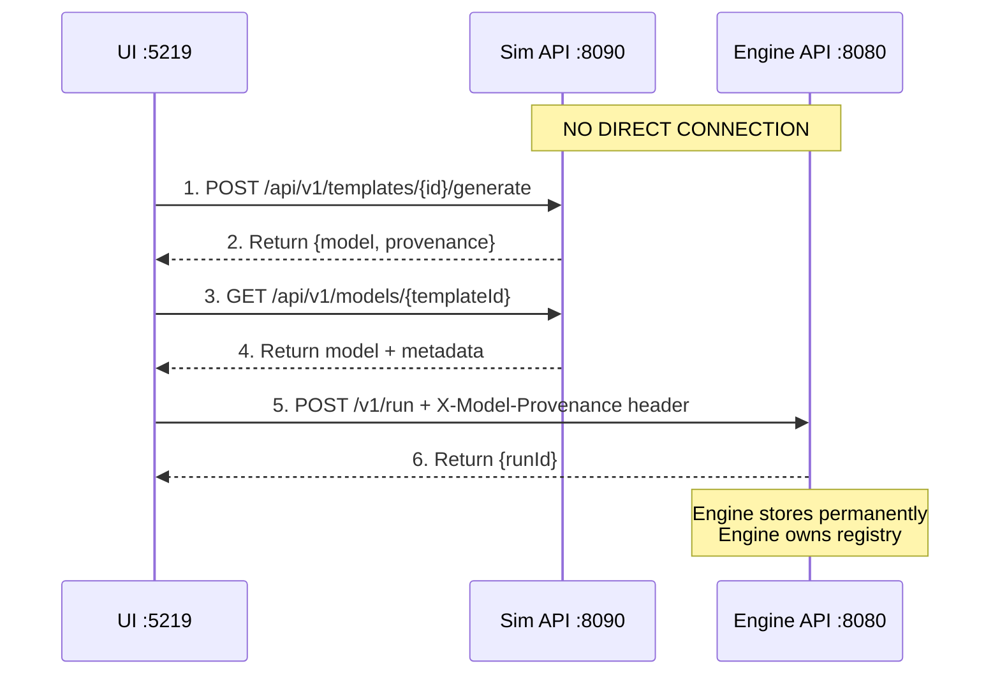

# Deep Analysis: SIM-M2.8 vs KISS Registry Architecture

**Date:** October 2, 2025  
**Author:** Architecture Review  
**Status:** 🚨 CRITICAL MISALIGNMENT DETECTED

---

## Executive Summary

**FINDING:** The SIM-M2.8 milestone described in NEW-ROADMAP.md **directly contradicts** the KISS registry architecture documented in `registry-integration.md`.

**SEVERITY:** HIGH - Would introduce dual-registry complexity explicitly rejected in architecture docs

**RECOMMENDATION:** **DELETE SIM-M2.8** from roadmap. The workflow is complete after SIM-M2.7 + Engine M2.9.

---

## What registry-integration.md Architecture Says

### Core KISS Principles

```
┌─────────────────────────────────────────────────────────────┐
│ KISS ARCHITECTURE: Single Source of Truth                   │
├─────────────────────────────────────────────────────────────┤
│                                                              │
│  Engine owns artifacts registry (permanent storage)         │
│  Sim stores temporarily (for UI workflows only)             │
│  UI orchestrates (calls Sim, then Engine)                   │
│  NO direct Sim ↔ Engine communication                       │
│                                                              │
└─────────────────────────────────────────────────────────────┘
```

### What Sim Does (Per Architecture)

✅ **ALLOWED:**
- Generate model YAML from templates
- Create provenance metadata
- Store models **temporarily** in `/data/models/{templateId}/{hashPrefix}/`
- Expose models via `/api/v1/models` API (for UI retrieval)
- Return provenance with generated models

❌ **FORBIDDEN:**
- Call Engine API directly
- Store permanently (Engine's job)
- Maintain artifact registry index (Engine's job)
- Auto-register models with Engine
- Cross-service synchronization
- Health monitoring between services

### Architecture Workflow



### Implementation Phases (Per Architecture Doc)

**Phase 1:** SIM-M2.6.1 - Schema Evolution
- Remove `binMinutes` conversion layer
- Update to `binSize`/`binUnit` format

**Phase 2:** SIM-M2.7 - Provenance Generation (Sim-Side)
- Enhance metadata.json with provenance fields
- Generate unique `model_id` for each model
- Enhanced `/generate` endpoint returns provenance
- CLI options: `--provenance`, `--embed-provenance`
- Support embedded provenance in YAML

**Phase 3:** Engine M2.9 - Provenance Acceptance (Engine-Side)
- Accept `X-Model-Provenance` header in `/v1/run`
- Store `provenance.json` in run artifacts
- Enhanced registry scanning for provenance
- Add provenance to artifact metadata

**Phase 4:** SIM-M2.7 - Integration & UI (Cross-Service)
- UI retrieves models from Sim
- UI extracts provenance
- UI sends model + provenance to Engine
- UI displays provenance in run details

**NOTICE:** Only 3 milestones needed:
1. SIM-M2.6.1 (schema)
2. SIM-M2.7 (provenance)
3. Engine M2.9 (acceptance)

**NO SIM-M2.8 mentioned in architecture!**

---

## What NEW-ROADMAP.md Says About SIM-M2.8

```markdown
### 🚀 SIM-M2.8 - Registry Integration (v0.7.0)
**Goal**: Integrate with Engine M2.9 Registry for model discovery

**Features**:
- Auto-register models with Engine registry
- Query registry for model discovery
- Health monitoring and sync status
- Cross-platform model sharing

**Dependencies**: 
- Engine M2.9 Registry operational
- SIM-M2.7 provenance complete

**Effort**: 2-3 weeks
```

---

## Conflict Analysis: Point-by-Point

### ❌ Conflict #1: "Auto-register models with Engine registry"

**NEW-ROADMAP.md says:** Sim auto-registers models with Engine

**registry-integration.md says:**
> **Don't implement:**
> - ❌ Permanent artifact storage (Engine's job)
> - ❌ Artifact registry index like Engine's (Engine's job)
> - ❌ Cross-service synchronization
> - ❌ Health monitoring between services

**Violation:** Auto-registration requires Sim→Engine API calls, which violates "NO direct Sim↔Engine communication" principle.

**Architecture Quote:**
> "CRITICAL: Sim and Engine DO NOT talk to each other directly. UI orchestrates everything."

### ❌ Conflict #2: "Query registry for model discovery"

**NEW-ROADMAP.md says:** Sim queries Engine registry

**registry-integration.md says:**
```yaml
# Sim Responsibilities
✅ Store models temporarily
✅ Expose via /models API

# Sim Does NOT
❌ Call Engine API
❌ Maintain artifact registry
```

**Violation:** If Sim queries Engine registry, that's Sim→Engine communication, breaking the orchestration model.

**Correct Flow Per Architecture:**
- UI queries Engine registry (not Sim)
- UI queries Sim for temporary models
- UI combines information and orchestrates

### ❌ Conflict #3: "Health monitoring and sync status"

**NEW-ROADMAP.md says:** Sim monitors Engine health and sync status

**registry-integration.md says:**
> **Problems with dual-registry approach:**
> - Synchronization: Cross-service coordination needed
> - Coupling: Services tightly coupled via registry sync
> - Failure modes: What if sync fails? Which is source of truth?

**Violation:** Health monitoring implies:
- Sim needs to know Engine state
- Cross-service health checks
- Synchronization awareness

All explicitly rejected in KISS architecture.

### ❌ Conflict #4: "Cross-platform model sharing"

**NEW-ROADMAP.md says:** Cross-platform model sharing via registry

**registry-integration.md says:**
> **Q2: Should Sim keep ANY local storage?**
> 
> **Answer:** Optional local cache for template development only:
> - NOT a registry (just filesystem output)
> - CLI: `--out model.yaml` saves locally
> - Service: Memory-only (no persistence)
> - UI orchestration decides when to persist (via Engine)

**Violation:** "Cross-platform model sharing" implies:
- Sim stores models for sharing (not just temporary)
- Some form of registry or discovery mechanism
- Coordination between Sim instances

Architecture is clear: Sim is stateless, Engine is the sharing mechanism.

---

## Comparison Matrix

| Feature | SIM-M2.8 (NEW-ROADMAP) | KISS Architecture | Alignment |
|---------|------------------------|-------------------|-----------|
| **Auto-register models** | ✅ Yes | ❌ No - UI orchestrates | ❌ CONFLICT |
| **Query Engine registry** | ✅ Yes | ❌ No - UI queries | ❌ CONFLICT |
| **Health monitoring** | ✅ Yes | ❌ No - stateless Sim | ❌ CONFLICT |
| **Cross-service sync** | ✅ Implied | ❌ Explicitly forbidden | ❌ CONFLICT |
| **Direct Sim→Engine calls** | ✅ Required | ❌ Forbidden | ❌ CONFLICT |
| **Registry ownership** | ⚠️ Unclear | ✅ Engine only | ❌ CONFLICT |

**Alignment Score:** 0/6 ❌

---

## What Actually Happens After SIM-M2.7

### Complete Workflow (No SIM-M2.8 Needed)

```
┌────────────────────────────────────────────────────────┐
│ After SIM-M2.6.1 + SIM-M2.7 + Engine M2.9:           │
├────────────────────────────────────────────────────────┤
│                                                        │
│  1. ✅ Sim generates models + provenance              │
│  2. ✅ Sim stores temporarily in /data/models/        │
│  3. ✅ UI calls Sim: GET /api/v1/models/{id}          │
│  4. ✅ UI retrieves {model, provenance}               │
│  5. ✅ UI calls Engine: POST /v1/run + header         │
│  6. ✅ Engine stores permanently in /data/run_*/      │
│  7. ✅ Engine updates registry-index.json             │
│  8. ✅ UI queries Engine: GET /v1/artifacts           │
│  9. ✅ Users find models via Engine registry          │
│                                                        │
│  COMPLETE WORKFLOW - Nothing more needed!             │
│                                                        │
└────────────────────────────────────────────────────────┘
```

### What SIM-M2.7 Delivers

From `docs/milestones/SIM-M2.7.md`:

**FR-SIM-M2.7-1:** Provenance Metadata Generation ✅
- source, model_id, template_id, parameters, timestamps
- Deterministic model_id generation
- JSON serialization

**FR-SIM-M2.7-2:** Enhanced /generate Endpoint ✅
- Returns {model, provenance}
- Query parameter: `?embed_provenance=true`
- Backward compatible

**FR-SIM-M2.7-3:** Engine Provenance Acceptance ✅
- Coordination (not implementation)
- X-Model-Provenance header
- provenance.json storage
- Registry integration

**FR-SIM-M2.7-4:** CLI Provenance Output ✅
- `--provenance <file>` flag
- Local template development

**FR-SIM-M2.7-5:** Embedded Provenance Support ✅
- Self-contained model files
- Provenance in YAML

**Result:** Complete end-to-end provenance tracking from template to run!

---

## Why SIM-M2.8 Exists (Historical Context)

### Original Dual-Registry Proposal

The deleted `model-provenance.md` document proposed:

```
❌ Separate Sim model registry (/data/models/ in SIM repo)
❌ Sim registry-index.json
❌ Sim /api/v1/models endpoints with full registry features
❌ Cross-registry synchronization
❌ Registry health monitoring between services
❌ Duplicate storage of models
```

**This was explicitly rejected!**

From `registry-integration.md`:
> **Status:** Proposed Architecture  
> **Supersedes:** Original model-provenance.md dual-registry approach

### Why It Was Rejected

**Problems identified:**
- Complexity: Two registries to maintain
- Synchronization: Cross-service coordination needed
- Duplication: Models stored in both places
- Coupling: Services tightly coupled via registry sync
- Failure modes: What if sync fails? Which is source of truth?

**Complexity reduction:** ~85% less code with KISS approach

### SIM-M2.8 is Zombie Code

**SIM-M2.8 in NEW-ROADMAP.md is leftover thinking from the rejected dual-registry proposal.**

It describes features that:
1. Were explicitly rejected in architecture review
2. Contradict the approved KISS architecture
3. Would reintroduce the complexity we eliminated
4. Are unnecessary for complete workflow

---

## What SIM-M3.0 Should Be

Looking at `docs/milestones/SIM-M3.0.md`, it describes "Charter Alignment" and lists:

**Dependencies:**
- SIM-M2.7 (Registry Preparation) ✅
- **SIM-M2.8** (Model Authoring Service & API) ⚠️
- SIM-M2.9 (Compare Integration) 📋
- Engine M2.7 (Artifacts Registry) ✅
- Engine M2.9 (Compare Infrastructure) 📋

**Problem:** SIM-M2.8 as dependency doesn't match architecture!

**What SIM-M3.0 Actually Needs:**
- SIM-M2.6.1 (schema evolution) ✅
- SIM-M2.7 (provenance integration) ✅
- Engine M2.9 (provenance acceptance) 📋
- Enhanced templates (domain-specific)
- Template validation improvements
- Documentation and examples

---

## Recommendations

### 🚨 Immediate Actions

1. **DELETE SIM-M2.8 from NEW-ROADMAP.md**
   - It contradicts approved architecture
   - Features are already delivered in SIM-M2.7
   - Would waste 2-3 weeks implementing rejected design

2. **Update NEW-ROADMAP.md version sequence:**
   ```
   OLD:
   v0.5.0 (SIM-M2.6.1) → v0.6.0 (SIM-M2.7) → v0.7.0 (SIM-M2.8) → v1.0.0 (SIM-M3.0)
   
   NEW:
   v0.5.0 (SIM-M2.6.1) → v0.6.0 (SIM-M2.7) → v1.0.0 (SIM-M3.0)
   ```

3. **Rename/Renumber future milestones:**
   - SIM-M3.0 → Keep as v1.0.0 (Stable API)
   - Focus on template library expansion
   - Advanced validation features
   - Documentation and examples

### 📋 Phase 2 Milestones (After SIM-M2.7)

**v0.6.0 → v1.0.0: Stable API (SIM-M3.0)**
- API contract guarantees
- Backward compatibility policy
- Complete documentation
- Production-ready defaults

**v1.1.0: Enhanced Templates**
- Supply chain templates (multi-tier)
- Network reliability templates
- Transportation templates
- Healthcare templates

**v1.2.0: Advanced Validation**
- Schema validation improvements
- Template linting
- Best practices checker
- Performance analysis

### 🎯 What "Registry Integration" Actually Means

**Not a separate milestone!** It means:

```
SIM-M2.7 (Sim provenance) 
    + 
Engine M2.9 (Engine acceptance) 
    + 
UI orchestration (retrieve from Sim, post to Engine)
    = 
COMPLETE REGISTRY INTEGRATION
```

No additional Sim work needed!

---

## Architecture Compliance Checklist

For any future milestone, verify:

- [ ] Does it require Sim→Engine direct calls? ❌ FORBIDDEN
- [ ] Does it involve registry management in Sim? ❌ FORBIDDEN  
- [ ] Does it require cross-service synchronization? ❌ FORBIDDEN
- [ ] Does it maintain permanent storage in Sim? ❌ FORBIDDEN
- [ ] Does it implement health monitoring? ❌ FORBIDDEN
- [ ] Is UI the orchestrator? ✅ REQUIRED
- [ ] Is Engine the source of truth? ✅ REQUIRED
- [ ] Is Sim stateless/temporary? ✅ REQUIRED

**SIM-M2.8 fails 5/8 checks!**

---

## Conclusion

### The Verdict

**SIM-M2.8 as described in NEW-ROADMAP.md is architecturally invalid.**

It would:
- Violate KISS principles
- Reintroduce rejected dual-registry complexity
- Create tight coupling between services
- Break UI orchestration model
- Waste 2-3 weeks implementing wrong design

### The Solution

**After SIM-M2.6.1 + SIM-M2.7 + Engine M2.9, the workflow is COMPLETE.**

Next steps should focus on:
- Template library expansion
- Validation improvements  
- Documentation and examples
- Stable API guarantees (v1.0.0)

**Delete SIM-M2.8 from roadmap. Ship v1.0.0 instead.**

---

## References

- **registry-integration.md**: Approved KISS architecture
- **SIM-M2.7.md**: Provenance integration milestone (complete solution)
- **SIM-M3.0.md**: Charter alignment (needs dependency update)
- **NEW-ROADMAP.md**: Contains invalid SIM-M2.8 milestone

---

**Status:** 🚨 **REQUIRES ROADMAP CORRECTION**  
**Next Action:** Update NEW-ROADMAP.md to remove SIM-M2.8  
**Impact:** Prevents wasted implementation effort on rejected architecture
