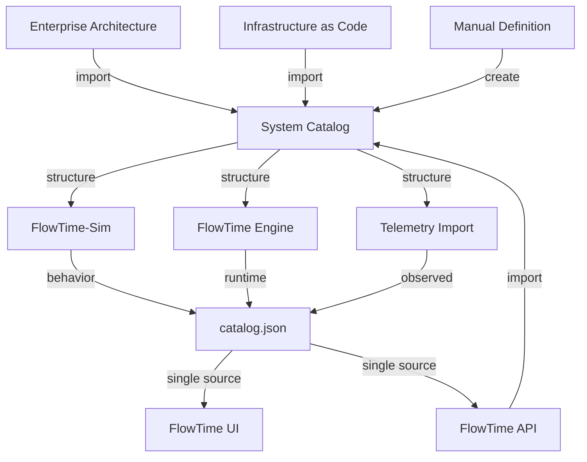

# Catalog Architecture — Single Source of Truth for System Metadata

**Version:** 1.0  
**Date:** September 19, 2025  
**Status:** Draft - Under Review

---

## Overview

The FlowTime catalog system provides a **single source of truth** for system metadata that spans across all FlowTime components (Sim, Engine, UI). The catalog serves as the authoritative foundation for component identity, system topology, and metadata, which is then enhanced by behavioral models, runtime execution, and telemetry data.

## Design Principles

### **1. Catalog-First Architecture**
The system catalog defines the **authoritative structure** that all other components reference:
- **Component Identity**: Canonical component IDs and names
- **System Topology**: How components connect and interact
- **Structural Metadata**: Types, capabilities, and classifications

### **2. Layered Enhancement**
Each FlowTime component adds complementary data to the catalog foundation:
- **FlowTime-Sim**: Adds behavioral models (PMF, expressions, parameters)
- **FlowTime Engine**: Adds runtime capabilities and execution results
- **Telemetry Import**: Adds observed capabilities and performance data

### **3. External Integration**
System catalogs can be imported from external enterprise sources:
- Enterprise Architecture tools (ServiceNow, Visio)
- Infrastructure as Code (Terraform, CloudFormation)
- API Documentation (OpenAPI specs, service meshes)
- Manual creation for testing and small systems

## Catalog Data Flow



## System Catalog Structure

### **Base System Catalog Format**
```yaml
version: 1
metadata:
  id: "checkout-system"
  title: "E-commerce Checkout System"
  description: "Customer checkout and payment processing"
  domain: "e-commerce"
  owner: "platform-team@company.com"
  created: "2025-09-19T10:00:00Z"
  
components:
  - id: CHECKOUT_SVC
    label: "Checkout Service"
    description: "Manages shopping cart and checkout flow"
    type: "service"
    technology: "nodejs"
    team: "checkout-team"
    
  - id: PAYMENT_SVC
    label: "Payment Service"
    description: "Processes payments and handles transactions"
    type: "service"
    technology: "java"
    team: "payments-team"
    
  - id: INVENTORY_SVC
    label: "Inventory Service"
    description: "Manages product inventory and availability"
    type: "service"
    technology: "python"
    team: "inventory-team"

connections:
  - from: CHECKOUT_SVC
    to: PAYMENT_SVC
    label: "Process Payment"
    protocol: "https"
    
  - from: CHECKOUT_SVC
    to: INVENTORY_SVC
    label: "Check Availability"
    protocol: "grpc"

classifications:
  - id: "critical"
    components: [CHECKOUT_SVC, PAYMENT_SVC]
    description: "Business critical services"
    
  - id: "external-facing"
    components: [CHECKOUT_SVC]
    description: "Directly serves customer requests"

layoutHints:
  rankDir: "LR"
  spacing: 100
  clusters:
    - name: "frontend"
      components: [CHECKOUT_SVC]
    - name: "backend"
      components: [PAYMENT_SVC, INVENTORY_SVC]
```

## Enhanced Catalog in Artifacts

### **Model Artifact Catalog (FlowTime-Sim)**
When FlowTime-Sim creates a model from a system catalog and template:

```json
{
  "kind": "model",
  "id": "checkout-baseline_a1b2",
  "name": "checkout-baseline",
  "created_utc": "2025-09-19T10:22:30Z",
  "schema_version": "treehouse.binned.v0",
  
  "system_catalog": {
    "source": "system_catalog",
    "catalog_id": "checkout-system",
    "catalog_version": "v1.2",
    "imported_from": "enterprise-arch.yaml"
  },
  
  "topology": {
    "nodes": [
      {
        "id": "CHECKOUT_SVC",
        "label": "Checkout Service",
        "type": "service",
        "team": "checkout-team"
      },
      {
        "id": "PAYMENT_SVC", 
        "label": "Payment Service",
        "type": "service",
        "team": "payments-team"
      }
    ],
    "edges": [
      {
        "from": "CHECKOUT_SVC",
        "to": "PAYMENT_SVC",
        "label": "Process Payment",
        "protocol": "https"
      }
    ]
  },
  
  "behavior": {
    "template_id": "e-commerce",
    "template_version": "v1",
    "parameters": {
      "peak_factor": 1.5,
      "base_capacity": 100,
      "error_rate": 0.02
    },
    "pmf_definitions": {
      "CHECKOUT_SVC": {
        "values": [50, 100, 150],
        "probabilities": [0.2, 0.6, 0.2]
      }
    },
    "expressions": {
      "PAYMENT_SVC": "CHECKOUT_SVC * 0.95"
    }
  },
  
  "capabilities": ["counts", "flows"],
  "tags": ["e-commerce", "checkout", "baseline"],
  "source": "sim",
  "inputs_hash": "sha256:c4f2a8d1...",
  "owner": "user@domain.com",
  "visibility": "private"
}
```

### **Run Artifact Catalog (FlowTime Engine)**
When FlowTime Engine executes a model:

```json
{
  "kind": "run",
  "id": "checkout-run_2025-09-19_c3d4",
  "name": "checkout-baseline-run",
  "created_utc": "2025-09-19T11:30:00Z",
  
  "model_reference": {
    "model_id": "checkout-baseline_a1b2",
    "model_catalog": "checkout-system"
  },
  
  "topology": {
    "inherited_from": "checkout-baseline_a1b2",
    "nodes": [...],
    "edges": [...]
  },
  
  "execution": {
    "engine_version": "ft-eng 0.2.1",
    "bin_width": "PT1M",
    "bin_boundary": "LCR0",
    "total_bins": 1440,
    "seed": 42
  },
  
  "runtime_capabilities": {
    "measures_generated": ["count", "flow", "utilization"],
    "components_executed": ["CHECKOUT_SVC", "PAYMENT_SVC"],
    "peak_values": {
      "CHECKOUT_SVC": 247,
      "PAYMENT_SVC": 234
    },
    "statistics": {
      "total_flow": 144550,
      "avg_utilization": 0.73,
      "peak_utilization": 0.94
    }
  },
  
  "capabilities": ["counts", "flows", "utilization", "latency.quantiles"],
  "tags": ["execution", "baseline", "validated"],
  "source": "engine"
}
```

### **Telemetry Artifact Catalog (Import)**
When external data is imported:

```json
{
  "kind": "telemetry",
  "id": "prod-sept_2025-09-19_e5f6",
  "name": "Production September Data",
  "created_utc": "2025-09-19T12:45:00Z",
  
  "system_catalog": {
    "catalog_id": "checkout-system",
    "validation": "matched",
    "components_found": ["CHECKOUT_SVC", "PAYMENT_SVC"],
    "components_missing": ["INVENTORY_SVC"],
    "components_extra": ["ANALYTICS_SVC"]
  },
  
  "topology": {
    "validated_against": "checkout-system",
    "nodes": [...],
    "edges": [...]
  },
  
  "observed_data": {
    "time_range": {
      "start": "2025-09-01T00:00:00Z",
      "end": "2025-09-30T23:59:59Z"
    },
    "data_quality": {
      "completeness": 0.97,
      "missing_intervals": 43,
      "anomalies_detected": 12
    },
    "observed_capabilities": {
      "CHECKOUT_SVC": ["count", "latency", "errors"],
      "PAYMENT_SVC": ["count", "latency", "success_rate"]
    },
    "peak_analysis": {
      "daily_peak_hour": "14:00",
      "weekly_peak_day": "Friday",
      "monthly_trend": "increasing"
    }
  },
  
  "capabilities": ["counts", "latency", "errors", "success_rate"],
  "tags": ["production", "september", "validated"],
  "source": "import"
}
```

## Implementation Architecture

### **1. System Catalog Registry**

System catalogs are managed separately from artifacts but referenced by them:

```
/catalogs/                               # System catalog registry
  checkout-system/
    v1/
      catalog.yaml                       # Base system definition
      metadata.json                      # Version info, lineage
    v2/
      catalog.yaml                       # Updated system definition
      metadata.json                      # Version info, lineage
      
/artifacts/                              # Artifact storage references catalogs
  models/
    checkout-baseline_a1b2/v1/
      model.yaml                         # Generated model
      catalog.json                       # Enhanced with behavior
  runs/
    checkout-run_2025-09-19_c3d4/
      binned_v0.csv                      # Execution results
      catalog.json                       # Enhanced with runtime data
  telemetry/
    prod-sept_2025-09-19_e5f6/
      binned_v0.csv                      # Imported data
      catalog.json                       # Enhanced with observed data
```

### **2. Catalog Management API**

```http
# System catalog management
GET    /v1/catalogs                      # List available system catalogs
POST   /v1/catalogs                      # Import/create new system catalog
GET    /v1/catalogs/{id}                 # Get system catalog
PUT    /v1/catalogs/{id}                 # Update system catalog
DELETE /v1/catalogs/{id}                 # Remove system catalog

# Catalog validation
POST   /v1/catalogs/{id}/validate        # Validate catalog structure
POST   /v1/catalogs/{id}/compare/{id2}   # Compare two catalog versions

# Artifact catalog queries (existing M2.6 API)
GET    /v1/artifacts                     # Search artifacts (includes catalog data)
GET    /v1/artifacts/{id}                # Get artifact with enhanced catalog
```

### **3. CLI Commands**

```bash
# System catalog management
flowtime catalog list                                    # List system catalogs
flowtime catalog import --source arch.yaml --id prod    # Import system catalog
flowtime catalog validate --id prod                     # Validate catalog
flowtime catalog export --id prod --format visio        # Export for external tools
flowtime catalog compare --baseline prod-v1 --target prod-v2

# Artifact creation with catalog reference
flowtime sim new --catalog prod --template baseline --out artifacts
flowtime run --model baseline_a1b2 --out artifacts      # Inherits catalog from model  
flowtime import --data prod.csv --catalog prod --out artifacts

# Catalog-aware queries
flowtime list --catalog prod --kind model               # Find artifacts for system
flowtime search --component CHECKOUT_SVC --measure count
```

## Workflow Examples

### **Enterprise Integration Workflow**
```bash
# 1. Import system catalog from enterprise architecture
flowtime catalog import --source enterprise-arch.yaml --id prod-checkout --version v2.1

# 2. Validate catalog structure
flowtime catalog validate --id prod-checkout
# ✅ 15 components validated
# ✅ 23 connections validated  
# ⚠️  3 components missing team assignments

# 3. Create model based on catalog
flowtime sim new --catalog prod-checkout --template e-commerce --name baseline-q4 --out artifacts
# Creates: checkout-baseline-q4_x7y8 with all component IDs from catalog

# 4. Run model
flowtime run --model checkout-baseline-q4_x7y8 --out artifacts --seed 42
# Inherits topology from catalog, adds runtime capabilities

# 5. Import production data for validation
flowtime import --data prod-q3-data.csv --catalog prod-checkout --name "Q3 Production" --out artifacts
# Validates component IDs against catalog, reports discrepancies

# 6. Compare model vs reality
flowtime compare --baseline checkout-baseline-q4_run_a1b2 --comparison prod-q3_c3d4
# Future milestone: comparison using shared catalog foundation
```

### **Development Workflow**
```bash
# 1. Create test system catalog
flowtime catalog create --id test-system --template minimal
# Creates simple 2-component system for development

# 2. Generate test models
flowtime sim new --catalog test-system --template load-test --out artifacts
flowtime sim new --catalog test-system --template stress-test --out artifacts

# 3. All artifacts share same component IDs and structure
flowtime list --catalog test-system
# Shows all models, runs, telemetry for test-system
```

## Benefits

### **1. Consistency Across Components**
- All FlowTime components use identical component IDs and system structure
- Eliminates ID mismatches between Sim models and Engine execution
- UI displays consistent component names and relationships

### **2. Enterprise Integration**
- Import existing enterprise architecture definitions
- Maintain traceability from business architecture to technical models
- Support compliance and governance requirements

### **3. Data Validation**
- Telemetry import validates against known system structure  
- Identifies missing components or unexpected data sources
- Provides confidence in model-to-reality comparisons

### **4. Collaborative Development**
- Teams can contribute different aspects (structure, behavior, data)
- Shared vocabulary for system components and interactions
- Version control for system evolution over time

## Migration Strategy

### **Phase 1: System Catalog Foundation (M2.6)**
- Implement basic system catalog registry
- Add catalog references to artifact catalog.json
- Support manual catalog creation and import

### **Phase 2: Enhanced Integration (M3)**  
- Add catalog validation during artifact creation
- Implement catalog comparison and versioning
- Enterprise architecture tool connectors

### **Phase 3: Advanced Features (M4+)**
- Automatic catalog discovery from telemetry
- Catalog-driven UI generation  
- Advanced analytics across catalog lineage

## Open Questions

1. **Catalog Versioning**: How should we handle system evolution and backward compatibility?

2. **Conflict Resolution**: What happens when telemetry contains components not in the system catalog?

3. **Catalog Ownership**: Should catalogs have team ownership and access controls?

4. **Default Behavior**: What should happen when no system catalog is specified?

5. **Catalog Discovery**: Should we support automatic catalog inference from artifacts?

6. **External Tool Integration**: Which enterprise architecture tools should we prioritize for integration?

---

## Related Documentation

- [M2.6 Milestone Specification](../milestones/M2.6.md) - Artifacts registry implementation
- [SIM-M2.6 Milestone Specification](../milestones/SIM-M2.6.md) - FlowTime-Sim catalog integration  
- [UI-M2.6 Milestone Specification](../milestones/UI-M2.6.md) - UI artifacts and catalog display
- [Artifact Schema Specification](./artifact-schema.md) - Detailed catalog.json schema
- [Integration Specification (archived)](../archive/flowtime-sim-integration-spec-legacy.md) - Historical sim/engine integration notes

## Revision History

| Date | Version | Changes | Author |
|------|---------|---------|--------|
| 2025-09-19 | 1.0 | Initial catalog architecture specification | Assistant |
