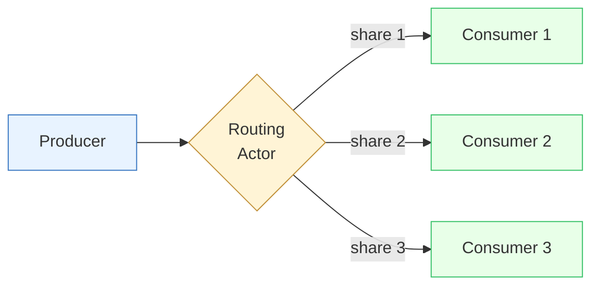

# Flow-Authority Policy — Three-Class Taxonomy

**Status:** Draft — taxonomy backbone for ADR-0001 (Flow-Authority Policy, ratified by M-066).
**Date:** 2026-05-05
**Owner:** E-25 Engine Truth Gate

## Purpose

FlowTime models real physical systems in which work flows from producers to consumers. At every fan-out point in such a system there is a question — *who decides how this producer's outflow apportions across its downstream consumers?* — and the modeling language must answer that question unambiguously. This document names the **three classes** of physical systems FlowTime exists to model, describes the routing actor's responsibilities for each, and assigns each class an **authority surface** — the place in the model where the routing rule is allowed to live.

The taxonomy is the prose backbone the flow-authority ADR references. A future template author should be able to read this document, place their model in one of the three classes, and immediately know which surface is normative for their fan-out points.

## The actor model

FlowTime's flow-authority policy presupposes a small actor model. Three roles participate at every fan-out point:

- **Producer.** A node that emits work into one or more outgoing edges. The producer knows its own state (e.g., `served(t)`) but must not know the state of its peer consumers.
- **Consumer.** A node that receives work from one or more incoming edges. The consumer knows its own state (e.g., its capacity, its queue depth) but must not know the state of its peer consumers.
- **Routing actor.** The decider. At any producer-fan-out point, exactly one routing actor decides how the producer's outflow apportions across the downstream consumers. The routing actor may be the producer itself (push routing), an explicit router node, an allocator that observes consumer capacity, or a static rule encoded on the edges. The choice depends on the class.

The hard constraint the policy ratifies: **exactly one routing authority lives at any producer-fan-out point**. Nothing else may inject routing information. A consumer that hard-codes peer-relative arithmetic (`arrivals = served * 0.25`) embeds peer knowledge in an actor that, by the actor model, must not have peer knowledge — the model is structurally invalid regardless of whether it happens to evaluate correctly under any particular parameter choice.

## The three classes

### Class 1 — producer-side push routing

**Definition.** The producer (or a routing actor placed immediately after it) computes per-consumer volumes from its own state and a routing rule that does not depend on individual consumer state. The routing actor decides "this consumer gets `f(produced)`" using a rule the producer itself can evaluate.

**Examples.**

- A round-robin or sticky-session load balancer in front of a pool of stateless workers.
- A conveyor diverter that sends every Nth item down branch B.
- A broadcast tree that copies the producer's outflow to every downstream consumer.
- A stateful router that emits priority-driven splits (e.g., gold customers → fast lane).

**Authority surface — `kind: router` node.** FlowTime models class 1 today via the explicit `kind: router` node. The router node is the routing actor; it sits between the producer and the downstream consumers, holds the routing rule, and emits per-consumer arrival series. Edge weights between a router and its downstream consumers are interpreted as routing-rule parameters (e.g., target shares); the router is normative, not the edges.

**Policy decision — authoritative for class 1.** Class 1 has a working surface in the engine. The flow-authority policy preserves it as-is: the router node is the authoritative routing actor for class-1 fan-outs, and consumer-side expr arithmetic must not encode peer-relative splits even when a router is also present.

### Class 2 — consumer-side pull / capacity-aware allocation

**Definition.** The producer offers a quantity (e.g., `served(t)`); an **allocator** observes all live consumers' available capacity for the bin and apportions the offered work across them. The routing decision is consumer-driven in the sense that it depends on consumer state — but the apportionment still happens at a single point (the allocator), not in the consumers themselves.

**Examples.**

- A scheduler dispatching jobs to whichever workers are currently free.
- A warehouse picker assignment that gives the next bin to whichever picker has slack.
- An admission controller matching incoming requests to backend health.
- A cell-fill allocator that pours produced units into whichever downstream cell has available capacity this bin.

**Authority surface — capacity-aware router actor (not yet surfaced).** The engine **does not surface class 2 today**. There is no built-in allocator node, and templates that need consumer-state-aware apportionment have historically faked it via consumer-side expr arithmetic. That workaround is a modeling error: it embeds peer knowledge in actors that must not have peer knowledge, breaks under telemetry replay (replay substitutes telemetry-observed arrivals; there is no `*0.25` to substitute), and breaks when a peer is added or saturated (the existing arithmetic is wrong).

**Policy decision — deferred.** Class 2 is a real future capability — not "we won't ship it," but "we have not surfaced it yet, and the current shipped template set does not require it." A capacity-aware allocator actor distinct from the static-weight router is the proposed future surface; the design lives in a deferred-follow-up gap (see [Cross-references](#cross-references)). Until that surface exists, templates that need class-2 semantics must either be restructured to fit class 1 or class 3, or wait. Consumer-side peer-relative arithmetic is **not** an acceptable workaround.

### Class 3 — edge-as-channel / static-weight routing

**Definition.** Each producer→consumer edge carries a **static weight** that means "this is the channel's share of this producer's outflow when no other information is available." Edge weights *are* the routing rule. Consumer state is irrelevant to *which* consumer gets *what share* — it only affects whether the routed volume queues, serves, drops, or otherwise behaves at the consumer.

**Examples.**

- A percentage-split routing rule: 30% airport, 50% downtown, 20% industrial.
- A demand-probability split derived from historical traffic shares.
- A PMF-style fan-out that materializes a categorical distribution as edge weights.
- Any model where the question "what fraction of the producer's outflow does each downstream channel get?" has a single, static, structurally-known answer.

**Authority surface — outgoing edge `weight`.** The edge weights declared on the producer's outgoing edges are normative. The engine's `EdgeFlowMaterializer` apportions the producer's outflow by weight; the resulting per-edge `flowVolume` series is the truth at every consumer's incoming side; the conservation invariant `arrivals(t) == sum(incomingEdges_after_lag)(t)` enforces that nothing else has injected routing information.

**Policy decision — authoritative for class 3.** Edge weights win for class-3 fan-outs. Templates that need static-share routing must encode the splits as edge weights, not as consumer-side expr arithmetic on the producer's `served` series. This is the answer to G-032's original "edge weights win / expr authority wins / both must agree" question for the cases the gap actually documents — all 9 affected shipped templates from G-032 are class-3 fan-outs.

## Authority assignment summary

| Class | Routing actor | Authority surface | Engine status |
|---|---|---|---|
| 1 — producer-side push | `kind: router` node | router node specification | Supported today |
| 2 — consumer-side pull / capacity-aware | capacity-aware allocator (future) | future allocator-node specification | **Not surfaced today** \| deferred future capability |
| 3 — edge-as-channel / static-weight | static rule on edges | producer-outgoing edge `weight` | Supported today; normative for class 3 |

**At every fan-out point, exactly one routing authority is active.** A producer with more than one outgoing edge must declare exactly one routing authority — either weighted edges (class 3), or a router node downstream (class 1), or eventually a capacity-aware allocator (class 2). Zero authorities or more than one authority at a single fan-out point is a modeling error and must be rejected by the engine's gates.

## Rejected framings

### Consumer-side expr authority

**Framing.** The consumer's `arrivals` is computed by an `expr` node referencing the producer's `served` series and a peer-relative split parameter (e.g., `arrivals_airport = hub_dispatch * splitAirport`). The engine treats expr-authored arrivals as authoritative; per-edge `flowVolume` becomes advisory.

**Rejected — flow-purity grounds.** A consumer that hard-codes `arrivals = served * 0.25` embeds peer knowledge in an actor that, per the actor model, must not have peer knowledge. Consequences:

- **Not telemetry-replayable.** Replay substitutes telemetry-observed arrivals; there is no `*0.25` factor to substitute.
- **Not invariant under peer addition.** Add a fifth consumer and every existing consumer's arithmetic is wrong.
- **Not robust to capacity-aware allocation.** Cannot express "1/3 each across the three live peers when one is saturated" without reaching into peer state, at which point the consumer is a router masquerading as one.

The framing is structurally invalid, not merely costly. It is rejected on first principles regardless of footprint cost.

### Both-must-agree (edge weights AND expr arithmetic, with a tooling-enforced consistency check)

**Framing.** The author declares the same fact twice (split on the edge AND split in the consumer expr). Tooling verifies they agree.

**Rejected — structurally redundant for class 3.** Forces the author to encode the same fact in two surfaces and tooling to verify they agree. Adds tax with no expressive gain. The mismatch potential is a perpetual maintenance burden (parameter changes must be made in two places). For class 3 the routing rule lives on the edge; reasserting it in the consumer is noise.

## Enforcement points

The flow-authority policy gets teeth at three layers of the engine. ADR-0001 names them; M-069 (the next milestone in E-25) implements them. They are listed here so the taxonomy reader sees how the policy becomes binding:

- **Schema (`docs/schemas/model.schema.yaml` + `ModelSchemaValidator`).** Rejects models that encode peer-relative splits in consumer expr arithmetic (e.g., expr nodes whose formula references the producer's `served` series and a `split*` parameter directly).
- **Compile (`ModelCompiler` / `TimeMachineValidator`).** Fan-out detection: any producer with more than one outgoing edge must have exactly one routing authority declared. Compile-time error if zero or more than one authority is detected.
- **Analyse (`InvariantAnalyzer`).** Adds two warning families — `routing_authority_ambiguous` (producer with conflicting authority surfaces) and `consumer_side_peer_split_detected` (consumer expr that looks peer-relative). The existing `edge_flow_mismatch_incoming` / `edge_flow_mismatch_outgoing` warnings stay in place as the conservation gate.

## Non-goals and out of scope

- **Implementation.** This document does not change engine code, schema, analyser, or any template. Implementation lives in M-069 (enforcement) and M-067 (engine + template alignment).
- **Class-2 surface design.** This document names class 2 as a deferred future capability and gives the framing; it does not propose a specific node specification, allocator algorithm, or evaluation-order treatment for capacity-aware allocation. The deferred-follow-up gap (filed by M-066 AC-7) owns that scoping.
- **Routing within stateful nodes.** Internal flow handling inside a single node (e.g., how a `serviceWithBuffer` partitions its served output across queue/served/dropped) is node-internal semantics, not a fan-out point. The policy does not regulate intra-node mechanics.
- **Cross-class hybrid models.** A model may contain class-1 fan-outs and class-3 fan-outs simultaneously — each fan-out point is classified independently. This document does not introduce a "model class" — only a per-fan-out classification.
- **Migration tooling.** The policy may force template-form changes for templates that currently encode class-3 splits in consumer expr arithmetic. Migration tooling for user-authored templates outside the shipped set is out of scope at the epic level (see E-25 epic spec, Out of scope).
- **Performance characterization of the chosen authority surfaces.** Whether edge-weight materialization, router evaluation, or future allocator evaluation has acceptable performance under realistic model sizes is engine-evolution scope, not policy scope.

## Cross-references

- **Milestone:** [M-066 — Flow-Authority Policy Spike](../../work/epics/E-25-engine-truth-gate/M-066-edge-flow-authority-decision.md). The milestone that authored this document and ratifies the policy as ADR-0001.
- **Gap:** [G-032 — `transportation-basic` regressed: `edge_flow_mismatch_incoming` × 3 after E-24 unification](../../work/gaps/G-032-transportation-basic-regressed-edge-flow-mismatch-incoming-3-after-e-24-unification.md). The investigation that surfaced the latent class-3 inconsistency in the shipped template set and motivated the policy.
- **ADR:** ADR-0001 — Flow-Authority Policy *(forthcoming, drafted under M-066 AC-5 and ratified under AC-9)*. Names the policy formally, references this taxonomy, records the rejected framings, and pins the enforcement points.
- **Epic:** [E-25 — Engine Truth Gate](../../work/epics/E-25-engine-truth-gate/epic.md). The epic that owns the policy work, the enforcement implementation (M-069), the engine + template alignment (M-067), and the golden-output canary (M-068).
- **Class-2 deferred capability gap:** [G-038 — Class-2 capacity-aware allocator (deferred from M-066 flow-authority policy)](../../work/gaps/G-038-class-2-capacity-aware-allocator-deferred-from-m-066-flow-authority-policy.md) *(filed under M-066 AC-7)*. Captures the future engine work for surfacing capacity-aware allocation as a first-class actor.

## Glossary

| Term | Meaning in this document |
|---|---|
| **Producer** | Node that emits work into one or more outgoing edges. |
| **Consumer** | Node that receives work from one or more incoming edges. |
| **Routing actor** | The decider at a fan-out point — producer, router node, allocator, or static edge rule. |
| **Fan-out point** | A producer with more than one outgoing edge, where an apportionment decision must be made. |
| **Authority surface** | The place in the model where the routing rule is allowed to live for a given class. |
| **Peer knowledge** | State of consumers other than oneself; structurally forbidden in consumer actors. |
| **Static-weight routing** | Routing where the apportionment is structurally known and parameter-time, not bin-time. |
| **Capacity-aware allocation** | Routing where the apportionment depends on observed consumer state at the bin. |
