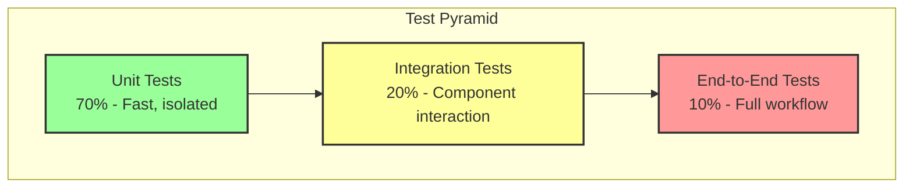
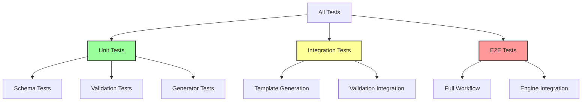

# FlowTime-Sim Time-Travel Implementation Plan
## Chapter 6: Testing Strategy

**Last Updated:** October 9, 2025

---

## 6.1 Testing Philosophy

### 6.1.1 Test Pyramid



**Target Distribution:**
- **Unit Tests:** 70% of test count - Fast, isolated, comprehensive
- **Integration Tests:** 20% of test count - Component interactions
- **End-to-End Tests:** 10% of test count - Full workflow validation

---

### 6.1.2 Testing Principles

**P1: Test Behavior, Not Implementation**
- Test what code does, not how it does it
- Refactoring should not break tests

**P2: Fast Feedback**
- Unit tests complete quickly
- Integration tests run in reasonable time
- Fail fast with clear messages

**P3: Independence**
- Tests don't depend on each other
- Tests runnable in any order
- No shared state between tests

**P4: Maintainability**
- Tests easy to understand
- Use builders and fixtures
- Clear assertion messages

---

## 6.2 Unit Testing

### 6.2.1 Schema Classes

**Coverage Target:** >95%

**Test Categories:**

**Serialization Tests:**
```csharp
[TestClass]
public class TemplateWindowTests
{
    [TestMethod]
    public void Window_Serialization_RoundTrip()
    {
        var window = new TemplateWindow
        {
            Start = "2025-10-07T00:00:00Z",
            Timezone = "UTC"
        };
        
        var yaml = SerializeToYaml(window);
        var deserialized = DeserializeFromYaml<TemplateWindow>(yaml);
        
        Assert.AreEqual(window.Start, deserialized.Start);
        Assert.AreEqual(window.Timezone, deserialized.Timezone);
    }
    
    [TestMethod]
    public void Window_Nullable_HandledCorrectly()
    {
        var template = new Template { Window = null };
        var yaml = SerializeToYaml(template);
        
        Assert.IsFalse(yaml.Contains("window:"));
    }
}
```

**Topology Tests:**
```csharp
[TestClass]
public class TopologyNodeTests
{
    [TestMethod]
    public void TopologyNode_AllFields_SerializeCorrectly()
    {
        var node = new TopologyNode
        {
            Id = "OrderService",
            Kind = "service",
            Group = "Core",
            Ui = new UIHint { X = 100, Y = 200 },
            Semantics = new NodeSemantics
            {
                Arrivals = "orders_in",
                Served = "orders_out",
                Capacity = "orders_capacity"
            }
        };
        
        var yaml = SerializeToYaml(node);
        var deserialized = DeserializeFromYaml<TopologyNode>(yaml);
        
        Assert.AreEqual("OrderService", deserialized.Id);
        Assert.AreEqual("service", deserialized.Kind);
        Assert.AreEqual(100, deserialized.Ui.X);
    }
    
    [TestMethod]
    public void NodeSemantics_NullFields_SerializeAsNull()
    {
        var semantics = new NodeSemantics
        {
            Arrivals = "orders_in",
            Served = null,
            Capacity = null
        };
        
        var yaml = SerializeToYaml(semantics);
        Assert.IsTrue(yaml.Contains("arrivals: orders_in"));
    }
}
```

---

### 6.2.2 Validation Tests

**Coverage Target:** >95%

**Test Structure:**
```csharp
[TestClass]
public class WindowValidatorTests
{
    private WindowValidator _validator;
    
    [TestInitialize]
    public void Setup()
    {
        _validator = new WindowValidator();
    }
    
    [TestMethod]
    public void Validate_ValidWindow_NoErrors()
    {
        var template = TemplateBuilder.Create()
            .WithWindow("2025-10-07T00:00:00Z", "UTC")
            .WithGrid(6, 60, "minutes")
            .Build();
        
        var result = _validator.Validate(template);
        
        Assert.IsTrue(result.IsValid);
        Assert.AreEqual(0, result.Errors.Count);
    }
    
    [TestMethod]
    public void Validate_MissingZ_ReturnsWIN003()
    {
        var template = TemplateBuilder.Create()
            .WithWindow("2025-10-07T00:00:00", "UTC")
            .Build();
        
        var result = _validator.Validate(template);
        
        Assert.IsFalse(result.IsValid);
        Assert.AreEqual(1, result.Errors.Count);
        Assert.AreEqual("WIN003", result.Errors[0].Code);
        StringAssert.Contains(result.Errors[0].Message, "UTC");
    }
    
    [TestMethod]
    public void Validate_NotAlignedToBin_ReturnsWIN005()
    {
        var template = TemplateBuilder.Create()
            .WithWindow("2025-10-07T00:07:30Z", "UTC")
            .WithGrid(6, 15, "minutes")
            .Build();
        
        var result = _validator.Validate(template);
        
        Assert.IsFalse(result.IsValid);
        var error = result.Errors.First(e => e.Code == "WIN005");
        Assert.IsNotNull(error);
        StringAssert.Contains(error.Message, "aligned");
    }
    
    [TestMethod]
    public void Validate_NullWindow_NoErrors()
    {
        var template = TemplateBuilder.Create()
            .WithoutWindow()
            .Build();
        
        var result = _validator.Validate(template);
        
        Assert.IsTrue(result.IsValid);
    }
}
```

**Test Coverage Requirements:**

| Validator | Test Cases | Coverage Target |
|-----------|-----------|-----------------|
| **WindowValidator** | 8 | >95% |
| **TopologyValidator** | 15 | >95% |
| **SemanticValidator** | 10 | >95% |
| **EdgeValidator** | 12 | >95% |
| **ParameterValidator** | 6 | >90% |

---

### 6.2.3 Generator Tests

**Coverage Target:** >90%

**Parameter Substitution:**
```csharp
[TestClass]
public class ParameterSubstitutionTests
{
    [TestMethod]
    public void SubstituteParameters_SimpleField_Replaced()
    {
        var yaml = "bins: ${bins}";
        var parameters = new Dictionary<string, object> { ["bins"] = 6 };
        
        var result = SubstituteParameters(yaml, parameters);
        
        Assert.AreEqual("bins: 6", result);
    }
    
    [TestMethod]
    public void SubstituteParameters_NestedObject_Replaced()
    {
        var yaml = @"
window:
  start: ${startTime}
  timezone: UTC";
        
        var parameters = new Dictionary<string, object> 
        { 
            ["startTime"] = "2025-10-07T00:00:00Z" 
        };
        
        var result = SubstituteParameters(yaml, parameters);
        
        StringAssert.Contains(result, "start: 2025-10-07T00:00:00Z");
    }
    
    [TestMethod]
    public void SubstituteParameters_StringInterpolation_Replaced()
    {
        var yaml = "id: ${name}_service";
        var parameters = new Dictionary<string, object> { ["name"] = "order" };
        
        var result = SubstituteParameters(yaml, parameters);
        
        Assert.AreEqual("id: order_service", result);
    }
}
```

**Schema Conversion:**
```csharp
[TestClass]
public class ConvertToEngineSchemaTests
{
    [TestMethod]
    public void Convert_RemovesMetadataSection()
    {
        var yaml = @"
schemaVersion: 1
metadata:
  id: test
grid:
  bins: 6";
        
        var result = ConvertToEngineSchema(yaml);
        
        Assert.IsFalse(result.Contains("metadata:"));
        Assert.IsTrue(result.Contains("grid:"));
    }
    
    [TestMethod]
    public void Convert_PreservesWindowSection()
    {
        var yaml = @"
metadata:
  id: test
window:
  start: 2025-10-07T00:00:00Z
grid:
  bins: 6";
        
        var result = ConvertToEngineSchema(yaml);
        
        Assert.IsTrue(result.Contains("window:"));
        Assert.IsTrue(result.Contains("start: 2025-10-07T00:00:00Z"));
    }
    
    [TestMethod]
    public void Convert_PreservesTopologySection()
    {
        var yaml = @"
metadata:
  id: test
topology:
  nodes:
    - id: Service1
grid:
  bins: 6";
        
        var result = ConvertToEngineSchema(yaml);
        
        Assert.IsTrue(result.Contains("topology:"));
        Assert.IsTrue(result.Contains("id: Service1"));
    }
}
```

---

## 6.3 Integration Testing

### 6.3.1 Template Generation

**Coverage Target:** All templates

**Test Structure:**
```csharp
[TestClass]
public class TemplateGenerationIntegrationTests
{
    private NodeBasedTemplateService _templateService;
    
    [TestInitialize]
    public void Setup()
    {
        _templateService = new NodeBasedTemplateService(
            new ValidationOrchestrator());
    }
    
    [TestMethod]
    public void GenerateModel_TransportationBasic_ProducesValidModel()
    {
        var parameters = new Dictionary<string, object>
        {
            ["bins"] = 6,
            ["startTime"] = "2025-10-07T00:00:00Z"
        };
        
        var model = _templateService.GenerateModel("transportation-basic", parameters);
        
        Assert.IsNotNull(model);
        Assert.AreEqual(1, model.SchemaVersion);
        Assert.IsNotNull(model.Window);
        Assert.AreEqual("2025-10-07T00:00:00Z", model.Window.Start);
        Assert.IsNotNull(model.Topology);
        Assert.AreEqual(1, model.Topology.Nodes.Count);
        Assert.AreEqual("service", model.Topology.Nodes[0].Kind);
        Assert.AreEqual("1.1", model.ModelVersion);
    }
    
    [TestMethod]
    public void GenerateModel_AllTemplates_ProduceValidModels()
    {
        var templateIds = new[]
        {
            "transportation-basic",
            "manufacturing-line",
            "it-system-microservices",
            "supply-chain-multi-tier",
            "network-reliability"
        };
        
        foreach (var templateId in templateIds)
        {
            var model = _templateService.GenerateModel(
                templateId, 
                new Dictionary<string, object>());
            
            Assert.IsNotNull(model, $"{templateId} failed");
            Assert.IsNotNull(model.Window, $"{templateId} missing window");
            Assert.IsNotNull(model.Topology, $"{templateId} missing topology");
            Assert.AreEqual("1.1", model.ModelVersion, $"{templateId} wrong version");
        }
    }
}
```

---

### 6.3.2 Validation Integration

**Coverage Target:** All validation paths

```csharp
[TestClass]
public class ValidationIntegrationTests
{
    [TestMethod]
    public void Validate_CompleteTemplate_NoErrors()
    {
        var template = LoadTestTemplate("complete-valid.yaml");
        var orchestrator = new ValidationOrchestrator();
        
        var result = orchestrator.ValidateAll(template);
        
        Assert.IsTrue(result.IsValid);
        Assert.AreEqual(0, result.Errors.Count);
    }
    
    [TestMethod]
    public void Validate_MultipleErrors_AllCaptured()
    {
        var template = TemplateBuilder.Create()
            .WithWindow("2025-10-07T00:00:00", "EST")  // WIN003, WIN004
            .WithTopologyNode("Node1", "invalid_kind")  // TOP004
            .WithSemanticReference("non_existent")      // SEM001
            .Build();
        
        var orchestrator = new ValidationOrchestrator();
        var result = orchestrator.ValidateAll(template);
        
        Assert.IsFalse(result.IsValid);
        Assert.IsTrue(result.Errors.Count >= 4);
        
        Assert.IsTrue(result.Errors.Any(e => e.Code == "WIN003"));
        Assert.IsTrue(result.Errors.Any(e => e.Code == "WIN004"));
        Assert.IsTrue(result.Errors.Any(e => e.Code == "TOP004"));
        Assert.IsTrue(result.Errors.Any(e => e.Code == "SEM001"));
    }
}
```

---

## 6.4 End-to-End Testing

### 6.4.1 Full Workflow Tests

**Coverage Target:** Critical paths

```csharp
[TestClass]
public class EndToEndTests
{
    [TestMethod]
    public void E2E_LoadTemplate_GenerateModel_ValidateOutput()
    {
        // 1. Load template
        var templateService = new NodeBasedTemplateService(
            new ValidationOrchestrator());
        
        // 2. Generate model
        var parameters = new Dictionary<string, object>
        {
            ["bins"] = 12,
            ["startTime"] = "2025-10-07T00:00:00Z"
        };
        
        var model = templateService.GenerateModel(
            "transportation-basic", 
            parameters);
        
        // 3. Validate structure
        Assert.IsNotNull(model.Window);
        Assert.AreEqual("2025-10-07T00:00:00Z", model.Window.Start);
        Assert.AreEqual(12, model.Grid.Bins);
        Assert.AreEqual("1.1", model.ModelVersion);
        
        // 4. Verify topology
        Assert.IsNotNull(model.Topology);
        Assert.AreEqual(1, model.Topology.Nodes.Count);
        
        var service = model.Topology.Nodes[0];
        Assert.AreEqual("TransportService", service.Id);
        Assert.AreEqual("service", service.Kind);
        Assert.IsNotNull(service.Semantics.Arrivals);
        Assert.IsNotNull(service.Semantics.Served);
        
        // 5. Verify semantic references valid
        var nodeIds = model.Nodes.Select(n => n.Id).ToHashSet();
        Assert.IsTrue(nodeIds.Contains(service.Semantics.Arrivals));
        Assert.IsTrue(nodeIds.Contains(service.Semantics.Served));
    }
}
```

---

### 6.4.2 Engine Integration Tests

**Objective:** Verify generated models work with Engine M3.x

**Prerequisites:** Engine M3.x available

```csharp
[TestClass]
[TestCategory("EngineIntegration")]
public class EngineIntegrationTests
{
    private HttpClient _engineClient;
    
    [TestInitialize]
    public void Setup()
    {
        _engineClient = new HttpClient
        {
            BaseAddress = new Uri("http://localhost:5000")
        };
    }
    
    [TestMethod]
    public async Task GeneratedModel_LoadsInEngine()
    {
        // Generate model
        var service = new NodeBasedTemplateService(new ValidationOrchestrator());
        var model = service.GenerateModel(
            "transportation-basic", 
            new Dictionary<string, object>());
        var modelYaml = SerializeToYaml(model);
        
        // POST to Engine
        var content = new StringContent(modelYaml, Encoding.UTF8, "application/yaml");
        var response = await _engineClient.PostAsync("/v1/runs", content);
        
        // Verify accepted
        Assert.IsTrue(response.IsSuccessStatusCode, 
            $"Engine rejected: {await response.Content.ReadAsStringAsync()}");
        
        var runId = await response.Content.ReadAsStringAsync();
        Assert.IsFalse(string.IsNullOrEmpty(runId));
    }
    
    [TestMethod]
    public async Task StateAPI_ReturnsTopology()
    {
        // Generate and load model
        var service = new NodeBasedTemplateService(new ValidationOrchestrator());
        var model = service.GenerateModel(
            "transportation-basic", 
            new Dictionary<string, object>());
        var modelYaml = SerializeToYaml(model);
        
        var content = new StringContent(modelYaml, Encoding.UTF8, "application/yaml");
        var postResponse = await _engineClient.PostAsync("/v1/runs", content);
        var runId = await postResponse.Content.ReadAsStringAsync();
        
        // Call /state API
        var stateResponse = await _engineClient.GetAsync(
            $"/v1/runs/{runId}/state?bin=0");
        Assert.IsTrue(stateResponse.IsSuccessStatusCode);
        
        var stateJson = await stateResponse.Content.ReadAsStringAsync();
        var state = JsonConvert.DeserializeObject<dynamic>(stateJson);
        
        // Verify topology in response
        Assert.IsNotNull(state.topology);
        Assert.IsNotNull(state.topology.nodes);
        Assert.IsTrue(state.topology.nodes.Count > 0);
    }
}
```

---

## 6.5 Backward Compatibility Testing

### 6.5.1 Legacy Template Tests

**Objective:** Verify templates without topology still work

```csharp
[TestClass]
public class BackwardCompatibilityTests
{
    [TestMethod]
    public void OldTemplate_WithoutTopology_GeneratesSuccessfully()
    {
        var oldTemplate = @"
schemaVersion: 1
metadata:
  id: old-template
grid:
  bins: 6
  binSize: 60
  binUnit: minutes
nodes:
  - id: demand
    kind: const
    values: [10, 20, 30, 40, 50, 60]
outputs:
  - series: demand
    as: demand.csv";
        
        var template = DeserializeFromYaml<Template>(oldTemplate);
        var orchestrator = new ValidationOrchestrator();
        
        // Should NOT fail (topology optional)
        var result = orchestrator.ValidateAll(template);
        Assert.IsTrue(result.IsValid);
        
        // Should generate without topology
        var modelYaml = SerializeToYaml(template);
        Assert.IsFalse(modelYaml.Contains("window:"));
        Assert.IsFalse(modelYaml.Contains("topology:"));
    }
    
    [TestMethod]
    public void OldTemplate_ModelVersion10()
    {
        var template = TemplateBuilder.Create()
            .WithoutWindow()
            .WithoutTopology()
            .Build();
        
        var service = new NodeBasedTemplateService(new ValidationOrchestrator());
        var model = service.AddModelVersion(template);
        
        // Should be model 1.0 (or omitted)
        Assert.IsTrue(model.ModelVersion == "1.0" || model.ModelVersion == null);
    }
    
    [TestMethod]
    public void NewTemplate_ModelVersion11()
    {
        var template = TemplateBuilder.Create()
            .WithWindow("2025-10-07T00:00:00Z", "UTC")
            .WithTopology()
            .Build();
        
        var service = new NodeBasedTemplateService(new ValidationOrchestrator());
        var model = service.AddModelVersion(template);
        
        // Should be model 1.1
        Assert.AreEqual("1.1", model.ModelVersion);
    }
}
```

---

## 6.6 Performance Testing

### 6.6.1 Benchmark Suite

**Framework:** BenchmarkDotNet

```csharp
[MemoryDiagnoser]
public class TemplateBenchmarks
{
    private NodeBasedTemplateService _service;
    
    [GlobalSetup]
    public void Setup()
    {
        _service = new NodeBasedTemplateService(new ValidationOrchestrator());
    }
    
    [Benchmark]
    public void LoadTemplate_TransportationBasic()
    {
        _service.LoadTemplate("transportation-basic");
    }
    
    [Benchmark]
    public void GenerateModel_TransportationBasic()
    {
        _service.GenerateModel("transportation-basic", new Dictionary<string, object>());
    }
    
    [Benchmark]
    public void ValidateTemplate_SmallTopology()
    {
        var template = CreateTemplateWithTopology(5);
        var orchestrator = new ValidationOrchestrator();
        orchestrator.ValidateAll(template);
    }
    
    [Benchmark]
    public void ValidateTemplate_MediumTopology()
    {
        var template = CreateTemplateWithTopology(50);
        var orchestrator = new ValidationOrchestrator();
        orchestrator.ValidateAll(template);
    }
    
    [Benchmark]
    public void ValidateTemplate_LargeTopology()
    {
        var template = CreateTemplateWithTopology(100);
        var orchestrator = new ValidationOrchestrator();
        orchestrator.ValidateAll(template);
    }
}
```

**Performance Targets:**

| Operation | Target | Measurement |
|-----------|--------|-------------|
| Load template | Fast | Mean |
| Generate model | Fast | Mean |
| Validate 10 nodes | Very fast | Mean |
| Validate 50 nodes | Fast | Mean |
| Validate 100 nodes | Reasonable | Mean |

---

### 6.6.2 Load Testing

**Scenario:** Generate many models concurrently

```csharp
[TestClass]
public class LoadTests
{
    [TestMethod]
    public void LoadTest_GenerateMultipleModelsParallel()
    {
        var service = new NodeBasedTemplateService(new ValidationOrchestrator());
        var stopwatch = Stopwatch.StartNew();
        
        Parallel.For(0, 100, i =>
        {
            service.GenerateModel(
                "transportation-basic", 
                new Dictionary<string, object>());
        });
        
        stopwatch.Stop();
        
        // Log time for analysis
        Console.WriteLine($"Generated 100 models in {stopwatch.Elapsed.TotalSeconds}s");
    }
}
```

---

## 6.7 Test Data Management

### 6.7.1 Test Fixtures

**Structure:**
```
tests/
  FlowTime.Sim.Tests/
    Fixtures/
      Templates/
        valid-minimal.yaml
        valid-complete.yaml
        invalid-window.yaml
        invalid-topology.yaml
        legacy-no-topology.yaml
      CSV/
        arrivals-6bins.csv
        arrivals-100bins.csv
```

**Fixture Loading:**
```csharp
public static class TestFixtures
{
    public static Template LoadTemplate(string name)
    {
        var path = Path.Combine("Fixtures", "Templates", $"{name}.yaml");
        var yaml = File.ReadAllText(path);
        return DeserializeFromYaml<Template>(yaml);
    }
    
    public static double[] LoadCSV(string name)
    {
        var path = Path.Combine("Fixtures", "CSV", $"{name}.csv");
        var lines = File.ReadAllLines(path);
        return lines.Select(double.Parse).ToArray();
    }
}
```

---

### 6.7.2 Test Builders

**TemplateBuilder:**
```csharp
public class TemplateBuilder
{
    private Template _template = new Template
    {
        SchemaVersion = 1,
        Grid = new TemplateGrid { Bins = 6, BinSize = 60, BinUnit = "minutes" }
    };
    
    public static TemplateBuilder Create() => new TemplateBuilder();
    
    public TemplateBuilder WithWindow(string start, string timezone)
    {
        _template.Window = new TemplateWindow
        {
            Start = start,
            Timezone = timezone
        };
        return this;
    }
    
    public TemplateBuilder WithoutWindow()
    {
        _template.Window = null;
        return this;
    }
    
    public TemplateBuilder WithTopology()
    {
        _template.Topology = new TemplateTopology
        {
            Nodes = new List<TopologyNode>
            {
                new TopologyNode
                {
                    Id = "TestService",
                    Kind = "service",
                    Semantics = new NodeSemantics
                    {
                        Arrivals = "arrivals",
                        Served = "served"
                    }
                }
            }
        };
        return this;
    }
    
    public TemplateBuilder WithoutTopology()
    {
        _template.Topology = null;
        return this;
    }
    
    public TemplateBuilder WithTopologyNode(string id, string kind)
    {
        if (_template.Topology == null)
            _template.Topology = new TemplateTopology();
        
        _template.Topology.Nodes.Add(new TopologyNode
        {
            Id = id,
            Kind = kind
        });
        return this;
    }
    
    public TemplateBuilder WithGrid(int bins, int binSize, string binUnit)
    {
        _template.Grid = new TemplateGrid
        {
            Bins = bins,
            BinSize = binSize,
            BinUnit = binUnit
        };
        return this;
    }
    
    public Template Build() => _template;
}
```

---

## 6.8 Test Execution

### 6.8.1 CI Pipeline Integration

```yaml
name: Tests

on: [push, pull_request]

jobs:
  unit-tests:
    runs-on: ubuntu-latest
    steps:
      - uses: actions/checkout@v3
      - name: Setup .NET
        uses: actions/setup-dotnet@v3
        with:
          dotnet-version: '8.0.x'
      - name: Run Unit Tests
        run: dotnet test --filter Category!=EngineIntegration
      - name: Upload Coverage
        uses: codecov/codecov-action@v3
  
  integration-tests:
    runs-on: ubuntu-latest
    needs: unit-tests
    steps:
      - uses: actions/checkout@v3
      - name: Run Integration Tests
        run: dotnet test --filter Category=Integration
  
  performance-tests:
    runs-on: ubuntu-latest
    needs: unit-tests
    steps:
      - uses: actions/checkout@v3
      - name: Run Benchmarks
        run: dotnet run --project tests/FlowTime.Sim.Benchmarks --configuration Release
```

---

### 6.8.2 Test Categories



**Test Categories:**
- `[TestCategory("Unit")]` - Fast unit tests
- `[TestCategory("Integration")]` - Integration tests
- `[TestCategory("EngineIntegration")]` - Requires Engine M3.x
- `[TestCategory("Performance")]` - Performance benchmarks

---

## 6.9 Test Checklist

### M3.0 Exit Criteria
- [ ] All schema classes have unit tests
- [ ] Serialization round-trip tests pass
- [ ] Null handling tests pass
- [ ] High code coverage achieved

### M3.1 Exit Criteria
- [ ] Generator tests pass
- [ ] Parameter substitution tests pass
- [ ] Schema conversion tests pass
- [ ] E2E generation tests pass

### M3.2 Exit Criteria
- [ ] All 5 templates generate successfully
- [ ] Template-specific tests pass
- [ ] Backward compatibility tests pass

### M3.3 Exit Criteria
- [ ] All validators have unit tests
- [ ] All 29 error codes covered
- [ ] Integration validation tests pass
- [ ] Performance benchmarks acceptable

### M3.4 Exit Criteria
- [ ] Engine integration tests pass
- [ ] /state API tests pass
- [ ] Load tests complete

### M3.5 Exit Criteria
- [ ] All documentation tests reviewed
- [ ] Example templates validated

---

## 6.10 Test Metrics

### Success Criteria

| Metric | Target | Measurement |
|--------|--------|-------------|
| **Unit Test Count** | >50 | Test explorer |
| **Integration Test Count** | >15 | Test explorer |
| **E2E Test Count** | >5 | Test explorer |
| **Code Coverage** | >90% | CodeCov |
| **Validation Coverage** | All 29 codes | Manual check |

---

**End of Chapter 6**

**End of Implementation Plan**