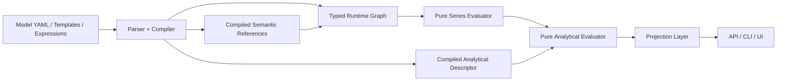

# Formula-First Engine Refactor Plan

**Status:** Proposed  
**Date:** 2026-04-03  
**Scope:** Follow-on architecture plan for E-10 Phase 3 after `m-ec-p3a1`

## Thesis

FlowTime core should behave like a spreadsheet engine over a fixed time grid:

- authored models define named series and dependencies
- expressions and domain primitives compile into a typed calculation graph
- evaluation is deterministic and pure over vectors
- analytical metrics are derived by pure evaluators over compiled model facts and series
- API, storage, telemetry, and UI are shells around that kernel, not places where domain meaning is reconstructed

This is close to the intent already described in [docs/concepts/nodes-and-expressions.md](../concepts/nodes-and-expressions.md): expressions are the authoring surface, nodes are the execution plan, and the engine is deterministic graph evaluation over a canonical grid.

The current smell is not that FlowTime has layers. The smell is that the wrong layers own domain meaning. The engine should have a thin imperative shell around a pure calculation kernel. Today, analytical identity and semantic reference meaning are still reconstructed late in adapters and clients.

## What “Excel-Like Core” Means

The right analogy is **formula-first**, not **formula-text-only**.

Excel is not just user-entered `=A1+B1` text. It also has:

- a typed workbook model
- cell/range references resolved before calculation
- built-in functions with pure evaluation semantics
- a calculation chain
- views and formatting that sit outside the calculation core

FlowTime should mirror that structure:

- **Authoring layer:** YAML, templates, expression language, model schema
- **Compile layer:** parse references, resolve semantics, lower authoring concepts into a typed runtime graph
- **Evaluation kernel:** deterministic pure vector functions over a fixed time grid
- **Analytical layer:** pure derived metrics and warnings over compiled node descriptors and evaluated series
- **Shell layer:** artifacts, HTTP, telemetry packaging, DTO projection, UI rendering

That means the engine core should absolutely be “just formulas” in spirit: a deterministic graph of pure transforms over named series. But it does **not** mean every domain primitive must be handwritten as an `expr:` string. `serviceWithBuffer`, router behavior, dispatch cadence, and future analytical primitives can be built-in pure vector operators or compile-time macros. Purity matters more than textual uniformity.

## Current Design Smells

### 1. Semantic identity is inferred too late

Runtime analytical identity is still derived from raw strings in `StateQueryService` instead of being compiled once into the runtime node model.

Symptoms:

- `StateQueryService` reparses `queueDepth` references to determine logical type
- `StateRunContext` carries both compiled topology and parser-style `ModelNodes`
- API logic backfills topology nodes into a parser-style map just to recover meaning

Consequence:

- adapters and tests rely on reference-shape knowledge
- logicalType parity becomes an edge-case problem instead of a compiled invariant

### 2. Contracts expose hints, not facts

The API exposes `kind` and `nodeLogicalType`, but not an authoritative analytical descriptor or capability contract.

Consequence:

- UI/client code re-implements `IsServiceLike`, `IsQueueLike`, `ClassifyNode`, and similar helpers
- downstream behavior depends on duplicated heuristics instead of engine facts

### 3. Analytical policy is fragmented

Analytical behavior is spread across:

- `AnalyticalCapabilities`
- `StateQueryService`
- `CycleTimeComputer`
- `LatencyComputer`
- warning builders and metadata emitters

Consequence:

- Core owns some analytical math, but adapters still own emission truth and warning applicability plumbing
- the same concept is represented in multiple places with slightly different policy

### 4. Reference parsing is duplicated

The API has separate parsing logic for:

- queue origin metadata
- logicalType promotion
- node-id extraction from semantics references

Consequence:

- the same authoring syntax is reinterpreted in multiple ways after compile
- any new edge case tends to produce another helper rather than a better compiled model

### 5. Fallback and truth are mixed together

`ClassMetricsAggregator` currently does more than aggregation:

- aggregates real by-class data
- assigns coverage status
- produces warnings
- manufactures a wildcard fallback when no class data exists

Consequence:

- tests can appear to prove “by-class analytical parity” while only exercising fallback projection
- downstream code must infer whether data is actual by-class truth or synthesized fallback

## Architecture Principles

These principles should gate all follow-on work.

1. **No string parsing after compile for semantic meaning.**
   Parsing raw `file:` or `series:` references in API/UI code is a design failure unless it is purely for provenance display.

2. **One owner per concept.**
   If “what analytical metrics can this node emit?” is a concept, it must have one owning type and one authoritative computation path.

3. **Contracts publish facts, not reconstruction hints.**
   UI should not need to interpret `kind + logicalType` to know whether queue/service semantics apply.

4. **Authoring kinds are not runtime truth.**
   `kind` is part of the authored model surface. Runtime evaluation should use compiled descriptors.

5. **Derived metric emission must come from the evaluator, not booleans in the adapter.**
   Metadata honesty and warning applicability should fall out of evaluated facts, not hand-maintained condition sets.

6. **Warnings are analyzers over evaluated facts.**
   Warning logic should consume compiled descriptors and evaluated series, not raw authoring syntax.

7. **Every migration slice ends with deletion.**
   No “temporary helper” survives past the slice that replaces it.

## Target Architecture

### Required runtime concepts

The compiler should produce explicit runtime concepts instead of making later layers reconstruct them:

- `SeriesRef` or equivalent typed semantic reference
- `CompiledNodeSemantics` or equivalent resolved semantics structure
- `AnalyticalDescriptor` or equivalent authoritative analytical identity
- `AnalyticalEvaluationResult` that includes both values and emitted derived keys
- `WarningFacts` or equivalent pure analyzer output before API formatting

### What stays imperative

The pure-core goal does **not** remove these layers:

- file/artifact I/O
- YAML/template parsing
- run manifest assembly
- HTTP/JSON projection
- telemetry source reporting
- UI layout and visualization choices

Those are legitimate shell concerns. The rule is that they should not own analytical truth.

## Recommended Refactor Direction

### Direction A: Make the compiler authoritative

The cleanest next move is not more adapter cleanup. It is to move semantic resolution one phase earlier.

The compiler should resolve:

- semantic references into typed references
- queue/source relationships
- effective analytical kind for runtime evaluation
- queue origin facts
- whether a node is analytically queue-like, service-like, both, or neither

After that point, adapters should not inspect raw semantic strings to recover analytical identity.

### Direction B: Make analytical evaluation a pure Core subsystem

Core should expose one analytical evaluator that takes:

- a compiled analytical descriptor
- raw node series data
- optional per-class data
- evaluation options

and returns:

- snapshot analytical values
- window analytical series
- class analytical values/series
- emitted derived keys
- warning/analyzer facts

This should subsume the current split between `AnalyticalCapabilities`, ad hoc adapter emission gating, and warning eligibility plumbing.

### Direction C: Make the API a projector, not an interpreter

`StateQueryService` should:

- load artifacts and compiled runtime context
- call Core evaluators
- format responses
- attach telemetry/provenance metadata

It should **not**:

- classify nodes analytically from raw strings
- decide derived metric truth with local boolean matrices
- parse semantics references to discover analytical relationships

### Direction D: Make clients consume engine facts

UI and client layers should either receive:

- an explicit analytical descriptor in the contract, or
- an authoritative list of supported/emitted analytical series and node categories

That allows deletion of duplicated `IsServiceLike` / `IsQueueLike` logic in the UI.

## Refactor Plan

This should be done as a staged refactor, not a rewrite-from-scratch. The engine already has the right conceptual foundation. The problem is ownership, not that the whole system is unsalvageable.

### Phase 0: Architecture freeze and invariants

Before code changes:

- approve the target runtime concepts
- decide what becomes authoritative in Core versus contract
- define a delete list for adapter/local heuristics
- write migration invariants and review gates

Required invariants:

- no semantic string parsing in API/UI for analytical identity
- no `kind + logicalType` classification in UI for analytical behavior
- no analytical emission truth computed by adapter booleans
- no duplicate core primitive for the same analytical concept

### Phase 1: Typed semantic references

Introduce typed references for runtime semantics.

Deliverables:

- replace raw semantic reference strings in runtime-facing semantics with typed refs
- parse `file:`, `series:`, self-reference, and source-node relationships at compile time
- retain raw text only for provenance/debug if needed
- regenerate existing runs, fixtures, and approved snapshots that depend on the old runtime shape; do not add backward-compatibility fallbacks

Exit criteria:

- `StateQueryService` no longer needs helpers that parse semantic references for analytical meaning

### Phase 2: Class-data boundary cleanup

Separate these concerns before descriptor/evaluator work depends on them:

- real class aggregation
- wildcard fallback projection
- class coverage diagnostics
- analytical class evaluation

Exit criteria:

- tests explicitly distinguish real by-class analytical results from fallback projection
- runtime and projection code no longer infer class truth from `*` alone

### Phase 3: Compiled analytical descriptor

Introduce an authoritative runtime analytical descriptor on nodes.

Suggested contents:

- effective analytical kind
- queue/service semantics flags
- cycle-time decomposition applicability
- warning applicability
- queue-origin facts
- source-node identity for queue semantics when relevant

Exit criteria:

- delete adapter-side logicalType inference for analytics
- delete topology-node backfill used only for analytical identity recovery

### Phase 4: Core analytical evaluator

Build a single pure Core evaluator for analytical values and emitted-series truth.

It should produce:

- snapshot results
- window results
- class snapshot/window results
- emitted-derived-keys manifest

Exit criteria:

- remove adapter-side analytical gating logic
- move emitted-series truth out of adapter-local boolean matrices

### Phase 5: Warning facts and primitive cleanup

Move warning/analyzer facts into Core and clean up the analytical primitive layer.

Recommended changes:

- keep `CycleTimeComputer` as pure math
- either fold `LatencyComputer` into the analytical evaluator or reduce it to a unit conversion helper if it remains distinct
- separate stationarity logic from `CycleTimeComputer` if it is analyzer policy rather than math
- make warning facts consume compiled descriptors and evaluated analytical results rather than raw semantics

Exit criteria:

- each analytical concept has one owning primitive/evaluator
- projection code formats warning facts but does not decide them

### Phase 6: Contract and named-consumer purification

Expose authoritative engine facts to the current state consumers and delete their analytical heuristics.

Options:

1. add a compact `analytical` descriptor to node contracts
2. add a contract-level emitted-metrics descriptor and supported-capabilities section

Initial consumer scope:

- `FlowTime.Contracts` state DTOs
- API `/state` and `/state_window` projections
- `src/FlowTime.UI/Services/TimeTravelMetricsClient.cs`
- `src/FlowTime.UI/Pages/TimeTravel/Dashboard.razor.cs`
- `src/FlowTime.UI/Components/Topology/GraphMapper.cs`
- `src/FlowTime.UI/Components/Topology/TopologyCanvas.razor.cs`

Exit criteria:

- UI/client code no longer needs `kind + logicalType` heuristics for analytical behavior
- old hint fields and heuristics are removed in the same forward-only cut once those consumers are migrated

### Phase 7: Deletion and simplification pass

After the new boundary is in place, delete:

- semantic reference parsing helpers in `StateQueryService`
- analytical identity reconstruction in adapters
- duplicated UI classification helpers for analytical behavior
- any temporary regeneration or migration code that outlived its slice

Exit criteria:

- a grep-based cleanup pass can show the old heuristics are actually gone

## Systematic Delivery Rules

To avoid stubs and duct tape again, each slice must follow these rules.

### Rule 1: Forward-only migration at the boundary

When the runtime or contract boundary changes:

- regenerate runs, fixtures, and approved snapshots
- delete the old inference path
- do not add compatibility shims for the old analytical/runtime boundary

### Rule 2: No new helper that reparses authoring syntax in adapters

If a feature requires another adapter parser, stop and extend the compiled model instead.

### Rule 3: Each slice must delete something old

Every completed slice should reduce the total number of:

- semantic parsers
- classification helpers
- duplicated emitted-metric decisions
- duplicate analytical primitives

### Rule 4: Tests must prove ownership, not just output shape

Tests should verify:

- compiled descriptors are correct
- adapters consume descriptors without reclassification
- clients consume published facts without local heuristics
- real multi-class data and fallback wildcard data are distinguished

### Rule 5: Review for purity regressions

Future reviews should explicitly ask:

- did any new runtime behavior get implemented by reparsing strings after compile?
- did any UI/API code reintroduce node classification rules?
- did any adapter regain ownership of analytical truth?

If yes, reject the change.

## Recommended Initial Slice

The best first implementation slice is:

1. add typed semantic references to runtime semantics
2. separate real by-class truth from wildcard fallback
3. add a compiled analytical descriptor to runtime nodes
4. migrate `StateQueryService` analytical identity to that descriptor

This is the highest-leverage cut because it removes the root cause behind most current duct tape.

## Rewrite vs Refactor

This does **not** need a full rewrite.

A rewrite would risk:

- losing already-correct deterministic behavior
- duplicating bug-fixing effort
- delaying Phase 3 analytical milestones behind architecture churn

The right move is a **strangler refactor** around the existing compiler/evaluator foundation:

- keep the deterministic DAG engine
- move semantic truth earlier into compile
- move analytical truth fully into Core
- progressively delete adapter/client inference

The engine foundation is sound. The purity boundary is what needs repair.

## Discussion: Is the Core “Just Formulas”?

Yes, with one important nuance.

The core should be:

- deterministic
- pure
- graph-based
- vectorized over time bins
- explainable in terms of named series and pure transforms

That is exactly the spreadsheet mental model.

But “just formulas” should mean:

- **formula semantics own the core**
- **side effects stay outside the core**
- **compiled model facts are explicit**

It should **not** mean:

- every behavior must be encoded as user-visible expression text
- every runtime primitive must be decomposed into raw arithmetic nodes immediately
- every orchestration concern belongs inside the evaluator

FlowTime can stay faithful to its foundation if it treats expressions and domain primitives as different authoring faces of the same pure execution kernel.

## Next Step

If this direction is accepted, the next planning artifact should be a concrete implementation spec for the first slice:

- typed semantic references
- compiled analytical descriptor
- adapter deletion plan
- contract migration strategy
- test matrix focused on ownership boundaries