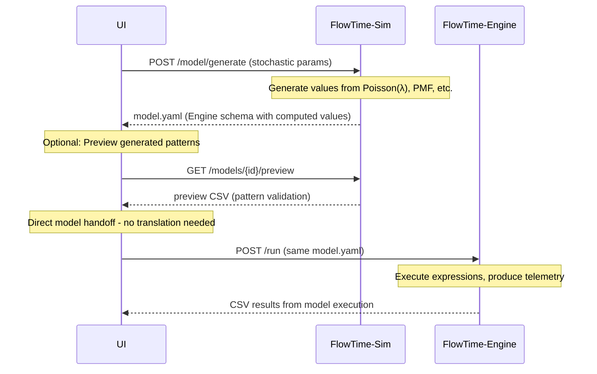

# FlowTime-Sim Model Schema Compatibility Guide

**Version:** 2.0 (Charter v1.0 Compliant)  
**Purpose:** Define single-schema compatibility where FlowTime-Sim generates the same model.yaml format that FlowTime Engine consumes.

---

## Core Principle: Single Model Schema

> **"One model format, two roles"** - FlowTime-Sim and FlowTime Engine use identical model.yaml schema. Sim generates models with computed values, Engine executes models to produce telemetry.

### Charter-Compliant Single Schema Architecture
- **Same Format**: Both systems use FlowTime Engine's existing model.yaml schema
- **Different Roles**: Sim populates model parameters, Engine executes model logic
- **Clear Boundary**: Model specifications cross the boundary, telemetry generation stays in Engine

```
┌─────────────────┐    model.yaml     ┌─────────────────┐
│   FlowTime-Sim  │ ──────────────────▶│ FlowTime Engine │
│                 │  (same schema)     │                 │
│ • Generate      │                    │ • Execute       │
│   model values  │                    │   model logic   │
│ • Preview tools │                    │ • Telemetry     │
│   (internal)    │                    │ • Analytics     │
└─────────────────┘                    └─────────────────┘
```

---

## Single Schema Model Alignment

### 1. **Primary Output: FlowTime Engine Compatible Model**
```
models/<modelId>/
├── model.yaml              # FlowTime Engine schema with Sim-generated values
├── sim-metadata.yaml       # FlowTime-Sim generation metadata (internal)
```

### 2. **Secondary Output: Preview Artifacts (Internal Validation Only)**
```
models/<modelId>/preview/
├── distributions/
│   ├── arrivals-sample.csv     # Poisson/PMF preview data
│   ├── distribution-check.csv  # Statistical validation samples
│   └── pattern-preview.csv     # Generated pattern visualization
├── validation/
│   ├── model-validation.yaml   # Structural validation results
│   └── parameter-summary.csv   # Parameter validation summary
└── README.md                   # Preview data explanation (Sim internal use)
```

### 3. **Unified Model Schema (FlowTime Engine Format)**
```yaml
# model.yaml - Identical schema used by both Sim and Engine
# FlowTime-Sim GENERATES this, FlowTime Engine EXECUTES this
grid:
  bins: 24
  binMinutes: 60
nodes:
  - id: arrivals
    kind: const
    values: [50, 52, 48, 51, 49, 53, 47, 50, 52, 48, 51, 49, 53, 47, 50, 52, 48, 51, 49, 53, 47, 50, 52, 48]  # Generated by Sim from Poisson(λ=50)
  - id: served
    kind: expr
    expr: "arrivals * 0.9"  # Engine evaluates this expression
  - id: errors
    kind: expr  
    expr: "arrivals * 0.1"  # Engine evaluates this expression
outputs:
  - series: served
    as: served.csv
  - series: errors
    as: errors.csv
```

**Key Points:**
- **Sim Role**: Computes `values` arrays from stochastic parameters (Poisson, PMF, etc.)
- **Engine Role**: Executes `expr` nodes and produces final telemetry
- **Same Schema**: No translation needed, perfect compatibility
- **Charter Compliant**: Sim never generates telemetry, only model specifications

---

## Model Component Type Classification

FlowTime-Sim creates model specifications that define component types FlowTime Engine will execute:

### 1. **Flow Components** (Activity Generators)
- **Purpose**: Define patterns of activity over time  
- **Examples**: `arrivalPatterns`, `demandPatterns`, `errorPatterns`
- **Model Properties**: Distribution type, parameters, temporal characteristics
- **Engine Execution**: Engine generates actual flow series from these specifications

### 2. **Resource Components** (System State Modelers)
- **Purpose**: Define system capacity and constraints
- **Examples**: `serviceCapacity`, `queueCapacity`, `resourceLimits` 
- **Model Properties**: Capacity values, scheduling policies, constraint rules
- **Engine Execution**: Engine applies these constraints during simulation

### 3. **Behavioral Components** (Pattern Definitions)
- **Purpose**: Define system behavioral rules and patterns
- **Examples**: `retryPolicies`, `failureModels`, `routingRules`
- **Model Properties**: Policy parameters, probability distributions, decision rules
- **Engine Execution**: Engine implements these behaviors during execution
- **Purpose**: System configuration and operational parameters
- **Examples**: `capacity`, `replicas`, `cost_per_request`
- **Units**: `entities/bin`, `count`, `currency/request`  
- **Semantics**: System configuration or derived metrics

---

## Charter-Compliant Pattern Modeling

### FlowTime Engine Model Consumption
```yaml
# FlowTime Engine processes model specifications
# (Generated from FlowTime-Sim model.yaml)
nodes:
  - id: serviceA
    kind: expr
    expr: |
      arrivals_total := arrivals + retries
      attempts := MIN(capacity, arrivals_total)
      errors := attempts * fail_rate  
      retries := CONV(errors, [0.0,0.6,0.3,0.1])
      served := attempts - errors
```

### Single Schema Example: Retry Modeling
```yaml
# model.yaml - Same format for Sim generation and Engine execution
grid:
  bins: 10
  binMinutes: 60
nodes:
  - id: arrivals
    kind: const
    values: [50, 52, 48, 51, 49, 53, 47, 50, 52, 48]  # Sim: Generated from Poisson(λ=50)
  - id: attempts
    kind: expr
    expr: "arrivals + retries"  # Engine: Evaluates this expression
  - id: errors  
    kind: expr
    expr: "attempts * 0.1"  # Engine: Computes 10% failure rate
  - id: served
    kind: expr
    expr: "attempts - errors"  # Engine: Computes successes
  - id: retries
    kind: expr  
    expr: "CONV(errors, [0.0,0.6,0.3,0.1])"  # Engine: Handles convolution
outputs:
  - series: served
    as: served.csv
  - series: errors
    as: errors.csv
  - series: retries  
    as: retries.csv
```

**Workflow:**
1. **FlowTime-Sim**: Generates `values` for `arrivals` node from stochastic parameters
2. **FlowTime-Sim**: Creates complete model.yaml with proper `expr` nodes  
3. **FlowTime Engine**: Receives identical model.yaml, executes expressions, produces CSV

### FlowTime-Sim Preview (Secondary Output - Internal Only)
```
preview/
├── retry-validation.csv    # Sample retry behavior for visual inspection
├── arrival-pattern.csv     # Poisson pattern preview
└── model-checks.yaml       # Structural validation results
```

### Charter-Compliant Validation Workflow
1. **Model Creation**: Sim creates `model.yaml` specification
2. **Preview Generation**: Sim creates internal validation CSV
3. **Model Handoff**: Engine receives model specification only
4. **Engine Execution**: Engine generates operational telemetry from model

---

## Grid & Time Alignment

### Canonical Time Grid
Both systems use identical time semantics:
```yaml
grid:
  bins: 24                    # Number of time bins
  binMinutes: 60             # Duration per bin (minutes)
  start: "2025-01-01T00:00:00Z"  # UTC start time
```

### Time Alignment Rules
- **Bin boundaries**: UTC timestamps divisible by `binMinutes`
- **Left-aligned**: Values represent activity during `[t, t+binMinutes)`
- **Index consistency**: `t=0` maps to start time, `t=bins-1` is final bin

---

## Multi-Class Compatibility

### Class Naming Convention
**Format**: `{measure}@{componentId}.{className}.csv`

### FlowTime Engine Class Processing (From Sim Model)
```yaml
# FlowTime Engine processes class-aware models
# (Generated from FlowTime-Sim class model specifications)
classes: ["Order", "Refund", "VIP"]
nodes:
  - id: serviceA
    kind: expr
    expr: |
      # Per-class processing based on Sim model
      served.Order := MIN(arrivals.Order, capacity * 0.6)
      served.VIP := MIN(arrivals.VIP, capacity * 0.4)
```

### Single Schema Example: Multi-Class Modeling
```yaml
# model.yaml - Same format for both systems, multi-class support
grid:
  bins: 24
  binMinutes: 60
nodes:
  # Sim generates class-specific arrival patterns
  - id: arrivals_Order
    kind: const
    values: [30, 31, 29, 32, 28, 33, 27, 30, 31, 29, 32, 28, 33, 27, 30, 31, 29, 32, 28, 33, 27, 30, 31, 29]  # Sim: From Poisson(λ=30)
  - id: arrivals_VIP
    kind: const  
    values: [10, 11, 9, 12, 8, 13, 7, 10, 11, 9, 12, 8, 13, 7, 10, 11, 9, 12, 8, 13, 7, 10, 11, 9]  # Sim: From Poisson(λ=10)
  - id: capacity
    kind: const
    values: [100, 100, 100, 100, 100, 100, 100, 100, 100, 100, 100, 100, 100, 100, 100, 100, 100, 100, 100, 100, 100, 100, 100, 100]  # Sim: Constant capacity
  # Engine evaluates capacity allocation expressions  
  - id: served_Order
    kind: expr
    expr: "MIN(arrivals_Order, capacity * 0.6)"  # Engine: Evaluates MIN function
  - id: served_VIP
    kind: expr
    expr: "MIN(arrivals_VIP, capacity * 0.4)"  # Engine: Evaluates MIN function
outputs:
  - series: served_Order
    as: served_Order.csv
  - series: served_VIP
    as: served_VIP.csv
```

**Benefits of Single Schema:**
- **No translation layer**: Engine directly consumes Sim output
- **Leverages existing Engine capabilities**: All expression evaluation, MIN/MAX functions, etc.
- **Perfect compatibility**: Same parsing, validation, execution logic

### Preview Output (Internal Class Validation)
```
preview/classes/
├── Order-arrivals-sample.csv     # Order class arrival preview
├── VIP-arrivals-sample.csv       # VIP class arrival preview
└── class-allocation-test.csv     # Capacity allocation validation
```

---

## DAG Structure Compatibility

### Catalog vs Model Schema Separation

**Important Distinction**: FlowTime uses different schemas for different purposes:

#### Catalog Schema (System Structure)
```yaml
# catalog.yaml (system topology - separate from execution model)
version: 1
metadata:
  id: "demo-system"
  title: "Demo Processing System"
components:                   # ← "components" for system structure
  - id: serviceA
    label: "Service A"
  - id: queueB  
    label: "Queue B"
connections:
  - from: serviceA
    to: queueB
classes: ["Order", "VIP"]
```

#### Model Schema (Execution Specification)  
```yaml
# model.yaml (execution model - uses nodes)
grid:
  bins: 24
  binMinutes: 60
nodes:                        # ← "nodes" for execution model
  - id: serviceA
    kind: const
    values: [...]
  - id: queueB_depth
    kind: expr
    expr: "..."
```

### Node ID Consistency Rules
- **Requirement**: `model.nodes[].id` MUST be referenced correctly in expressions
- **Series naming**: Output series use `@nodeId` format: `served@serviceA.csv`
- **Cross-reference**: Catalog `components[].id` may correspond to model `nodes[].id` but schemas are separate

---

## Expression Language Support

### FlowTime Engine Expression Processing
FlowTime Engine provides rich expression language for model execution:
- **Temporal**: `SHIFT(x,k)`, `CONV(x,kernel)`, `DELAY(x,kernel)`
- **Arithmetic**: `+`, `-`, `*`, `/`, `MIN`, `MAX`, `CLAMP`
- **Stateful**: Backlog queues, autoscaling, retry kernels

### FlowTime-Sim Charter-Compliant Role
FlowTime-Sim creates models that define expression parameters:
1. **Model specifications**: Define kernel values, parameters, constraints
2. **Preview validation**: Generate sample data to validate model structure
3. **No expression execution**: Engine executes expressions from model specs
4. **Parameter validation**: Ensure model parameters are mathematically sound

---

## Charter-Compliant Model Integrity

### Charter-Compliant Model Integrity

#### Unified Model Integrity
```yaml
# model.yaml uses FlowTime Engine's standard hashing
# Both systems can compute identical hashes for same model
modelHash: "sha256:abc123..."  # Computed from same nodes schema
```

#### FlowTime-Sim Generation Metadata (Internal Only)
```yaml  
# sim-metadata.yaml (FlowTime-Sim internal tracking)
simGeneration:
  schemaVersion: 1
  modelId: "sim_2025-09-08T10-30-00Z_a1b2c3d4"
  inputParameters:
    arrivalPattern: "poisson"
    lambda: 50
    retryKernel: [0.0, 0.6, 0.3, 0.1]
  rng:
    kind: "pcg32"
    seed: 12345
  preview:
    generated: true
    samples: ["arrivals-preview.csv", "distribution-check.csv"]
```

### Single Schema Benefits
- **Identical hashing**: Both systems use same model hashing algorithm
- **Cross-validation**: Engine can verify Sim-generated model integrity
- **No translation errors**: Same schema eliminates conversion bugs
- **Leverages existing infrastructure**: Engine's validation, parsing, execution

---

## Charter-Compliant API Integration

### FlowTime Engine APIs (Existing)
```
POST /run              # Execute model.yaml, return telemetry results
GET /graph            # Return compiled DAG from model.yaml  
GET /state?ts=        # Execution state snapshot
```

### FlowTime-Sim APIs (Charter-Compliant)
```
POST /model/generate   # Generate nodes schema model + preview
GET /models/{id}       # Return model.yaml (Engine compatible)
GET /models/{id}/preview # Preview data (internal validation only)
```

### Single Schema Integration Workflow


**Key Advantages:**
- **No schema translation**: Engine receives exact format it expects
- **Leverages Engine capabilities**: All expression evaluation in Engine
- **Charter compliant**: Sim generates model specs, Engine generates telemetry  
- **Perfect compatibility**: Same validation, parsing, execution logic

---

## Validation & Testing

### Charter-Compliant Schema Tests
1. **Model structure**: Verify model specification format compliance
2. **Component naming**: Validate model component ID consistency
3. **Parameter validation**: Ensure model parameters are mathematically sound
4. **Preview consistency**: Cross-validate preview data generation

### Charter-Compliant Integration Tests
1. **Model handoff**: FlowTime-Sim model → FlowTime Engine execution
2. **Parameter preservation**: Model parameters correctly interpreted by Engine
3. **Structural validation**: Model components properly recognized by Engine
4. **Preview accuracy**: Preview data reflects model behavior patterns

### Charter Compliance Gates
- **No telemetry generation**: Sim never generates operational telemetry
- **Model-only handoff**: Engine receives model specifications only
- **Preview isolation**: Preview data stays within Sim boundaries
- **Charter adherence**: All changes respect "modeling front-end" role

---

## Future Evolution

### Schema Versioning Strategy
```json
{
  "schemaVersion": 2,  // Coordinated bump
  "features": ["level-series", "multi-class"],
  "compatibility": {
    "minFlowTimeVersion": "1.2.0",
    "minFlowTimeSimVersion": "1.3.0"
  }
}
```

### Breaking Change Process
1. **Coordinated planning**: Schema changes discussed across both teams
2. **Migration support**: Provide upgrade paths for existing artifacts
3. **Deprecation timeline**: Clear communication of legacy support windows
4. **Cross-validation**: Both systems validate new schema versions

---

## Conclusion

Single schema compatibility between FlowTime-Sim and FlowTime Engine ensures perfect integration through a unified model format. FlowTime-Sim generates model.yaml files using the FlowTime Engine's native schema, enabling direct consumption without translation. This approach maintains charter compliance while maximizing compatibility and leveraging existing Engine infrastructure.

### Key Benefits of Single Schema Architecture:

1. **Perfect compatibility**: Engine directly consumes Sim-generated models without modification
2. **No translation layer**: Eliminates schema conversion bugs and complexity
3. **Leverages Engine capabilities**: Full expression language, validation, and execution features
4. **Charter compliant**: Clear separation between model generation (Sim) and telemetry production (Engine)
5. **Enhanced UX**: Preview capabilities for modeling validation while maintaining Engine compatibility

This unified approach enables seamless model handoff from FlowTime-Sim to FlowTime Engine while respecting charter boundaries: Sim generates model specifications with computed values, Engine executes those specifications to produce operational telemetry.
