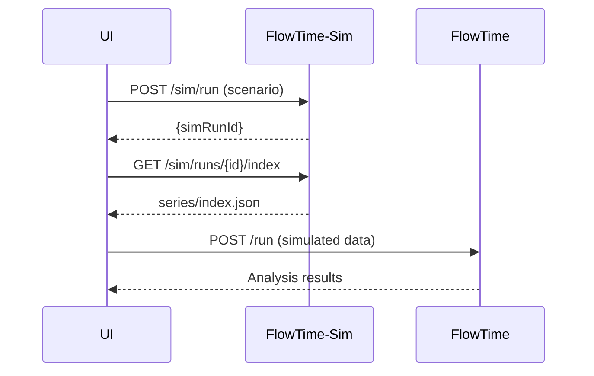

# FlowTime-Sim Schema Compatibility Guide

**Version:** 1.0  
**Purpose:** Define schema compatibility requirements between FlowTime-Sim and FlowTime engine per the engineering whitepaper.

---

## Core Principle

> **"Schemas used in both solutions need to match"** - FlowTime-Sim artifacts must be consumable by FlowTime engine without modification.

FlowTime-Sim serves as the **synthetic data generator** while FlowTime engine provides **analytical processing**. Both must respect identical contracts.

---

## Artifact Schema Alignment

### 1. **Run Artifact Structure**
Both systems use identical artifact layout:
```
runs/<runId>/
├── run.json                 # Run metadata & series listing
├── manifest.json            # Integrity hashes & RNG seed  
├── spec.yaml               # Original model specification
└── series/
    ├── index.json           # Series discovery metadata
    ├── arrivals@nodeA.csv   # Per-series data files
    ├── served@nodeA.csv
    └── errors@nodeA.csv
```

### 2. **Series Naming Convention**
**Format**: `{measure}@{componentId}[.{className}].csv`

**Examples**:
- `arrivals@serviceA.csv` - Base arrivals to serviceA
- `served@serviceA.VIP.csv` - VIP class served by serviceA
- `retries@queueB.csv` - Retry volume at queueB
- `queue_depth@serviceA.csv` - Queue state at serviceA

### 3. **Series Index Schema**
```json
{
  "schemaVersion": 1,
  "series": [
    {
      "id": "arrivals@serviceA",
      "path": "arrivals@serviceA.csv", 
      "unit": "entities/bin",
      "type": "flow",
      "hash": "sha256:abc123...",
      "points": 24
    }
  ]
}
```

---

## Series Type Classification

Per the whitepaper, FlowTime distinguishes three series types:

### 1. **Flow Series** (per-bin totals)
- **Purpose**: Measure activity within each time bin
- **Examples**: `arrivals`, `served`, `errors`, `retries`, `attempts`, `dlq`
- **Units**: `entities/bin`, `requests/bin`, `calls/bin`
- **Semantics**: Additive volumes that occurred during the bin

### 2. **Level Series** (end-of-bin state)  
- **Purpose**: Measure system state at bin boundaries
- **Examples**: `queue_depth`, `backlog`, `capacity_utilized`
- **Units**: `entities`, `requests`, `percentage`
- **Semantics**: Point-in-time state measurements

### 3. **Metadata Series** (configuration/operational)
- **Purpose**: System configuration and operational parameters
- **Examples**: `capacity`, `replicas`, `cost_per_request`
- **Units**: `entities/bin`, `count`, `currency/request`  
- **Semantics**: System configuration or derived metrics

---

## Retry Pattern Compatibility

### FlowTime Engine Retry Processing
```yaml
# FlowTime model using retry expressions
nodes:
  - id: serviceA
    kind: expr
    expr: |
      arrivals_total := arrivals + retries
      attempts := MIN(capacity, arrivals_total)
      errors := attempts * fail_rate  
      retries := CONV(errors, [0.0,0.6,0.3,0.1])
      served := attempts - errors
```

### FlowTime-Sim Compatible Output
FlowTime-Sim must generate series that validate this model:
```
arrivals@serviceA.csv    # Base arrivals input
retries@serviceA.csv     # Generated retry echoes  
attempts@serviceA.csv    # Total effort (arrivals + retries)
errors@serviceA.csv      # Failure volume
served@serviceA.csv      # Success volume
```

### Validation Requirements
1. **Conservation**: `arrivals + retries - served - errors ≈ 0`
2. **Retry echoes**: `retries[t] = Σ(errors[t-k] * kernel[k])`
3. **Effort bounds**: `attempts >= served` always
4. **Temporal consistency**: All values non-negative

---

## Grid & Time Alignment

### Canonical Time Grid
Both systems use identical time semantics:
```yaml
grid:
  bins: 24                    # Number of time bins
  binMinutes: 60             # Duration per bin (minutes)
  start: "2025-01-01T00:00:00Z"  # UTC start time
```

### Time Alignment Rules
- **Bin boundaries**: UTC timestamps divisible by `binMinutes`
- **Left-aligned**: Values represent activity during `[t, t+binMinutes)`
- **Index consistency**: `t=0` maps to start time, `t=bins-1` is final bin

---

## Multi-Class Compatibility

### Class Naming Convention
**Format**: `{measure}@{componentId}.{className}.csv`

### FlowTime Engine Class Processing
```yaml
# FlowTime multi-class model
classes: ["Order", "Refund", "VIP"]
nodes:
  - id: serviceA
    kind: expr
    expr: |
      # Per-class processing
      served.Order := MIN(arrivals.Order, capacity * 0.6)
      served.VIP := MIN(arrivals.VIP, capacity * 0.4)
```

### FlowTime-Sim Class Generation
```
arrivals@serviceA.Order.csv    # Order class arrivals
arrivals@serviceA.VIP.csv      # VIP class arrivals  
served@serviceA.Order.csv      # Order class served
served@serviceA.VIP.csv        # VIP class served
```

---

## DAG Structure Compatibility

### Catalog Schema Alignment
Both systems consume identical catalog format:
```yaml
# catalog.yaml (shared schema)
version: 1
components:
  - id: serviceA             # Must match series @componentId
    label: "Service A"
  - id: queueB
    label: "Queue B"
connections:
  - from: serviceA
    to: queueB
classes: ["Order", "VIP"]
```

### Component ID Consistency
- **Requirement**: `catalog.components[].id` MUST match series `@componentId`
- **Case sensitivity**: Exact string match required
- **Normalization**: If applied, must be deterministic and documented

---

## Expression Language Support

### FlowTime Engine Built-ins
FlowTime engine provides rich expression language:
- **Temporal**: `SHIFT(x,k)`, `CONV(x,kernel)`, `DELAY(x,kernel)`
- **Arithmetic**: `+`, `-`, `*`, `/`, `MIN`, `MAX`, `CLAMP`
- **Stateful**: Backlog queues, autoscaling, retry kernels

### FlowTime-Sim Compatibility
FlowTime-Sim must generate data that validates these operations:
1. **No implementation required**: FlowTime-Sim doesn't implement expressions
2. **Validation data**: Generate series that test expression correctness
3. **Conservation laws**: Ensure synthetic data respects FlowTime invariants

---

## Artifact Integrity

### Deterministic Hashing
```json
// manifest.json (identical between systems)
{
  "schemaVersion": 1,
  "runId": "sim_2025-09-08T10-30-00Z_a1b2c3d4",
  "seed": 12345,
  "series": {
    "arrivals@serviceA": "sha256:def456...",
    "served@serviceA": "sha256:789abc..."
  }
}
```

### Reproducibility Requirements
- **Same input → Same output**: Identical specs + seed = identical artifacts
- **Hash stability**: Per-series SHA-256 must be deterministic
- **Cross-system validation**: FlowTime engine can verify FlowTime-Sim hashes

---

## API Contract Alignment

### FlowTime Engine APIs
```
POST /run          # Analyze model, return results
GET /graph         # Return compiled DAG  
GET /state?ts=     # Per-bin state snapshot
```

### FlowTime-Sim APIs  
```
POST /sim/run      # Generate synthetic data
GET /sim/runs/{id}/index   # Series discovery
GET /sim/runs/{id}/series/{seriesId}  # Series data
```

### Integration Pattern


---

## Validation & Testing

### Schema Compliance Tests
1. **Artifact structure**: Verify identical layout between systems
2. **Series naming**: Validate naming convention compliance  
3. **Type classification**: Ensure correct flow/level/metadata categorization
4. **Hash consistency**: Cross-validate deterministic hashing

### Integration Tests
1. **End-to-end**: FlowTime-Sim → FlowTime engine processing
2. **Expression validation**: Synthetic data validates FlowTime expressions
3. **Conservation laws**: Generated data respects FlowTime invariants
4. **Multi-class**: Per-class processing works correctly

### Compatibility Gates
- **No schema breaks**: Changes must maintain backward compatibility
- **Cross-system validation**: Both systems validate each other's artifacts
- **Version alignment**: `schemaVersion` must be coordinated between systems

---

## Future Evolution

### Schema Versioning Strategy
```json
{
  "schemaVersion": 2,  // Coordinated bump
  "features": ["level-series", "multi-class"],
  "compatibility": {
    "minFlowTimeVersion": "1.2.0",
    "minFlowTimeSimVersion": "1.3.0"
  }
}
```

### Breaking Change Process
1. **Coordinated planning**: Schema changes discussed across both teams
2. **Migration support**: Provide upgrade paths for existing artifacts
3. **Deprecation timeline**: Clear communication of legacy support windows
4. **Cross-validation**: Both systems validate new schema versions

---

## Conclusion

Schema compatibility between FlowTime and FlowTime-Sim ensures seamless integration where FlowTime-Sim generates synthetic telemetry and FlowTime engine provides analytical processing. By maintaining identical artifact schemas, series naming conventions, and temporal semantics, both systems can evolve independently while preserving perfect interoperability.

This compatibility enables powerful workflows: synthetic data generation for testing, what-if scenario analysis, and comprehensive validation of FlowTime's analytical capabilities without requiring real-world telemetry.
