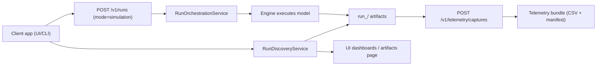
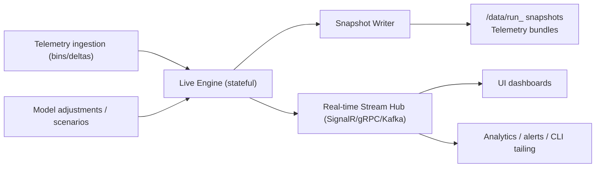

# FlowTime Streaming Architecture — Working Note

**Status:** Draft for review  
**Audience:** Time-Travel platform, Engine team, UI/Telemetry team  
**Purpose:** Capture a north-star design for moving FlowTime from discrete run artifacts to a live, streaming engine while keeping provenance and replay intact.

---

## 1. Problem Framing

Today every run is orchestrated as a discrete batch:

- `/v1/runs` spins up the engine, computes the full model, writes `run_<timestamp>/manifest.json`, series CSVs, etc.
- Telemetry capture is an explicit post-step that rewrites CSV bundles from the run artifacts.
- The UI polls the filesystem (via API helpers) to list runs; dashboards load series by reading the static CSVs.

For live telemetry we will eventually ingest bins continuously (seconds/minutes cadence). Re-running the entire engine and re-emitting artifacts for every bin is not feasible (I/O churn, latency, duplication). We need a long-lived engine process that maintains state, accepts deltas, and streams results to clients while still checkpointing artifacts for provenance.

---

## 2. Guiding Principles

1. **Live-first, snapshot-second** – Live updates must reach UIs/consumers immediately; artifact creation becomes an asynchronous checkpoint, not the primary delivery path.
2. **Single source of truth** – The live engine maintains canonical state; snapshots and telemetry bundles are derived from it, not vice versa.
3. **Backward compatibility** – Existing `/v1/runs` and artifact readers must keep working during migration.
4. **Composable delivery** – Support multiple consumers (UI, analytics jobs, downstream APIs) through a fan-out mechanism (event bus / pub-sub).
5. **Operational transparency** – Instrument the streaming service with health, lag, and replay metrics so it can be observed like any other backend.

---

## 3. Current Architecture Snapshot

Limitations for streaming:
- Engine is short-lived per request; no in-memory state survives between runs.
- Producers/consumers communicate via shared storage, causing latency and heavy I/O.
- Telemetry capture is a batch job; no incremental ingestion/warning updates.
- No push-based delivery; UI must poll.

---

## 4. Target Streaming Model (Conceptual)

Key components:

1. **Live Engine Service**
   - Maintains model state in memory (node metrics, derived graphs).
   - Accepts incremental telemetry bins and/or model adjustments.
   - Emits incremental results (per-bin/per-node deltas or window aggregates).
   - Exposes health/lag APIs and a snapshot endpoint (`GET /state/live`).

2. **Ingestion Gateway**
   - Normalizes telemetry input (batch or streaming).
   - Enqueues bins to the live engine (bounded queue w/ backpressure).
   - Optionally persists raw telemetry for audit.

3. **Real-time Stream Hub**
   - Fan-out channel for clients (e.g., SignalR hub, gRPC server-streaming, Kafka topic).
   - Handles subscriptions, reconnections, and cursor management.
   - Delivers consistent payload shape (node metrics, warnings, provenance references).

4. **Snapshot Writer (Async)**
   - Subscribes to the live stream (or is invoked at checkpoints).
   - Produces run artifacts identical to today’s layout (manifest.json, CSVs, telemetry bundles).
   - Emits provenance metadata linking snapshots back to the live engine session/run ID.

5. **Compatibility Layer**
   - `/v1/runs` continues to exist:
     - For “simulations” it can trigger the live engine to compute against a static model and emit a snapshot.
     - For telemetry replay it points the live engine at a bundle and begins streaming.
   - Existing filesystem-backed APIs (RunDiscovery, Artifacts) call into the snapshot writer outputs.

---

## 5. Incremental Migration Plan

1. **Foundations (TT-M-03.x)**
   - Extract engine execution into a reusable service layer (separate from artifact writer).
   - Introduce an internal state container (per model/topology) with APIs to apply telemetry frames and produce diffs.
   - Encapsulate telemetry warning aggregation so it can run incrementally.

2. **Event Plumbing**
   - Choose a streaming transport (SignalR for initial UI integration; consider Kafka/Azure Event Hubs for cross-service needs).
   - Define streaming payload contracts (`RunUpdate`, `NodeDelta`, `WarningUpdate`).
   - Build a thin stream hub hosting layer with authentication and fan-out metrics.

3. **Snapshot Decoupling**
   - Refactor RunOrchestrationService:
     - Live execution path: run engine in streaming mode, stream results until completion/abort.
     - Snapshot writer path: subscribe to stream and persist artifact sets on interval or completion.
   - Update telemetry capture to consume the stream rather than re-reading disk.

4. **UI/Client Adoption**
   - Add a streaming client in the UI (e.g., SignalR client) to update dashboards in real time.
   - Continue exposing run listings from snapshots, but keep dashboards in sync via the stream.
   - Provide CLI commands to tail live runs (`flowtime stream runs <runId>`).

5. **Full Transition**
   - Default `/v1/runs` to streaming execution, with a flag for legacy batch mode.
   - Eventually mark the batch-only code path deprecated once consumers migrate.

---

## 6. Data & State Considerations

- **Consistency**: Provide snapshot sequence numbers so clients can detect gaps and request resyncs.
- **Backpressure**: If consumers lag, buffer limits must trigger snapshot fallbacks or throttling.
- **Idempotency**: Updates should use deterministic identifiers (runId + binIndex) so clients can deduplicate.
- **Fault tolerance**: On engine crash, last persisted snapshot becomes the recovery point; ingestion gateway must replay telemetry since last checkpoint.
- **Security**: Streaming channel requires the same authz as REST endpoints; consider per-run ACLs when multiple teams consume the same engine.

---

## 7. Open Questions

1. **Transport** – Do we standardize on SignalR (good for UI, limited for other services) or adopt a broker (Kafka, Azure Event Hubs) and bridge to web clients?
2. **In-memory footprint** – How much history does the live engine keep (entire run vs. sliding window)? Need config knobs.
3. **Scaling model** – Single live engine instance per model? Can we horizontally scale ingestion with sharding?
4. **Snapshot frequency** – On every X bins? On schedule? Operator-driven? Impact on storage & recovery?
5. **Telemetry validation** – How do incremental warnings surface (push vs. checkpoint)? Do we store warning deltas separately?
6. **API compatibility** – Do we introduce `/v2/runs` for streaming semantics or evolve `/v1/runs` with mode flags?

---

## 8. Next Steps

1. Prototype a long-lived engine host that can ingest telemetry frames without restarting.
2. Define and document streaming payload schemas and versioning strategy.
3. Spike a minimal streaming hub (local SignalR or WebSocket) showing UI dashboard updates without polling.
4. Draft a compatibility matrix for legacy endpoints vs. streaming features to guide rollout messaging.
5. Schedule a design review with Engine/UI teams to validate assumptions and split responsibilities.

---

## 9. References

- `docs/architecture/time-travel/time-travel-planning-decisions.md` (Q7 – explicit telemetry generation)
- `docs/operations/telemetry-capture-guide.md`
- `src/FlowTime.Generator/Orchestration/RunOrchestrationService.cs` (current batch orchestration)
- `src/FlowTime.API/Endpoints/RunOrchestrationEndpoints.cs`

*Maintainers:* Please update this note as prototypes land or architectural decisions are made. Dedicated design docs can fork from here when individual workstreams kick off.
