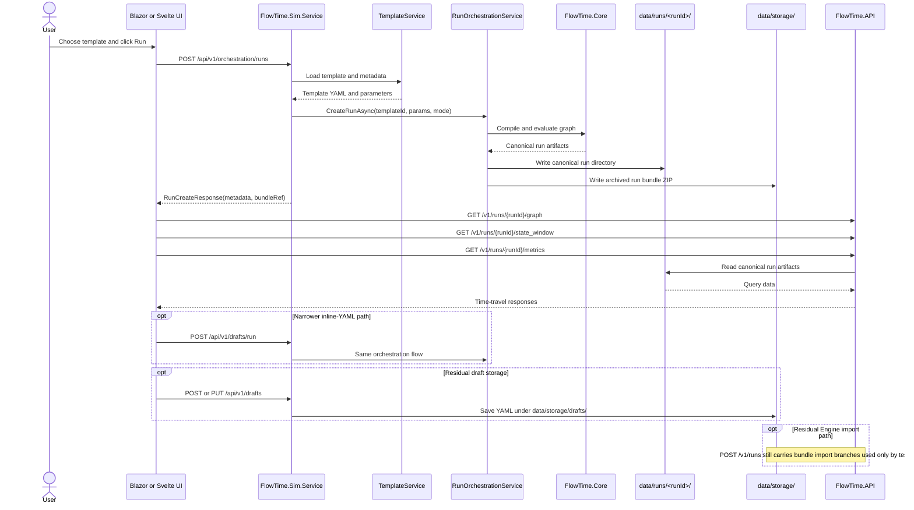
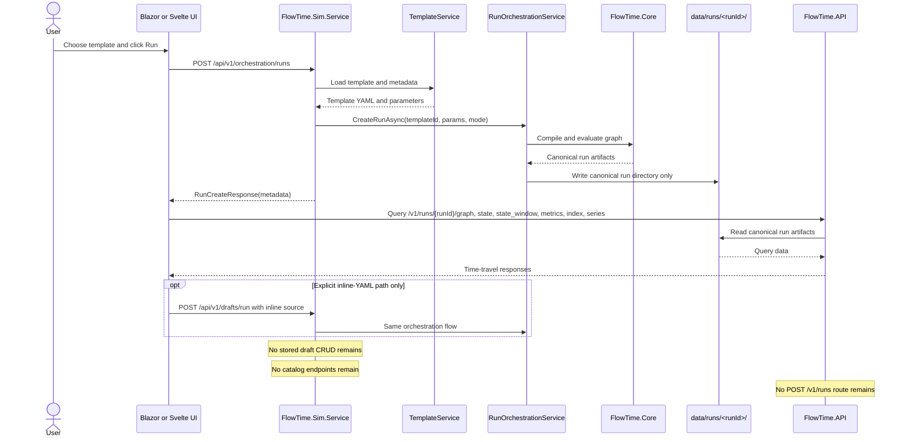
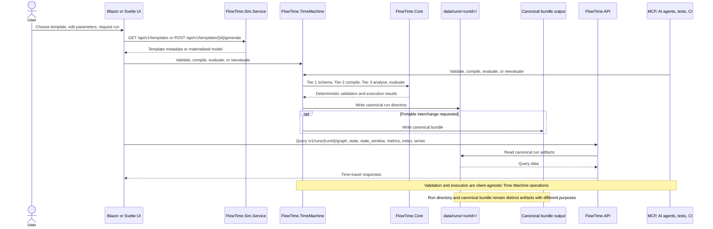

# Template, Draft, Model, Run, and Bundle Boundary

**Status:** accepted baseline for E-19 and E-18 handoff
**Related epic:** [E-19](../../work/epics/E-19-surface-alignment-and-compatibility-cleanup/spec.md)
**Related milestone:** [m-E19-01-supported-surface-inventory](../../work/epics/E-19-surface-alignment-and-compatibility-cleanup/m-E19-01-supported-surface-inventory.md)
**Related inventory:** [supported-surfaces.md](./supported-surfaces.md)

## Purpose

Clarify the meaning and ownership of template, draft, model, run, bundle, and catalog surfaces so the current Sim authoring/orchestration path does not harden into the future programmable contract.

## Problem

FlowTime currently mixes several artifact types and service roles:

- repo-backed templates under `templates/`
- storage-backed drafts under `data/storage/drafts/`
- generated engine models returned by Sim generation endpoints
- canonical evaluated run directories under `data/runs/<runId>/`
- archived run bundles under `data/storage/runs/`
- Engine-side bundle import endpoints
- catalog-era runtime seeding and UI/catalog clients

Those surfaces were introduced for different reasons, but on the current first-party path they are easy to confuse. That ambiguity makes it too easy to treat today's Sim orchestration path as the default programmable contract even though E-18 is meant to replace it with `FlowTime.TimeMachine`.

## Terms

| Term | Meaning | Current owner | Canonical location | Notes |
|------|---------|---------------|--------------------|-------|
| Template | Versioned authored source with parameter metadata used to generate engine models | Sim authoring surface | `templates/` | Long-lived repo-backed source material |
| Draft | Mutable saved working copy of template-like YAML | Sim authoring surface only if explicitly retained | `data/storage/drafts/<draftId>` | User working state, never canonical runtime truth |
| Model | Materialised engine model YAML after template expansion and parameter substitution | Sim generation/orchestration surface | transient response, optional model storage | Intermediate artifact for preview, validation side effects, or transport |
| Run | Canonical evaluated execution result with manifest, model, series, and aggregates | Shared runtime contract, queried by Engine API | `data/runs/<runId>/` | Authoritative runtime/query truth |
| Bundle | Portable interchange artifact derived from a run or model | Interchange surface | canonical bundle output, not canonical run truth | Portable artifact with a different purpose from the in-place run directory |
| Catalog | Component-library residue from an older authoring direction | Legacy or optional Sim authoring surface | `catalogs/`, `data/catalogs/` | E-19 decides whether this survives at all |

## Responsibility Clarification

### `FlowTime.Core`

`FlowTime.Core` is the pure evaluation library. It owns schema validation, compile, parse, evaluate, and invariant analysis as pure computational operations. It does not own HTTP, orchestration, storage, or client-specific logic.

### `FlowTime.Generator`

`FlowTime.Generator` is today's shared orchestration layer between Sim and API. It stays frozen during E-19. Its forward fate is already decided: E-18 Path B extracts its execution-pipeline responsibilities into `FlowTime.TimeMachine` and deletes `FlowTime.Generator` in the same cut.

### `FlowTime.API`

`FlowTime.API` is the query and operator surface over canonical run artifacts. It reads canonical run artifacts and exposes the current read/query surface. It does not become the template-driven execution host, and E-19 deletes obsolete API write endpoints instead of preserving rejection stubs.

### `FlowTime.Sim.Service`

`FlowTime.Sim.Service` owns template authoring, authoring metadata, and template-materialisation flows. It hosts execution only as a transitional first-party UI bridge until the Time Machine exists.

### `FlowTime.TimeMachine`

`FlowTime.TimeMachine` is a new component owned by E-18. It is the future client-agnostic execution component for tiered validation, compile, evaluate, reevaluate, parameter override, and artifact write. It depends on Core; Core does not depend on it.

### Validation Principle

Validation is a first-class client-agnostic operation. No client is privileged. Sim UI, Blazor UI, Svelte UI, MCP servers, external AI agents, tests, and CI are all equal callers of the future Time Machine validation surface.

The tiered validation requirement is fixed:

- Tier 1: schema-only validation
- Tier 2: compile/parse validation without execution
- Tier 3: full analyse validation including deterministic evaluation and invariant analysis

E-19 removes the current Sim-only `POST /api/v1/drafts/validate` wrapper. E-18 owns the replacement Time Machine validation surface.

## Current

## Transitional (end of E-19)

## Target (post-E-18)

## Decision

1. Treat `data/runs/<runId>/` as the canonical runtime truth for first-party run querying.
2. Treat drafts as authoring state only. Stored drafts are not canonical runtime truth and are removed from the current supported surface by E-19.
3. Treat the canonical bundle as a portable interchange artifact distinct from the canonical run directory. It is not the primary runtime/query truth.
4. Use E-19 to inventory, narrow, delete, or archive current Sim/catalog/storage residue on active first-party surfaces.
5. Use E-18 to build the actual client-agnostic programmable foundation in `FlowTime.TimeMachine` instead of normalizing today's Sim orchestration path.

## Consequences

- New callers should not be built on catalog endpoints, stored-draft CRUD, bundle-ref import flows, or Sim orchestration as a future-facing programmable contract.
- Docs should describe Sim orchestration as the current first-party authoring bridge, not as the target execution architecture.
- The current Sim validation endpoint is deleted, but the underlying validation libraries remain and become the basis of Time Machine tiered validation.
- Canonical bundle writing survives as a Time Machine capability, but the in-place run directory remains the runtime/query truth.
- The supported/deleted/archive decisions for each current surface are recorded in [supported-surfaces.md](./supported-surfaces.md).