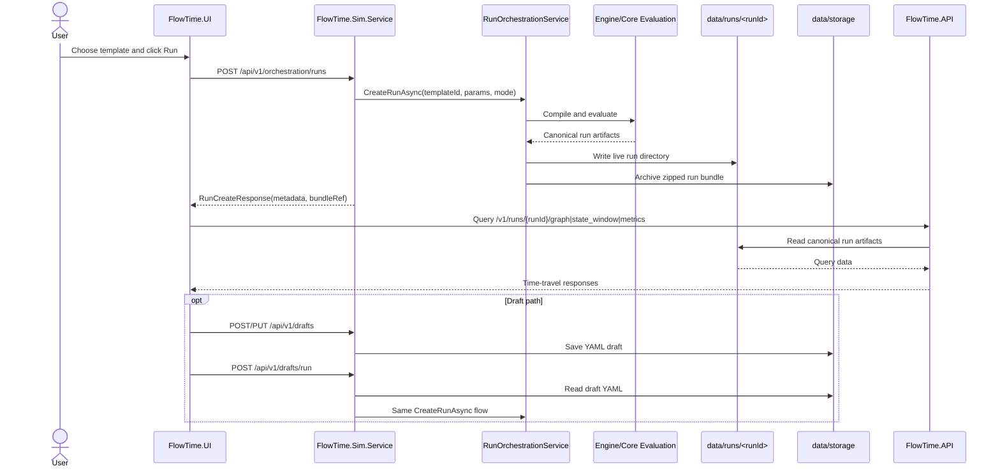

# Template, Draft, Model, Run, and Bundle Boundary

**Status:** proposed
**Related epics:** E-19, E-18, E-17

## Purpose

Clarify the meaning and ownership of template, draft, model, run, bundle, and catalog surfaces so current Sim authoring/orchestration paths do not become the accidental headless/programmatic contract.

## Problem

FlowTime currently mixes several artifact types and service roles:

- repo-backed templates under `templates/`
- storage-backed drafts under `data/storage/drafts/`
- generated engine models returned by Sim generation endpoints
- canonical evaluated run directories under `data/runs/<runId>/`
- archived run bundles under `data/storage/runs/`
- Engine-side bundle import endpoints
- catalog-era runtime seeding and UI/catalog clients

Those surfaces were introduced for different reasons, but the current first-party flow makes them easy to confuse. The result is that today's Sim orchestration path can be mistaken for the future headless path even though E-18 is meant to replace it with a cleaner programmable foundation.

## Terms

| Term | Meaning | Current Owner | Canonical Location | Notes |
|------|---------|---------------|--------------------|-------|
| Template | Versioned authored source with parameter metadata used to generate engine models | Sim authoring surface | `templates/` | Long-lived source material checked into the repo |
| Draft | Mutable saved working copy of template-like YAML | Sim authoring surface if retained | `data/storage/drafts/<draftId>` | User working state, not canonical runtime truth |
| Model | Generated engine model YAML after parameter substitution and template expansion | Sim generation/orchestration surface | transient response; optional storage model archive | Intermediate artifact for preview, validation, or transport |
| Run | Canonical evaluated execution result with manifest, model, series, and aggregates | Shared Engine/Sim runtime contract; queried by Engine API | `data/runs/<runId>/` | Authoritative current execution artifact |
| Bundle | Portable archive of a model or run for transfer/import/reuse | Interchange surface | `data/storage/runs/<runId>` and model refs | Archive, not authoritative live runtime state |
| Catalog | Component library / earlier authoring direction; not required by the current run path | Legacy or optional Sim authoring surface | `catalogs/` and `data/catalogs/` | E-19 must decide whether this remains supported |

## Ownership Boundary

### Sim Owns

- template discovery and authoring-facing template metadata
- any explicitly supported draft lifecycle
- template-to-model generation
- current template-driven orchestration until E-19 narrows or replaces that surface

### Engine API Owns

- querying canonical run artifacts (`/runs/{runId}/graph`, `/state`, `/state_window`, `/metrics`, `/index`, `/series/...`)
- importing canonical bundles when import is explicitly supported

### E-19 Owns

- defining which of the current Sim/catalog/storage surfaces remain supported
- deleting or archiving transitional residue on active first-party paths
- making the supported-vs-historical boundary explicit across docs, UI, Sim, schemas, and examples

### E-18 Owns

- the future headless foundation: runtime parameter identity, deterministic overrides, reevaluation/evaluation APIs, evaluation SDK, and headless CLI/sidecar over compiled graphs

E-18 does **not** inherit the current Sim draft/catalog/bundle choreography as its baseline API.

## Current Sequence

## Decision

1. Treat `data/runs/<runId>/` as the canonical runtime truth for first-party run querying.
2. Treat storage-backed drafts as authoring state, not as runtime truth.
3. Treat storage-backed run bundles and bundle refs as interchange/import artifacts, not as the default evaluation API.
4. Use E-19 to decide which current Sim/catalog/storage surfaces stay supported and to remove the rest from active first-party paths.
5. Use E-18 to build the actual headless/programmatic foundation instead of normalizing today's Sim orchestration path.

## Consequences

- New callers should not be built on catalog endpoints, bundle-ref import flows, or draft-only orchestration paths unless E-19 explicitly retains them.
- Docs should describe the current Sim path as the present authoring/orchestration surface, not as the target headless architecture.
- If draft authoring remains supported, it stays an authoring feature. It does not define the programmable evaluation boundary.
- If bundle import remains supported, it stays an import/interchange feature. It does not define template-driven run creation.

## Near-Term Use In E-19

`m-E19-01-supported-surface-inventory` should use this document to:

- publish the supported compatibility matrix
- classify each current Sim/catalog/storage surface as retain, decide, or delete
- prevent new consumers of transitional residue while the cleanup lane is in flight