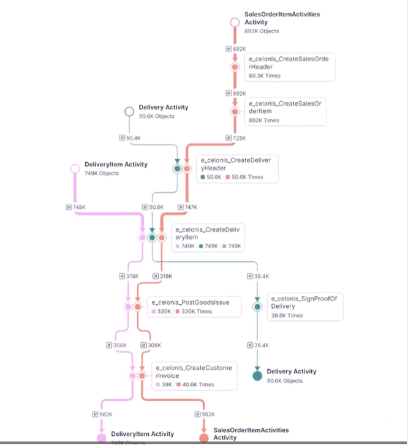

# FT-UI-LAYOUT-METRO — Metro Map Topology Layout (TB)

**Status:** Draft (proposed layout motor)

This document specifies a "metro map" topology layout mode intended to approximate top-to-bottom process/metro diagrams: shared trunks, clean merges/splits, and station-like nodes.

It is designed to fit the pluggable layout motor architecture described in [docs/architecture/ui-layout/README.md](docs/architecture/ui-layout/README.md).

> Note: This document intentionally does **not** inherit the fixed-lane / fixed-row constraints in [docs/ui/layout.md](docs/ui/layout.md). That document describes a simpler "happy path" layout currently used by the UI. Metro layout is a separate motor and renderer.

## Reference image (target style)

Place the screenshot at `docs/architecture/ui-layout/images/metro-reference.png`.

---

## 1. Goals

Metro layout should:

1. **Read like a metro/process map (top→bottom)**
   - Flow direction is predominantly top-to-bottom.
   - Stations (nodes) are placed along vertical trunks and branch tracks.
   - Merges and splits are explicit and visually clean.

2. **Prefer bundled trunks over parallel spaghetti**
   - If multiple flows share a common subpath, render a shared trunk for as long as possible.

3. **Minimize crossings and bends**
   - Crossings reduction is the highest aesthetic priority.
   - Routing should be mostly orthogonal (v1), optionally octilinear (v2).

4. **Be deterministic and cacheable**
   - Same input signature + options + algorithm id ⇒ same result.

5. **Support FlowTime semantics**
   - Routers (multi-out) produce clean splits.
   - Expressions (multi-in) produce clean merges.
   - Important operational nodes can be emphasized.

6. **Enable server-precomputed results**
   - Metro layout is designed for Option B (server-precomputed) in the UI-layout epic.

---

## 2. Non-goals

- We do not require globally optimal crossing minimization (NP-hard).
- We do not require strict cartographic metro rules (e.g., exact 45° angles everywhere).
- We do not mandate a specific algorithm implementation (MSAGL/ELK/custom), only the contract and invariants.

---

## 3. Terminology

- **Station:** A rendered node (service/router/expression/constant/etc.).
- **Track:** A routed path segment in world coordinates; may be shared by multiple logical lines.
- **Line:** A logical route through the graph (for styling/legend); a line may traverse multiple tracks.
- **Trunk:** A shared track used by multiple lines for some distance.
- **Junction:** A merge/split point (may be at a station or between stations).

---

## 4. Contract Fit (No Conflicts with UI-Layout README)

Metro layout must be expressed strictly through the existing conceptual contracts:

- **LayoutInput**: structure + static metadata only (no per-bin metrics)
- **LayoutOptions**: geometry/routing preferences
- **LayoutResult**: node rectangles + edge routes + bounds (plus optional indexes)

The metro motor is identified by a stable algorithm id, e.g.:

- `layoutAlgorithmId = "ft-metro@1"`

and participates in the same signature scheme described in the UI-layout README.

### 4.1 World coordinates vs viewport

Metro layout is returned in **world coordinates** (station rectangles + routed track polylines). The UI applies a pan/zoom transform to map world → screen and uses layout bounds for fit-to-view.

Viewport size should not affect metro geometry unless explicitly modeled as a `LayoutOptions` input (and therefore included in `layoutOptionsSignature`). If exact station sizing depends on client-measured text, prefer hybrid mode: server produces stable geometry from conservative size estimates; UI performs a small refinement pass if needed.

---

## 5. LayoutInput (Metro Extensions)

Metro mode uses standard `LayoutInput` with additional *optional* metadata that improves results.

### 5.1 Required (baseline)

- Nodes: `nodeId`
- Edges: `fromNodeId`, `toNodeId`
- Optional: fixed anchors/pins

### 5.2 Recommended metadata

- **nodeKind**: (`service`, `router`, `expression`, `const`, `scalar`, …)
  - Used for station sizing and join/split behavior.
- **nodeImportance**: numeric or enum (`primary`, `secondary`)
  - Used to prefer a dominant "spine" trunk.
- **edgeKind**: (`flow`, `dependency`, `routing`, …)
  - Used to differentiate styling and bundling.
- **edgeWeight** (optional): numeric
  - Used for stroke width and to bias trunk selection.

### 5.3 Optional “line identity” hints

Metro diagrams are clearer when flows are grouped into a small number of logical "lines".

- **lineKey** (optional): stable string id for grouping edges into a line
  - If present, the motor should preserve line continuity through shared trunks when possible.
  - If absent, the motor derives line identity heuristically (see §7).

> Constraint: All metadata included here is considered part of the `layoutInputSignature`.

---

## 6. LayoutOptions (Metro)

Metro layout uses standard layout options and adds a few metro-specific knobs.

### 6.1 Required defaults

- **Orientation**: TB only for metro mode.
- **Routing style**: orthogonal polyline (v1).
- **Bundling**: on by default.

### 6.2 Suggested option fields

- `rankSeparation`: vertical spacing between station ranks.
- `stationSeparation`: minimum station-to-station spacing.
- `trackSeparation`: minimum track-to-track spacing.
- `allowOctilinear`: (false v1) allow 45° segments.
- `bundleAggressiveness`: (0..1) how long to keep trunks before splitting.
- `stabilityMode`:
  - `fresh` (default): compute from scratch
  - `incremental`: try to keep previous station positions where safe

> All of these options contribute to `layoutOptionsSignature`.

---

## 7. LayoutResult (Metro)

Metro layout produces a normal `LayoutResult` with additional optional fields.

### 7.1 Required outputs

- **Node rectangles** in world coords: `(x, y, width, height)`
- **Edge routes** as polylines: `[{x,y}, …]` in world coords
- **Graph bounds**: `(minX, minY, maxX, maxY)`

### 7.2 Optional metro-specific outputs

These are allowed as “auxiliary indices” per the UI-layout README.

- **trackId / bundleKey** annotations on edge routes
  - Enables renderer to draw shared trunks cleanly.
- **junction points**
  - Explicit merge/split points to avoid ambiguous joins.
- **line definitions** (if `lineKey` exists or is derived)
  - Allows consistent coloring and highlighting.

> If the API chooses to keep `LayoutResult` minimal, the renderer can still render per-edge polylines; however, providing bundle/junction metadata improves metro aesthetics substantially.

---

## 8. Layout Invariants

### 8.1 Hard invariants

1. **No station overlap**: station rectangles must not intersect.
2. **Top-to-bottom monotonicity**: for any edge route, the path must not move upward in a way that reverses flow direction.
   - Small local upward jiggles are disallowed in v1.
3. **Clear attachment**: edge route must terminate on station boundaries (or ports) without visible gaps.
4. **Determinism**: stable ordering + stable tiebreakers (e.g., by node id).

### 8.2 Soft objectives (prioritized)

1. Minimize crossings (highest).
2. Maximize useful bundling (share trunks when paths overlap).
3. Minimize bends and total ink.
4. Preserve line continuity (when `lineKey` or derived lines exist).
5. Keep important stations near the main spine.

---

## 9. Metro Layout Strategy (Recommended Heuristic Pipeline)

The following pipeline is recommended for v1. It is compatible with using a third-party layered DAG layout as a sub-step.

### 9.1 Rank assignment (vertical order)

- Assign each station a rank/level such that all edges go from smaller to larger rank.
- Prefer compact ranks to avoid excessive vertical depth.

### 9.2 Crossing reduction (per-rank ordering)

- Use median/barycenter passes to reduce crossings.
- Tie-break deterministically by stable ids.

> Implementation note: A layered layout engine (including MSAGL) can provide a strong initial ordering here.

### 9.3 Line discovery (if `lineKey` absent)

Derive a small set of lines to improve continuity:

- Identify a **dominant spine** (e.g., maximum-weight path or primary operational chain).
- From routers, spawn branch lines for each significant output.
- For multi-input expressions, treat inputs as converging feeders into the expression station.

The goal is not semantic perfection; it is visual continuity for the renderer.

### 9.4 Bundling and trunk selection

- For lines with a shared subpath (common suffix toward sinks or common prefix from sources), route them onto a shared trunk.
- Place split/merge junctions near the station that causes the divergence/convergence.

### 9.5 Track corridor assignment (variable width)

- Allocate as many vertical corridors as required to maintain clearance and avoid crossings.
- Width is dynamic: metro layout must not assume a fixed number of lanes.

### 9.6 Routing

- Generate orthogonal polylines:
  - vertical segments for trunks
  - short horizontal segments for station attachments and corridor changes
- Ensure track separation and obstacle avoidance.

---

## 10. Rendering Spec (Metro Renderer)

Metro mode is rendered by a separate renderer module that consumes metro `LayoutResult`.

### 10.1 Draw order

1. Tracks/trunks (background)
2. Line overlays (optional)
3. Stations
4. Labels and counters
5. Hover/selection highlights

### 10.2 Station visuals

- Stations should be distinct and readable at a glance.
- Node kind influences station shape/size.
- Station labels must have a stable placement rule (e.g., right of station) and should avoid overlapping adjacent stations where possible.

### 10.3 Track styling

- Trunks may be thicker than branches.
- If `edgeWeight` exists, map it monotonically to thickness (with clamping).
- Shared trunks should look like shared infrastructure:
  - Either a single thick neutral trunk underlay with colored overlays, or per-line offsets.

### 10.4 Interaction

- Hover station: highlight incident routes.
- Hover line (if lines exist): highlight the entire line.
- Selection persists highlight until cleared.

---

## 11. API Integration

### 11.1 Layout selection

Expose metro layout via an API parameter consistent with the pluggable motor concept:

- `layoutAlgorithmId=ft-metro@1`
- or a friendly alias: `layout=metro` mapping to that algorithm id

### 11.2 Server-side caching

Cache key follows the UI-layout README:

- `layoutKey = H(layoutInputSignature, layoutOptionsSignature, layoutAlgorithmId)`

### 11.3 Compatibility

- Metro results are consumed only by the metro renderer.
- Existing "happy path" and "layered" renderers remain unchanged.

---

## 12. Relationship to Existing Layout Docs

- [docs/architecture/ui-layout/README.md](docs/architecture/ui-layout/README.md) defines the abstraction: input/options/result, signatures, and server vs client layout.
- [docs/ui/layout.md](docs/ui/layout.md) defines constraints for an existing, simpler UI layout strategy. Those constraints are **not** constraints for metro mode.

---

## 13. Open Questions

1. **Line identity source**: should the engine emit `lineKey` (preferred) or should the motor derive it?
2. **Weights**: what should `edgeWeight` represent (throughput, event count, probability)?
3. **Station sizing**: do sizes come from server estimates or client measurement (hybrid mode)?
4. **Cycles**: do we guarantee a DAG here, or define a cycle-breaking rule?
