# FlowTime Charter Roadmap Overview

**Charter Paradigm:** Transform from demo tool to artifacts-centric model authoring and analysis platform

### **Charter Success Metrics**

### **Paradigm Shift Success**
- **Artifacts Usage**: Majority of user actions use artifacts registry
- **Charter Navigation**: Users primarily adopt charter tabs for workflow navigation  
- **Compare Adoption**: Analysis sessions regularly include Compare workflows

### **Technical Success**
- **Registry Performance**: Artifacts registry queries performant for large artifact collections
- **UI Responsiveness**: Charter tabs performance matches existing UI performance
- **Integration Reliability**: Charter workflows maintain high success rate

### **User Experience Success**
- **Workflow Continuity**: Zero user complaints about functionality regression
- **Charter Discoverability**: Users find and use charter features without training
- **Efficiency Gains**: Charter workflows reduce analysis time for comparison taskser Document:** [FlowTime-Engine Charter](../charter/flowtime-engine.md)  
**Status:** Charter alignment in progress  
**Date:** 2025-09-20

---

## Charter Vision Summary

FlowTime transforms from simulation demo tool to **model authoring platform** with **artifacts-centric workflow**:

```
[Models] → [Runs] → [Artifacts] → [Learn] → [Compare]
    ↑         ↑         ↑           ↑         ↑
    │         │         │           │         │
 Author    Execute   Persist     Analyze   Compare
 models    models   results    patterns  scenarios
```

### **Core Charter Principles**
1. **Never Forget**: Persistent artifacts registry remembers all work
2. **Artifacts-Centric**: Everything flows through artifacts (runs, models, telemetry)
3. **Contextual Actions**: Compare, Export, Analyze launched from artifacts/results
4. **Input Selection → Configure → Compute → Results**: Unified workflow pattern

---

## Charter-Aligned Milestone Sequence

### **Foundation Milestones (Completed)**

#### **M2.6 Export System** ✅ COMPLETED
**Charter Role:** Artifact creation infrastructure foundation
- ✅ Three export formats (CSV, NDJSON, Parquet) become artifact formats
- ✅ Export service architecture becomes artifact creation architecture
- ✅ Export metadata schema becomes artifact metadata foundation
- ✅ UI export integration becomes artifact action patterns foundation

**Charter Impact:** Provides infrastructure for M2.7 artifacts registry - no wasted work.

### **Core Charter Implementation**

#### **M2.7 Artifacts Registry** 📋 PLANNED
**Charter Role:** Persistent backbone implementing "never forget" principle
- **Artifacts Storage**: File-based storage with pluggable architecture for future enhancement (database)
- **Registry API**: REST endpoints for artifact CRUD operations
- **Artifact Types**: Run, Model, Telemetry, Comparison with extensible schema
- **Automatic Creation**: Run artifacts auto-created on analysis completion
- **Charter Foundation**: Enables all other charter workflows

**Dependencies:** M2.6 (Export Infrastructure)  
**Enables:** M2.8, M2.9, SIM-M3.0

#### **M2.8 Charter UI Migration** 📋 PLANNED
**Charter Role:** Incremental migration to charter 4-tab structure
- **Parallel UI**: Charter tabs alongside existing UI during transition
- **4-Tab Structure**: [Models] [Runs] [Artifacts] [Learn] implementation
- **Artifacts Browsing**: Registry UI with filtering, search, metadata display
- **Backward Compatibility**: Preserve all existing functionality
- **Charter Navigation**: Unified workflow navigation patterns

**Dependencies:** M2.7 (Artifacts Registry)  
**Enables:** M2.9 (Compare actions from artifacts)

### **UI Implementation Architecture**

**Separation of Concerns**: Charter implementation separates backend services (M2.x) from UI implementation (UI-M2.x) for better maintainability and parallel development.

#### **UI-M2.7 Artifacts Registry UI** 📋 PLANNED
**Charter Role:** Comprehensive artifacts browsing and management interface
- **Artifacts Browser**: Search, filter, and browse all artifact types
- **Artifact Detail Views**: Complete metadata, file listings, and contextual actions
- **Charter Integration**: Reusable components for artifact selection throughout charter workflows
- **Performance**: Responsive interface supporting 1000+ artifacts

#### **UI-M2.8 Charter Navigation & Tab Structure** 📋 PLANNED
**Charter Role:** Charter tab navigation system and workflow context management
- **Charter Layout**: [Models] → [Runs] → [Artifacts] → [Learn] tab navigation
- **Workflow Context**: State management preserving charter progression across sessions
- **Tab Content**: Modular components implementing charter workflow stages
- **Integration**: Seamless integration with existing TemplateRunner during transition

#### **UI-M2.9 Compare Workflow UI Integration** 📋 PLANNED
**Charter Role:** Visual comparison interfaces integrated into charter navigation
- **Comparison Interface**: Side-by-side artifact comparison with difference highlighting
- **Visualization**: Charts, tables, and statistical analysis of comparison results
- **Charter Integration**: Contextual comparison actions throughout charter workflow
- **Cross-Platform**: Preparation for Engine vs Simulation comparisons

#### **UI-M3.0 Cross-Platform Charter Integration** 📋 PLANNED
**Charter Role:** Unified charter UI spanning Engine and Simulation platforms
- **Unified Navigation**: Charter structure extended to include simulation capabilities
- **Model Authoring**: Embedded simulation model creation within charter workflow
- **Cross-Platform Workflows**: Seamless Engine ↔ Sim integration through unified UI
- **Integration Status**: Clear communication of cross-platform connectivity and capabilities

#### **M2.9 Compare Workflow** 📋 PLANNED
**Charter Role:** Core charter Compare functionality with contextual actions
- **Contextual Compare**: Launch from results and artifacts, not standalone mode
- **Input Flexibility**: Compare any artifact type (Run vs Run, Run vs Telemetry, Model vs Run)
- **Engine Integration**: Engine computes comparison metrics and side-by-side data
- **Artifact Results**: Comparison results stored as artifacts in registry
- **Charter Compliance**: Compare as contextual action, not separate analysis mode

**Dependencies:** M2.7, M2.8, UI-M2.8 (Charter Navigation), UI-M2.9 (Compare Workflow UI)  
**Enables:** Full charter workflow completion

### **Ecosystem Integration**

#### **SIM-M3.0 FlowTime-Sim Charter** 📋 PLANNED
**Charter Role:** Model authoring platform feeding charter ecosystem
- **Model Artifacts**: Sim creates charter-compatible model artifacts via registry API
- **Charter Integration**: Seamless handoff from Sim model creation to Engine execution through artifact registry
- **Registry Access**: FlowTime-Sim uses registry API for model artifact management and Engine integration
- **Quality Validation**: Sim validates models before registry submission
- **Ecosystem Flow**: Complete Sim (Create) → Engine (Execute) → Compare & Learn workflow

**Dependencies:** M2.7 (Artifacts Registry), SIM-M2.7+SIM-M2.8+SIM-M2.9 (Sim preparation milestones)  
**Enables:** Complete ecosystem model authoring to analysis flow  
**Implementation:** See [SIM-M3.0 in FlowTime-Sim repository](../../flowtime-sim-vnext/docs/milestones/SIM-M3.0.md)

---

## Charter Implementation Strategy

### **Incremental Migration Approach**
The charter transition uses **incremental migration** to preserve user workflows while introducing charter concepts:

#### **Phase 1: Foundation (M2.7)**
- Add artifacts registry backend with API
- Auto-create run artifacts from existing runs
- Preserve all existing UI and workflows
- **User Impact:** None - registry operates transparently

#### **Phase 2: Charter Navigation (M2.8 + UI-M2.8)**
- **Backend (M2.8):** Registry integration APIs and enhanced service architecture
- **Frontend (UI-M2.8):** Charter tabs alongside existing UI with navigation patterns
- **Integration:** Artifacts registry browsing through UI components consuming M2.8 APIs
- **User Impact:** New capabilities, existing workflows unchanged

#### **Phase 3: Charter Actions (M2.9 + UI-M2.9)**
- **Backend (M2.9):** Compare infrastructure and contextual action APIs
- **Frontend (UI-M2.9):** Compare interfaces integrated into charter workflow
- **Integration:** Charter actions consume M2.9 infrastructure through UI-M2.9 components
- **User Impact:** Complete charter workflow with comparison capabilities
- **User Impact:** Enhanced capabilities via contextual actions

#### **Phase 4: Full Charter (M3.x)**
- Primary workflows use charter patterns
- Existing UI becomes legacy/power-user mode
- Charter workflow optimization and polish
- **User Impact:** Streamlined charter-native experience

### **Risk Mitigation Strategy**

#### **No Functionality Regression**
- Existing export, templates, analysis remain fully functional
- Charter features added alongside, not replacing existing features
- Users can ignore charter features and continue existing workflows

#### **Gradual User Adoption**
- Charter features are additive enhancements
- No forced migration to charter workflow
- Natural adoption as users discover charter benefits (persistent artifacts, Compare)

#### **Technical Continuity**
- Charter implementation builds on M2.6 infrastructure
- Service patterns and API integration carry forward
- Performance and reliability maintained throughout transition

---

## Charter Success Metrics

### **Paradigm Shift Success**
- **Artifacts Usage**: 80%+ of user actions use artifacts registry within 6 months
- **Charter Navigation**: 70%+ of users primarily use charter tabs within 4 months  
- **Compare Adoption**: 60%+ of analysis sessions include Compare workflows within 3 months

### **Technical Success**
- **Registry Performance**: Artifacts registry queries < 200ms for 10K+ artifacts
- **UI Responsiveness**: Charter tabs performance matches existing UI performance
- **Integration Reliability**: Charter workflows maintain 99%+ success rate

### **User Experience Success**
- **Workflow Continuity**: Zero user complaints about functionality regression
- **Charter Discoverability**: Users find and use charter features without training
- **Efficiency Gains**: Charter workflows reduce analysis time by 30%+ for comparison tasks

---

## Milestone Dependencies & Timeline

```mermaid
gantt
    title Charter Implementation Sequence (Backend + UI)
    dateFormat  X
    section Foundation
    M2.6 Export System (Complete)    :done, m26, 0, 1
    
    section Core Charter Backend
    M2.7                             :m27, after m26, 2
    M2.8                             :m28, after m27, 3  
    M2.9                             :m29, after m28, 4
    
    section Charter UI
    UI-M2.7 Artifacts Registry UI    :ui27, after m27, 2
    UI-M2.8 Charter Navigation       :ui28, after m28, 3
    UI-M2.9 Compare Workflow UI      :ui29, after m29, 4
    
    section Cross-Platform
    UI-M3.0 Cross-Platform Charter   :ui30, after ui29, 5
    SIM-M3.0 Charter Alignment       :sim30, after ui30, 6
```



### **Critical Path Analysis**
1. **M2.7** blocks all other charter work - highest priority
2. **M2.8 + UI-M2.8 (Charter Navigation)** enables charter user experience - second priority
3. **M2.9 + UI-M2.9 (Compare UI)** completes core charter workflow - third priority
4. **SIM-M3.0 + UI-M3.0** extends charter to cross-platform ecosystem - final integration

### **Parallel Development Opportunities**
- UI-M2.7/UI-M2.8 UI components can develop in parallel with M2.7/M2.8 backend implementation
- M2.9 Compare infrastructure can develop in parallel with UI-M2.9 comparison interfaces
- SIM-M3.0 model artifact schema can develop in parallel with UI-M3.0 cross-platform integration

---

## Next Actions

### **Immediate Next Actions**
1. **Start M2.7 Artifacts Registry** - File-based storage schema design and registry API
2. **Begin UI Architecture** - Start UI-M2.7/UI-M2.8 component design and navigation patterns
3. **API Enhancement Planning** - Prepare M2.8 registry integration and workflow services
3. **Compare Architecture** - Design M2.9 engine integration and comparison algorithms

### **Charter Communication**
1. **User Communication** - Explain charter transition and benefits without forcing adoption
2. **Developer Alignment** - Ensure all development follows charter architecture principles
3. **Stakeholder Updates** - Regular progress updates on charter transformation

### **Success Monitoring**
1. **Usage Analytics** - Track charter feature adoption and user workflow patterns
2. **Performance Monitoring** - Ensure charter implementation maintains system performance
3. **User Feedback** - Gather feedback on charter workflow effectiveness

---

## Charter Documents

- **[FlowTime-Engine Charter](../charter/flowtime-engine.md)** - Core charter document defining vision and architecture
- **[Charter UI Requirements](../charter/flowtime-ui-refactor.md)** - UI transformation requirements and patterns

**Charter Status: IMPLEMENTATION IN PROGRESS** 🔄  
**Foundation: COMPLETE (M2.6)** ✅  
**Next Milestone: M2.7 Artifacts Registry** 📋
