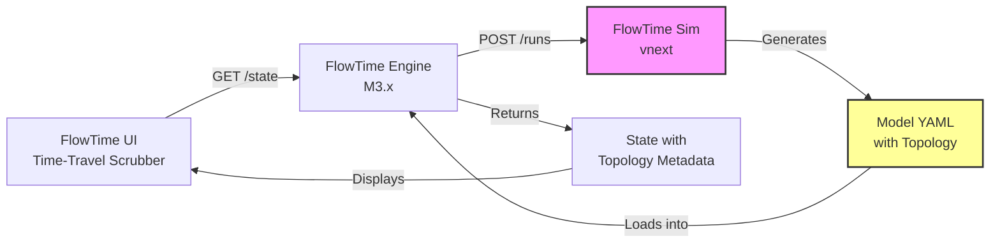
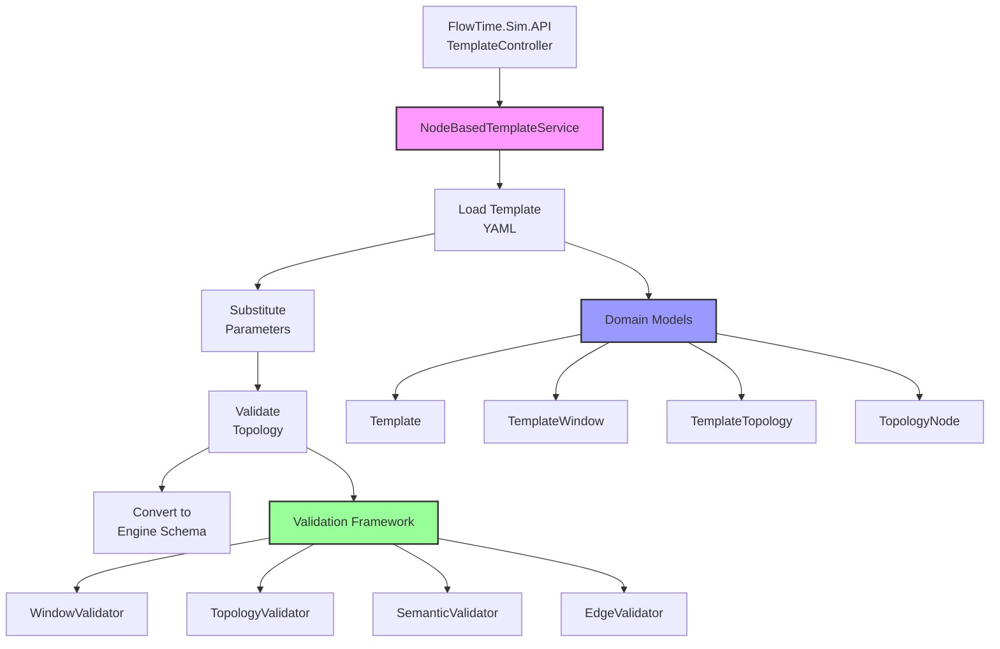
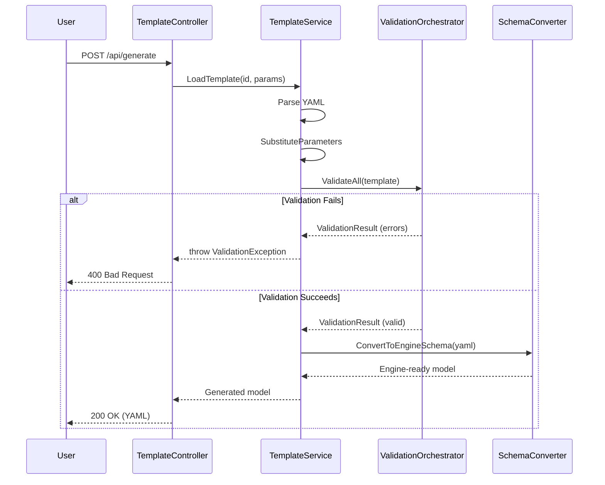
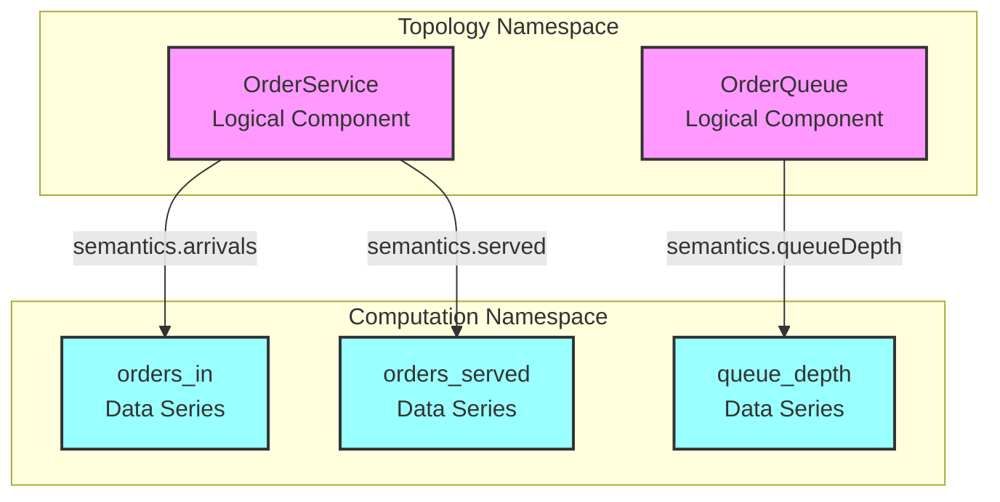

# FlowTime-Sim Time-Travel Implementation Plan
## Chapter 2: Architecture & Design Principles

**Last Updated:** October 9, 2025

---

## 2.1 Design Principles

### P1: Schema Evolution Over Backward Compatibility
**Principle:** Clean schema evolution is more important than backward compatibility.

**Application:**
- Schema 1.1 (time-travel) makes `window` and `topology` REQUIRED
- Schema 1.0 (simulation-only) remains available for non-time-travel use cases
- Breaking changes are acceptable and clearly documented
- Clean separation between simulation and time-travel modes

**Trade-off:** Existing templates must be updated, but schema is cleaner

---

### P2: KISS Architecture Compliance
**Principle:** Strict adherence to FlowTime KISS Architecture Ch2 (Data Contracts).

**Application:**
- Schema structure exactly matches KISS specification
- No custom extensions beyond KISS spec
- Validation rules mirror Engine validation
- Field names, types, and semantics identical to Engine

**Trade-off:** Less flexibility for FlowTime-Sim-specific features

---

### P3: Fail Fast with Clear Errors
**Principle:** Detect errors during template generation, not runtime.

**Application:**
- Validation runs during template loading (not generation)
- Errors include context (file, line, field)
- Errors suggest fixes (e.g., "Did you mean 'arrivals'?")
- Multiple errors accumulated (not fail-fast on first error)

**Trade-off:** More validation code, longer startup time

---

### P4: Separation of Concerns
**Principle:** Schema, validation, generation, and templating are separate concerns.

**Application:**
- Schema classes are pure data models (no logic)
- Validation is separate service (TopologyValidator)
- Generation logic doesn't know about validation rules
- Template parameter substitution is isolated

**Trade-off:** More classes and interfaces

---

### P5: Extensibility Without Modification
**Principle:** New features should be addable without changing existing code.

**Application:**
- Validation framework is pluggable (IValidator interface)
- Node kinds are enum-based (easy to extend)
- Semantic fields use dictionary for future extensions
- Template metadata supports custom tags

**Trade-off:** More abstraction, potentially over-engineered

---

## 2.2 Architectural Overview

### 2.2.1 System Context



**FlowTime-Sim's Role:**
- Input: Template YAML + parameters
- Processing: Parameter substitution + validation
- Output: Engine-compatible model with topology metadata

---

### 2.2.2 Component Architecture



---

### 2.2.3 Data Flow

**Template Generation Flow:**



---

## 2.3 Schema Design

### 2.3.1 Core Schema Classes

**Template (Root Object)**
```yaml
# C# Class: Template
# Purpose: Root container for template definition
# Serialization: YamlDotNet

schemaVersion: 1                    # int (always 1 for now)
metadata: { ... }                   # TemplateMetadata
parameters: [ ... ]                 # List<TemplateParameter>
window: { ... }                     # TemplateWindow? (OPTIONAL, new!)
grid: { ... }                       # TemplateGrid
topology: { ... }                   # TemplateTopology? (OPTIONAL, new!)
nodes: [ ... ]                      # List<TemplateNode>
outputs: [ ... ]                    # List<TemplateOutput>
rng: { ... }                        # TemplateRng?
```

**Design Decisions:**
- `window` is nullable → backward compatible (old templates work)
- `topology` is nullable → backward compatible
- If `window` is null, model is simulation-only (M2.10)
- If `topology` is null, Engine cannot compute derived metrics

---

**TemplateWindow**
```yaml
# C# Class: TemplateWindow
# Purpose: Absolute time anchor for bin → timestamp conversion
# KISS Ref: Ch2, §2.2.1

window:
  start: "2025-10-07T00:00:00Z"     # string (ISO-8601 UTC)
  timezone: "UTC"                   # string (must be "UTC")
```

**Validation Rules:**
- `start` must parse as DateTimeOffset
- `start` must end with 'Z' (UTC only)
- `start` must align to bin boundary: (start - epoch) % (binSize * binUnit) == 0
- `timezone` must equal "UTC" (no other timezones supported)

**Usage:**
```
bin_start_utc = window.start + (bin_index * grid.binSize * grid.binUnit_as_duration)
```

---

**TemplateTopology**
```yaml
# C# Class: TemplateTopology
# Purpose: System structure and semantic mapping
# KISS Ref: Ch2, §2.2.2

topology:
  nodes:
    - id: "OrderService"            # string (unique within topology.nodes)
      kind: "service"               # enum: service|queue|router|external
      group: "Orders"               # string? (optional, for UI grouping)
      ui:                           # UIHint? (optional)
        x: 100
        y: 200
      semantics:                    # NodeSemantics
        arrivals: "orders_arrivals"      # string? → nodes[*].id
        served: "orders_served"          # string? → nodes[*].id
        errors: "orders_errors"          # string? → nodes[*].id
        capacity: "orders_capacity"      # string? → nodes[*].id
        queue: null                      # string? (required for kind=queue)
        external_demand: null            # string? (for kind=external)
        latency_min: null                # null = Engine derives from queue
        sla_min: 5.0                     # double? (SLA threshold)
        q0: 0                            # double? (initial queue depth)
  
  edges:
    - from: "OrderService:out"      # string (format: nodeId:port)
      to: "OrderQueue:in"           # string (format: nodeId:port)
      weight: 1.0                   # double (default: 1.0)
```

**Design Decisions:**
- `topology.nodes[*].id` is separate namespace from `nodes[*].id`
  - Topology node = logical system component (OrderService)
  - Computation node = data series (orders_arrivals)
  - Relationship: topology.nodes[*].semantics.* → nodes[*].id
- `semantics` fields map topology nodes to data series
- `kind` determines which semantic fields are required
- `ui.x, ui.y` are hints (Engine can ignore and use auto-layout)
- `edges` describe flow topology (used by UI and validation)

**Validation Rules:**
- `topology.nodes[*].id` must be unique
- `topology.nodes[*].kind` must be enum value
- `semantics.*` values must reference existing `nodes[*].id`
- Kind-specific requirements (see §2.4)
- `edges[*].from` and `edges[*].to` must reference topology.nodes[*].id
- No self-loops: from node != to node
- Cycles allowed only if cycle contains time delay (SHIFT)

---

**NodeSemantics**
```yaml
# C# Class: NodeSemantics
# Purpose: Map logical node to data series
# All fields are optional (string?)

semantics:
  arrivals: string?           # Incoming requests/items
  served: string?             # Successfully processed requests
  errors: string?             # Failed requests
  capacity: string?           # Maximum throughput
  queue: string?              # Queue depth (for kind=queue)
  external_demand: string?    # Demand from outside system
  latency_min: null           # null = Engine derives, or explicit series
  sla_min: double?            # SLA threshold in minutes
  q0: double?                 # Initial queue depth
```

**Field Semantics:**
- `arrivals`: Total demand (may exceed capacity)
- `served`: Actual throughput (MIN(arrivals, capacity))
- `errors`: Dropped/failed requests (arrivals - served)
- `capacity`: Maximum processing rate
- `queue`: Current backlog depth
- `external_demand`: Demand generated externally (not from other nodes)
- `latency_min`: Average latency (computed from queue via Little's Law)
- `sla_min`: Target latency threshold
- `q0`: Initial queue state (alternative to node.initial)

---

**TopologyEdge**
```yaml
# C# Class: TopologyEdge
# Purpose: Flow connection between topology nodes

edges:
  - from: "LoadBalancer:out"     # string (format: nodeId:port)
    to: "AuthService:in"         # string (format: nodeId:port)
    weight: 1.0                  # double (flow split ratio)
```

**Design Decisions:**
- Port suffix (`:out`, `:in`) is metadata for UI
- Ports are not validated (Engine doesn't use them)
- Weight represents flow split ratio (for routers) or just metadata

**Edge Weight Semantics:**
```
# For a router with 2 outgoing edges:
edges:
  - from: "Router:out"
    to: "Service1:in"
    weight: 0.7              # 70% of traffic
  - from: "Router:out"
    to: "Service2:in"
    weight: 0.3              # 30% of traffic
```

---

### 2.3.2 Node Kinds & Requirements

**Kind-Specific Semantic Requirements:**

| Kind | Required Semantics | Optional Semantics | Description |
|------|-------------------|-------------------|-------------|
| **service** | arrivals, served | capacity, errors, sla_min | Processing node (HTTP API, worker) |
| **queue** | arrivals, served, queue | capacity, errors, sla_min, q0 | Backlog node (Service Bus, DB queue) |
| **router** | arrivals, served | capacity | Flow splitter (load balancer) |
| **external** | external_demand | - | Boundary node (demand source) |

**Validation Rules per Kind:**

```
IF kind = "service":
  REQUIRE semantics.arrivals is not null
  REQUIRE semantics.served is not null
  OPTIONAL semantics.capacity, errors, sla_min

IF kind = "queue":
  REQUIRE semantics.arrivals is not null
  REQUIRE semantics.served is not null
  REQUIRE semantics.queueDepth is not null
  OPTIONAL semantics.capacity, errors, sla_min, q0

IF kind = "router":
  REQUIRE semantics.arrivals is not null
  REQUIRE semantics.served is not null
  SHOULD HAVE multiple outgoing edges with weights

IF kind = "external":
  REQUIRE semantics.external_demand is not null
  SHOULD NOT HAVE incoming edges (it's a source)
```

---

### 2.3.3 Namespace Separation

**Problem:** Topology nodes vs. Computation nodes could have ID collisions.

**Solution:** Separate namespaces with clear mapping.

**Namespace Design:**



**Relationship:**
- `topology.nodes[*].semantics.arrivals` → `nodes[*].id`
- Many-to-one allowed: Multiple topology nodes can reference same data series
- One-to-many NOT recommended: One topology node should not map to multiple series for same semantic

**Example:**
```yaml
topology:
  nodes:
    - id: OrderService           # Logical service
      semantics:
        arrivals: orders_in      # → nodes[*].id
        served: orders_out       # → nodes[*].id

nodes:
  - id: orders_in                # Data series (referenced by topology)
    kind: const
    values: [100, 150, 200]
  
  - id: orders_out               # Data series (referenced by topology)
    kind: expr
    expr: "MIN(orders_in, capacity)"
```

**Validation:**
```
FOR EACH topology.nodes[*].semantics.* AS semantic_value:
  IF semantic_value is not null:
    ASSERT semantic_value exists in nodes[*].id
    ERROR: "Semantic field '{semantic_field}' references unknown node '{semantic_value}'"
```

---

## 2.4 Generator Design

### 2.4.1 Parameter Substitution Strategy

**Challenge:** Current substitution engine may not handle nested object paths.

**Current Behavior:**
```yaml
# Simple substitution (works today)
parameters:
  - name: bins
    type: integer
    default: 6

grid:
  bins: ${bins}       # ✅ Works (simple field)
```

**Required Behavior:**
```yaml
# Nested substitution (must support)
parameters:
  - name: startTime
    type: string
    default: "2025-10-07T00:00:00Z"

window:
  start: ${startTime}    # ❓ Does this work?
  
topology:
  nodes:
    - id: ${serviceName}Service      # ❓ Does this work?
      semantics:
        arrivals: ${serviceName}_in  # ❓ Does this work?
```

**Solution Approach:**

**Option A: Enhance Existing Substitution (Preferred)**
```csharp
// Current: Simple regex-based substitution
public string SubstituteParameters(string yaml, Dictionary<string, object> parameters)
{
    foreach (var param in parameters)
    {
        yaml = yaml.Replace($"${{{param.Key}}}", param.Value.ToString());
    }
    return yaml;
}
```

**Assessment:** This should work for all cases! Substitution happens at string level before parsing.

**Verification Needed:**
- Test with nested objects
- Test with arrays
- Test with string interpolation: `${serviceName}_capacity`

**Option B: Post-Parse Substitution (Fallback)**
If Option A doesn't work, substitute after parsing:
```csharp
public Template SubstituteParameters(Template template, Dictionary<string, object> parameters)
{
    // Recursively walk template object tree
    // Replace placeholders in all string fields
}
```

**Recommendation:** Verify Option A in Phase 1 spike. If it works, no code changes needed!

---

### 2.4.2 ConvertToEngineSchema Updates

**Current Behavior:**
- Removes `metadata` and `parameters` sections
- Preserves `grid`, `nodes`, `outputs`, `rng`

**Required Behavior:**
- Also preserve `window` section
- Also preserve `topology` section

**Implementation:**

```csharp
private string ConvertToEngineSchema(string yaml)
{
    var lines = yaml.Split('\n');
    var result = new List<string>();
    bool inMetadataSection = false;
    bool inParametersSection = false;
    int sectionIndentLevel = 0;
    
    foreach (var line in lines)
    {
        var trimmed = line.TrimStart();
        var indentLevel = line.Length - trimmed.Length;
        
        // Check for section starts
        if (trimmed == "metadata:")
        {
            inMetadataSection = true;
            sectionIndentLevel = indentLevel;
            continue;  // Skip this line
        }
        
        if (trimmed == "parameters:")
        {
            inParametersSection = true;
            sectionIndentLevel = indentLevel;
            continue;  // Skip this line
        }
        
        // NEW: Do NOT skip window section
        if (trimmed == "window:")
        {
            inMetadataSection = false;
            inParametersSection = false;
        }
        
        // NEW: Do NOT skip topology section
        if (trimmed == "topology:")
        {
            inMetadataSection = false;
            inParametersSection = false;
        }
        
        // Check if we're exiting a section
        if ((inMetadataSection || inParametersSection) && 
            indentLevel <= sectionIndentLevel && 
            !string.IsNullOrWhiteSpace(trimmed))
        {
            inMetadataSection = false;
            inParametersSection = false;
        }
        
        // Skip lines in excluded sections
        if (inMetadataSection || inParametersSection)
        {
            continue;
        }
        
        // Keep all other lines
        result.Add(line);
    }
    
    return string.Join('\n', result);
}
```

**Key Changes:**
1. When encountering `window:` or `topology:`, reset skip flags
2. These sections are preserved in output
3. No other logic changes

---

## 2.5 Validation Framework Design

### 2.5.1 Validation Architecture

**Design Pattern:** Chain of Responsibility + Strategy

```
IValidator Interface
  ↓
┌─────────────────────────────────────────┐
│      ValidationOrchestrator             │
│  (Coordinates all validators)           │
└───┬──────────────┬──────────────┬───────┘
    │              │              │
    ▼              ▼              ▼
┌────────┐   ┌────────┐   ┌────────┐
│Window  │   │Topology│   │Semantic│  ... (more validators)
│Validator│   │Validator│   │Validator│
└────────┘   └────────┘   └────────┘
```

**Interface:**
```csharp
public interface IValidator
{
    ValidationResult Validate(Template template);
}

public class ValidationResult
{
    public bool IsValid { get; set; }
    public List<ValidationError> Errors { get; set; }
    public List<ValidationWarning> Warnings { get; set; }
}

public class ValidationError
{
    public string Code { get; set; }           // e.g., "TOP001"
    public string Message { get; set; }        // Human-readable
    public string Path { get; set; }           // e.g., "topology.nodes[0].semantics.arrivals"
    public string Suggestion { get; set; }     // How to fix
}
```

---

### 2.5.2 Validation Error Taxonomy

**Error Code Format:** `AAA###`
- `AAA` = Category (WIN, TOP, SEM, EDG, etc.)
- `###` = Sequential number

**Error Categories:**

| Code | Category | Description | Example |
|------|----------|-------------|---------|
| **WIN** | Window Validation | window section errors | WIN001: Invalid ISO-8601 format |
| **TOP** | Topology Validation | topology structure errors | TOP001: Duplicate node ID |
| **SEM** | Semantic Validation | semantics mapping errors | SEM001: Reference to unknown node |
| **EDG** | Edge Validation | edge structure errors | EDG001: Self-loop detected |
| **KND** | Kind Validation | kind-specific errors | KND001: Queue missing required field |
| **PAR** | Parameter Validation | parameter errors | PAR001: Value out of range |

**Complete Error Catalog:** See Chapter 5 (Validation Framework)

---

## 2.6 Design Trade-offs

### 2.6.1 Required vs Optional Topology

**Decision:** Make `topology` REQUIRED in schema 1.1 (time-travel).

**Rationale:**
- ✅ Cleaner schema (no conditional logic)
- ✅ Time-travel functionality requires topology metadata
- ✅ Schema 1.0 remains available for simulation-only use cases
- ✅ Breaking change is acceptable for major version bump
- ❌ Existing templates must be updated

**Alternative Considered:**
- Make topology optional, maintain backward compatibility
- Rejected: Too complex, defeats purpose of time-travel feature

---

### 2.6.2 Schema Versioning Strategy

**Decision:** Bump to schema version 1.1 for time-travel, keep 1.0 for simulation.

**Rationale:**
- ✅ Clear distinction between modes
- ✅ Allows breaking changes
- ✅ Simpler validation rules (no conditionals)
- ✅ Better developer experience (know what's required)
- ❌ Requires template updates

**Version Strategy:**
- **Schema 1.0:** Simulation-only (window/topology optional)
- **Schema 1.1:** Time-travel (window/topology REQUIRED)
- **Schema 2.0:** Reserved for future breaking changes

---

### 2.6.3 Separate vs. Unified Namespaces

**Decision:** Keep topology.nodes and nodes in separate namespaces.

**Rationale:**
- ✅ Clear separation of concerns (logical vs. computational)
- ✅ Flexibility for many-to-one mappings
- ✅ Matches mental model (service vs. data series)
- ❌ Requires semantic mapping (more complexity)

**Alternative Considered:**
- Merge namespaces (topology node ID = computation node ID)
- Rejected: Too restrictive, limits reuse of data series

---

### 2.6.4 Fail-Fast vs. Accumulate Errors

**Decision:** Accumulate all validation errors before failing.

**Rationale:**
- ✅ Better developer experience (see all errors at once)
- ✅ Reduces iteration time (fix multiple errors in one pass)
- ❌ More complex validation logic

**Alternative Considered:**
- Fail on first error (simpler implementation)
- Rejected: Poor developer experience

---

### 2.6.4 String-Based vs. Object-Based Parameter Substitution

**Decision:** Keep string-based substitution (pre-parse).

**Rationale:**
- ✅ Simpler implementation
- ✅ Works for all YAML constructs
- ✅ No code changes needed
- ❌ Less type safety

**Alternative Considered:**
- Parse YAML first, then substitute object properties
- Rejected: More complex, requires deep object traversal

---

## 2.7 Design Patterns Applied

### 2.7.1 Builder Pattern
**Used For:** Template construction in tests
**Benefit:** Fluent API for creating complex templates

### 2.7.2 Strategy Pattern
**Used For:** Validation rules (IValidator)
**Benefit:** Pluggable, testable validators

### 2.7.3 Chain of Responsibility
**Used For:** Validation orchestration
**Benefit:** Each validator independent, easy to add new rules

### 2.7.4 Template Method Pattern
**Used For:** Base validator class
**Benefit:** Common error formatting, shared logic

### 2.7.5 Null Object Pattern
**Used For:** Optional topology/window
**Benefit:** No null checks in client code

---

## 2.8 Quality Attributes

### 2.8.1 Maintainability
- **Score:** 8/10
- **Strengths:** Clear separation of concerns, pluggable validation
- **Risks:** Validation logic could become complex

### 2.8.2 Testability
- **Score:** 9/10
- **Strengths:** Interface-based design, dependency injection
- **Risks:** Integration tests with Engine required

### 2.8.3 Performance
- **Score:** 7/10
- **Strengths:** Validation is O(n) for most rules
- **Risks:** Cycle detection is O(V + E), could be slow for large topologies

### 2.8.4 Extensibility
- **Score:** 9/10
- **Strengths:** Pluggable validators, enum-based kinds, schema versioning
- **Risks:** Adding new node kinds requires validation updates

### 2.8.5 Security
- **Score:** 8/10
- **Strengths:** File path validation, no arbitrary code execution
- **Risks:** File URI resolution needs careful security review

---

**End of Chapter 2**

**Next:** Chapter 3 - Implementation Phases & Milestones