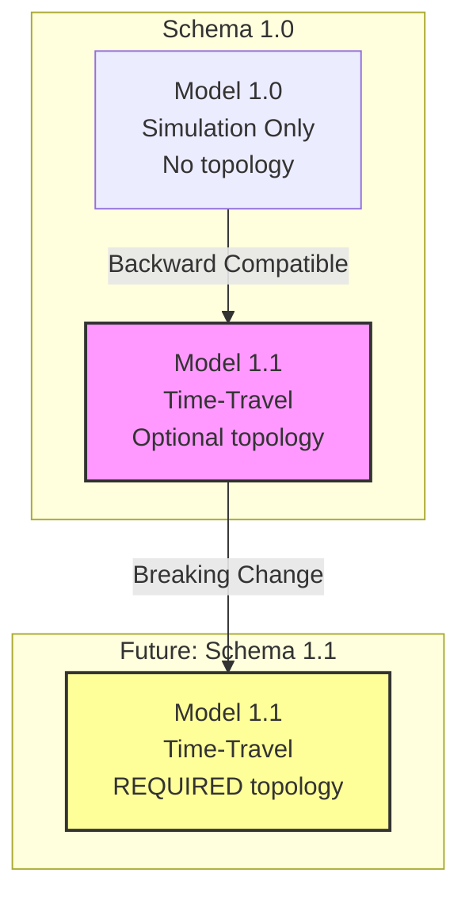
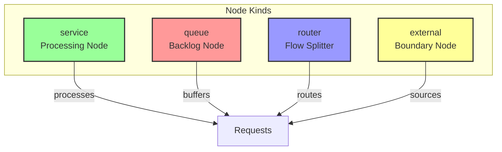
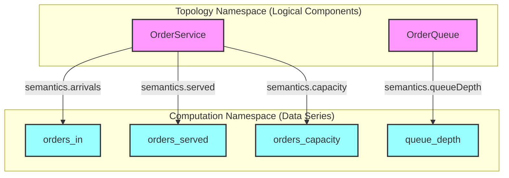
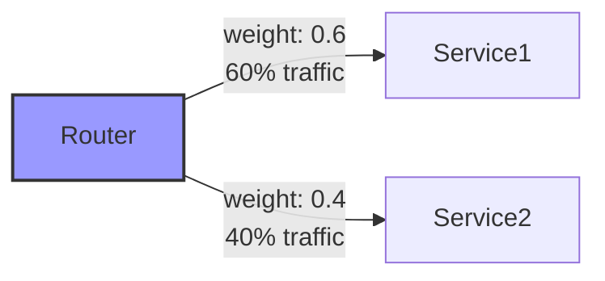
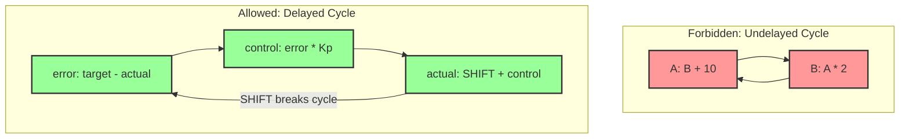

# FlowTime-Sim Time-Travel Implementation Plan
## Chapter 4: Schema Extensions Reference

**Last Updated:** October 9, 2025

---

## 4.1 Versioning Strategy

### Schema vs Model Version



**Current Implementation (M3.x):**
- Schema Version: **1.0** (no changes)
- Model Version: **1.1** (new field)
- Topology: **OPTIONAL** (backward compatible)
- Validation: Conditional (only if topology present)

**Future:**
- Schema Version: **1.1** (breaking change)
- Topology: **REQUIRED**

---

## 4.2 Complete Template Schema

### 4.2.1 Root Template Structure

```yaml
schemaVersion: 1                    # Schema version (always 1 for M3.x)
modelVersion: 1.1                   # NEW: Model version (1.0 or 1.1)

metadata:
  id: example-template
  title: Example Template
  description: Complete example
  author: FlowTime Team
  version: 1.0.0
  tags: [example, complete]

parameters:
  - name: bins
    type: integer
    default: 6
  - name: startTime
    type: string
    default: "2025-10-07T00:00:00Z"
  - name: serviceName
    type: string
    default: "Order"

window:                             # NEW: Optional (model 1.1)
  start: ${startTime}
  timezone: "UTC"

grid:
  bins: ${bins}
  binSize: 60
  binUnit: minutes

topology:                           # NEW: Optional (model 1.1)
  nodes:
    - id: ${serviceName}Service
      kind: service
      group: CoreServices
      ui:
        x: 200
        y: 300
      semantics:
        arrivals: ${serviceName}_arrivals
        served: ${serviceName}_served
        capacity: ${serviceName}_capacity
  
  edges:
    - from: "${serviceName}Service:out"
      to: "${serviceName}Queue:in"
      weight: 1.0

nodes:
  - id: ${serviceName}_arrivals
    kind: const
    values: [100, 150, 200, 180, 120, 80]
  
  - id: ${serviceName}_served
    kind: expr
    expr: "MIN(${serviceName}_arrivals, ${serviceName}_capacity)"
    initial: 0                      # NEW: Optional for stateful nodes

outputs:
  - series: ${serviceName}_arrivals
    as: arrivals.csv

rng:
  seed: 12345
  algorithm: pcg32
```

---

## 4.3 Window Section

### 4.3.1 Schema Definition

**C# Class:**
```csharp
namespace FlowTime.Sim.Core.Templates
{
    /// <summary>
    /// Absolute time window for bin-to-timestamp conversion.
    /// Optional in model 1.1 (backward compatible).
    /// </summary>
    public class TemplateWindow
    {
        /// <summary>
        /// Start time in ISO-8601 UTC format.
        /// Must end with 'Z' (UTC timezone).
        /// Must align to bin boundary.
        /// </summary>
        public string Start { get; set; } = string.Empty;
        
        /// <summary>
        /// Timezone (must be "UTC").
        /// Other timezones not supported.
        /// </summary>
        public string Timezone { get; set; } = "UTC";
    }
}
```

**YAML Schema:**
```yaml
window:
  type: object
  properties:
    start:
      type: string
      format: date-time
      pattern: "^\\d{4}-\\d{2}-\\d{2}T\\d{2}:\\d{2}:\\d{2}Z$"
    timezone:
      type: string
      enum: ["UTC"]
  required: [start, timezone]
```

---

### 4.3.2 Field Specifications

**start Field:**

| Property | Value | Validation Rule |
|----------|-------|-----------------|
| **Type** | string | Must be string (not DateTime object) |
| **Format** | ISO-8601 | `YYYY-MM-DDTHH:MM:SSZ` |
| **Timezone** | UTC only | Must end with 'Z' |
| **Alignment** | Bin boundary | `(start - epoch) % (binSize * binUnit) == 0` |

**Valid Examples:**
```yaml
start: "2025-10-07T00:00:00Z"      # Valid
start: "2025-10-07T00:15:00Z"      # Valid if binSize=15, binUnit=minutes
```

**Invalid Examples:**
```yaml
start: "2025-10-07T00:00:00"       # Missing 'Z'
start: "2025-10-07T00:07:30Z"      # Not aligned (if bins are 15min)
```

---

**timezone Field:**

| Property | Value | Validation Rule |
|----------|-------|-----------------|
| **Type** | string | Must be string |
| **Allowed** | `"UTC"` | Only UTC supported |
| **Case** | Sensitive | Must be exactly "UTC" |

---

### 4.3.3 Bin-to-Timestamp Conversion

**Algorithm:**
```
bin_start_utc = window.start + (bin_index × grid.binSize × grid.binUnit)
bin_end_utc = bin_start_utc + (grid.binSize × grid.binUnit)
```

**Example:**
```yaml
window:
  start: "2025-10-07T00:00:00Z"
  timezone: "UTC"

grid:
  bins: 12
  binSize: 5
  binUnit: minutes
```

**Result:**
```
bin[0] → 2025-10-07T00:00:00Z to 2025-10-07T00:05:00Z
bin[1] → 2025-10-07T00:05:00Z to 2025-10-07T00:10:00Z
bin[2] → 2025-10-07T00:10:00Z to 2025-10-07T00:15:00Z
...
bin[11] → 2025-10-07T00:55:00Z to 2025-10-07T01:00:00Z
```

---

## 4.4 Topology Section

### 4.4.1 Schema Definition

**C# Classes:**

```csharp
public class TemplateTopology
{
    public List<TopologyNode> Nodes { get; set; } = new();
    public List<TopologyEdge> Edges { get; set; } = new();
}

public class TopologyNode
{
    public string Id { get; set; } = string.Empty;
    public string Kind { get; set; } = string.Empty;
    public string? Group { get; set; }
    public UIHint? Ui { get; set; }
    public NodeSemantics Semantics { get; set; } = new();
}

public class NodeSemantics
{
    public string? Arrivals { get; set; }
    public string? Served { get; set; }
    public string? Errors { get; set; }
    public string? Capacity { get; set; }
    public string? Queue { get; set; }
    public string? ExternalDemand { get; set; }
    public double? Q0 { get; set; }
    public double? SlaMin { get; set; }
}

public class TopologyEdge
{
    public string From { get; set; } = string.Empty;
    public string To { get; set; } = string.Empty;
    public double Weight { get; set; } = 1.0;
}

public class UIHint
{
    public int X { get; set; }
    public int Y { get; set; }
}
```

---

### 4.4.2 Node Kinds



**service (Processing Node)**

Description: HTTP API, worker service, microservice

**Required Semantics:**
- `arrivals`: Incoming requests
- `served`: Successfully processed requests

**Optional Semantics:**
- `capacity`: Maximum throughput
- `errors`: Failed requests
- `sla_min`: Target latency threshold

**Example:**
```yaml
- id: OrderService
  kind: service
  semantics:
    arrivals: orders_in
    served: orders_processed
    capacity: orders_max_throughput
    errors: orders_failed
```

---

**queue (Backlog Node)**

Description: Service Bus, database queue, message broker

**Required Semantics:**
- `arrivals`: Incoming items
- `served`: Items removed from queue
- `queue`: Current queue depth

**Optional Semantics:**
- `capacity`: Queue processing rate
- `errors`: Items dropped
- `q0`: Initial queue depth
- `sla_min`: Target latency threshold

**Example:**
```yaml
- id: OrderQueue
  kind: queue
  semantics:
    arrivals: orders_enqueued
    served: orders_dequeued
    queue: queue_depth
    capacity: queue_processing_rate
    q0: 0
    sla_min: 5.0

# Corresponding computation node:
nodes:
  - id: queue_depth
    kind: expr
    expr: "MAX(0, SHIFT(queue_depth, 1) + orders_enqueued - orders_dequeued)"
    initial: 0  # Must match q0
```

---

**router (Flow Splitter)**

Description: Load balancer, API gateway, conditional router

**Required Semantics:**
- `arrivals`: Incoming traffic
- `served`: Outgoing traffic

**Optional Semantics:**
- `capacity`: Router throughput limit

**Example:**
```yaml
- id: LoadBalancer
  kind: router
  semantics:
    arrivals: total_requests
    served: routed_requests
    capacity: lb_capacity

edges:
  - from: "LoadBalancer:out"
    to: "ServiceA:in"
    weight: 0.7
  - from: "LoadBalancer:out"
    to: "ServiceB:in"
    weight: 0.3
```

---

**external (Boundary Node)**

Description: User traffic, external system, supplier

**Required Semantics:**
- `external_demand`: Demand from outside system

**Example:**
```yaml
- id: UserTraffic
  kind: external
  semantics:
    external_demand: user_requests

edges:
  - from: "UserTraffic:out"
    to: "LoadBalancer:in"
```

---

### 4.4.3 Semantic Field Reference

| Field | Type | Required For | Description |
|-------|------|--------------|-------------|
| **arrivals** | string? | service, queue, router | Incoming demand |
| **served** | string? | service, queue, router | Successfully processed |
| **errors** | string? | service, queue | Failed requests |
| **capacity** | string? | service, queue, router | Maximum throughput |
| **queue** | string? | queue | Queue depth |
| **external_demand** | string? | external | External demand source |
| **q0** | double? | queue | Initial queue depth |
| **sla_min** | double? | service, queue | SLA threshold (minutes) |

**Note:** All string fields reference `nodes[*].id` (computation node namespace)

---

### 4.4.4 Namespace Separation

**Topology Namespace vs Computation Namespace:**



**Relationship:**
- `topology.nodes[*].id` → Logical components
- `nodes[*].id` → Data series
- Semantic fields map topology → computation

**Cardinality:**
- N:1 allowed (multiple topology nodes can reference same series)
- 1:N not recommended (one topology node shouldn't map to multiple series for same semantic)

**Example:**
```yaml
topology:
  nodes:
    - id: OrderService           # Topology namespace
      semantics:
        arrivals: orders_in      # → Computation namespace

nodes:
  - id: orders_in                # Computation namespace
    kind: const
    values: [100, 150, 200]
```

---

### 4.4.5 Edge Specification

**Format:**
```yaml
edges:
  - from: "nodeId:port"
    to: "nodeId:port"
    weight: 1.0
```

**Port Naming:**
- Common ports: `:in`, `:out`, `:error`, `:overflow`
- Ports are UI metadata (not validated by Engine)
- If omitted, default port assumed

**Weight Semantics:**



**For Routers:**
```yaml
edges:
  - from: "Router:out"
    to: "ServiceA:in"
    weight: 0.6          # 60% of traffic
  - from: "Router:out"
    to: "ServiceB:in"
    weight: 0.4          # 40% of traffic
```

**For Sequential Flow:**
```yaml
edges:
  - from: "StageA:out"
    to: "StageB:in"
    weight: 1.0          # 100% flow
```

---

## 4.5 Cycle Detection

### 4.5.1 Allowed vs Forbidden Cycles



**Forbidden:**
```yaml
# INVALID: Circular dependency without delay
nodes:
  - id: A
    expr: "B + 10"      # A depends on B
  
  - id: B
    expr: "A * 2"       # B depends on A → CYCLE!
```

**Allowed:**
```yaml
# VALID: Feedback loop with SHIFT (delay)
nodes:
  - id: error
    expr: "target - actual"
  
  - id: control
    expr: "error * Kp"
  
  - id: actual
    expr: "SHIFT(actual, 1) + control"  # Delay breaks cycle
    initial: 0
```

---

### 4.5.2 Detection Algorithm

**Pseudocode:**
```
1. Build dependency graph from expressions:
   FOR EACH node WITH expr:
     dependencies = extract_identifiers(expr)
     graph.add_edges(node.id → dependencies)

2. Run topological sort:
   WHILE nodes with in-degree 0 exist:
     Remove node, decrement neighbors

3. Check for cycles:
   IF any nodes remain:
     cycle_nodes = remaining nodes
     FOR EACH cycle_node:
       IF cycle_node does NOT use SHIFT(self, k):
         ERROR: "Undelayed cycle detected"
       ELSE:
         PASS: "Delayed cycle (valid)"
```

**Complexity:** O(V + E) where V = nodes, E = dependencies

---

## 4.6 Initial Conditions

### 4.6.1 When Initial Required

**Rule:** If node expression contains `SHIFT(self, k)` where `k > 0`, then `initial` field is REQUIRED.

**Valid:**
```yaml
- id: queue_depth
  kind: expr
  expr: "MAX(0, SHIFT(queue_depth, 1) + arrivals - served)"
  initial: 0       # ✅ Required
```

**Invalid:**
```yaml
- id: queue_depth
  kind: expr
  expr: "MAX(0, SHIFT(queue_depth, 1) + arrivals - served)"
  # ❌ Missing initial field!
```

---

### 4.6.2 Consistency with q0

**If both `node.initial` and `topology.semantics.q0` are present, they must match:**

```yaml
topology:
  nodes:
    - id: DatabaseQueue
      kind: queue
      semantics:
        queue: queue_depth
        q0: 10            # Initial queue depth

nodes:
  - id: queue_depth
    kind: expr
    expr: "SHIFT(queue_depth, 1) + arrivals - served"
    initial: 10         # Must match q0
```

**Validation Rule:**
```
IF topology.nodes[*].semantics.q0 is not null:
  queue_node_id = topology.nodes[*].semantics.queueDepth
  queue_node = find_node(queue_node_id)
  IF queue_node.initial is not null:
    ASSERT queue_node.initial == topology.nodes[*].semantics.q0
```

---

## 4.7 File Sources

### 4.7.1 File URI Format

**Syntax:**
```
source: "file:<path>"
```

**Resolution Rules:**

1. **Relative Path:**
```yaml
source: "file:telemetry/arrivals.csv"
# Resolves to: {template_dir}/telemetry/arrivals.csv
```

2. **Absolute Path:**
```yaml
source: "file:/data/telemetry/arrivals.csv"
# Resolves to: /data/telemetry/arrivals.csv
```

---

### 4.7.2 CSV File Format

**Structure:**
- Single column, no header
- One value per line
- Length must equal `grid.bins`

**Example (6 bins):**
```csv
100
150
200
180
120
80
```

**Validation:**
- File must exist and be readable
- File must have exactly `grid.bins` lines
- Each line must parse as double
- No sparse data (all bins required)

---

### 4.7.3 Security Constraints

**Path Traversal Prevention:**

```csharp
public static string ResolveFileSource(string fileUri, string templateDir)
{
    // Remove "file:" prefix
    var path = fileUri.Substring(5);
    
    // Resolve relative path
    if (!Path.IsPathRooted(path))
    {
        path = Path.Combine(templateDir, path);
    }
    
    // Normalize path
    path = Path.GetFullPath(path);
    
    // Security check: path must be within allowed directories
    var allowedDirs = new[]
    {
        Path.GetFullPath("templates/"),
        Path.GetFullPath("telemetry/"),
        Path.GetFullPath("fixtures/")
    };
    
    if (!allowedDirs.Any(dir => path.StartsWith(dir)))
    {
        throw new SecurityException($"Access denied: {path}");
    }
    
    return path;
}
```

---

## 4.8 Template Examples

### 4.8.1 Minimal Time-Travel Template

```yaml
schemaVersion: 1
modelVersion: 1.1

metadata:
  id: minimal-time-travel
  title: Minimal Time-Travel Template

parameters:
  - name: startTime
    default: "2025-10-07T00:00:00Z"

window:
  start: ${startTime}
  timezone: "UTC"

grid:
  bins: 3
  binSize: 60
  binUnit: minutes

topology:
  nodes:
    - id: SimpleService
      kind: service
      semantics:
        arrivals: arrivals
        served: served

nodes:
  - id: arrivals
    kind: const
    values: [10, 20, 30]
  
  - id: served
    kind: const
    values: [10, 20, 30]

outputs:
  - series: arrivals
    as: arrivals.csv
```

---

### 4.8.2 Backward Compatible Template (Model 1.0)

```yaml
schemaVersion: 1
modelVersion: 1.0

metadata:
  id: legacy-simulation
  title: Legacy Simulation Template

grid:
  bins: 6
  binSize: 60
  binUnit: minutes

nodes:
  - id: demand
    kind: const
    values: [10, 20, 30, 40, 50, 60]
  
  - id: served
    kind: const
    values: [10, 20, 30, 40, 50, 60]

outputs:
  - series: demand
    as: demand.csv
```

**Note:** No window, no topology (backward compatible)

---

### 4.8.3 Complete Feature Showcase

```yaml
schemaVersion: 1
modelVersion: 1.1

metadata:
  id: complete-example
  title: Complete Feature Showcase

parameters:
  - name: bins
    type: integer
    default: 6
  - name: startTime
    type: string
    default: "2025-10-07T00:00:00Z"
  - name: serviceName
    type: string
    default: "Order"

window:
  start: ${startTime}
  timezone: "UTC"

grid:
  bins: ${bins}
  binSize: 60
  binUnit: minutes

topology:
  nodes:
    - id: ${serviceName}Service
      kind: service
      group: CoreServices
      ui: { x: 200, y: 300 }
      semantics:
        arrivals: ${serviceName}_arrivals
        served: ${serviceName}_served
        capacity: ${serviceName}_capacity
        errors: ${serviceName}_errors
    
    - id: ${serviceName}Queue
      kind: queue
      group: Queues
      ui: { x: 400, y: 300 }
      semantics:
        arrivals: ${serviceName}_served
        served: ${serviceName}_processed
        queue: ${serviceName}_queue_depth
        capacity: ${serviceName}_db_capacity
        q0: 0
        sla_min: 5.0
  
  edges:
    - from: "${serviceName}Service:out"
      to: "${serviceName}Queue:in"
      weight: 1.0

nodes:
  - id: ${serviceName}_arrivals
    kind: const
    values: [100, 150, 200, 180, 120, 80]
  
  - id: ${serviceName}_capacity
    kind: const
    values: [200, 200, 200, 200, 200, 200]
  
  - id: ${serviceName}_served
    kind: expr
    expr: "MIN(${serviceName}_arrivals, ${serviceName}_capacity)"
  
  - id: ${serviceName}_errors
    kind: expr
    expr: "MAX(0, ${serviceName}_arrivals - ${serviceName}_served)"
  
  - id: ${serviceName}_db_capacity
    kind: const
    values: [150, 150, 150, 150, 150, 150]
  
  - id: ${serviceName}_queue_depth
    kind: expr
    expr: "MAX(0, SHIFT(${serviceName}_queue_depth, 1) + ${serviceName}_served - ${serviceName}_processed)"
    initial: 0
  
  - id: ${serviceName}_processed
    kind: expr
    expr: "MIN(${serviceName}_served, ${serviceName}_db_capacity)"

outputs:
  - series: ${serviceName}_arrivals
    as: arrivals.csv
  - series: ${serviceName}_queue_depth
    as: queue.csv

rng:
  seed: 12345
  algorithm: pcg32
```

---

## 4.9 Schema Version Summary

### Current (M3.x)

| Field | Schema 1.0, Model 1.0 | Schema 1.0, Model 1.1 |
|-------|----------------------|----------------------|
| **schemaVersion** | 1 | 1 |
| **modelVersion** | 1.0 (or omit) | 1.1 |
| **window** | Not present | Optional |
| **topology** | Not present | Optional |
| **Validation** | Basic | Conditional (if topology present) |

### Future (Engine Schema 1.1)

| Field | Schema 1.1, Model 1.1 |
|-------|----------------------|
| **schemaVersion** | 1.1 (breaking change) |
| **modelVersion** | 1.1 |
| **window** | REQUIRED |
| **topology** | REQUIRED |
| **Validation** | Always enforced |

---

**End of Chapter 4**

**Next:** Chapter 5 - Validation Framework Details