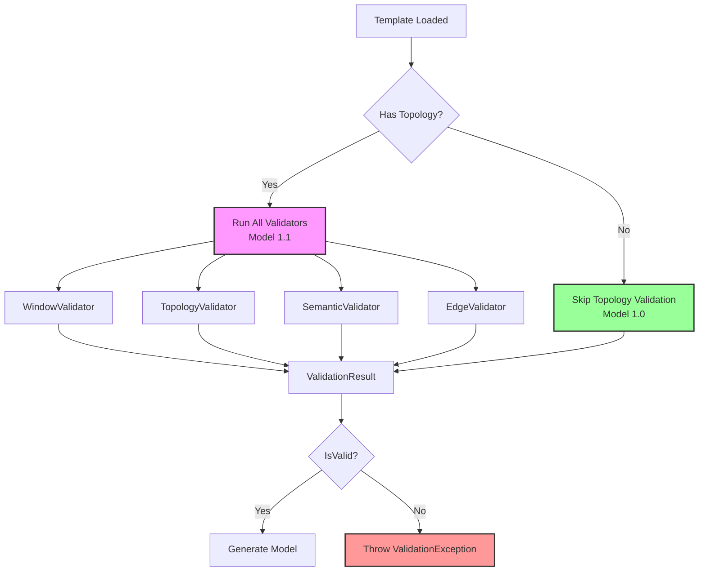
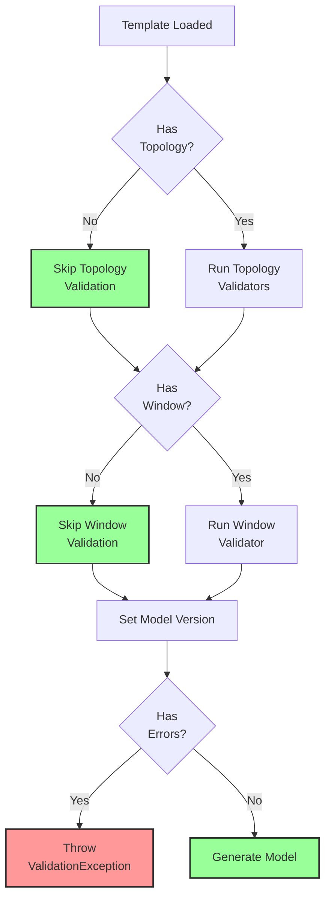

# FlowTime-Sim Time-Travel Implementation Plan
## Chapter 5: Validation Framework Details

**Last Updated:** October 9, 2025

---

## 5.1 Validation Architecture

### 5.1.1 Validation Philosophy

**Key Principles:**
- **Conditional Validation:** Only validate topology if present (backward compatible)
- **Accumulate Errors:** Report all errors, not fail-fast
- **Actionable Messages:** Include context, path, and suggestions
- **Performance Conscious:** Validation should be fast



---

### 5.1.2 Core Interfaces

```csharp
namespace FlowTime.Sim.Core.Validation
{
    public interface IValidator
    {
        /// <summary>
        /// Validates template. Returns errors, never throws.
        /// </summary>
        ValidationResult Validate(Template template);
    }
    
    public class ValidationResult
    {
        public bool IsValid => !Errors.Any();
        public List<ValidationError> Errors { get; set; } = new();
        public List<ValidationWarning> Warnings { get; set; } = new();
        
        public void Merge(ValidationResult other)
        {
            Errors.AddRange(other.Errors);
            Warnings.AddRange(other.Warnings);
        }
    }
    
    public class ValidationError
    {
        public string Code { get; set; } = string.Empty;
        public string Message { get; set; } = string.Empty;
        public string Path { get; set; } = string.Empty;
        public string? Suggestion { get; set; }
    }
    
    public class ValidationWarning
    {
        public string Code { get; set; } = string.Empty;
        public string Message { get; set; } = string.Empty;
        public string Path { get; set; } = string.Empty;
        public string? Suggestion { get; set; }
    }
}
```

---

## 5.2 WindowValidator

### 5.2.1 Implementation

```csharp
public class WindowValidator : IValidator
{
    public ValidationResult Validate(Template template)
    {
        var result = new ValidationResult();
        
        // If no window, skip (backward compatible)
        if (template.Window == null)
            return result;
        
        ValidateStartFormat(template, result);
        ValidateTimezone(template, result);
        ValidateAlignment(template, result);
        
        return result;
    }
    
    private void ValidateStartFormat(Template template, ValidationResult result)
    {
        var start = template.Window!.Start;
        
        if (string.IsNullOrWhiteSpace(start))
        {
            result.Errors.Add(new ValidationError
            {
                Code = "WIN001",
                Message = "window.start is required",
                Path = "window.start",
                Suggestion = "Set to ISO-8601 UTC format (e.g., '2025-10-07T00:00:00Z')"
            });
            return;
        }
        
        if (!DateTime.TryParse(start, CultureInfo.InvariantCulture,
            DateTimeStyles.AssumeUniversal | DateTimeStyles.AdjustToUniversal,
            out var dt))
        {
            result.Errors.Add(new ValidationError
            {
                Code = "WIN002",
                Message = $"Invalid ISO-8601 format: '{start}'",
                Path = "window.start",
                Suggestion = "Use format: YYYY-MM-DDTHH:MM:SSZ"
            });
            return;
        }
        
        if (!start.EndsWith("Z"))
        {
            result.Errors.Add(new ValidationError
            {
                Code = "WIN003",
                Message = $"Must be UTC (end with 'Z'): '{start}'",
                Path = "window.start",
                Suggestion = "Add 'Z' at the end for UTC"
            });
        }
    }
    
    private void ValidateTimezone(Template template, ValidationResult result)
    {
        var timezone = template.Window!.Timezone;
        
        if (timezone != "UTC")
        {
            result.Errors.Add(new ValidationError
            {
                Code = "WIN004",
                Message = $"Timezone must be 'UTC', got '{timezone}'",
                Path = "window.timezone",
                Suggestion = "Change to: timezone: \"UTC\""
            });
        }
    }
    
    private void ValidateAlignment(Template template, ValidationResult result)
    {
        var start = template.Window!.Start;
        var binSize = template.Grid.BinSize;
        var binUnit = template.Grid.BinUnit;
        
        if (!DateTime.TryParse(start, CultureInfo.InvariantCulture,
            DateTimeStyles.AssumeUniversal | DateTimeStyles.AdjustToUniversal,
            out var dt))
        {
            return; // Already caught in ValidateStartFormat
        }
        
        var binDuration = binUnit switch
        {
            "seconds" => TimeSpan.FromSeconds(binSize),
            "minutes" => TimeSpan.FromMinutes(binSize),
            "hours" => TimeSpan.FromHours(binSize),
            "days" => TimeSpan.FromDays(binSize),
            _ => TimeSpan.Zero
        };
        
        if (binDuration == TimeSpan.Zero)
            return; // Invalid binUnit, caught elsewhere
        
        var epoch = new DateTime(1970, 1, 1, 0, 0, 0, DateTimeKind.Utc);
        var elapsed = dt - epoch;
        
        if (elapsed.Ticks % binDuration.Ticks != 0)
        {
            result.Errors.Add(new ValidationError
            {
                Code = "WIN005",
                Message = $"Not aligned to bin boundary ({binSize} {binUnit})",
                Path = "window.start",
                Suggestion = $"Adjust to multiple of {binSize} {binUnit} from epoch"
            });
        }
    }
}
```

---

### 5.2.2 Error Catalog - Window

| Code | Description | Example | Fix |
|------|-------------|---------|-----|
| **WIN001** | start is empty | `start: ""` | Set to ISO-8601 |
| **WIN002** | Invalid ISO-8601 | `start: "2025-10-07"` | Use full format with time |
| **WIN003** | Not UTC | `start: "2025-10-07T00:00:00"` | Add 'Z' |
| **WIN004** | Invalid timezone | `timezone: "EST"` | Use "UTC" |
| **WIN005** | Not aligned | start=00:07:30, bins=15min | Align to boundary |

---

## 5.3 TopologyValidator

### 5.3.1 Implementation

```csharp
public class TopologyValidator : IValidator
{
    public ValidationResult Validate(Template template)
    {
        var result = new ValidationResult();
        
        // If no topology, skip (backward compatible)
        if (template.Topology == null)
            return result;
        
        ValidateNodeIDs(template, result);
        ValidateNodeKinds(template, result);
        ValidateKindSpecificRequirements(template, result);
        
        return result;
    }
    
    private void ValidateNodeIDs(Template template, ValidationResult result)
    {
        var nodeIds = template.Topology!.Nodes.Select(n => n.Id).ToList();
        var duplicates = nodeIds.GroupBy(id => id)
                                 .Where(g => g.Count() > 1)
                                 .Select(g => g.Key)
                                 .ToList();
        
        foreach (var duplicate in duplicates)
        {
            result.Errors.Add(new ValidationError
            {
                Code = "TOP001",
                Message = $"Duplicate node ID: '{duplicate}'",
                Path = "topology.nodes",
                Suggestion = "Each node must have unique ID"
            });
        }
        
        for (int i = 0; i < template.Topology.Nodes.Count; i++)
        {
            var node = template.Topology.Nodes[i];
            if (string.IsNullOrWhiteSpace(node.Id))
            {
                result.Errors.Add(new ValidationError
                {
                    Code = "TOP002",
                    Message = $"Node at index {i} has empty ID",
                    Path = $"topology.nodes[{i}].id",
                    Suggestion = "Provide unique identifier"
                });
            }
        }
    }
    
    private void ValidateNodeKinds(Template template, ValidationResult result)
    {
        var validKinds = new[] { "service", "queue", "router", "external" };
        
        for (int i = 0; i < template.Topology!.Nodes.Count; i++)
        {
            var node = template.Topology.Nodes[i];
            
            if (string.IsNullOrWhiteSpace(node.Kind))
            {
                result.Errors.Add(new ValidationError
                {
                    Code = "TOP003",
                    Message = $"Node '{node.Id}' has no kind",
                    Path = $"topology.nodes[{i}].kind",
                    Suggestion = $"Set to: {string.Join(", ", validKinds)}"
                });
                continue;
            }
            
            if (!validKinds.Contains(node.Kind.ToLowerInvariant()))
            {
                result.Errors.Add(new ValidationError
                {
                    Code = "TOP004",
                    Message = $"Node '{node.Id}' has invalid kind: '{node.Kind}'",
                    Path = $"topology.nodes[{i}].kind",
                    Suggestion = $"Use: {string.Join(", ", validKinds)}"
                });
            }
        }
    }
    
    private void ValidateKindSpecificRequirements(Template template, ValidationResult result)
    {
        for (int i = 0; i < template.Topology!.Nodes.Count; i++)
        {
            var node = template.Topology.Nodes[i];
            var kind = node.Kind.ToLowerInvariant();
            
            switch (kind)
            {
                case "service":
                    if (string.IsNullOrEmpty(node.Semantics.Arrivals))
                    {
                        result.Errors.Add(new ValidationError
                        {
                            Code = "TOP005",
                            Message = $"Service '{node.Id}' requires semantics.arrivals",
                            Path = $"topology.nodes[{i}].semantics.arrivals",
                            Suggestion = "Specify arrivals series ID"
                        });
                    }
                    
                    if (string.IsNullOrEmpty(node.Semantics.Served))
                    {
                        result.Errors.Add(new ValidationError
                        {
                            Code = "TOP006",
                            Message = $"Service '{node.Id}' requires semantics.served",
                            Path = $"topology.nodes[{i}].semantics.served",
                            Suggestion = "Specify served series ID"
                        });
                    }
                    
                    if (string.IsNullOrEmpty(node.Semantics.Capacity))
                    {
                        result.Warnings.Add(new ValidationWarning
                        {
                            Code = "TOP007",
                            Message = $"Service '{node.Id}' should have semantics.capacity",
                            Path = $"topology.nodes[{i}].semantics.capacity",
                            Suggestion = "Add capacity for utilization metrics"
                        });
                    }
                    break;
                
                case "queue":
                    if (string.IsNullOrEmpty(node.Semantics.Arrivals))
                    {
                        result.Errors.Add(new ValidationError
                        {
                            Code = "TOP008",
                            Message = $"Queue '{node.Id}' requires semantics.arrivals",
                            Path = $"topology.nodes[{i}].semantics.arrivals"
                        });
                    }
                    
                    if (string.IsNullOrEmpty(node.Semantics.Served))
                    {
                        result.Errors.Add(new ValidationError
                        {
                            Code = "TOP009",
                            Message = $"Queue '{node.Id}' requires semantics.served",
                            Path = $"topology.nodes[{i}].semantics.served"
                        });
                    }
                    
                    if (string.IsNullOrEmpty(node.Semantics.QueueDepth))
                    {
                        result.Errors.Add(new ValidationError
                        {
                            Code = "TOP010",
                            Message = $"Queue '{node.Id}' requires semantics.queueDepth",
                            Path = $"topology.nodes[{i}].semantics.queueDepth",
                            Suggestion = "Specify queue depth series ID"
                        });
                    }
                    break;
                
                case "router":
                    if (string.IsNullOrEmpty(node.Semantics.Arrivals))
                    {
                        result.Errors.Add(new ValidationError
                        {
                            Code = "TOP011",
                            Message = $"Router '{node.Id}' requires semantics.arrivals",
                            Path = $"topology.nodes[{i}].semantics.arrivals"
                        });
                    }
                    
                    if (string.IsNullOrEmpty(node.Semantics.Served))
                    {
                        result.Errors.Add(new ValidationError
                        {
                            Code = "TOP012",
                            Message = $"Router '{node.Id}' requires semantics.served",
                            Path = $"topology.nodes[{i}].semantics.served"
                        });
                    }
                    break;
                
                case "external":
                    if (string.IsNullOrEmpty(node.Semantics.ExternalDemand))
                    {
                        result.Errors.Add(new ValidationError
                        {
                            Code = "TOP013",
                            Message = $"External '{node.Id}' requires semantics.external_demand",
                            Path = $"topology.nodes[{i}].semantics.external_demand"
                        });
                    }
                    break;
            }
        }
    }
}
```

---

### 5.3.2 Error Catalog - Topology

| Code | Description | Fix |
|------|-------------|-----|
| **TOP001** | Duplicate node ID | Make IDs unique |
| **TOP002** | Empty node ID | Provide unique ID |
| **TOP003** | Missing kind | Set to service/queue/router/external |
| **TOP004** | Invalid kind | Use valid kind |
| **TOP005** | Service missing arrivals | Add arrivals field |
| **TOP006** | Service missing served | Add served field |
| **TOP007** | Service missing capacity (warning) | Consider adding capacity |
| **TOP008** | Queue missing arrivals | Add arrivals field |
| **TOP009** | Queue missing served | Add served field |
| **TOP010** | Queue missing queue | Add queue depth field |
| **TOP011** | Router missing arrivals | Add arrivals field |
| **TOP012** | Router missing served | Add served field |
| **TOP013** | External missing external_demand | Add external_demand field |

---

## 5.4 SemanticValidator

### 5.4.1 Implementation

```csharp
public class SemanticValidator : IValidator
{
    public ValidationResult Validate(Template template)
    {
        var result = new ValidationResult();
        
        if (template.Topology == null)
            return result;
        
        var nodeIds = template.Nodes.Select(n => n.Id).ToHashSet();
        
        for (int i = 0; i < template.Topology.Nodes.Count; i++)
        {
            var topNode = template.Topology.Nodes[i];
            ValidateSemanticReferences(topNode, i, nodeIds, result);
        }
        
        ValidateQ0Consistency(template, result);
        
        return result;
    }
    
    private void ValidateSemanticReferences(
        TopologyNode node, 
        int index, 
        HashSet<string> nodeIds, 
        ValidationResult result)
    {
        ValidateReference("arrivals", node.Semantics.Arrivals, node.Id, index, nodeIds, result);
        ValidateReference("served", node.Semantics.Served, node.Id, index, nodeIds, result);
        ValidateReference("errors", node.Semantics.Errors, node.Id, index, nodeIds, result);
        ValidateReference("capacity", node.Semantics.Capacity, node.Id, index, nodeIds, result);
        ValidateReference("queue", node.Semantics.Queue, node.Id, index, nodeIds, result);
        ValidateReference("external_demand", node.Semantics.ExternalDemand, node.Id, index, nodeIds, result);
    }
    
    private void ValidateReference(
        string fieldName,
        string? value,
        string nodeId,
        int index,
        HashSet<string> nodeIds,
        ValidationResult result)
    {
        if (string.IsNullOrEmpty(value))
            return;
        
        if (!nodeIds.Contains(value))
        {
            var suggestions = FindSimilar(value, nodeIds);
            var suggestionText = suggestions.Any() 
                ? $"Did you mean: {string.Join(", ", suggestions.Take(3))}?"
                : "Ensure referenced node exists in 'nodes' section";
            
            result.Errors.Add(new ValidationError
            {
                Code = "SEM001",
                Message = $"Node '{nodeId}' references unknown '{value}' in {fieldName}",
                Path = $"topology.nodes[{index}].semantics.{fieldName}",
                Suggestion = suggestionText
            });
        }
    }
    
    private List<string> FindSimilar(string target, HashSet<string> candidates)
    {
        return candidates
            .Select(c => new { Id = c, Distance = LevenshteinDistance(target, c) })
            .Where(x => x.Distance <= 3)
            .OrderBy(x => x.Distance)
            .Select(x => x.Id)
            .ToList();
    }
    
    private int LevenshteinDistance(string s, string t)
    {
        var d = new int[s.Length + 1, t.Length + 1];
        
        for (int i = 0; i <= s.Length; i++)
            d[i, 0] = i;
        for (int j = 0; j <= t.Length; j++)
            d[0, j] = j;
        
        for (int j = 1; j <= t.Length; j++)
        {
            for (int i = 1; i <= s.Length; i++)
            {
                var cost = s[i - 1] == t[j - 1] ? 0 : 1;
                d[i, j] = Math.Min(Math.Min(
                    d[i - 1, j] + 1,
                    d[i, j - 1] + 1),
                    d[i - 1, j - 1] + cost
                );
            }
        }
        
        return d[s.Length, t.Length];
    }
    
    private void ValidateQ0Consistency(Template template, ValidationResult result)
    {
        if (template.Topology == null)
            return;
        
        for (int i = 0; i < template.Topology.Nodes.Count; i++)
        {
            var topNode = template.Topology.Nodes[i];
            
            if (topNode.Kind != "queue" || !topNode.Semantics.Q0.HasValue)
                continue;
            
            var queueSeriesId = topNode.Semantics.Queue;
            if (string.IsNullOrEmpty(queueSeriesId))
                continue;
            
            var queueNode = template.Nodes.FirstOrDefault(n => n.Id == queueSeriesId);
            if (queueNode == null)
                continue;
            
            if (queueNode.Initial.HasValue && queueNode.Initial.Value != topNode.Semantics.Q0.Value)
            {
                result.Errors.Add(new ValidationError
                {
                    Code = "SEM002",
                    Message = $"Inconsistent initial queue depth for '{topNode.Id}': " +
                              $"q0={topNode.Semantics.Q0} but initial={queueNode.Initial}",
                    Path = $"topology.nodes[{i}].semantics.q0",
                    Suggestion = "Ensure q0 matches queue node initial value"
                });
            }
        }
    }
}
```

---

### 5.4.2 Error Catalog - Semantic

| Code | Description | Fix |
|------|-------------|-----|
| **SEM001** | Reference to unknown node | Use existing node ID |
| **SEM002** | q0 vs initial mismatch | Make values consistent |
| **SEM003** | Conflicting semantic roles | Clarify semantic mappings |

---

## 5.5 EdgeValidator

### 5.5.1 Implementation

```csharp
public class EdgeValidator : IValidator
{
    public ValidationResult Validate(Template template)
    {
        var result = new ValidationResult();
        
        if (template.Topology == null || !template.Topology.Edges.Any())
            return result;
        
        var topologyNodeIds = template.Topology.Nodes.Select(n => n.Id).ToHashSet();
        
        for (int i = 0; i < template.Topology.Edges.Count; i++)
        {
            var edge = template.Topology.Edges[i];
            ValidateEdgeReferences(edge, i, topologyNodeIds, result);
            ValidateSelfLoop(edge, i, result);
        }
        
        ValidateCycles(template, result);
        ValidateWeightSums(template, result);
        
        return result;
    }
    
    private void ValidateEdgeReferences(
        TopologyEdge edge, 
        int index, 
        HashSet<string> topologyNodeIds, 
        ValidationResult result)
    {
        var fromNode = edge.From.Split(':')[0];
        var toNode = edge.To.Split(':')[0];
        
        if (!topologyNodeIds.Contains(fromNode))
        {
            result.Errors.Add(new ValidationError
            {
                Code = "EDG001",
                Message = $"Edge references unknown source: '{fromNode}'",
                Path = $"topology.edges[{index}].from",
                Suggestion = "Use node ID from topology.nodes"
            });
        }
        
        if (!topologyNodeIds.Contains(toNode))
        {
            result.Errors.Add(new ValidationError
            {
                Code = "EDG002",
                Message = $"Edge references unknown target: '{toNode}'",
                Path = $"topology.edges[{index}].to",
                Suggestion = "Use node ID from topology.nodes"
            });
        }
    }
    
    private void ValidateSelfLoop(TopologyEdge edge, int index, ValidationResult result)
    {
        var fromNode = edge.From.Split(':')[0];
        var toNode = edge.To.Split(':')[0];
        
        if (fromNode == toNode)
        {
            result.Errors.Add(new ValidationError
            {
                Code = "EDG003",
                Message = $"Self-loop: '{fromNode}' → '{toNode}'",
                Path = $"topology.edges[{index}]",
                Suggestion = "Remove self-reference or use SHIFT"
            });
        }
    }
    
    private void ValidateCycles(Template template, ValidationResult result)
    {
        var graph = BuildGraph(template.Topology!.Edges);
        var cycles = FindCycles(graph);
        
        foreach (var cycle in cycles)
        {
            var hasDelay = CycleHasTimeDelay(cycle, template);
            
            if (!hasDelay)
            {
                result.Errors.Add(new ValidationError
                {
                    Code = "EDG004",
                    Message = $"Undelayed cycle: {string.Join(" → ", cycle)} → {cycle[0]}",
                    Path = "topology.edges",
                    Suggestion = "Add SHIFT operator or remove cycle"
                });
            }
        }
    }
    
    // Graph building and cycle detection methods...
    // (Implementation details similar to Chapter 4)
    
    private void ValidateWeightSums(Template template, ValidationResult result)
    {
        var edgesBySource = template.Topology!.Edges
            .GroupBy(e => e.From.Split(':')[0])
            .ToList();
        
        foreach (var group in edgesBySource)
        {
            var totalWeight = group.Sum(e => e.Weight);
            
            if (Math.Abs(totalWeight - 1.0) > 0.01 && group.Count() > 1)
            {
                result.Warnings.Add(new ValidationWarning
                {
                    Code = "EDG005",
                    Message = $"Weights from '{group.Key}' sum to {totalWeight:F2}, expected 1.0",
                    Path = "topology.edges",
                    Suggestion = "For routing, weights should sum to 1.0"
                });
            }
        }
    }
}
```

---

### 5.5.2 Error Catalog - Edge

| Code | Description | Fix |
|------|-------------|-----|
| **EDG001** | Unknown source node | Use valid topology node ID |
| **EDG002** | Unknown target node | Use valid topology node ID |
| **EDG003** | Self-loop | Remove or add SHIFT |
| **EDG004** | Undelayed cycle | Add SHIFT to break cycle |
| **EDG005** | Weight sum != 1.0 (warning) | Adjust weights |

---

## 5.6 ValidationOrchestrator

### 5.6.1 Implementation

```csharp
public class ValidationOrchestrator
{
    private readonly List<IValidator> _validators;
    
    public ValidationOrchestrator()
    {
        _validators = new List<IValidator>
        {
            new WindowValidator(),
            new TopologyValidator(),
            new SemanticValidator(),
            new EdgeValidator(),
            new ParameterValidator()
        };
    }
    
    public ValidationResult ValidateAll(Template template)
    {
        var result = new ValidationResult();
        
        // Run all validators (they internally check for null topology)
        foreach (var validator in _validators)
        {
            var validatorResult = validator.Validate(template);
            result.Merge(validatorResult);
        }
        
        // Sort for consistent output
        result.Errors = result.Errors
            .OrderBy(e => e.Path)
            .ThenBy(e => e.Code)
            .ToList();
        
        result.Warnings = result.Warnings
            .OrderBy(w => w.Path)
            .ToList();
        
        return result;
    }
    
    public void ThrowIfInvalid(ValidationResult result)
    {
        if (!result.IsValid)
        {
            var errorMessages = result.Errors
                .Select(e => $"[{e.Code}] {e.Message}\n  Path: {e.Path}\n  Fix: {e.Suggestion ?? "See documentation"}")
                .ToList();
            
            throw new ValidationException(
                $"Validation failed with {result.Errors.Count} error(s):\n\n" +
                string.Join("\n\n", errorMessages));
        }
    }
}
```

---

## 5.7 Complete Error Catalog

### 5.7.1 Summary

| Category | Codes | Count |
|----------|-------|-------|
| **Window** | WIN001-WIN005 | 5 |
| **Topology** | TOP001-TOP013 | 13 |
| **Semantic** | SEM001-SEM003 | 3 |
| **Edge** | EDG001-EDG005 | 5 |
| **Parameter** | PAR001-PAR003 | 3 |
| **Total** | | **29** |

---

### 5.7.2 Error Message Guidelines

**Good Error Message:**
```
[SEM001] Node 'OrderService' references unknown 'order_arrivals' in arrivals
  Path: topology.nodes[0].semantics.arrivals
  Fix: Did you mean: orders_arrivals, order_served?
```

**Bad Error Message:**
```
Invalid reference
```

**Quality Criteria:**
1. ✅ Error code included
2. ✅ Full path to error location
3. ✅ Context (which node, which field)
4. ✅ Actionable suggestion
5. ✅ Clear, non-technical language

---

## 5.8 Validation Flow

### 5.8.1 Integration with Template Service

```csharp
public class NodeBasedTemplateService
{
    private readonly ValidationOrchestrator _validator;
    
    public string GenerateModel(string templateId, Dictionary<string, object> parameters)
    {
        // 1. Load template
        var template = LoadTemplate(templateId);
        
        // 2. Substitute parameters
        var yaml = SubstituteParameters(template, parameters);
        template = ParseTemplate(yaml);
        
        // 3. Validate (conditional on topology presence)
        var result = _validator.ValidateAll(template);
        
        if (!result.IsValid)
        {
            _validator.ThrowIfInvalid(result);
        }
        
        // 4. Add model version
        template = AddModelVersion(template);
        
        // 5. Convert to engine schema
        return ConvertToEngineSchema(SerializeToYaml(template));
    }
}
```

---

### 5.8.2 Validation Decision Tree



---

**End of Chapter 5**

**Next:** Chapter 6 - Testing Strategy
