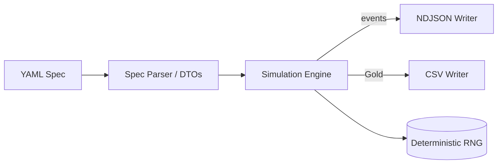

# Milestone SIM-M0 — Simulator Skeleton & Contracts

Status: IN PROGRESS (branch `milestone/m0`).

This document supersedes the earlier lightweight "M0" description and clarifies the true scope for the first simulator milestone (SIM-M0) distinct from the FlowTime engine M0. The current code base only implements an API relay CLI; the actual simulation engine (arrivals → events → Gold aggregation) is not yet present. This doc is the authoritative checklist to complete SIM-M0.

---

## Goal

Deliver a deterministic, spec‑driven local simulator that:

1. Parses a simulation scenario YAML (distinct from a FlowTime engine model).
2. Generates synthetic arrival events (constant or Poisson) for a single simple route.
3. Emits NDJSON events and an aggregated Gold CSV (Parquet deferred) matching the shared contracts.
4. Is deterministic given a `seed`.
5. Provides outputs that the future Synthetic Adapter (SYN-M0) can ingest to feed FlowTime engine models.

The existing API passthrough mode remains (so we can still call the FlowTime engine directly), but the simulator must operate with zero dependency on a running FlowTime API.

---

## Out of Scope (Deferred to later SIM milestones)

- Multi-stage routing, branching, fan‑out (SIM-M5+).
- Retries / failures / error distributions (SIM-M5).
- Multiple flow classes (EXPRESS vs STANDARD) (SIM-M6).
- PMF export mode (SIM-M2).
- Streaming playback (SIM-M3).
- Scenario overlays (surge/outage) (SIM-M4).
- Calibration / fitting from real telemetry (SIM-M7).
- Scenario catalog packaging (SIM-M8).
- Parquet writers (replaceable later; we only do CSV for Gold + NDJSON for events now).

---

## High-Level Architecture (SIM-M0)

Primary (Mermaid):



Key concepts:
- Spec: Declares grid, arrivals, route (single node), seed, and output file overrides.
- Engine: For each bin, sample arrivals → create events with timestamps → aggregate per bin into Gold rows.
- Writers: Stream events; aggregate is computed incrementally (avoid holding all events if counts are large).

---

## YAML Spec (SIM-M0 Draft)

```yaml
grid:
  bins: 24               # required > 0
  binMinutes: 60         # required > 0
  start: 2025-01-01T00:00:00Z   # optional (UTC); default: 1970-01-01T00:00:00Z
seed: 12345              # optional; default 12345
arrivals:
  kind: const | poisson  # required
  values: [10, 12, ...]   # for const; length == bins
  rate: 8.5               # for poisson (single lambda applied each bin) OR
  rates: [8,9,...]        # alt: per-bin lambda values (length == bins)
route:
  id: nodeA              # single logical node identifier
outputs:                 # optional overrides
  events: out/events.ndjson
  gold: out/gold.csv
```

Validation rules:
- Exactly one of (values) or (rate | rates) depending on kind.
- No mixing `rate` and `rates`.
- For `const`, `values.Length == bins`.
- For `rates`, `rates.Length == bins`.
- `grid.start` must parse as UTC (`DateTimeOffset` with `Z` or offset 0). Reject local/unspecified kind.

---

## Event Schema (NDJSON)

One JSON object per line, UTF-8, no outer array.

Fields (SIM-M0 minimal):
```
entity_id : string        # deterministic sequential id (e.g. "e1", "e2", ...)
event_type: string        # "arrival" (only type in SIM-M0)
ts        : string        # ISO8601 UTC timestamp (bin-aligned) e.g. 2025-01-01T03:00:00Z
node      : string        # route.id (single node)
flow      : string        # "*" (wildcard placeholder)
```

Future-reserved (not emitted yet; document for forward compatibility): `attrs`, `correlation_id`, `retry_seq`.

---

## Gold Schema (CSV)

Header:
```
timestamp,node,flow,arrivals,served,errors
```
Rows: one per bin in chronological order.

Rules:
- `timestamp` = bin start (ISO8601 UTC).
- `arrivals` = count of arrival events in that bin.
- `served` = arrivals (identity in SIM-M0; later will differ when capacity modeled).
- `errors` = 0 (constant in SIM-M0).
- `flow` = "*".

---

## Determinism Strategy

- RNG wrapper around `System.Random` seeded from `seed` (document potential future replacement with a stable algorithm if .NET changes implementation details).
- All sampling for Poisson arrivals draws from this RNG only.
- Event ordering: strictly ascending by bin, then ascending by generation index inside bin.
- Entity IDs assigned sequentially as events are generated (prefix `e` + integer) ensuring stable IDs across runs with same seed/spec.

---

## Poisson Sampling (SIM-M0 constraints)

- Default algorithm: Knuth loop (acceptable for λ <= ~1000). Document performance note; if a user supplies λ > 1000, we may log a warning (not fail) and still attempt.
- Provide unit test verifying same counts for identical seeds.

---

## CLI Behavior Changes

Two modes (explicit early to avoid ambiguity):

1. `--mode sim` (new) → treat `--model` as a simulation spec; run local generator; ignore `--flowtime` unless `--mode engine`.
2. `--mode engine` (existing behavior) → relay YAML to FlowTime API `/run` and emit series CSV/JSON (unchanged).

Planned default: remain `engine` until SIM-M0 stabilized; then flip default to `sim` (documented breaking default shift). For now we add the flag but keep default `engine`.

Output selection:
- For `--mode sim`, `--out` may specify a directory root OR explicit file; if directory, we create `<root>/events.ndjson` and `<root>/gold.csv` unless overridden by spec.outputs.
- Verbose mode prints summary: grid, total events generated, seed, first/last timestamp.

Exit codes unchanged: 0 success, 1 error, 2 usage, 130 cancel.

---

## Phased Implementation Plan

| Phase | Focus | Deliverables | Tests |
|-------|-------|--------------|-------|
| 0 | Branch & skeleton | Feature branch created; placeholder DTOs | n/a |
| 1 | Contracts & docs | `docs/contracts.md`, milestone doc updated | Doc lint (manual) |
| 2 | Spec parser | DTOs + validation errors | SpecParserTests (success + invalid cases) |
| 3 | Generators | Constant & Poisson arrival generation + RNG wrapper | ConstantGeneratorTests, PoissonDeterminismTests |
| 4 | Writers | NDJSON + Gold CSV streaming writers | NdjsonWriterTests, GoldWriterTests |
| 5 | CLI integration | `--mode sim` path, directory handling | CliSimModeTests |
| 6 | Determinism & polish | Seed determinism test, negative cases | SeedDeterminismTests, ErrorMessagesTests |
| 7 | Samples | `examples/m0.const.sim.yaml`, `examples/m0.poisson.sim.yaml` | Smoke sample test |
| 8 | Readiness for SYN-M0 | Confirm artifacts shape; finalize checklist | Parity stub (later) |

Progress tracking: mark each phase complete in this file as PRs merge.

---

## Acceptance Criteria (SIM-M0)

Checklist (must all be true for completion):

- [ ] Spec parser validates and rejects malformed specs with clear messages.
- [ ] Constant arrivals produce exactly the specified counts; Poisson variant is reproducible with same seed.
- [ ] NDJSON events file produced; each line valid JSON; total lines == total arrivals.
- [ ] Gold CSV rows == grid.bins; column aggregates match events.
- [ ] Determinism: Running twice with identical spec + seed yields byte-identical Gold CSV and NDJSON (excluding trailing newline differences allowed).
- [ ] CLI `--mode sim` operates without FlowTime API running.
- [ ] Documentation (`contracts.md`, this milestone file) explains schemas, limits, deterministic rules, and future extensions.
- [ ] Example specs run in <2s on a typical dev laptop.
- [ ] All new unit tests pass in CI.

Stretch (optional, not blocking):
- [ ] Warning surfaced when Poisson λ > 1000.
- [ ] Hash (e.g., SHA256) of outputs logged in verbose mode for reproducibility referencing.

---

## Risks & Mitigations

| Risk | Impact | Mitigation |
|------|--------|------------|
| Future RNG change in .NET | Non-determinism across versions | Abstract RNG; later swap to fixed algorithm (e.g., PCG) |
| Large λ Poisson performance | Slow generation | Document upper guidance; later optimize with transformed rejection methods |
| Output schema drift before SYN-M0 | Rework in adapter | Lock contracts in `contracts.md`; version with `schemaVersion` field later |
| Memory blow-up with huge event counts | OOM risk | Stream events while aggregating; do not cache full list |

---

## Mapping to FlowTime Engine Roadmap

- This SIM-M0 delivers synthetic inputs (Gold + events) enabling early testing for future FlowTime features (e.g., PMFs in engine M1+).
- Provides groundwork for SYN-M0 where the synthetic adapter converts NDJSON/Gold into an engine model (likely producing ConstSeries nodes initially).

---

## Current Implementation (Delta From Goal)

Already present:
- API relay CLI (engine mode).
- CSV writer for engine response.
- Basic tests (ArgParser, FlowTimeClient error surfacing, CSV writer).

Missing (to build):
- Simulation spec + parser.
- Arrivals generation logic.
- Event + Gold writers (separate from current series writer).
- CLI `--mode sim` path.
- Determinism tests & seed handling.
- Contracts documentation.

---

## How to Run (Engine Relay Mode — Existing)

Ensure FlowTime.API is running (from sibling repo flowtime-vnext):

```bash
dotnet run --project apis/FlowTime.API --urls http://0.0.0.0:8080
```

Test the FlowTime.API is responding:

```bash
curl -sS -X POST http://flowtime-api:8080/run -H 'Content-Type: text/plain' --data-binary @examples/m0.const.yaml | jq .
```

Then relay via the current CLI:

```bash
dotnet run --project src/FlowTime.Sim.Cli -- \
  --model examples/m0.const.yaml \
  --flowtime http://flowtime-api:8080 \
  --out out/m0.csv \
  --format csv
```

---

## How to Run (Simulator Mode — FUTURE once implemented)

```bash
dotnet run --project src/FlowTime.Sim.Cli -- \
  --mode sim \
  --model examples/m0.const.sim.yaml \
  --out out/m0-sim
```

Expected outputs (directory):
```
out/m0-sim/
  events.ndjson   # NDJSON arrival events
  gold.csv        # Aggregated Gold series
```

---

## Testing Strategy Summary

Unit test layers:
1. Parser tests (input validation, positive + negative).
2. Generator tests (counts, determinism, Poisson variability across seeds).
3. Writer tests (schema, line counts, header correctness).
4. CLI tests (mode dispatch, output file creation, error on missing model path).
5. Integration smoke: run a small Poisson spec (bins=3) and assert deterministic hash.

All tests must avoid time-dependent asserts (fixed start timestamps).

---

## Next After SIM-M0 (Preview)

- SIM-M1: Domain templates (logistics + transport), add service-time distributions.
- SIM-M2: PMF output mode (daily/weekly, retry kernels) + conversion utilities.
- SIM-M3: Streaming playback (time-accelerated scheduler).
- SYN-M0: Adapter ingesting NDJSON → FlowTime model (parallel once SIM-M0 contracts frozen).

---

## Revision History

| Date | Change | Author |
|------|--------|--------|
| 2025-08-27 | Expanded milestone to SIM-M0 with detailed phases and contracts | AI Assistant |


## How to run

Ensure FlowTime.API is running (from sibling repo flowtime-vnext):

```bash
# in ../flowtime-vnext
# run API on 0.0.0.0:8080 inside the devcontainer
dotnet run --project apis/FlowTime.API --urls http://0.0.0.0:8080
```

Test the FlowTime.API is responding

```bash
curl -sS -X POST http://flowtime-api:8080/run -H 'Content-Type: text/plain' --data-binary @examples/m0.const.yaml | jq . 
```

Output:
```json
{                                                                                           
  "grid": {
    "bins": 8,
    "binMinutes": 60
  },
  "order": [
    "demand",
    "served"
  ],
  "series": {
    "demand": [
      10,
      10,
      10,
      10,
      10,
      10,
      10,
      10
    ],
    "served": [
      8,
      8,
      8,
      8,
      8,
      8,
      8,
      8
    ]
  }
}
```

From this repo, run the SIM CLI:

```bash
# in flowtime-sim-vnext
dotnet run --project src/FlowTime.Sim.Cli -- \
  --model examples/m0.const.yaml \
  --flowtime http://flowtime-api:8080 \
  --out out/m0.csv \
  --format csv
```

Outputs:
- CSV header: `bin,index,<node1>,<node2>,...` ordered by `response.order`.
- Values are aligned to `response.grid.bins`.

## Notes

- Default FlowTime URL (when omitted) is `http://localhost:8080`.
- Errors from FlowTime API bubble up with the server message.
- See `.vscode/tasks.json` for build/test/run tasks.

## Next

- Async run pattern (submit/poll/result endpoint trio) in SIM-M1.
- Scenario templates and a YAML model generator.
- True ingestion (NDJSON/"Gold") in later milestone.
