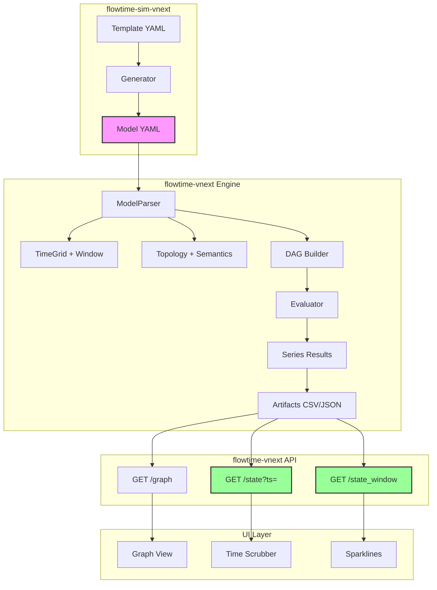
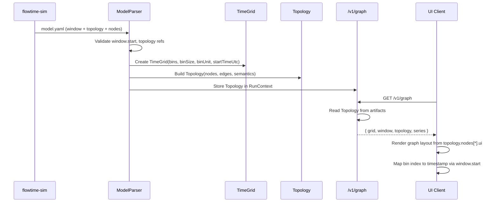
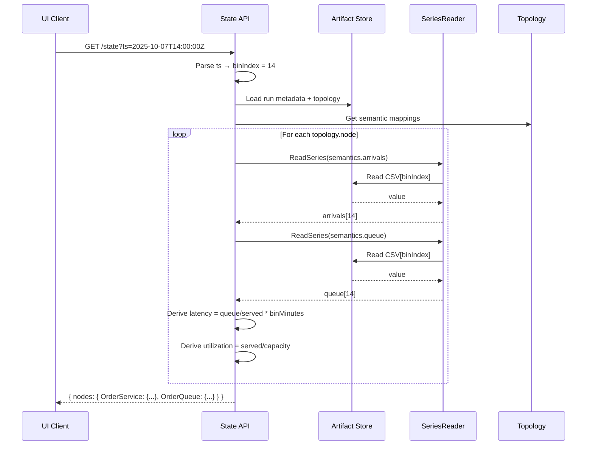
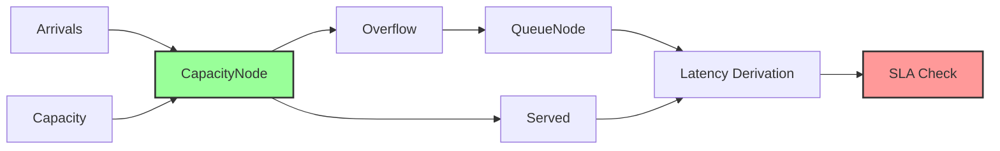
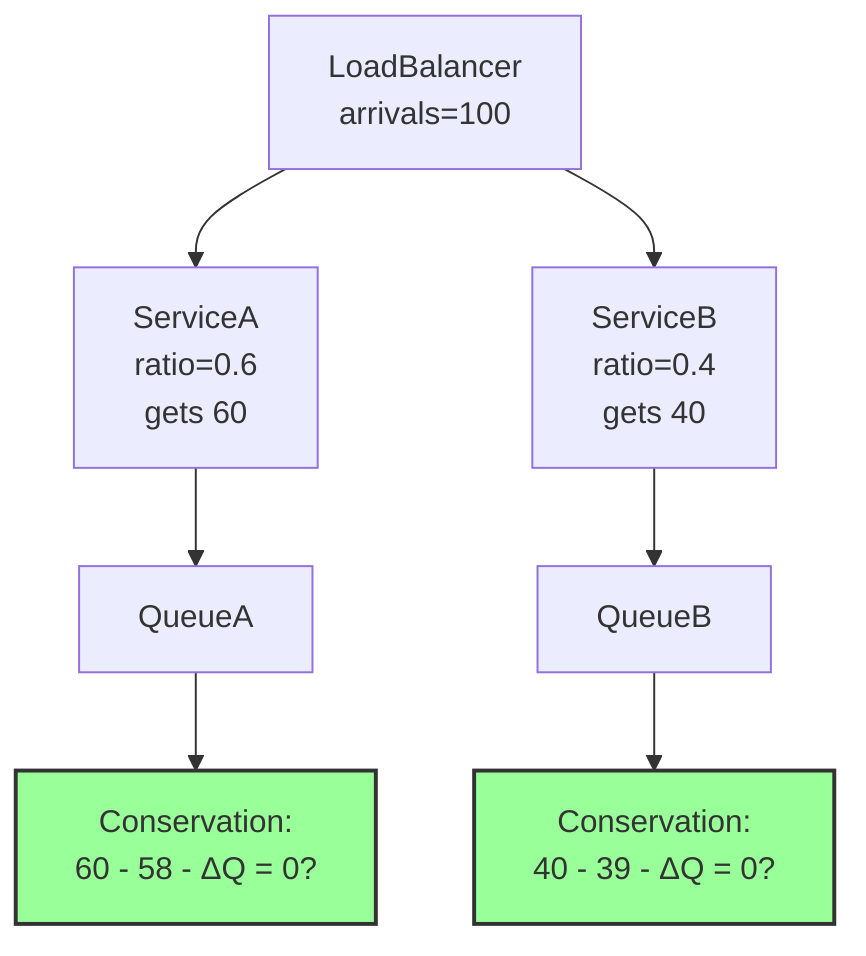
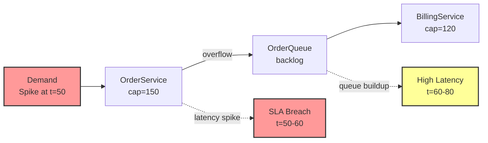
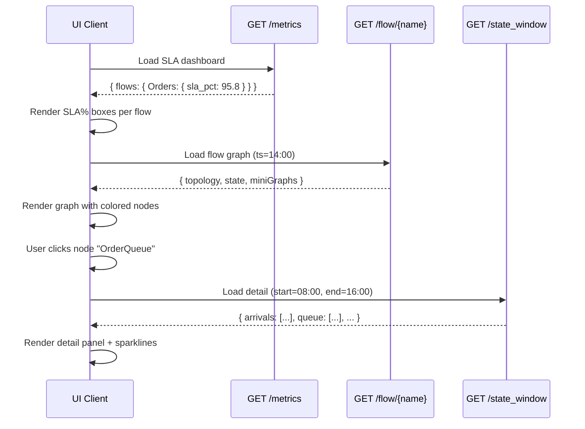

# FlowTime Time-Travel Architecture Plan

> **Archived:** Superseded by the time-travel architecture chapters and planning roadmap in `docs/architecture/time-travel/`. Retained here for historical reference.
**Date**: October 7, 2025  
**Goal**: Ship working time-travel demo in 5 incremental steps  
**Constraint**: Each step must be TDD-complete and shippable in ~1 day

---

## Design Principles

1. **Incremental**: Every priority level works end-to-end
2. **KISS**: Minimal additions, maximum leverage
3. **Series-first**: Preserve existing node evaluation model
4. **Two-repo coordination**: flowtime-sim generates, flowtime-vnext evaluates
5. **Fail-fast validation**: Strict schema checks at every boundary
6. **UTC discipline**: Absolute timestamps, no timezone ambiguity
7. **Grid ergonomics**: `binUnit` + `binSize` are source of truth; `binMinutes` is derived and exposed in all API responses
   - **Derivation**: `binMinutes = binSize × toMinutes(binUnit)` (integer)
   - **Rationale**: Clients need a single scalar for timestamp math (`t = start + idx × binMinutes`) and latency calculations (Little's Law)
   - **Invariant**: UTC + fixed grid is a Treehouse/FlowTime core constraint; exposing `binMinutes` avoids unit bugs and float drift
   - **Usage**: Gold tables are keyed on discrete bins (5m/1h/1d); clients normalize rates and derive latency using `binMinutes`

---

## Architecture Overview



---

## Priority Roadmap

| Priority | Name | Duration | Deliverable | Validates |
|----------|------|----------|-------------|-----------|
| **P0** | Foundation | 1 day | Window + Topology schema | Model can express time + topology |
| **P1** | Backlog + State | 1 day | BacklogNode + /state APIs | Time-travel works |
| **P2** | Latency + Capacity | 1 day | Latency derivation + caps | SLA metrics visible |
| **P3** | Routing + Conservation | 1 day | RouterNode + validation | Flow correctness |
| **P4** | Demo Scenario | 1 day | End-to-end demo | Ship-ready |

**Total**: 5 days, working system at each checkpoint

---

# P0: Foundation (Window + Topology Schema)

**Goal**: Extend model schema to support absolute time and topology/semantics layer

**Why**: Without this, engine can't map bin indices to UTC timestamps or know which series represent "queue" vs "arrivals"

## P0.1: Schema Additions

### flowtime-sim Model Schema v1.1

**Add three top-level sections** (backward compatible):

```yaml
schemaVersion: "1.0"
modelFormat: "1.1"  # NEW: semantic versioning for model evolution

# NEW: Absolute time anchoring
window:
  start: "2025-10-07T00:00:00Z"  # ISO-8601 UTC (bin 0 timestamp)
  timezone: "UTC"                 # MUST be UTC

# EXISTING (unchanged)
grid:
  bins: 168          # 7 days of hourly data
  binSize: 1
  binUnit: "hours"

# NEW: Flow classes (top-level, sibling to topology)
classes: ["*"]     # Single-class for P0, multi-class later

# NEW: Topology + Semantics
topology:
  nodes:
    - id: "OrderService"           # Logical node name
      kind: "service"              # {service|queue|router|external}
      group: "Orders"              # Optional UI grouping
      ports: ["in", "out"]         # Optional UI hint
      ui:                          # Optional coordinates for demo
        x: 120
        y: 260
      semantics:                   # Map meaning → series id
        arrivals: "orders_arrivals"    # REQUIRED for service/queue
        capacity: "orders_capacity"    # REQUIRED for service
        served: "orders_served"        # REQUIRED for service/queue
        errors: "orders_errors"        # OPTIONAL
        queue: null                    # null for service, REQUIRED for queue
        latency_min: null              # OPTIONAL (engine derives if absent)
        replicas: null                 # OPTIONAL (for autoscale later)
        sla_min: 5.0                   # OPTIONAL constant SLA target (minutes)
    
    - id: "OrderQueue"
      kind: "queue"
      group: "Orders"
      ports: ["in", "out", "queue"]
      ui: { x: 340, y: 260 }
      semantics:
        arrivals: "queue_inflow"
        served: "queue_outflow"
        queue: "queue_backlog"       # REQUIRED for queue kind
        q0: 0                        # OPTIONAL: initial queue state (default 0, can seed from Gold)
        oldest_age_s: null           # OPTIONAL (validation/visuals)
  
  edges:
    - id: "e1"
      from: "OrderService:out"
      to: "OrderQueue:in"
    - id: "e2"
      from: "OrderQueue:out"
      to: "BillingService:in"

# EXISTING: Series nodes (unchanged)
nodes:
  - id: orders_arrivals
    kind: const
    role: "arrivals"     # NEW: Optional hint for linting
    values: [10, 15, 12, ...]
  
  - id: orders_capacity
    kind: const
    role: "capacity"
    values: [20, 20, 20, ...]
  
  - id: orders_served
    kind: expr
    role: "served"
    expr: "MIN(orders_arrivals, orders_capacity)"
  
  - id: queue_backlog
    kind: expr
    role: "queue"
    expr: "MAX(0, SHIFT(queue_backlog, 1) + queue_inflow - billing_capacity)"
  
  - id: queue_outflow
    kind: expr
    role: "served"
    expr: "MIN(SHIFT(queue_backlog, 1) + queue_inflow, billing_capacity)"

# EXISTING: Outputs, provenance (unchanged)
outputs:
  - orders_arrivals
  - orders_served
  - queue_backlog

provenance:
  generatedAt: "2025-10-07T14:30:00Z"
  generator: "flowtime-sim"
  version: "0.8.0"
  template: "demo-system"
```

### P0.2: Validation Rules

**In flowtime-sim (generator validation)**:

```yaml
Rules:
  - window.start MUST be ISO-8601 UTC
  - window.timezone MUST be "UTC"
  - grid.bins * grid.binSize determines window.end
  - classes[] MUST be present (top-level, sibling to topology)
  - topology.nodes[*].semantics.* MUST reference existing nodes[*].id
  - topology.nodes[kind=service] MUST have: arrivals, capacity, served
  - topology.nodes[kind=queue] MUST have: arrivals, served, queue
  - topology.nodes[kind=queue] MAY have: q0 (defaults to 0)
  - topology.edges[*].from/to MUST reference topology.nodes[*].id
  - No cycles in edges (DAG validation)
  - expr nodes with SHIFT(x, n): n MUST be >= 1 (reject SHIFT(x, 0) or negative)
```

**In flowtime-vnext (engine validation)**:

```yaml
Rules:
  - Reject if window.start missing
  - Reject if window.timezone != "UTC"
  - Reject if classes[] missing or empty
  - Reject if topology.nodes[*].semantics references non-existent node
  - Warn if optional semantics (errors, replicas, q0) referenced but missing
  - Warn if modelFormat missing (default to "1.0" for backward compat)
  - Validate bins count matches all series lengths
  - Validate SHIFT(x, n) with n >= 1 (reject 0 or negative)
  - Compute conservation residual for queue nodes: |arrivals - served - ΔQ| and warn if > threshold
```

### P0.3: Engine Changes (flowtime-vnext)

**Extend TimeGrid**:

```yaml
Changes:
  - Add StartTimeUtc property (DateTime?)
  - Add GetBinTimeUtc(int binIndex) → DateTime? helper
  - Update constructor to accept startTimeUtc parameter
```

**Add Topology Model Classes**:

```yaml
New Classes:
  - TopologyDefinition (nodes, edges, classes)
  - TopologyNode (id, kind, group, ports, ui, semantics)
  - TopologyEdge (id, from, to)
  - SemanticMapping (arrivals, served, capacity, queue, errors, ...)
  - NodeKind enum (Service, Queue, Router, External)
```

**Update ModelParser**:

```yaml
Changes:
  - Parse window section → populate TimeGrid.StartTimeUtc
  - Parse topology section → build Topology graph
  - Validate semantic mappings against nodes[*].id
  - Store Topology alongside Graph for API access
```

### P0.4: API Changes (flowtime-vnext)

**Extend POST /v1/run response**:

```yaml
Before (P0):
  {
    "runId": "run_20251007T143000Z_abc123",
    "status": "completed",
    "grid": { "bins": 168, "binSize": 1, "binUnit": "hours" },
    "outputs": ["orders_arrivals", "queue_backlog"]
  }

After (P0):
  {
    "runId": "run_20251007T143000Z_abc123",
    "status": "completed",
    "grid": { 
      "bins": 168, 
      "binSize": 1, 
      "binUnit": "hours",
      "binMinutes": 60,                         # NEW: Derived (1 hour = 60 minutes)
      "startTimeUtc": "2025-10-07T00:00:00Z"  # NEW
    },
    "window": {                                  # NEW
      "start": "2025-10-07T00:00:00Z",
      "end": "2025-10-14T00:00:00Z",
      "timezone": "UTC"
    },
    "outputs": ["orders_arrivals", "queue_backlog"]
  }
```

**Extend GET /v1/graph response**:

```yaml
Before (P0):
  {
    "nodes": ["orders_arrivals", "orders_served", "queue_backlog"],
    "order": ["orders_arrivals", "orders_capacity", "orders_served", ...],
    "edges": [
      { "id": "orders_served", "inputs": ["orders_arrivals", "orders_capacity"] }
    ]
  }

After (P0):
  {
    "grid": { 
      "bins": 168, 
      "binSize": 1, 
      "binUnit": "hours",
      "binMinutes": 60,                         # NEW: Derived for client ergonomics
      "startTimeUtc": "2025-10-07T00:00:00Z"
    },
    "window": {
      "start": "2025-10-07T00:00:00Z",
      "end": "2025-10-14T00:00:00Z",
      "timezone": "UTC"
    },
    "classes": ["*"],                           # NEW: Top-level flow classes
    "topology": {                                # NEW
      "nodes": [
        {
          "id": "OrderService",
          "kind": "service",
          "group": "Orders",
          "ports": ["in", "out"],
          "ui": { "x": 120, "y": 260 },
          "semantics": {
            "arrivals": "orders_arrivals",
            "capacity": "orders_capacity",
            "served": "orders_served",
            "sla_min": 5.0
          }
        },
        {
          "id": "OrderQueue",
          "kind": "queue",
          "group": "Orders",
          "ports": ["in", "out", "queue"],
          "ui": { "x": 340, "y": 260 },
          "semantics": {
            "arrivals": "queue_inflow",
            "served": "queue_outflow",
            "queue": "queue_backlog"
          }
        }
      ],
      "edges": [
        { "id": "e1", "from": "OrderService:out", "to": "OrderQueue:in" },
        { "id": "e2", "from": "OrderQueue:out", "to": "BillingService:in" }
      ]
    },
    "series": {                                  # NEW: Series DAG (for debugging)
      "nodes": ["orders_arrivals", "orders_served", "queue_backlog"],
      "order": ["orders_arrivals", "orders_capacity", "orders_served", ...],
      "edges": [
        { "id": "orders_served", "inputs": ["orders_arrivals", "orders_capacity"] }
      ]
    }
  }
```

### P0.5: Grid Ergonomics - binMinutes Derivation

**Requirement**: Engine must derive and expose `binMinutes` as an integer scalar in all API responses.

**Source of Truth**: `binSize` + `binUnit` (expressive, version-proof)

**Derived Field**: `binMinutes = binSize × toMinutes(binUnit)`

**Conversion Table**:

```yaml
binUnit: "minutes" → toMinutes(x) = x
binUnit: "hours"   → toMinutes(x) = x × 60
binUnit: "days"    → toMinutes(x) = x × 1440
binUnit: "weeks"   → toMinutes(x) = x × 10080
```

**Examples**:

```yaml
# 5-minute bins
binSize: 5, binUnit: "minutes" → binMinutes: 5

# 1-hour bins
binSize: 1, binUnit: "hours"   → binMinutes: 60

# 1-day bins
binSize: 1, binUnit: "days"    → binMinutes: 1440
```

**Why This Matters**:

1. **Timestamp arithmetic**: Clients compute `timestamp = window.start + (binIndex × binMinutes)` without unit logic
2. **Latency derivation**: Little's Law requires `latency_min = (queue / throughput) × binMinutes`
3. **Rate normalization**: Convert bin-level counts to per-minute rates: `rate = count / binMinutes`
4. **Avoid unit bugs**: Single integer scalar prevents float drift and enum-to-minutes errors in 3+ client implementations
5. **Gold table alignment**: Treehouse Gold tables are keyed on discrete bins (5m/1h/1d); `binMinutes` matches this invariant

**API Contract**:

- `binMinutes` MUST appear in: `/v1/run`, `/v1/graph`, `/state`, `/state_window` responses
- `binMinutes` is read-only (derived)
- Clients SHOULD use `binMinutes` for all time calculations, NOT recompute from `binUnit`

**Implementation Note**: TimeGrid already computes this (TimeGrid.cs:54-75). Ensure serialization includes it in all API responses.

### P0.6: Data Flow



### P0.7: Success Criteria

- [ ] flowtime-sim can generate model with window + topology sections
- [ ] flowtime-vnext ModelParser accepts and validates new schema
- [ ] GET /v1/graph returns topology with semantics
- [ ] GET /v1/graph returns `binMinutes` as derived field
- [ ] TimeGrid.GetBinTimeUtc(42) returns correct UTC timestamp
- [ ] `binMinutes` correctly derived for all binUnit values (minutes/hours/days/weeks)
- [ ] All API responses include `binMinutes` in grid objects
- [ ] Validation rejects missing window.start or invalid semantic refs
- [ ] Existing P0 models without window/topology still work (backward compat)

### P0.8: Test Cases

**Schema Validation Tests**:
- ✅ Accept: model with valid window + topology
- ❌ Reject: window.start not ISO-8601
- ❌ Reject: window.timezone != "UTC"
- ❌ Reject: topology.nodes[*].semantics references non-existent series
- ❌ Reject: topology.nodes[kind=service] missing required semantic (capacity)
- ❌ Reject: cycle in topology.edges

**binMinutes Derivation Tests**:
- ✅ binSize=5, binUnit="minutes" → binMinutes=5
- ✅ binSize=1, binUnit="hours" → binMinutes=60
- ✅ binSize=1, binUnit="days" → binMinutes=1440
- ✅ binSize=2, binUnit="hours" → binMinutes=120
- ✅ binSize=1, binUnit="weeks" → binMinutes=10080

**API Tests**:
- ✅ POST /v1/run returns window + grid.startTimeUtc + grid.binMinutes
- ✅ GET /v1/graph returns topology with nodes/edges/semantics
- ✅ GET /v1/graph returns grid.binMinutes
- ✅ GET /v1/graph.window.start + (binIndex × binMinutes) = correct timestamp

**Backward Compatibility**:
- ✅ Models without window/topology sections still evaluate (warn + default behavior)

---

# P1: Queue Expressions + State APIs

**Goal**: Implement queue/backlog using expressions with SHIFT + time-travel state query APIs

**Why**: Core time-travel mechanic - scrub through queue/latency over time. Using expressions avoids schema churn and leverages existing expr/SHIFT infrastructure.

## P1.1: Queue Expressions with SHIFT

**Key Insight**: No new node kinds needed. Use existing `expr` + `SHIFT(x, 1)` to model queues.

**Canonical Formulas**:

**Queue level (backlog)**:
```yaml
Q[t] = MAX(0, SHIFT(Q, 1) + inflow[t] - downstream_capacity[t])
```

**Served (actual completions)**:
```yaml
served[t] = MIN(SHIFT(Q, 1) + inflow[t], downstream_capacity[t])
```

**YAML Patterns**:

```yaml
# Pattern 1: Queue with separate inflow and downstream capacity
nodes:
  - id: queue_inflow
    kind: const
    role: arrivals
    values: [150, 145, 160, ...]
  
  - id: billing_capacity
    kind: const
    role: capacity
    values: [140, 140, 140, ...]  # Downstream service capacity
  
  - id: queue_backlog
    kind: expr
    role: queue
    expr: "MAX(0, SHIFT(queue_backlog, 1) + queue_inflow - billing_capacity)"
  
  - id: queue_outflow
    kind: expr
    role: served
    expr: "MIN(SHIFT(queue_backlog, 1) + queue_inflow, billing_capacity)"
```

**Initialization**: `SHIFT(queue_backlog, 1)` at t=0 returns 0 (or `q0` from semantics if provided).

**Critical Wiring**: The `capacity` input must be the **downstream service capacity**, not the queue's outflow (which is derived). This avoids circular dependencies.

## P1.2: State API - Single Bin

**Endpoint**: `GET /v1/runs/{runId}/state?ts={timestamp}`

**Query Parameter**: `ts` = ISO-8601 timestamp (e.g., `2025-10-07T14:00:00Z`)

**Timestamp Semantics**: `ts` **MUST equal a bin start timestamp**. Reject if `ts` doesn't align with `window.start + (k × binMinutes)` for some integer k.

**Logic**:
1. Parse timestamp → find bin index via `(ts - window.start) / binMinutes`
2. Validate: `ts == window.start + (binIndex × binMinutes)`
3. For each topology.node, read semantic series at that bin index
4. Derive latency for queue nodes only: `queue[t] / max(0.001, served[t]) * binMinutes` (minutes)
5. Derive utilization: `served[t] / capacity[t]`
6. Apply capacity inference if capacity series missing:
   - If `Q[t-1] > 0`: `capacity[t] = served[t]` (binding constraint)
   - Else: `capacity[t] = smooth_envelope(served)` (piecewise max with smoothing)
7. Derive `utilization_band`: "green" (<0.7), "yellow" (0.7-0.9), "red" (≥0.9)

**Request Example**:

```http
GET /v1/runs/run_20251007T143000Z_abc123/state?ts=2025-10-07T14:00:00Z
Accept: application/json
```

**Response Example**:

```json
{
  "runId": "run_20251007T143000Z_abc123",
  "grid": {
    "bins": 168,
    "binSize": 1,
    "binUnit": "hours",
    "binMinutes": 60
  },
  "window": {
    "start": "2025-10-07T00:00:00Z",
    "end": "2025-10-14T00:00:00Z",
    "timezone": "UTC"
  },
  "bin": {
    "index": 14,
    "startUtc": "2025-10-07T14:00:00Z",
    "endUtc": "2025-10-07T15:00:00Z"
  },
  "timestamp": "2025-10-07T14:00:00Z",
  "nodes": {
    "OrderService": {
      "kind": "service",
      "arrivals": 150.0,
      "served": 145.0,
      "capacity": 200.0,
      "errors": 2.0,
      "utilization": 0.725,
      "latency_min": 0.0,
      "sla_min": 5.0,
      "sla_breach": false
    },
    "OrderQueue": {
      "kind": "queue",
      "arrivals": 145.0,
      "served": 140.0,
      "queue": 8.0,
      "capacity": 150.0,
      "latency_min": 0.057,
      "oldest_age_s": null
    }
  }
}
```

**Error Cases**:

```yaml
400 Bad Request:
  - ts parameter missing
  - ts not ISO-8601
  - ts not aligned to bin start (must equal window.start + k×binMinutes)
  - ts outside window range [window.start, window.end)

404 Not Found:
  - runId does not exist

500 Internal Server Error:
  - Semantic series missing from artifacts
```

## P1.3: State API - Window Slice

**Endpoint**: `GET /v1/runs/{runId}/state_window?start={timestamp}&end={timestamp}`

**Query Parameters**:
- `start` = ISO-8601 timestamp (inclusive, must be bin start)
- `end` = ISO-8601 timestamp (**exclusive**, must be bin start)

**Range Semantics**: [start, end) - **start inclusive, end exclusive**. This matches Kusto `bin()` and Gold binning.

**Logic**:
1. Parse timestamps → validate both align to bin starts
2. Calculate bin range: `binCount = (end - start) / binMinutes`
3. For each topology.node, read semantic series slice [startIdx : startIdx + binCount]
4. Return arrays for each metric (timestamps, arrivals, served, queue, latency, utilization, etc.)
5. Apply capacity inference and derive `utilization_band` for each bin

**Request Example**:

```http
GET /v1/runs/run_20251007T143000Z_abc123/state_window?start=2025-10-07T10:00:00Z&end=2025-10-07T16:00:00Z
Accept: application/json
```

**Response Example**:

```json
{
  "runId": "run_20251007T143000Z_abc123",
  "grid": {
    "bins": 168,
    "binSize": 1,
    "binUnit": "hours",
    "binMinutes": 60
  },
  "window": {
    "start": "2025-10-07T10:00:00Z",
    "end": "2025-10-07T16:00:00Z",
    "binCount": 6,
    "timezone": "UTC"
  },
  "nodes": {
    "OrderService": {
      "kind": "service",
      "timestamps": [
        "2025-10-07T10:00:00Z",
        "2025-10-07T11:00:00Z",
        "2025-10-07T12:00:00Z",
        "2025-10-07T13:00:00Z",
        "2025-10-07T14:00:00Z",
        "2025-10-07T15:00:00Z"
      ],
      "arrivals": [120, 135, 150, 165, 150, 140],
      "served": [120, 135, 145, 145, 145, 140],
      "capacity": [200, 200, 200, 200, 200, 200],
      "utilization": [0.60, 0.675, 0.725, 0.725, 0.725, 0.70],
      "utilization_band": ["green", "green", "yellow", "yellow", "yellow", "yellow"],
      "latency_min": [0.0, 0.0, 0.0, 0.0, 0.0, 0.0]
    },
    "OrderQueue": {
      "kind": "queue",
      "timestamps": [
        "2025-10-07T10:00:00Z",
        "2025-10-07T11:00:00Z",
        "2025-10-07T12:00:00Z",
        "2025-10-07T13:00:00Z",
        "2025-10-07T14:00:00Z",
        "2025-10-07T15:00:00Z"
      ],
      "arrivals": [120, 135, 145, 145, 145, 140],
      "served": [115, 130, 140, 140, 140, 135],
      "queue": [0, 5, 10, 15, 20, 25],
      "latency_min": [0.0, 0.038, 0.071, 0.107, 0.143, 0.185]
    }
  }
}
```

**Optimization Note**: For P1, read CSVs on demand. Add in-memory caching in P2+ if needed.

## P1.4: Data Flow



## P1.5: Success Criteria

- [ ] Queue expressions with SHIFT evaluate correctly (Q[t] = MAX(0, SHIFT(Q,1) + inflow - capacity))
- [ ] Served expressions evaluate correctly (served[t] = MIN(SHIFT(Q,1) + inflow, capacity))
- [ ] SHIFT(x, 1) at t=0 returns 0 or q0 from semantics
- [ ] GET /v1/runs/{id}/state?ts={timestamp} returns per-node state with grid/binMinutes
- [ ] GET /v1/runs/{id}/state_window returns time-series arrays with grid/binMinutes
- [ ] Timestamp → bin index conversion accurate (edge cases: start, end-exclusive)
- [ ] ts validation: must equal bin start (window.start + k×binMinutes)
- [ ] Derived metrics (latency, utilization, utilization_band) match manual calculations
- [ ] Latency only derived for queue nodes (not services)
- [ ] Capacity inference applied when capacity series missing
- [ ] Conservation residual computed and warnings logged
- [ ] 400 errors on invalid/misaligned timestamps
- [ ] 404 errors on missing runId

## P1.6: Test Cases

**Queue Expression Tests**:
- ✅ SHIFT(queue_backlog, 1) at t=0 returns 0 (or q0 if specified)
- ✅ Q[t] = MAX(0, SHIFT(Q,1) + inflow - capacity) evaluates correctly
- ✅ served[t] = MIN(SHIFT(Q,1) + inflow, capacity) evaluates correctly
- ✅ Q[t] >= 0 (no negative queues with MAX(0, ...))
- ✅ Capacity > inflow → Q[t] decreases (queue drains)
- ✅ Capacity < inflow → Q[t] increases (queue builds)
- ✅ Multi-bin evaluation with SHIFT maintains correct state
- ❌ SHIFT(x, 0) or SHIFT(x, -1) rejected by validator

**Conservation Tests**:
- ✅ Residual = |arrivals - served - ΔQ| < threshold for queue nodes
- ✅ Warning logged in run.json when residual exceeds threshold
- ✅ Conservation holds over multi-bin window

**State API Tests**:
- ✅ GET /state?ts={bin-start} returns 200 with correct binIndex + bin bounds
- ✅ Response includes grid { binMinutes, ... } and window { timezone, ... }
- ✅ Latency derived correctly for queue nodes only
- ✅ Utilization = served / capacity
- ✅ utilization_band derived: green/yellow/red
- ✅ Capacity inference: Q[t-1] > 0 → capacity = served
- ❌ GET /state?ts={not-bin-start} returns 400
- ❌ GET /state (missing ts) returns 400
- ❌ GET /state?ts={invalid-format} returns 400
- ❌ GET /state?ts={out-of-window} returns 400
- ❌ GET /state with missing runId returns 404

**State Window API Tests**:
- ✅ GET /state_window?start={s}&end={e} returns [start, end) bins
- ✅ binCount = (end - start) / binMinutes
- ✅ Response includes grid with binMinutes
- ✅ Arrays have correct length (binCount elements)
- ❌ end <= start returns 400
- ❌ start/end not aligned to bin starts returns 400

---

# P2: Latency + Capacity (Expressions Only)

**Goal**: Add latency derivation (queue nodes only) and capacity inference fallback

**Why**: SLA breach detection, saturation analysis, robust handling of incomplete telemetry

## P2.1: Latency Computation (Queue Nodes Only)

**Key Rule**: Latency represents **waiting time in queues**. Only compute for queue nodes, never for services.

**State API Logic**:

```yaml
For each topology node:
  If node.kind == "queue":
    If semantics.latency_min exists:
      latency = read series[binIndex]
    Else if semantics.queue and semantics.served exist:
      latency = queue[t] / max(0.001, served[t]) * binMinutes
    Else:
      latency = null
  Else:  # service, router, external
    latency = null  # Don't derive latency for non-queue nodes
```

**Rationale**: Service "arrivals/capacity" ratio isn't latency. Latency = time spent waiting, which only applies to queues (Little's Law: L = λW, so W = L/λ).

## P2.2: Capacity Clamp (Expression Pattern)

**Purpose**: Clamp inflow by capacity, track overflow/saturation

**Expression Patterns** (no new node kind needed):

```yaml
# Pattern: Service capacity clamp (no explicit queue)
nodes:
  - id: service_arrivals
    kind: const
    role: arrivals
    values: [250, 300, 280, ...]  # Spiky demand
  
  - id: service_capacity
    kind: const
    role: capacity
    values: [200, 200, 200, ...]  # Fixed capacity
  
  - id: service_served
    kind: expr
    role: served
    expr: "MIN(service_arrivals, service_capacity)"
  
  - id: service_overflow
    kind: expr
    role: overflow
    expr: "MAX(0, service_arrivals - service_capacity)"
```

**Use Cases**:
- Service saturates → `overflow` represents dropped requests or forwarded to queue
- Utilization = `served / capacity` shows saturation bands

**Alternative**: If overflow feeds a queue, use queue expressions from P1

## P2.3: Capacity Inference Fallback

**Problem**: Real telemetry often lacks clean capacity series (no replica count, no explicit limits)

**Solution**: Infer effective capacity from observed behavior

**Algorithm**:

```yaml
For each service/queue node with missing capacity series:
  For each bin t:
    If Q[t-1] > 0:  # Queue was non-empty
      capacity[t] = served[t]  # Binding constraint (saturated)
    Else:  # Queue was empty
      capacity[t] = smooth_envelope(served, window)  # Piecewise max with smoothing
```

**Envelope Smoothing** (simple version for P2):

```python
max_served = max(served[t-5:t+5])  # 11-bin rolling max
capacity[t] = max(max_served, served[t])  # Envelope
```

**Benefits**:
- Derived utilization/latency stay stable even without explicit capacity
- Saturation detection works (when Q > 0, we know capacity was binding)
- Warnings logged in run.json when inference is used

## P2.4: SLA Breach Detection

**In State API response**:

```json
{
  "nodes": {
    "OrderService": {
      "latency_min": 6.2,
      "sla_min": 5.0,
      "sla_breach": true,        # NEW: latency > sla_min
      "sla_headroom_min": -1.2   # NEW: sla_min - latency
    }
  }
}
```

**Calculation**:
- `sla_breach = (latency_min > sla_min)`
- `sla_headroom_min = sla_min - latency_min`

## P2.4: Data Flow



## P2.5: Success Criteria

- [ ] Latency computed correctly in /state API (Little's Law)
- [ ] CapacityNode clamps inflow and tracks overflow
- [ ] SLA breach flag accurate when latency > sla_min
- [ ] Overflow series available for inspection
- [ ] Zero division handled gracefully (epsilon)

---

# P3: Routing + Conservation + Metrics API

**Goal**: Multi-path routing (via expressions), flow conservation validation, SLA metrics aggregation API

**Why**: Distributed systems split traffic; need to validate totals match; UI needs SLA summary

## P3.1: Routing via Expressions

**Key Insight**: No RouterNode needed. Use expressions to split flows.

**Expression Patterns**:

```yaml
# Pattern: Load balancer with ratio-based routing
nodes:
  - id: lb_arrivals
    kind: const
    role: arrivals
    values: [100, 150, 120, ...]
  
  - id: to_service_a
    kind: expr
    role: arrivals
    expr: "lb_arrivals * 0.6"  # 60% to ServiceA
  
  - id: to_service_b
    kind: expr
    role: arrivals
    expr: "lb_arrivals * 0.4"  # 40% to ServiceB
```

**Future**: For conditional routing (e.g., IF/ELSE), add when expression language supports it. For P3 demo, use simple ratio splits.

**Validation** (optional for P3):
- Can add lint rule: if multiple series reference same parent with `* <ratio>`, check sum(ratios) ≈ 1.0
- Warning (not error) if sum deviates significantly

## P3.2: Conservation Check (Already in P1)

**Formula**: `arrivals[t] - served[t] - ΔQ[t] ≈ 0`

Where: `ΔQ[t] = queue[t] - queue[t-1]`

**Residual**: `residual[t] = arrivals[t] - served[t] - ΔQ[t]`

**Tolerance**: `|residual[t]| < 0.01` (configurable)

**Implementation** (from P1):
- Engine computes residual for all queue nodes automatically
- Warnings logged in `run.json` when `|residual| > threshold`
- Optional: Include `conservation.residual` in `/state` response for debugging

**P3 Focus**: Validate conservation holds across **multiple flows** in routing scenarios (e.g., LB splits to A+B, check that `lb_arrivals = to_service_a + to_service_b`)

## P3.3: Metrics API (SLA Aggregates)

**Endpoint**: `GET /v1/runs/{runId}/metrics?start={timestamp}&end={timestamp}`

**Purpose**: Aggregate SLA metrics per flow over a time window (for SLA Dashboard UI)

**Query Parameters**:
- `start` = ISO-8601 timestamp (inclusive, bin start)
- `end` = ISO-8601 timestamp (exclusive, bin start)

**Logic**:
1. For each flow (from `classes`), aggregate SLA compliance across [start, end)
2. Compute: bins_meeting_sla, bins_total, sla_pct, worst_latency, avg_latency, total_errors

**Request Example**:

```http
GET /v1/runs/run_20251007T143000Z_abc123/metrics?start=2025-10-07T00:00:00Z&end=2025-10-08T00:00:00Z
Accept: application/json
```

**Response Example**:

```json
{
  "runId": "run_20251007T143000Z_abc123",
  "grid": {
    "bins": 168,
    "binSize": 1,
    "binUnit": "hours",
    "binMinutes": 60
  },
  "window": {
    "start": "2025-10-07T00:00:00Z",
    "end": "2025-10-08T00:00:00Z",
    "binCount": 24,
    "timezone": "UTC"
  },
  "flows": {
    "Orders": {
      "sla_min": 5.0,
      "bins_meeting_sla": 23,
      "bins_total": 24,
      "sla_pct": 95.8,
      "worst_latency_min": 6.2,
      "avg_latency_min": 1.4,
      "total_errors": 12
    },
    "Billing": {
      "sla_min": 3.0,
      "bins_meeting_sla": 21,
      "bins_total": 24,
      "sla_pct": 87.5,
      "worst_latency_min": 4.5,
      "avg_latency_min": 2.1,
      "total_errors": 8
    }
  }
}
```

**Aggregation Rules**:
- `bins_meeting_sla`: count bins where `latency_min <= sla_min` for queue nodes in flow
- `sla_pct = 100.0 * bins_meeting_sla / bins_total`
- `worst_latency_min = max(latency_min)` across all queue nodes in flow
- `avg_latency_min = mean(latency_min)` across all queue nodes in flow
- `total_errors = sum(errors)` across all nodes in flow

## P3.4: Data Flow



## P3.5: Success Criteria

- [ ] Routing via expressions works (e.g., `lb_arrivals * 0.6`)
- [ ] Optional validation: warn if routing ratios don't sum to ~1.0
- [ ] Conservation residuals computed per bin for all queue nodes
- [ ] Warnings logged when |residual| > tolerance
- [ ] GET /v1/runs/{id}/metrics returns SLA aggregates per flow
- [ ] /metrics response includes grid/binMinutes and bin bounds
- [ ] bins_meeting_sla and sla_pct calculated correctly
- [ ] worst_latency_min and avg_latency_min aggregated correctly

---

# P4: Demo Scenario

**Goal**: End-to-end time-travel demo with realistic scenario

**Why**: Validate entire stack, prepare for UI integration

## P4.1: Demo Topology

**Scenario**: Order processing system with queue backlog

```yaml
System:
  - OrderService (service)
    - Normal load: 100 req/h
    - Spike at t=50: 300 req/h (3x)
    - Capacity: 150 req/h
  
  - OrderQueue (queue)
    - Receives overflow from OrderService
    - Capacity: 120 req/h
  
  - BillingService (service)
    - Processes from OrderQueue
    - Capacity: 120 req/h
```

**Expected Behavior**:
- **t=0-49**: Normal operation, no queue buildup
- **t=50-59**: Spike causes OrderService saturation → overflow to queue
- **t=60-80**: Queue drains slowly, latency elevated
- **t=81+**: Back to normal



## P4.2: Demo Model Template

**File**: `flowtime-sim-vnext/templates/demo-time-travel.yaml`

```yaml
schemaVersion: "1.0"
modelFormat: "1.1"

window:
  start: "2025-10-07T00:00:00Z"
  timezone: "UTC"

grid:
  bins: 168
  binSize: 1
  binUnit: "hours"

topology:
  classes: ["*"]
  
  nodes:
    - id: "OrderService"
      kind: "service"
      group: "Orders"
      ui: { x: 100, y: 200 }
      semantics:
        arrivals: "orders_demand"
        capacity: "orders_capacity"
        served: "orders_served"
        errors: "orders_errors"
        sla_min: 5.0
    
    - id: "OrderQueue"
      kind: "queue"
      group: "Orders"
      ui: { x: 300, y: 200 }
      semantics:
        arrivals: "queue_inflow"
        served: "queue_outflow"
        queue: "queue_backlog"
    
    - id: "BillingService"
      kind: "service"
      group: "Billing"
      ui: { x: 500, y: 200 }
      semantics:
        arrivals: "billing_arrivals"
        capacity: "billing_capacity"
        served: "billing_served"
        sla_min: 3.0
  
  edges:
    - { id: "e1", from: "OrderService:out", to: "OrderQueue:in" }
    - { id: "e2", from: "OrderQueue:out", to: "BillingService:in" }

nodes:
  # Demand with spike (const vector - no t/AND operators needed)
  - id: orders_demand
    kind: const
    role: arrivals
    # 168 hourly bins: bins 0-49 = 100, bins 50-59 = 300 (spike), bins 60-167 = 100
    values: >-
      [100]*50 + [300]*10 + [100]*108
    # Note: flowtime-sim generator can expand this notation, or emit full array
  
  # Service capacity
  - id: orders_capacity
    kind: const
    role: capacity
    values: >-
      [150]*168
  
  # Served = min(demand, capacity) - using expr, not capacity node
  - id: orders_served
    kind: expr
    role: served
    expr: "MIN(orders_demand, orders_capacity)"
  
  # Queue inflow = overflow from OrderService
  - id: queue_inflow
    kind: expr
    role: arrivals
    expr: "MAX(0, orders_demand - orders_capacity)"
  
  # Billing capacity (downstream capacity for queue)
  - id: billing_capacity
    kind: const
    role: capacity
    values: >-
      [120]*168
  
  # Queue backlog (stateful) - using expr with SHIFT
  - id: queue_backlog
    kind: expr
    role: queue
    expr: "MAX(0, SHIFT(queue_backlog, 1) + queue_inflow - billing_capacity)"
  
  # Queue outflow (derived from backlog + inflow, clamped by downstream capacity)
  - id: queue_outflow
    kind: expr
    role: served
    expr: "MIN(SHIFT(queue_backlog, 1) + queue_inflow, billing_capacity)"
  
  # Billing receives queue outflow
  - id: billing_arrivals
    kind: expr
    role: arrivals
    expr: "queue_outflow"
  
  # Billing served (clamped by capacity)
  - id: billing_served
    kind: expr
    role: served
    expr: "MIN(billing_arrivals, billing_capacity)"

outputs:
  - orders_demand
  - orders_served
  - queue_backlog
  - billing_served
```

## P4.3: Demo Verification Steps

**1. Generate Model**:

```bash
cd /workspaces/flowtime-sim-vnext
dotnet run --project src/FlowTime.Sim.Cli -- \
  --template templates/demo-time-travel.yaml \
  --out demo-spike.yaml
```

**2. Run Model**:

```bash
cd /workspaces/flowtime-vnext
curl -X POST http://localhost:8080/v1/run \
  -H "Content-Type: text/plain" \
  -d @demo-spike.yaml
```

**3. Query State at Spike**:

```bash
curl "http://localhost:8080/v1/runs/{runId}/state?ts=2025-10-07T50:00:00Z"
```

**Expected Output**:

```json
{
  "binIndex": 50,
  "nodes": {
    "OrderService": {
      "arrivals": 300.0,
      "served": 150.0,
      "capacity": 150.0,
      "utilization": 1.0,
      "sla_breach": true
    },
    "OrderQueue": {
      "queue": 150.0,
      "latency_min": 1.25
    }
  }
}
```

**4. Query Window (Spike Recovery)**:

```bash
curl "http://localhost:8080/v1/runs/{runId}/state_window?start=2025-10-07T45:00:00Z&end=2025-10-07T85:00:00Z"
```

**Expected**: Queue builds from 0 → 150 at t=50-59, then drains to 0 by t=85

## P4.4: Success Criteria

- [ ] Demo model generates without errors (no t/AND operators, only const vectors)
- [ ] Spike at bins 50-59 causes queue buildup (using expr with SHIFT)
- [ ] /state?ts={spike-time} shows saturation + SLA breach + utilization_band=red
- [ ] /state_window shows queue ramp-up and drain-down over [45, 85)
- [ ] Conservation residuals near zero throughout (validated automatically)
- [ ] Latency correlates with queue depth (Little's Law)
- [ ] /metrics aggregates SLA correctly over spike window
- [ ] All API responses include grid.binMinutes
- [ ] Capacity inference applied where capacity series missing (warnings logged)
- [ ] UI can render graph + scrub timeline (manual verification)

---

## Implementation Checklist

### P0: Foundation
- [ ] **flowtime-sim**: Add window, topology, classes to schema
- [ ] **flowtime-sim**: Implement template generator for topology
- [ ] **flowtime-sim**: Add validation rules (window.start, semantic refs)
- [ ] **flowtime-vnext**: Extend TimeGrid with StartTimeUtc
- [ ] **flowtime-vnext**: Add Topology model classes
- [ ] **flowtime-vnext**: Update ModelParser for window + topology
- [ ] **flowtime-vnext**: Extend /v1/graph response with topology
- [ ] **flowtime-vnext**: Extend /v1/run response with window
- [ ] **Tests**: Schema validation (10 tests)
- [ ] **Tests**: API responses (5 tests)

### P1: Queue Expressions + State
- [ ] **flowtime-vnext**: Support SHIFT(x, n) in expressions (n > 0)
- [ ] **flowtime-vnext**: Validate SHIFT self-references (reject n <= 0)
- [ ] **flowtime-vnext**: Parse and evaluate expr nodes with SHIFT
- [ ] **flowtime-vnext**: Implement q0 (initial queue state) semantics
- [ ] **flowtime-vnext**: Implement GET /v1/runs/{id}/state (with grid, bin bounds)
- [ ] **flowtime-vnext**: Implement GET /v1/runs/{id}/state_window (with grid)
- [ ] **flowtime-vnext**: Timestamp → bin index conversion (validate ts = bin start)
- [ ] **flowtime-vnext**: Derive latency for queue nodes in state API
- [ ] **flowtime-vnext**: Add utilization_band calculation (green/yellow/red)
- [ ] **flowtime-vnext**: Implement conservation check (arrivals - served - ΔQ)
- [ ] **Tests**: SHIFT expression tests (self-ref, reject n<=0) (4 tests)
- [ ] **Tests**: Conservation residual tests (3 tests)
- [ ] **Tests**: State API integration tests (grid, bin bounds, ts validation) (10 tests)
- [ ] **Tests**: State window API tests (end-exclusive ranges, binCount) (6 tests)
- [ ] **Tests**: Bin alignment edge cases (2 tests)

### P2: Latency Derivation + Capacity Inference
- [ ] **flowtime-vnext**: Implement capacity inference (Q[t-1] > 0 → capacity = served)
- [ ] **flowtime-vnext**: Implement smooth envelope fallback (piecewise max)
- [ ] **flowtime-vnext**: Clarify latency only for queue nodes (not service nodes)
- [ ] **flowtime-vnext**: Add SLA breach detection to state API
- [ ] **flowtime-vnext**: Add sla_headroom calculation
- [ ] **flowtime-vnext**: Add sla_min to node metadata
- [ ] **Tests**: Capacity inference tests (binding constraint, envelope) (5 tests)
- [ ] **Tests**: SLA breach tests (3 tests)
- [ ] **Tests**: Latency derivation for queues only (2 tests)

### P3: Routing Expressions + Conservation
- [ ] **flowtime-vnext**: Validate routing expr patterns (arrivals * ratio)
- [ ] **flowtime-vnext**: Add routing ratio validation (sum of ratios = 1)
- [ ] **flowtime-vnext**: Add conservation residual to state API response
- [ ] **flowtime-vnext**: Implement GET /v1/runs/{id}/metrics (SLA aggregates)
- [ ] **flowtime-vnext**: Add per-flow and per-node SLA% calculation
- [ ] **Tests**: Routing expression tests (5 tests)
- [ ] **Tests**: Conservation residual in API response (4 tests)
- [ ] **Tests**: /metrics API tests (aggregates, per-flow) (6 tests)

### P4: Demo
- [ ] **flowtime-sim**: Create demo-time-travel.yaml template (expr-based nodes)
- [ ] **flowtime-sim**: Generate spike scenario model (const vector, no t/AND)
- [ ] **flowtime-vnext**: Run demo model end-to-end
- [ ] **Manual**: Verify /state at spike (bins 50-59) shows saturation
- [ ] **Manual**: Verify /state_window shows queue dynamics (end-exclusive ranges)
- [ ] **Manual**: Verify conservation residuals logged
- [ ] **Manual**: Verify capacity inference triggers during spike
- [ ] **Docs**: Write demo README with curl commands (include /metrics)

---

## Risk Mitigation

### High Risk
- **Timestamp → bin index edge cases**: Test window boundaries, timezone mismatches
- **Stateful node evaluation order**: BacklogNode must evaluate after dependencies
- **Conservation tolerance**: May need adjustment based on real data

### Medium Risk
- **CSV read performance**: Monitor state_window with large bins (1000+)
- **Schema backward compatibility**: Ensure old models still work

### Low Risk
- **UI coordinate layout**: Can hardcode for demo, defer to layout engine later

---

## UI Contract: Time-Travel Visualization APIs

This section defines the API surface needed for time-travel UI visualizations. For detailed UX specs, see `UI-VISUALIZATIONS.md`.

### Required UI Views

1. **SLA% Dashboard**: Per-flow SLA compliance over time window
2. **Flow Graph**: Topology with colored nodes (by latency/SLA breach)
3. **Node Details**: Per-bin metrics (latency, queue, arrivals, served, utilization, errors)
4. **Mini Graphs**: Sparklines showing metric trends per node

### API: GET /v1/runs/{runId}/metrics

**Purpose**: Aggregate metrics for SLA dashboard and flow-level summaries

**Query Parameters**:
- `start` (ISO-8601): Window start timestamp
- `end` (ISO-8601): Window end timestamp
- `flow` (optional): Filter by flow name

**Response**:

```json
{
  "runId": "run_20251007T143000Z_abc123",
  "window": {
    "start": "2025-10-07T00:00:00Z",
    "end": "2025-10-07T23:59:59Z",
    "binCount": 24
  },
  "flows": {
    "Orders": {
      "sla_pct": 95.8,
      "bins_meeting_sla": 23,
      "bins_total": 24,
      "bins_breaching_sla": 1,
      "worst_latency_min": 6.2,
      "avg_latency_min": 1.4,
      "total_arrivals": 3450,
      "total_served": 3380,
      "total_errors": 12,
      "peak_queue": 45,
      "nodes": {
        "OrderService": {
          "sla_pct": 100.0,
          "sla_min": 5.0,
          "bins_meeting_sla": 24,
          "worst_latency_min": 2.1,
          "avg_latency_min": 0.8
        },
        "OrderQueue": {
          "sla_pct": 91.7,
          "sla_min": 3.0,
          "bins_meeting_sla": 22,
          "worst_latency_min": 6.2,
          "avg_latency_min": 2.1
        }
      }
    }
  }
}
```

**Calculation Rules**:

```yaml
Per Node:
  sla_pct = (bins_meeting_sla / bins_total) × 100
  bins_meeting_sla = COUNT(latency_min[t] <= sla_min)
  worst_latency_min = MAX(latency_min[t])
  avg_latency_min = AVG(latency_min[t])

Per Flow:
  sla_pct = MIN(node.sla_pct for node in flow)  # Worst node determines flow SLA
  total_arrivals = SUM(node.arrivals[t] for all t, all nodes)
  peak_queue = MAX(node.queue[t] for all t, all nodes)
```

**Implementation**: P2 (after /state_window exists)

---

### API: GET /v1/runs/{runId}/flow/{flowName}

**Purpose**: Flow topology with per-node current state (for graph coloring)

**Query Parameters**:
- `ts` (ISO-8601): Timestamp for node state snapshot
- `window_start`, `window_end` (optional): For mini-graph data

**Response**:

```json
{
  "runId": "run_20251007T143000Z_abc123",
  "flow": "Orders",
  "timestamp": "2025-10-07T14:00:00Z",
  "binIndex": 14,
  "topology": {
    "nodes": [
      {
        "id": "OrderService",
        "kind": "service",
        "group": "Orders",
        "ui": { "x": 120, "y": 260 },
        "state": {
          "arrivals": 150,
          "served": 145,
          "capacity": 200,
          "errors": 2,
          "utilization": 0.725,
          "latency_min": 0.5,
          "sla_min": 5.0,
          "sla_breach": false,
          "color": "green"
        },
        "miniGraph": {
          "metric": "latency_min",
          "bins": [0.3, 0.5, 0.8, 1.2, 0.9, 0.5, 0.4],
          "timestamps": [
            "2025-10-07T08:00:00Z",
            "2025-10-07T09:00:00Z",
            "2025-10-07T10:00:00Z",
            "2025-10-07T11:00:00Z",
            "2025-10-07T12:00:00Z",
            "2025-10-07T13:00:00Z",
            "2025-10-07T14:00:00Z"
          ]
        }
      },
      {
        "id": "OrderQueue",
        "kind": "queue",
        "group": "Orders",
        "ui": { "x": 340, "y": 260 },
        "state": {
          "arrivals": 145,
          "served": 140,
          "queue": 25,
          "capacity": 150,
          "latency_min": 10.7,
          "sla_min": 3.0,
          "sla_breach": true,
          "color": "red"
        },
        "miniGraph": {
          "metric": "queue",
          "bins": [0, 5, 10, 18, 25, 22, 25],
          "timestamps": ["..."]
        }
      }
    ],
    "edges": [
      {
        "id": "e1",
        "from": "OrderService",
        "to": "OrderQueue",
        "flow_rate": 145.0
      }
    ]
  }
}
```

**Color Rules** (suggested, UI can override):

```yaml
Node Coloring by SLA:
  green:  latency <= sla_min
  yellow: sla_min < latency <= sla_min * 1.5
  red:    latency > sla_min * 1.5

Node Coloring by Utilization:
  green:  utilization < 0.7
  yellow: 0.7 <= utilization < 0.9
  red:    utilization >= 0.9
```

**Implementation**: P2 (reuses /state + /state_window data)

---

### API Enhancement: /state_window with Aggregates

**Add optional `aggregate` parameter** to existing `/state_window` endpoint:

**Request**:
```http
GET /v1/runs/{runId}/state_window?start=2025-10-07T00:00:00Z&end=2025-10-07T23:59:59Z&aggregate=true
```

**Response** (with aggregates added):

```json
{
  "runId": "run_20251007T143000Z_abc123",
  "window": {
    "start": "2025-10-07T00:00:00Z",
    "end": "2025-10-07T23:59:59Z",
    "binCount": 24
  },
  "nodes": {
    "OrderService": {
      "kind": "service",
      "timestamps": ["2025-10-07T00:00:00Z", "2025-10-07T01:00:00Z", ...],
      "arrivals": [120, 135, 150, ...],
      "served": [120, 135, 145, ...],
      "latency_min": [0.3, 0.5, 0.8, ...],
      "aggregates": {
        "arrivals_total": 3450,
        "arrivals_avg": 143.75,
        "arrivals_max": 180,
        "served_total": 3380,
        "latency_min_avg": 0.8,
        "latency_min_max": 2.1,
        "sla_pct": 100.0,
        "bins_meeting_sla": 24
      }
    }
  }
}
```

**Implementation**: P2 (compute during /state_window query)

---

### Data Flow for UI



---

### UI Implementation Priorities

**P1 (Core Time-Travel)**:
- Time scrubber (bin slider)
- Single-bin state view (`GET /state?ts=`)
- Flow graph with basic coloring

**P2 (SLA Dashboard)**:
- `GET /metrics` endpoint
- SLA% boxes per flow
- Per-node SLA% in graph

**P3 (Rich Visualization)**:
- Mini graphs per node (sparklines)
- `GET /flow/{name}` with mini-graph data
- Node detail panel with full time series

**P4 (Polish)**:
- Animation (play/pause through time)
- Compare mode (baseline vs scenario)
- Export views (PNG, PDF)

---

**For detailed UX specs**, see `UI-VISUALIZATIONS.md` (to be created)

---

## Future Extensions (Post-P4)

### Engine Purity Principle

**Core Invariant**: FlowTime engine remains pure (spreadsheet-like, deterministic, expression-based). All data source complexity lives in **adapters** that generate model.yaml.

```
┌─────────────────────────────────────┐
│  Data Sources (Outside Engine)     │
│  • Gold Tables (NodeTimeBin)        │
│  • Sim Templates                    │
│  • Hand-written YAML                │
└─────────────┬───────────────────────┘
              │
              ↓
┌─────────────────────────────────────┐
│  Adapters (Outside Engine)          │
│  • GoldToModelAdapter               │
│  • TemplateGenerator (sim)          │
│  • OverlayMerger                    │
└─────────────┬───────────────────────┘
              │
              ↓ (Always model.yaml)
┌─────────────────────────────────────┐
│  FlowTime Engine (PURE)             │
│  • Parse model.yaml                 │
│  • Build series DAG                 │
│  • Evaluate expressions             │
│  • Write artifacts                  │
│  NO telemetry awareness             │
│  NO mode switching                  │
└─────────────────────────────────────┘
```

### P5: GoldToModelAdapter (Telemetry Analysis)

**Purpose**: Convert Treehouse Gold tables to model.yaml for engine evaluation

**Location**: `FlowTime.Adapters.Gold` (new project, outside Core)

**Input**:
- Gold tables: `NodeTimeBin(flow, node, time_bin, arrivals, served, errors, capacity_proxy, backlog_est, latency_p50, latency_p95)`
- Catalog: `Catalog_Nodes(node_id, flow, kind, group, ui_x, ui_y)`
- Time window: `(start_time, end_time, bin_unit)`

**Output**: `model.yaml` with:
- `window.start` from query start time
- `topology.nodes` from Catalog
- `nodes[*]` as `const` kind with `values` from Gold columns
- Derived `expr` nodes for computed metrics (utilization, latency if missing)

**Example Transformation**:

```yaml
# Input: Gold Query Result
# NodeTimeBin WHERE flow='Orders' AND node='OrderService'
# time_bin | arrivals | served | capacity_proxy | backlog_est
#    0     |   120    |  115   |      200       |      5
#    1     |   135    |  130   |      200       |     10

# Output: model.yaml
window:
  start: "2025-10-07T00:00:00Z"
  timezone: "UTC"

grid:
  bins: 168
  binSize: 1
  binUnit: "hours"
  binMinutes: 60

topology:
  nodes:
    - id: "OrderService"
      kind: "service"
      catalog: { flow: "Orders", node: "OrderService" }  # From Catalog
      semantics:
        arrivals: "orders_svc_arrivals_gold"
        served: "orders_svc_served_gold"
        capacity: "orders_svc_capacity_gold"
        queue: "orders_svc_queue_gold"
        latency_min: "orders_svc_latency_derived"  # Computed by engine

nodes:
  # From Gold columns (const nodes)
  - id: orders_svc_arrivals_gold
    kind: const
    role: "arrivals"
    values: [120, 135, ...]  # From Gold.arrivals
  
  - id: orders_svc_served_gold
    kind: const
    role: "served"
    values: [115, 130, ...]  # From Gold.served
  
  - id: orders_svc_capacity_gold
    kind: const
    role: "capacity"
    values: [200, 200, ...]  # From Gold.capacity_proxy
  
  - id: orders_svc_queue_gold
    kind: const
    role: "queue"
    values: [5, 10, ...]  # From Gold.backlog_est
  
  # Derived by engine (expr nodes) - SPREADSHEET-LIKE!
  - id: orders_svc_latency_derived
    kind: expr
    role: "latency"
    expr: "orders_svc_queue_gold / MAX(0.001, orders_svc_served_gold) * 60"
  
  - id: orders_svc_utilization
    kind: expr
    expr: "orders_svc_served_gold / orders_svc_capacity_gold"
```

**Key Insight**: Engine computes derived metrics (latency, utilization) even though base facts came from Gold. All computations remain visible and reproducible.

**Benefits**:
- ✅ Engine stays pure (no Gold schema knowledge)
- ✅ Spreadsheet-like transparency preserved
- ✅ Can re-evaluate if Gold values change
- ✅ Derived metrics computable via expressions
- ✅ Time-travel UI works identically (reads artifacts)

**Effort**: 8-10 hours
- Define Gold schema types
- Implement catalog reader
- Generate const nodes from columns
- Generate derived expr nodes
- Write integration tests

---

### P8: OverlayMerger (Scenario Analysis)

**Purpose**: Merge Gold baseline with scenario changes for what-if analysis

**Location**: `FlowTime.Adapters.Overlay` (new project, outside Core)

**Input**:
- `baseline.yaml`: Generated by GoldToModelAdapter (real telemetry)
- `overlay.yaml`: Scenario changes (capacity adjustments, routing changes)

**Output**: `merged.yaml` with:
- Baseline series (const nodes with `_baseline` suffix)
- Scenario series (expr nodes with `_scenario` suffix)
- Comparison series (expr nodes with `_delta`, `_improvement_pct` suffixes)

**Example Overlay**:

```yaml
# overlay.yaml (scenario definition)
scenario:
  name: "2x_capacity"
  description: "What if we doubled OrderService capacity?"
  window:
    start: "2025-10-07T00:00:00Z"
    bins: 168
  changes:
    - node: "OrderService"
      field: "capacity"
      operation: "multiply"
      factor: 2.0
```

**Generated Merged Model**:

```yaml
nodes:
  # Baseline (from Gold)
  - id: demand_baseline
    kind: const
    values: [150, 180, 200, 220, ...]
  
  - id: capacity_baseline
    kind: const
    values: [200, 200, 200, 200, ...]
  
  - id: served_baseline
    kind: const
    values: [145, 180, 180, 180, ...]  # From Gold (saturated)
  
  - id: queue_baseline
    kind: const
    values: [0, 5, 20, 40, ...]  # From Gold
  
  # Scenario (computed by engine)
  - id: capacity_scenario
    kind: expr
    expr: "capacity_baseline * 2"  # 2x capacity (400)
  
  - id: served_scenario
    kind: expr
    expr: "MIN(demand_baseline, capacity_scenario)"  # No saturation
  
  - id: queue_scenario
    kind: expr
    expr: "MAX(0, SHIFT(queue_scenario, 1) + demand_baseline - served_scenario)"
    q0: 0  # Initial queue state
  
  - id: latency_scenario
    kind: expr
    expr: "queue_scenario / MAX(0.001, served_scenario) * 60"
  
  # Comparison (delta metrics)
  - id: served_delta
    kind: expr
    expr: "served_scenario - served_baseline"
  
  - id: served_improvement_pct
    kind: expr
    expr: "(served_delta / MAX(0.001, served_baseline)) * 100"
  
  - id: queue_reduction
    kind: expr
    expr: "queue_baseline - queue_scenario"
  
  - id: latency_improvement_min
    kind: expr
    expr: "latency_baseline - latency_scenario"

topology:
  nodes:
    - id: "OrderService"
      semantics:
        arrivals: "demand_baseline"
        capacity_baseline: "capacity_baseline"
        capacity_scenario: "capacity_scenario"
        served_baseline: "served_baseline"
        served_scenario: "served_scenario"
        queue_baseline: "queue_baseline"
        queue_scenario: "queue_scenario"
```

**State API Response** (with comparison):

```json
{
  "runId": "scenario_2x_capacity_abc123",
  "scenario": {
    "name": "2x_capacity",
    "baseline": "gold_20251007_baseline"
  },
  "timestamp": "2025-10-07T14:00:00Z",
  "nodes": {
    "OrderService": {
      "baseline": {
        "served": 180,
        "queue": 20,
        "latency_min": 6.67
      },
      "scenario": {
        "served": 200,
        "queue": 0,
        "latency_min": 0.0
      },
      "delta": {
        "served_improvement": 20,
        "served_improvement_pct": 11.1,
        "queue_reduction": 20,
        "latency_improvement_min": 6.67
      }
    }
  }
}
```

**Key Insight**: Engine evaluates scenario changes as pure expressions. Overlay adapter generates the comparison DAG, but engine just sees `expr` nodes.

**Benefits**:
- ✅ Engine stays pure (no overlay logic)
- ✅ Scenario changes are expressions (transparent)
- ✅ Can stack multiple overlays (overlay of overlay)
- ✅ Reproducible ("re-run scenario X on date Y")
- ✅ UI can scrub through scenario timeline

**Effort**: 6-8 hours
- Define overlay schema
- Implement node rewriting (baseline → scenario)
- Generate comparison expr nodes
- Handle topology updates
- Write integration tests

---

### P9+: Additional Node Types

Once adapters prove the architecture, add these to engine (as new node kinds):

- **P9**: Multi-class flows (replace classes: ["*"] with ["Order", "Refund"])
  - Node outputs become `[class, t]` arrays
  - Expressions handle class dimension
  
- **P10**: Retry/delay nodes (convolution kernels)
  - `RetryNode(errors, retry_kernel)` → future arrivals
  - `DelayNode(series, delay_kernel)` → shifted distribution
  
- **P11**: Autoscale nodes (threshold policies)
  - `AutoscaleNode(utilization, target, lag_bins, cooldown_bins)` → replicas
  - `CapacityNode(replicas, cap_per_replica)` → total capacity
  
- **P12**: Finite buffers + DLQ (queue caps + spill)
  - `BacklogNode` with `qcap` and `abandon_after_min`
  - `DlqNode` receives spill from capped queues

**All remain pure**: Just new expression node types, no mode switching

---

### Adapter Architecture Benefits

**For Engine**:
- ✅ Single evaluation model (no conditionals)
- ✅ Testable in isolation (unit tests with model.yaml)
- ✅ No external dependencies (no Gold client, no telemetry SDK)
- ✅ Complexity stays O(nodes × bins)

**For Adapters**:
- ✅ Independent evolution (Gold schema changes don't break engine)
- ✅ Composable (chain adapters: Gold → Overlay → Engine)
- ✅ Testable separately (adapter tests don't need engine)
- ✅ Multiple implementations (CSV adapter, Parquet adapter, API adapter)

**For Users**:
- ✅ Same time-travel UI for all data sources (sim, Gold, overlays)
- ✅ Can save and share scenarios (model.yaml is portable)
- ✅ Audit trail (model.yaml shows exact inputs and computations)
- ✅ Reproducible analysis ("re-run this exact scenario")

---

## Appendix: Key Files

### flowtime-sim-vnext
- `schemas/model-v1.1.yaml` - Extended schema definition
- `src/FlowTime.Sim.Core/ModelGenerator.cs` - Add topology generation
- `src/FlowTime.Sim.Core/Validation.cs` - Add window + topology validation
- `templates/demo-time-travel.yaml` - Demo scenario template

### flowtime-vnext
- `src/FlowTime.Core/TimeGrid.cs` - Add StartTimeUtc property
- `src/FlowTime.Core/Models/Topology.cs` - NEW: Topology model classes
- `src/FlowTime.Core/Models/ModelParser.cs` - Parse window + topology + classes
- `src/FlowTime.Core/Expressions/ShiftFunction.cs` - NEW: SHIFT(x, n) support
- `src/FlowTime.Core/Expressions/ExpressionValidator.cs` - Validate SHIFT self-refs
- `src/FlowTime.Core/Evaluation/ConservationCheck.cs` - NEW: Residual calculation
- `src/FlowTime.Core/Evaluation/CapacityInference.cs` - NEW: Infer capacity from binding
- `src/FlowTime.API/Program.cs` - Add /state, /state_window, /metrics endpoints
- `tests/FlowTime.Core.Tests/Expressions/ShiftTests.cs` - NEW
- `tests/FlowTime.Core.Tests/Evaluation/ConservationTests.cs` - NEW
- `tests/FlowTime.API.Tests/StateApiTests.cs` - NEW

---

**End of Plan**
