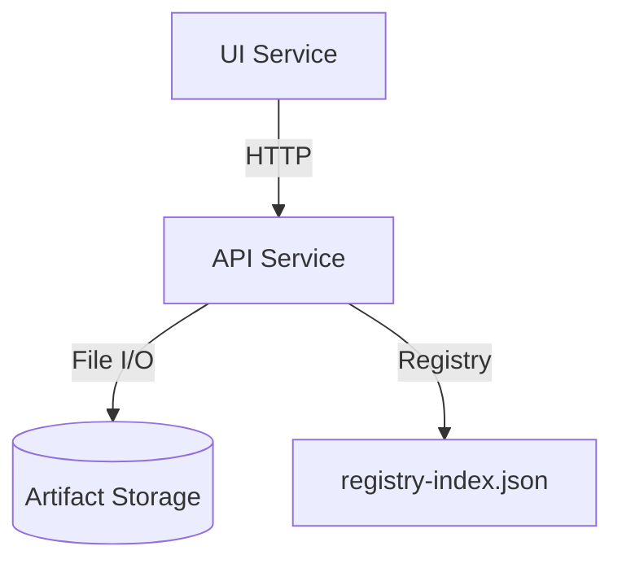
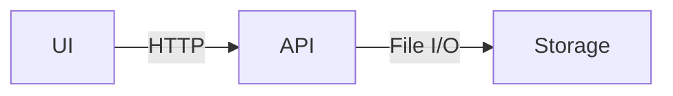

# Milestone Documentation Guide

**Purpose:** Establish clear standards for milestone documentation to ensure consistency, completeness, and actionability.

---

## Core Principles

### 1. Milestone as Foundation
The milestone document is the **authoritative specification** for a feature or capability. It must be:
- **Self-contained**: Sufficient to understand requirements without external context
- **Implementation-ready**: Provides enough detail to create an implementation plan
- **Test-driven**: Enables creation of comprehensive TDD plan before implementation

### 2. No Time Estimates
**NEVER include time estimates** in milestone documents.

❌ **Prohibited:**
- "Estimated Effort: 2-4 hours"
- "Timeline: 1 week"
- "Duration: 3 days"

✅ **Allowed:**
- Dependency sequences ("Phase 1 before Phase 2")
- Relative complexity ("High complexity area")
- Scope boundaries ("In scope", "Out of scope")

**Rationale:** Time estimates age poorly, create false expectations, and distract from actual requirements.

### 3. Living Documents
Milestones evolve through these states:
- **📋 Planned** - Initial draft, requirements gathering
- **🔄 In Progress** - Implementation underway, tracking document active
- **✅ Complete** - Delivered, tracked in release notes

---

## Required Structure

### Header Block

```markdown
# [Milestone ID] — [Title]

**Status:** [📋 Planned | 🔄 In Progress | ✅ Complete]  
**Dependencies:** [List milestones that must complete first]  
**Target:** [One-sentence goal]

---
```

**Milestone ID Format:**
- Engine: `M-XX.XX` (e.g., `M-02.10`)
- FlowTime.Sim: `SIM-M-XX.XX` (e.g., `SIM-M-03.00`)
- FlowTime.UI: `UI-M-XX.XX` (e.g., `UI-M-02.09`)
- Other surfaces (CLI, tooling) inherit the Engine or Sim prefix that owns the work; avoid creating new prefixes unless coordinated with architecture.

**Example:**
```markdown
# UI-M-02.09 — Schema Migration for UI

**Status:** 📋 Planned  
**Dependencies:** ✅ M-02.09 (Engine Schema Evolution)  
**Target:** Update UI to parse new schema format (binSize/binUnit)

---
```

### Section 1: Overview

**Purpose:** High-level summary accessible to non-technical stakeholders

**Required content:**
- **What** - One paragraph describing the capability
- **Why** - Strategic context and motivation
- **Impact** - What changes for users/developers

**Template:**
```markdown
## Overview

[One paragraph describing the capability and its value]

### Strategic Context
- **Motivation**: [Why this milestone exists]
- **Impact**: [What changes]
- **Dependencies**: [What must exist first]
```

### Section 2: Scope

**Purpose:** Clear boundaries prevent scope creep

**Required subsections:**
- **In Scope ✅** - What THIS milestone delivers
- **Out of Scope ❌** - What is explicitly NOT included
- **Future Work** - What comes later (optional)

**Template:**
```markdown
## Scope

### In Scope ✅
1. [Specific deliverable]
2. [Specific deliverable]

### Out of Scope ❌
- ❌ [Explicitly excluded item]
- ❌ [Explicitly excluded item]

### Future Work (Optional)
- [Related work for later milestones]
```

### Section 3: Requirements

**Purpose:** Functional and non-functional requirements in testable format

**Structure:**
```markdown
## Requirements

### Functional Requirements

#### FR1: [Requirement Name]

**Description:** [What the system must do]

**Acceptance Criteria:**
- [ ] [Testable criterion]
- [ ] [Testable criterion]

**Examples:** (Code blocks with expected behavior)

**Error Cases:** (What happens when things go wrong)

### Non-Functional Requirements

#### NFR1: [Requirement Name]

**Target:** [Measurable goal]
**Validation:** [How to verify]
```

### Section 4: Technical Design (Optional)

**Purpose:** Architecture decisions and technical approach

**Use when:**
- New subsystem or component
- Complex integration
- Performance-sensitive implementation

**Structure:**
```markdown
## Technical Design

### Architecture Decisions

**Decision:** [What was decided]
**Rationale:** [Why this approach]
**Alternatives Considered:** [What was rejected and why]

### Component Diagram

```mermaid
[Mermaid diagram showing system structure]
```

### Data Flow

```mermaid
[Mermaid sequence diagram showing interactions]
```
```

### Section 5: Implementation Plan

**Purpose:** Phase-by-phase breakdown of work

**Critical TDD Reminder:** Each phase must make it obvious which tests are written first (RED), followed by implementation (GREEN) and refactor steps. Call out the RED → GREEN → REFACTOR cadence explicitly so implementers can follow it.

**Structure:**
```markdown
## Implementation Plan

### Phase 1: [Phase Name]

**Goal:** [What this phase achieves]

**Tasks:**
1. [Specific task]
2. [Specific task]

**Deliverables:**
- [Concrete output]
- [Concrete output]

**Success Criteria:**
- [ ] [How to know phase is complete]

### Phase 2: [Phase Name]
[Repeat structure]
```

### Section 6: Test Plan

**Purpose:** Comprehensive testing strategy before implementation

**Required content:**
- Test categories
- Specific test cases
- Coverage targets
- TDD approach

**Template:**
```markdown
## Test Plan

### Test-Driven Development Approach

**Strategy:** [RED → GREEN → REFACTOR workflow]

### Test Categories

#### Unit Tests
**Focus:** [What to test in isolation]

**Key Test Cases:**
1. `Test_[Behavior]_[Scenario]_[ExpectedResult]()`
   - **Setup:** [Initial state]
   - **Action:** [What happens]
   - **Assert:** [Expected outcome]

#### Integration Tests
[Repeat structure]

### Test Coverage Goals
- **Unit Tests:** [Coverage statement, not percentage]
- **Integration Tests:** [Coverage statement]
- **E2E Tests:** [Critical workflows]
```

### Section 7: Success Criteria

**Purpose:** Clear definition of "done"

**Structure:**
```markdown
## Success Criteria

### Milestone Complete When:
- [ ] All functional requirements implemented
- [ ] All tests passing (unit + integration)
- [ ] Documentation updated
- [ ] Examples working
- [ ] Breaking changes documented
- [ ] Release notes prepared

### Per-Phase Criteria

#### Phase 1 Complete ✅
- [x] [Completed item]
- [x] [Completed item]

#### Phase 2 Complete 📋
- [ ] [Pending item]
- [ ] [Pending item]
```

### Section 8: File Impact Summary

**Purpose:** Help developers locate relevant code

**Structure:**
```markdown
## File Impact Summary

### Files to Create
- `path/to/NewFile.cs` - [Purpose]

### Files to Modify (Major Changes)
- `path/to/ExistingFile.cs` - [What changes]

### Files to Modify (Minor Changes)
- `path/to/AnotherFile.cs` - [What changes]

### Files to Deprecate/Delete
- `path/to/LegacyFile.cs` - [Reason]
```

### Section 9: Migration Guide (Breaking Changes Only)

**Include when:** Milestone introduces breaking changes

**Structure:**
```markdown
## Migration Guide

### Breaking Changes
1. **[Change Description]**
   - **Old Behavior:** [What used to work]
   - **New Behavior:** [What now works]
   - **Migration Path:** [How to update code]

### Backward Compatibility
[What remains compatible]

### Deprecation Timeline
[If phased deprecation]
```

---

## Graphics and Diagrams

### Preferred: Mermaid Diagrams

**Use Mermaid for:**
- Architecture diagrams
- Sequence diagrams
- State machines
- Flowcharts

**Example:**
```markdown
### System Architecture


\```

### Avoid: ASCII Art

❌ **Don't use ASCII boxes/diagrams** - they age poorly and are hard to maintain

❌ Example of what NOT to do:
```
+-------+     +-------+
|  UI   | --> |  API  |
+-------+     +-------+


✅ **Use Mermaid instead** - easier to read and maintain

---

## Implementation Tracking

### Separate Tracking Document

**When:** Created when work branch is created (first step of implementation)  
**Where:** `docs/milestones/tracking/[MILESTONE-ID]-tracking.md`  
**Purpose:** Real-time progress log updated with each commit  
**Created by:** Developer starting the milestone work  
**Template:** [`docs/development/TEMPLATE-tracking.md`](TEMPLATE-tracking.md)

**IMPORTANT RULES for Tracking Documents:**

✅ **DO:**
- Copy phase/task structure from milestone document
- Use actual milestone content (no placeholders like `[Phase Name]`)
- Status indicators: ⏳ Not Started, 🔄 In Progress, ✅ Complete
- Track actual progress with commits and test results
- Update after meaningful progress
- **Follow TDD order:** List tests FIRST in task checklists

❌ **DON'T:**
- Include template instructions or notes in the final document
- Use placeholder text like `[YYYY-MM-DD]` or `[Task Name]`
- Add date headers until you actually work on that date
- Include "Assignee" field (Git tracks this)
- Copy the template's help text into tracking document
- **List implementation before tests** in task checklists

**TDD Workflow (Critical):**

All task checklists MUST follow this order:

1. ✅ **Write unit tests FIRST** (RED - failing tests)
2. ✅ **Implement code** (GREEN - make tests pass)
3. ✅ **Verify functionality**

❌ **WRONG Order:**
```markdown
- [ ] Update class definition
- [ ] Add computed property
- [ ] Write unit test  ← TOO LATE!
```

✅ **CORRECT Order:**
```markdown
- [ ] Write unit test: `Test_Feature` (RED - failing)
- [ ] Update class definition (GREEN - make test pass)
- [ ] Add computed property (GREEN - make test pass)
```

**Clean Structure Example:**
```markdown
# UI-M-02.09 Implementation Tracking

**Milestone:** UI-M-02.09 — Schema Migration for UI  
**Status:** 🔄 In Progress  
**Branch:** `feature/ui-m2.9/schema-migration`

---

## Quick Links

- **Milestone Document:** [`docs/milestones/UI-M-02.09.md`](../UI-M-02.09.md)
- **Related Analysis:** [`docs/ui/UI-CURRENT-STATE-ANALYSIS.md`](../../ui/UI-CURRENT-STATE-ANALYSIS.md)

---

## Current Status

### Overall Progress
- [ ] Phase 1: Critical Schema Fixes (0/3 tasks)
- [ ] Phase 2: UI Page Display Updates (0/3 tasks)

### Test Status
- **Unit Tests:** 0 passing / 0 total (TBD)
- **Integration Tests:** 0 passing / 0 total (TBD)

---

## Progress Log

### Session: Milestone Setup

**Preparation:**
- [x] Read milestone document
- [x] Create feature branch
- [x] Create tracking document

**Next Steps:**
- [ ] Begin Phase 1: Critical Schema Fixes

---

## Phase 1: Critical Schema Fixes

**Goal:** Restore basic UI functionality by fixing deserialization failures

### Task 1.1: Update SimGridInfo Model

**File:** `ui/FlowTime.UI/Services/FlowTimeSimApiClient.cs`

**Checklist:**
- [ ] Update SimGridInfo class definition
- [ ] Add computed BinMinutes property
- [ ] Write unit test: `Test_SimGridInfo_Deserializes_NewSchema`

**Status:** ⏳ Not Started
```

### Update Frequency

**Update tracking document:**
- ✅ After each commit that advances the milestone
- ✅ When tests pass/fail
- ✅ When encountering blockers
- ✅ When completing a phase

**Don't update:**
- ❌ For unrelated commits
- ❌ For trivial typo fixes (unless in milestone scope)

---

## Examples of Good Milestones

### Simple Milestone
See: [`docs/milestones/M-02.10.md`](../milestones/M-02.10.md)
- ✅ Clear scope (provenance queries)
- ✅ Specific API/CLI requirements
- ✅ Test cases included
- ⚠️ Remove time estimate (violates rule)

### Complex Milestone
See: [`docs/milestones/M-02.09.md`](../milestones/M-02.09.md)
- ✅ Multi-phase implementation
- ✅ TDD approach documented
- ✅ Comprehensive test plan
- ✅ Architecture decisions

### UI Milestone
See: [`docs/milestones/UI-M-02.09.md`](../milestones/UI-M-02.09.md)
- ⚠️ Needs update (outdated schema assumptions)
- ⚠️ Remove date stamp
- ⚠️ Remove time estimates

---

## Checklist for Milestone Authors

Before marking a milestone as "📋 Planned":

- [ ] Header block complete (Status, Dependencies, Target)
- [ ] Overview section explains strategic context
- [ ] Scope clearly defines in/out of scope
- [ ] Functional requirements are testable
- [ ] Implementation plan has concrete phases
- [ ] Test plan enables TDD approach
- [ ] Success criteria are measurable
- [ ] File impact summary helps developers
- [ ] **NO time estimates anywhere**
- [ ] Graphics use Mermaid (not ASCII art)
- [ ] Migration guide included (if breaking changes)

When starting implementation:

- [ ] Create feature branch following naming convention
- [ ] Create tracking document from template [`docs/development/TEMPLATE-tracking.md`](TEMPLATE-tracking.md) → `docs/milestones/tracking/[MILESTONE-ID]-tracking.md` (first commit)
  - **IMPORTANT:** Remove all template instructions and placeholders
  - Use actual phase/task names from milestone document
  - NO dates until you actually work on them
  - NO "Assignee" field (Git tracks this)
  - **TDD Order:** Task checklists must list tests FIRST, then implementation
  - See updated tracking document rules above
- [ ] Create TDD plan in tracking document (based on test plan from milestone)
- [ ] Write failing tests (RED state) based on TDD plan **BEFORE any implementation code**
- [ ] Implement code to make tests pass (GREEN state)
- [ ] Update milestone status to "🔄 In Progress"
- [ ] Update ROADMAP.md status to "🔄 In Progress"

---

## Anti-Patterns to Avoid

### ❌ Time Estimates
```markdown
**Estimated Effort:** 2-4 hours  ← NEVER DO THIS
```

### ❌ Vague Requirements
```markdown
FR1: Make the system faster  ← NOT TESTABLE
```
✅ **Better:**
```markdown
FR1: Query Performance
- API response time < 200ms for 1000 artifacts
- Measured with benchmark tests
```

### ❌ Missing Scope
```markdown
## Overview
We need to add provenance support.
```
✅ **Better:**
```markdown
## Scope

### In Scope ✅
- API query parameters for templateId/modelId
- CLI commands for provenance queries

### Out of Scope ❌
- ❌ Comparison workflows
- ❌ UI integration
```

### ❌ ASCII Art Diagrams
```markdown
UI --> API --> Storage  ← HARD TO MAINTAIN
```
✅ **Better:**


---

## Questions and Answers

**Q: Should milestone docs include dates?**  
A: Only completion dates for historical milestones (✅ Complete status). Don't include target dates for planned work.

**Q: How detailed should test cases be?**  
A: Detailed enough to write the test before implementation. Include setup, action, and expected outcome.

**Q: Can I reference external documents?**  
A: Yes, but milestone must be self-contained. External docs supplement, don't replace.

**Q: What if requirements change during implementation?**  
A: Update the milestone document AND note the change in tracking document. Milestone stays authoritative.

**Q: Should I include performance benchmarks?**  
A: Yes, in NFR section with measurable targets (e.g., "< 200ms" not "fast").

---

## Document History

| Version | Date | Changes |
|---------|------|---------|
| 1.0 | 2025-10-06 | Initial guide based on existing milestone patterns |

---

**Related Documents:**
- [Branching Strategy](branching-strategy.md)
- [Release Ceremony](release-ceremony.md)
- [Versioning Strategy](versioning.md)
- [Copilot Instructions](../../.github/copilot-instructions.md)
