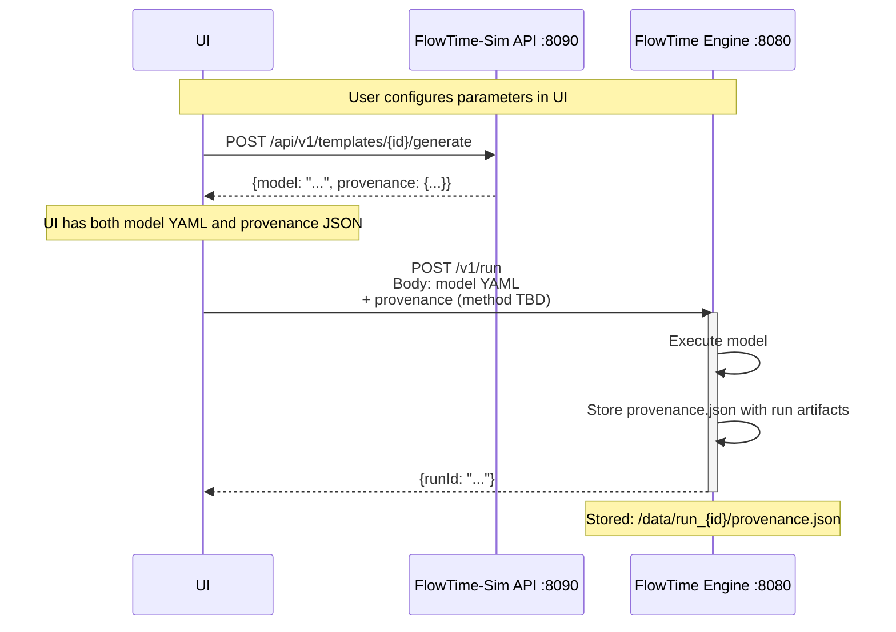

# FlowTime Engine M2.9 - Provenance Integration Specification

**From**: FlowTime-Sim Team  
**To**: FlowTime Engine Team  
**Date**: October 2, 2025  
**Milestone**: SIM-M2.7 (Complete) → Engine M2.9 (Pending)  
**Status**: 🟢 Ready for Integration

---

## Executive Summary

**FlowTime-Sim M2.7 is complete** and now generates provenance metadata for every model. Engine M2.9 needs to accept and store this provenance to enable complete traceability from template → model → run.

**What Sim Provides**: Model YAML + provenance metadata (JSON)  
**What Engine Needs**: Accept provenance, store with run artifacts, enable queries  
**Integration Point**: UI orchestrates (calls Sim, then Engine)

---

## Provenance Metadata Schema

### JSON Structure (Schema Version 1)

```json
{
  "source": "flowtime-sim",
  "modelId": "model_20251002T103045Z_a3f8c2d1",
  "templateId": "transportation-basic",
  "templateVersion": "1.0",
  "templateTitle": "Transportation Network",
  "parameters": {
    "bins": 12,
    "binSize": 1,
    "binUnit": "hours",
    "demandPattern": [20, 30, 40, 35, 25, 15]
  },
  "generatedAt": "2025-10-02T10:30:45.1234567Z",
  "generator": "flowtime-sim/0.5.0",
  "schemaVersion": "1"
}
```

### Field Specifications

| Field | Type | Required | Description |
|-------|------|----------|-------------|
| `source` | string | Yes | Always `"flowtime-sim"` for Sim-generated models |
| `modelId` | string | Yes | Unique identifier: `model_{timestamp}_{hash}` |
| `templateId` | string | Yes | Source template identifier (e.g., `"transportation-basic"`) |
| `templateVersion` | string | Yes | Template version (currently `"1.0"`) |
| `templateTitle` | string | Yes | Human-readable template name |
| `parameters` | object | Yes | Parameters used for generation (empty `{}` if defaults) |
| `generatedAt` | string | Yes | ISO8601 UTC timestamp with subsecond precision |
| `generator` | string | Yes | Format: `"flowtime-sim/{version}"` |
| `schemaVersion` | string | Yes | Provenance schema version (currently `"1"`) |

**Field Naming**: camelCase (standard for JSON APIs)

---

## Model ID Format

**Pattern**: `model_{timestamp}_{hash}`

**Example**: `model_20251002T103045Z_a3f8c2d1`

**Components**:
- `model_` - Fixed prefix
- `{timestamp}` - UTC ISO8601 basic format (YYYYMMDDTHHmmssZ)
- `{hash}` - First 8 hex characters of SHA-256 hash

**Hash Calculation**:
```
Input: "{templateId}:{sortedParametersJson}"
Example: "transportation-basic:{\"bins\":12,\"seed\":42}"
Algorithm: SHA-256
Output: First 8 hex characters (lowercase)
```

**Properties**:
- **Uniqueness**: Timestamp ensures global uniqueness
- **Determinism**: Same template + parameters = same hash portion
- **Traceability**: Can track multiple runs of same configuration
- **Culture-invariant**: Uses InvariantCulture throughout

---

## Integration Workflow



---

## What Engine Needs to Implement

### Milestone Scope

**M2.9 (Current):**
- ✅ Accept provenance via HTTP header (full JSON)
- ✅ Accept provenance via embedded YAML
- ✅ Store provenance.json with run artifacts
- ✅ Update registry index with basic provenance reference

**M2.10 (Future):**
- ⏳ Query by source, templateId, modelId parameters
- ⏳ Dedicated `/v1/artifacts/{runId}/provenance` endpoint
- ⏳ Enhanced registry index with provenance metadata

---

### 1. Accept Provenance Metadata (M2.9)

**Option A: HTTP Header** (Recommended)
```http
POST /v1/run
Content-Type: application/x-yaml
X-Model-Provenance: {"source":"flowtime-sim","modelId":"model_20251002T103045Z_a3f8c2d1","templateId":"transportation-basic","templateVersion":"1.0","templateTitle":"Transportation Network","parameters":{"bins":12},"generatedAt":"2025-10-02T10:30:45.123Z","generator":"flowtime-sim/0.5.0","schemaVersion":"1"}

<model YAML in body>
```

**Note:** The header contains the **complete provenance JSON object** as a single-line string.

**Option B: Multipart Request**
```http
POST /v1/run
Content-Type: multipart/form-data

--boundary
Content-Disposition: form-data; name="model"; filename="model.yaml"
Content-Type: application/x-yaml

<model YAML>

--boundary
Content-Disposition: form-data; name="provenance"; filename="provenance.json"
Content-Type: application/json

<provenance JSON>
```

**Option C: Extract from Embedded YAML**

If UI sends model with embedded provenance (generated via `?embed_provenance=true`):

```yaml
schemaVersion: 1

provenance:
  source: flowtime-sim
  modelId: model_20251002T103045Z_a3f8c2d1
  templateId: transportation-basic
  # ... rest of provenance ...

grid:
  bins: 12
  # ... rest of model ...
```

Engine extracts `provenance` section before execution.

**Implementation Decision (M2.9)**: Engine supports **both Option A and Option C**:
- **Option A (Header):** Best for UI orchestration - clean API calls with metadata separate from model
- **Option C (Embedded):** Best for file-based workflows - self-contained model files  
- Header takes precedence if both present (with warning logged)
- Either approach is optional (backward compatible with runs that have no provenance)

---

### 2. Store Provenance with Run Artifacts (M2.9)

**File Structure**:
```
/data/
├── run_20251002T104530Z_abc123/
│   ├── manifest.json          # Existing
│   ├── spec.yaml              # Existing (the model)
│   ├── provenance.json        # NEW - store provenance here
│   ├── run.json               # Existing (telemetry)
│   └── series/                # Existing
```

**provenance.json Contents**: Exact JSON received from Sim (via header or extracted from YAML)

---

### 3. Update Registry Index (M2.9 - Basic, M2.10 - Enhanced)

**Enhance `registry-index.json`** to include provenance metadata:

```json
{
  "artifacts": [
    {
      "id": "run_20251002T104530Z_abc123",
      "type": "run",
      "created": "2025-10-02T10:45:30Z",
      "source": "flowtime-sim",
      "metadata": {
        "modelId": "model_20251002T103045Z_a3f8c2d1",
        "templateId": "transportation-basic",
        "templateVersion": "1.0",
        "templateTitle": "Transportation Network",
        "parameters": {
          "bins": 12,
          "binSize": 1,
          "binUnit": "hours"
        }
      }
    }
  ]
}
```

**New Fields**:
- `source`: `"flowtime-sim"` for Sim-generated models
- `metadata.modelId`: Model identifier from provenance
- `metadata.templateId`: Template identifier
- `metadata.templateVersion`: Template version
- `metadata.templateTitle`: Human-readable name
- `metadata.parameters`: Parameters used for generation

---

### 4. Support Provenance Queries (M2.10 - Future Enhancement)

**API Endpoints** (M2.10 planned enhancements):

**Note:** These query capabilities are planned for Engine M2.10. In M2.9, use the existing `/v1/artifacts` endpoint with general search/filter parameters.

```bash
# Get all Sim-generated runs (M2.10)
GET /v1/artifacts?source=flowtime-sim

# Get runs from specific template
GET /v1/artifacts?templateId=transportation-basic

# Get runs with specific model ID (exact reproduction)
GET /v1/artifacts?modelId=model_20251002T103045Z_a3f8c2d1

# Get provenance for specific run
GET /v1/artifacts/{runId}/provenance
# Returns: provenance.json contents
```

**Query Use Cases**:
- "Show me all runs from the transportation-basic template"
- "Find runs that used bins=12"
- "Compare runs with different parameters from same template"
- "Reproduce exact model configuration"

---

## Integration Testing

### Test Scenario 1: Separate Provenance (Header)

```bash
# 1. Generate model from Sim
curl -X POST http://localhost:8090/api/v1/templates/transportation-basic/generate \
  -H "Content-Type: application/json" \
  -d '{"bins": 12, "binSize": 1, "binUnit": "hours"}' \
  -o response.json

# Extract model and provenance
MODEL=$(jq -r '.model' response.json)
PROVENANCE=$(jq -c '.provenance' response.json)

# 2. Send to Engine with provenance header
curl -X POST http://localhost:8080/v1/run \
  -H "Content-Type: application/x-yaml" \
  -H "X-Model-Provenance: $PROVENANCE" \
  --data-binary "$MODEL"

# 3. Verify provenance was stored
RUN_ID="<runId from response>"
curl http://localhost:8080/v1/artifacts/$RUN_ID/provenance
# Should return the same provenance JSON
```

### Test Scenario 2: Embedded Provenance

```bash
# 1. Generate model with embedded provenance
curl -X POST http://localhost:8090/api/v1/templates/transportation-basic/generate?embed_provenance=true \
  -H "Content-Type: application/json" \
  -d '{"bins": 12}' \
  | jq -r '.model' > model-with-provenance.yaml

# 2. Send to Engine (no header needed)
curl -X POST http://localhost:8080/v1/run \
  -H "Content-Type: application/x-yaml" \
  --data-binary @model-with-provenance.yaml

# 3. Verify Engine extracted and stored provenance
curl http://localhost:8080/v1/artifacts/$RUN_ID/provenance
```

### Test Scenario 3: Query by Template

```bash
# Generate and run multiple models from same template with different parameters
for BINS in 6 12 24; do
  curl -X POST http://localhost:8090/api/v1/templates/transportation-basic/generate \
    -H "Content-Type: application/json" \
    -d "{\"bins\": $BINS}" | jq -r '.model' | \
    curl -X POST http://localhost:8080/v1/run \
      -H "Content-Type: application/x-yaml" \
      --data-binary @-
done

# Query all runs from this template
curl "http://localhost:8080/v1/artifacts?templateId=transportation-basic"
# Should return 3 runs with different parameters
```

---

## Validation Checklist

### Engine M2.9 Implementation (Current Milestone)

- [ ] Accept provenance via HTTP header (full JSON object)
- [ ] Accept provenance via embedded YAML
- [ ] Store `provenance.json` in run artifacts directory
- [ ] Handle missing provenance gracefully (backward compatibility)
- [ ] Validate `schemaVersion` field
- [ ] Use camelCase for all provenance fields
- [ ] Support `templateTitle` field
- [ ] Log warning when both header and embedded provenance present

### Engine M2.10 Implementation (Future Milestone)

- [ ] Update registry index with full provenance metadata
- [ ] Support query by `source=flowtime-sim`
- [ ] Support query by `templateId`
- [ ] Support query by `modelId`
- [ ] Add `/v1/artifacts/{runId}/provenance` endpoint

### Integration Testing

- [ ] End-to-end test: Sim → UI → Engine → Storage
- [ ] Verify provenance.json file created
- [ ] Verify registry index includes provenance metadata
- [ ] Test query endpoints work correctly
- [ ] Test with empty parameters (`{}`)
- [ ] Test with complex parameters (nested objects, arrays)
- [ ] Test schema version validation
- [ ] Test backward compatibility (runs without provenance)

---

## Schema Evolution

**Current**: Schema Version 1

All provenance includes `"schemaVersion": "1"`.

**Future Considerations**:
- If schema evolves, `schemaVersion` will increment (e.g., `"2"`)
- Backward compatibility maintained where possible
- Breaking changes documented in release notes

**Engine Should**:
- Store `schemaVersion` field
- Validate against known schema versions
- Handle unknown versions gracefully (log warning, don't reject)

---

## Timeline and Coordination

**Current Status**:
- ✅ **SIM-M2.7 Complete** (October 2, 2025)
- ⏳ **Engine M2.9 Pending** (your milestone)
- ⏳ **UI Integration** (after Engine M2.9)

**Integration Approach**:
1. **Engine implements** provenance acceptance and storage
2. **Integration testing** between Sim and Engine (direct API calls)
3. **UI updates** to orchestrate workflow
4. **End-to-end validation**

**Communication**:
- Sim team ready to support integration testing
- Provenance format is stable (schema version 1)
- Questions? Reference: `docs/architecture/model-lifecycle.md` in flowtime-sim-vnext repo

---

## Example: Complete Provenance Flow

### 1. UI Calls Sim

```http
POST /api/v1/templates/transportation-basic/generate
Content-Type: application/json

{
  "bins": 12,
  "binSize": 1,
  "binUnit": "hours",
  "demandPattern": [20, 30, 40, 35, 25, 15]
}
```

**Sim Response**:
```json
{
  "model": "schemaVersion: 1\n\ngrid:\n  bins: 12\n  binSize: 1\n  binUnit: hours\n\narrivals:\n  kind: const\n  values: [20, 30, 40, 35, 25, 15]\n\nroute:\n  id: TRANSPORT_NODE",
  "provenance": {
    "source": "flowtime-sim",
    "modelId": "model_20251002T103045Z_a3f8c2d1",
    "templateId": "transportation-basic",
    "templateVersion": "1.0",
    "templateTitle": "Transportation Network",
    "parameters": {
      "bins": 12,
      "binSize": 1,
      "binUnit": "hours",
      "demandPattern": [20, 30, 40, 35, 25, 15]
    },
    "generatedAt": "2025-10-02T10:30:45.1234567Z",
    "generator": "flowtime-sim/0.5.0",
    "schemaVersion": "1"
  }
}
```

### 2. UI Calls Engine

```http
POST /v1/run
Content-Type: application/x-yaml
X-Model-Provenance: {"source":"flowtime-sim","modelId":"model_20251002T103045Z_a3f8c2d1","templateId":"transportation-basic","templateVersion":"1.0","templateTitle":"Transportation Network","parameters":{"bins":12,"binSize":1,"binUnit":"hours","demandPattern":[20,30,40,35,25,15]},"generatedAt":"2025-10-02T10:30:45.1234567Z","generator":"flowtime-sim/0.5.0","schemaVersion":"1"}

schemaVersion: 1

grid:
  bins: 12
  binSize: 1
  binUnit: hours

arrivals:
  kind: const
  values: [20, 30, 40, 35, 25, 15]

route:
  id: TRANSPORT_NODE
```

**Engine Response** (M2.9 actual format):
```json
{
  "grid": {
    "bins": 12,
    "binMinutes": 60
  },
  "order": ["TRANSPORT_NODE"],
  "series": {
    "TRANSPORT_NODE": [20, 30, 40, 35, 25, 15, 0, 0, 0, 0, 0, 0]
  },
  "runId": "run_20251002T104530Z_b2c4d6e8",
  "artifactsPath": "/data/run_20251002T104530Z_b2c4d6e8",
  "modelHash": "sha256:a1b2c3d4..."
}
```

**Note:** Engine returns execution results along with run metadata. The `runId` and `artifactsPath` enable subsequent artifact queries.

### 3. Engine Storage

```
/data/run_20251002T104530Z_b2c4d6e8/
├── manifest.json
├── spec.yaml              # The model
├── provenance.json        # NEW - from X-Model-Provenance header
├── run.json               # Telemetry
└── series/
```

### 4. UI Queries Results

```http
GET /v1/artifacts/run_20251002T104530Z_b2c4d6e8/provenance
```

**Engine Response**: Returns the provenance.json contents, enabling UI to display:
- "Generated from template: Transportation Network"
- "Parameters: bins=12, binSize=1 hour"
- "Model ID: model_20251002T103045Z_a3f8c2d1"
- Button: "Run Again with Same Parameters"

---

## Summary

**What Sim Delivers** ✅:
- Model YAML (ready for Engine execution)
- Provenance metadata (JSON, schema version 1)
- Both separate and embedded modes supported
- Deterministic model IDs with hashing
- Complete parameter capture

**What Engine Needs** ⏳:
- Accept provenance via HTTP header or extraction
- Store provenance.json with run artifacts
- Update registry index with provenance metadata
- Support provenance queries (by template, model ID, etc.)
- Enable traceability: runId → modelId → templateId → parameters

**Benefits** 🎯:
- Complete traceability from template to run
- "Run again with same parameters" feature
- Template-based filtering and comparison
- Reproducibility for debugging and analysis
- Foundation for future model management features

**Questions?**
- Sim team: Ready to support integration
- Reference docs: `flowtime-sim-vnext/docs/architecture/model-lifecycle.md`
- Test Sim API: http://localhost:8090/api/v1/templates

---

**Ready to integrate!** 🚀
