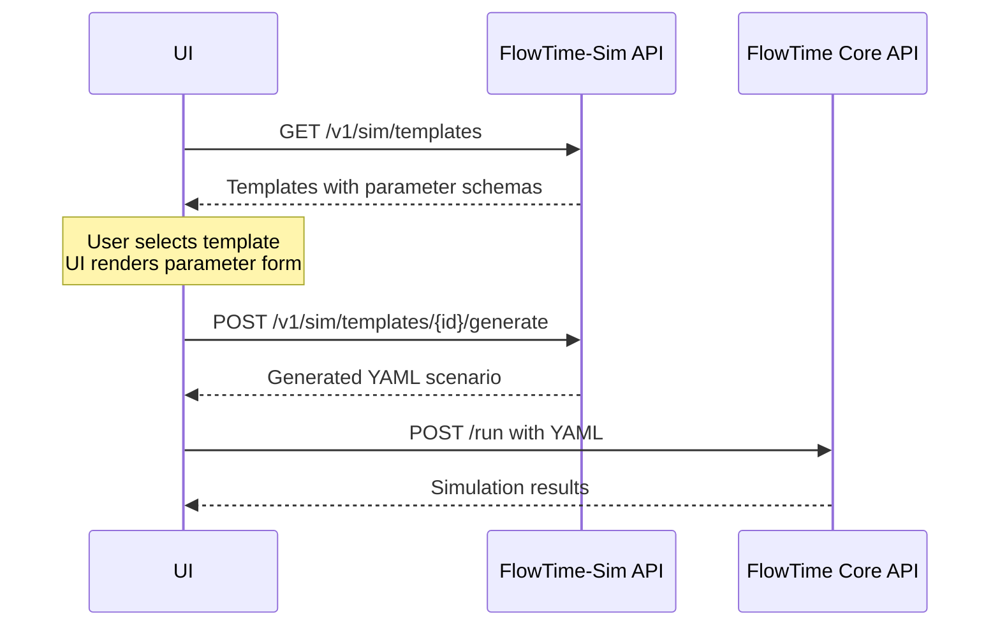

# Template API Integration Guide

This guide explains how to integrate with FlowTime-Sim's parameterized template system for building user interfaces that allow dynamic scenario generation.

## Overview

FlowTime-Sim has evolved from static scenarios to **parameterized templates** that generate customized simulation scenarios based on user input. This enables rich UI experiences where users can configure parameters through forms rather than editing raw YAML.

## API Evolution

### Before: Static Scenarios
```
GET /v1/sim/scenarios → Static YAML definitions
User selection → Fixed YAML scenario
```

### Now: Parameterized Templates  
```
GET /v1/sim/templates → Template metadata + parameter schemas
User parameter input → POST /v1/sim/templates/{id}/generate → Custom YAML scenario
```

## Core Concepts

### Templates vs Scenarios
- **Template**: A parameterized blueprint with `{{placeholder}}` syntax and parameter schema
- **Scenario**: A concrete YAML definition ready for simulation
- **Generation**: The process of template + parameters → scenario

### Parameter Schema
Each template includes a parameter schema defining:
- **Type**: `number`, `integer`, `string`, `boolean`, `enum`
- **Validation**: `minimum`, `maximum`, `allowedValues`
- **Metadata**: `title`, `description`, `defaultValue`

## API Endpoints

### 1. Template Discovery: `GET /v1/sim/templates`

**Purpose**: Get available templates with parameter schemas for UI form generation.

**Response Structure**:
```json
[
  {
    "id": "it-system-microservices",
    "title": "IT System with Microservices", 
    "description": "Modern web application with configurable load patterns",
    "category": "domain",
    "tags": ["intermediate", "microservices", "web-scale"],
    "parameters": [
      {
        "name": "requestRate",
        "type": "number",
        "title": "Request Rate (req/min)",
        "description": "Incoming API requests per minute",
        "defaultValue": 100,
        "minimum": 10,
        "maximum": 10000,
        "allowedValues": null
      }
    ],
    "preview": { /* YAML structure preview */ }
  }
]
```

**Query Parameters**:
- `?category=domain` - Filter by category (`theoretical`, `domain`)

### 2. Scenario Generation: `POST /v1/sim/templates/{id}/generate`

**Purpose**: Convert template + parameters into concrete YAML scenario.

**Request Body**:
```json
{
  "requestRate": 200,
  "bins": 8,
  "binMinutes": 45,
  "seed": 999
}
```

**Response**:
```json
{
  "scenario": "schemaVersion: 1\nrng: pcg\nseed: 999\ngrid:\n  bins: 8\n  binMinutes: 45\narrivals:\n  kind: poisson\n  rate: 200\nroute:\n  id: LOAD_BALANCER",
  "templateId": "it-system-microservices",
  "parameters": {
    "requestRate": 200,
    "bins": 8,
    "binMinutes": 45,
    "seed": 999
  }
}
```

**Error Handling**:
- `400 Bad Request` with `{"error": "Parameter 'requestRate' must be a number"}` for validation failures
- `404 Not Found` for unknown template IDs

### 3. Backward Compatibility: `GET /v1/sim/scenarios`

**Purpose**: Legacy endpoint for static scenarios (deprecated but functional).

Static scenarios are now represented as templates with no parameters. Existing integrations continue to work unchanged.

## UI Integration Flow

### Recommended Implementation



### Step-by-Step UI Flow

1. **Template Discovery**
   ```typescript
   const templates = await fetch('/v1/sim/templates').then(r => r.json());
   // Display template list with categories
   ```

2. **Parameter Form Generation** 
   ```typescript
   const template = templates.find(t => t.id === selectedId);
   // Build form dynamically from template.parameters schema
   // Include validation based on min/max/type constraints
   ```

3. **Scenario Generation**
   ```typescript
   const response = await fetch(`/v1/sim/templates/${templateId}/generate`, {
     method: 'POST',
     headers: { 'Content-Type': 'application/json' },
     body: JSON.stringify(userParameters)
   });
   const { scenario } = await response.json();
   ```

4. **Simulation Execution**
   ```typescript
   // Send generated YAML to FlowTime Core as before
   const results = await fetch('/run', {
     method: 'POST', 
     body: scenario,
     headers: { 'Content-Type': 'text/plain' }
   });
   ```

## Parameter Types & Validation

### Type System
```typescript
type ParameterType = 'number' | 'integer' | 'string' | 'boolean' | 'enum';

interface TemplateParameter {
  name: string;
  type: ParameterType;
  title: string;           // Human-readable label
  description: string;     // Help text
  defaultValue: any;       // Default value
  minimum?: number;        // For number/integer types
  maximum?: number;        // For number/integer types  
  allowedValues?: string[]; // For enum types
}
```

### UI Form Generation Examples

```typescript
// Number input with range validation
if (param.type === 'number') {
  return (
    <input 
      type="number" 
      min={param.minimum} 
      max={param.maximum}
      defaultValue={param.defaultValue}
      title={param.description}
    />
  );
}

// Select dropdown for enum types
if (param.type === 'enum' && param.allowedValues) {
  return (
    <select defaultValue={param.defaultValue}>
      {param.allowedValues.map(value => 
        <option key={value} value={value}>{value}</option>
      )}
    </select>
  );
}
```

## Template Categories

### Theoretical Templates
- **Purpose**: Educational, mathematical concepts
- **Examples**: `const-quick`, `poisson-demo`  
- **Parameters**: Usually minimal (seed, basic timing)
- **Target Users**: Learning queue theory, testing concepts

### Domain Templates  
- **Purpose**: Real-world system modeling
- **Examples**: `it-system-microservices`, `transportation-basic`, `manufacturing-basic`
- **Parameters**: Rich, domain-specific (request rates, capacity, throughput)
- **Target Users**: Business analysis, system design

## Error Handling

### Parameter Validation Errors
```json
{
  "error": "Parameter 'requestRate' must be a number"
}
```

### Template Not Found
```json
{
  "error": "Template 'unknown-id' not found"
}
```

### UI Error Handling Strategy
```typescript
try {
  const response = await generateScenario(templateId, params);
  if (!response.ok) {
    const error = await response.json();
    showParameterError(error.error); // Show user-friendly validation message
  }
} catch (err) {
  showGenericError('Failed to generate scenario');
}
```

## Migration Strategy

### For Existing UIs
1. **Phase 1**: Continue using `/scenarios` endpoint (no changes required)
2. **Phase 2**: Add `/templates` support for new features
3. **Phase 3**: Migrate gradually, template by template
4. **Phase 4**: Deprecate `/scenarios` when ready

### Feature Detection
```typescript
// Check if parameterized templates are available
const template = await fetch('/v1/sim/templates/it-system-microservices').then(r => r.json());
const hasParameters = template.parameters && template.parameters.length > 0;

if (hasParameters) {
  // Show parameter form UI
} else {
  // Show static scenario selection
}
```

## Best Practices

### UI Design
- **Progressive Disclosure**: Show basic parameters first, advanced in collapsible sections
- **Real-time Validation**: Validate parameters as user types
- **Default Values**: Pre-populate with sensible defaults from schema
- **Help Text**: Use parameter descriptions for tooltips/help text

### Performance
- **Template Caching**: Cache template metadata, regenerate scenarios as needed
- **Debounced Generation**: Don't regenerate on every parameter change
- **Preview Mode**: Consider showing YAML preview without full generation

### User Experience
- **Parameter Grouping**: Group related parameters (timing, capacity, etc.)
- **Units in Labels**: Include units in parameter titles ("Request Rate (req/min)")
- **Validation Feedback**: Clear error messages tied to specific parameters
- **Preset Configurations**: Allow saving/loading parameter combinations

## Examples

### Complete Integration Example

```typescript
class TemplateManager {
  async getTemplates(category?: string): Promise<Template[]> {
    const url = category 
      ? `/v1/sim/templates?category=${category}`
      : '/v1/sim/templates';
    return fetch(url).then(r => r.json());
  }

  async generateScenario(templateId: string, parameters: Record<string, any>): Promise<string> {
    const response = await fetch(`/v1/sim/templates/${templateId}/generate`, {
      method: 'POST',
      headers: { 'Content-Type': 'application/json' },
      body: JSON.stringify(parameters)
    });
    
    if (!response.ok) {
      const error = await response.json();
      throw new Error(error.error);
    }
    
    const { scenario } = await response.json();
    return scenario;
  }
}

// Usage
const manager = new TemplateManager();
const templates = await manager.getTemplates('domain');
const scenario = await manager.generateScenario('it-system-microservices', {
  requestRate: 150,
  bins: 8,
  seed: 42
});
```

This template system provides the foundation for rich, interactive simulation configuration UIs while maintaining backward compatibility with existing static scenario workflows.