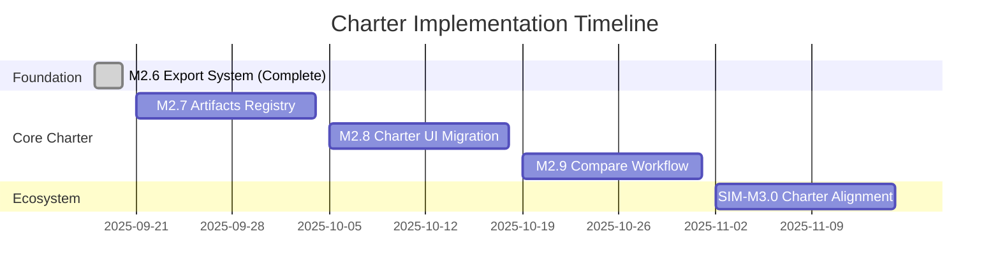

# FlowTime Charter Roadmap Overview

**Charter Paradigm:** Transform from demo tool to **artifacts-centric model authoring and analysis platform**  
**Charter Document:** [FlowTime-Engine Charter](../charter/flowtime-engine.md)  
**Status:** Charter alignment in progress  
**Date:** 2025-09-20

---

## Charter Vision Summary

FlowTime transforms from simulation demo tool to **model authoring platform** with **artifacts-centric workflow**:

```
[Models] → [Runs] → [Artifacts] → [Learn] → [Compare]
    ↑         ↑         ↑           ↑         ↑
    │         │         │           │         │
 Author    Execute   Persist     Analyze   Compare
 models    models   results    patterns  scenarios
```

### **Core Charter Principles**
1. **Never Forget**: Persistent artifacts registry remembers all work
2. **Artifacts-Centric**: Everything flows through artifacts (runs, models, telemetry)
3. **Contextual Actions**: Compare, Export, Analyze launched from artifacts/results
4. **Input Selection → Configure → Compute → Results**: Unified workflow pattern

---

## Charter-Aligned Milestone Sequence

### **Foundation Milestones (Completed)**

#### **M2.6 Export System** ✅ COMPLETED
**Charter Role:** Artifact creation infrastructure foundation
- ✅ Three export formats (CSV, NDJSON, Parquet) become artifact formats
- ✅ Export service architecture becomes artifact creation architecture
- ✅ Export metadata schema becomes artifact metadata foundation
- ✅ UI export integration becomes artifact action patterns foundation

**Charter Impact:** Provides infrastructure for M2.7 artifacts registry - no wasted work.

### **Core Charter Implementation**

#### **M2.7 Artifacts Registry** 📋 PLANNED (Week 1-2)
**Charter Role:** Persistent backbone implementing "never forget" principle
- **Artifacts Storage**: Persistent SQLite registry with full metadata
- **Registry API**: REST endpoints for artifact CRUD operations
- **Artifact Types**: Run, Model, Telemetry, Comparison with extensible schema
- **Automatic Creation**: Run artifacts auto-created on analysis completion
- **Charter Foundation**: Enables all other charter workflows

**Dependencies:** M2.6 (Export Infrastructure)  
**Enables:** M2.8, M2.9, SIM-M3.0

#### **M2.8 Charter UI Migration** 📋 PLANNED (Week 3-4)
**Charter Role:** Incremental migration to charter 4-tab structure
- **Parallel UI**: Charter tabs alongside existing UI during transition
- **4-Tab Structure**: [Models] [Runs] [Artifacts] [Learn] implementation
- **Artifacts Browsing**: Registry UI with filtering, search, metadata display
- **Backward Compatibility**: Preserve all existing functionality
- **Charter Navigation**: Unified workflow navigation patterns

**Dependencies:** M2.7 (Artifacts Registry)  
**Enables:** M2.9 (Compare actions from artifacts)

#### **M2.9 Compare Workflow** 📋 PLANNED (Week 5-6)
**Charter Role:** Core charter Compare functionality with contextual actions
- **Contextual Compare**: Launch from results and artifacts, not standalone mode
- **Input Flexibility**: Compare any artifact type (Run vs Run, Run vs Telemetry, Model vs Run)
- **Engine Integration**: Engine computes comparison metrics and side-by-side data
- **Artifact Results**: Comparison results stored as artifacts in registry
- **Charter Compliance**: Compare as contextual action, not separate analysis mode

**Dependencies:** M2.7 (Artifacts Registry), M2.8 (Charter UI)  
**Enables:** Full charter workflow completion

### **Ecosystem Integration**

#### **SIM-M3.0 FlowTime-Sim Charter** 📋 PLANNED (Week 7-8)  
**Charter Role:** Model authoring platform feeding charter ecosystem
- **Model Artifacts**: Sim creates charter-compatible model artifacts
- **Charter Integration**: Seamless handoff from Sim model creation to Engine execution
- **Quality Validation**: Sim validates models before Engine export
- **Ecosystem Flow**: Complete Sim (Create) → Engine (Execute) → Compare & Learn workflow

**Dependencies:** M2.7 (Artifacts Registry for model artifacts)  
**Enables:** Complete ecosystem model authoring to analysis flow

---

## Charter Implementation Strategy

### **Incremental Migration Approach**
The charter transition uses **incremental migration** to preserve user workflows while introducing charter concepts:

#### **Phase 1: Foundation (M2.7)**
- Add artifacts registry backend with API
- Auto-create run artifacts from existing runs
- Preserve all existing UI and workflows
- **User Impact:** None - registry operates transparently

#### **Phase 2: Charter UI (M2.8)**
- Add charter tabs alongside existing UI
- Implement artifacts registry browsing
- Enable charter navigation patterns
- **User Impact:** New capabilities, existing workflows unchanged

#### **Phase 3: Charter Actions (M2.9)**
- Add Compare actions to artifacts and results
- Enable contextual charter workflows
- Integrate existing UI with charter actions
- **User Impact:** Enhanced capabilities via contextual actions

#### **Phase 4: Full Charter (M3.x)**
- Primary workflows use charter patterns
- Existing UI becomes legacy/power-user mode
- Charter workflow optimization and polish
- **User Impact:** Streamlined charter-native experience

### **Risk Mitigation Strategy**

#### **No Functionality Regression**
- Existing export, templates, analysis remain fully functional
- Charter features added alongside, not replacing existing features
- Users can ignore charter features and continue existing workflows

#### **Gradual User Adoption**
- Charter features are additive enhancements
- No forced migration to charter workflow
- Natural adoption as users discover charter benefits (persistent artifacts, Compare)

#### **Technical Continuity**
- Charter implementation builds on M2.6 infrastructure
- Service patterns and API integration carry forward
- Performance and reliability maintained throughout transition

---

## Charter Success Metrics

### **Paradigm Shift Success**
- **Artifacts Usage**: 80%+ of user actions use artifacts registry within 6 months
- **Charter Navigation**: 70%+ of users primarily use charter tabs within 4 months  
- **Compare Adoption**: 60%+ of analysis sessions include Compare workflows within 3 months

### **Technical Success**
- **Registry Performance**: Artifacts registry queries < 200ms for 10K+ artifacts
- **UI Responsiveness**: Charter tabs performance matches existing UI performance
- **Integration Reliability**: Charter workflows maintain 99%+ success rate

### **User Experience Success**
- **Workflow Continuity**: Zero user complaints about functionality regression
- **Charter Discoverability**: Users find and use charter features without training
- **Efficiency Gains**: Charter workflows reduce analysis time by 30%+ for comparison tasks

---

## Milestone Dependencies & Timeline



### **Critical Path Analysis**
1. **M2.7 (Registry)** blocks all other charter work - highest priority
2. **M2.8 (Charter UI)** enables charter user experience - second priority
3. **M2.9 (Compare)** completes core charter workflow - third priority
4. **SIM-M3.0** extends charter to ecosystem - final integration

### **Parallel Development Opportunities**
- M2.8 UI components can develop in parallel with M2.7 registry implementation
- M2.9 Compare engine logic can develop in parallel with M2.8 UI implementation
- SIM-M3.0 model artifact schema can develop in parallel with M2.7 registry schema

---

## Next Actions

### **Immediate (Next Week)**
1. **Start M2.7 Artifacts Registry** - SQLite schema design and registry API
2. **Charter UI Planning** - Begin M2.8 component design and navigation patterns
3. **Compare Architecture** - Design M2.9 engine integration and comparison algorithms

### **Charter Communication**
1. **User Communication** - Explain charter transition and benefits without forcing adoption
2. **Developer Alignment** - Ensure all development follows charter architecture principles
3. **Stakeholder Updates** - Regular progress updates on charter transformation

### **Success Monitoring**
1. **Usage Analytics** - Track charter feature adoption and user workflow patterns
2. **Performance Monitoring** - Ensure charter implementation maintains system performance
3. **User Feedback** - Gather feedback on charter workflow effectiveness

---

## Charter Documents

- **[FlowTime-Engine Charter](../charter/flowtime-engine.md)** - Core charter document defining vision and architecture
- **[Charter UI Requirements](../charter/flowtime-ui-refactor.md)** - UI transformation requirements and patterns

**Charter Status: IMPLEMENTATION IN PROGRESS** 🔄  
**Foundation: COMPLETE (M2.6)** ✅  
**Next Milestone: M2.7 Artifacts Registry** 📋
