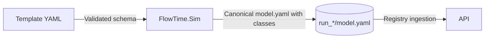

# CL-M-04.01 — Class Schema & Template Enablement

**Status:** ✅ Complete  
**Dependencies:** _None_  
**Target:** Allow FlowTime templates, canonical models, and run metadata to declare explicit flow classes and validate class-aware traffic definitions before downstream services rely on them.

---

## Overview

Classes become the canonical way to describe what type of entity flows through a topology. This milestone introduces schema-level constructs for classes, updates the simulation toolchain to emit them, and ensures run metadata exposes the declared classes everywhere templates and canonical models are consumed. Delivering this foundation keeps modeling, CLI tooling, and documentation ahead of engine, UI, and telemetry changes that depend on trustworthy class metadata.

### Strategic Context
- **Motivation:** FlowTime needs a first-class flow dimension so later milestones can emit per-class metrics without guessing which classes exist.
- **Impact:** Template authors can enumerate classes with friendly names, traffic definitions bind to specific classes, manifests track the class inventory, and CLI tools validate class-aware templates.
- **Dependencies:** None, but CL-M-04.02+ require this milestone to complete because they rely on the schema additions and canonical DTO updates made here.

---

## Scope

### In Scope ✅
1. Update the template/model schema (YAML + JSON schema) to declare `classes` and reference them from traffic definitions.
2. Extend FlowTime.Sim canonical output (`model.yaml`, `manifest.json`, `run.json`) to include the declared classes and enforce defaults when none are specified.
3. Update FlowTime.Contracts/DTOs, CLI validation (`flowtime templates validate`), and documentation (`docs/concepts`, `docs/templates`) to describe and verify class usage.
4. Provide migration guidance and examples demonstrating single-class models and multi-class arrivals.

### Out of Scope ❌
- ❌ Engine aggregation, `/state` APIs, or telemetry changes (covered by CL-M-04.02 and CL-M-04.04).
- ❌ UI experience for selecting classes (CL-M-04.03).
- ❌ Edge-level semantics or routing logic keyed by class (future EdgeTimeBin epic).

### Future Work
- CL-M-04.02 consumes the schema to emit `byClass` metrics.
- CL-M-04.03 binds the UI to the new metadata.
- CL-M-04.04 updates TelemetryLoader contracts once classes appear in gold bundles.
- Align `docs/schemas/template.schema.json` + `template-schema.md` with the class-aware template shape and consider wiring Sim template validation to the schema to avoid drift (post-CL-M-04.01 follow-up).

---

## Requirements

### Functional Requirements

#### FR1: Template Schema & Validation
**Description:** Authors can define classes under `model.classes[]`, reference them from arrivals, routing, and retry policies, and receive validation errors when referencing unknown classes.

**Acceptance Criteria:**
- [ ] `docs/schemas/model.schema.json` (and any YAML schema overlays) accept the new `classes` array (`id`, `displayName`, optional `description`).
- [ ] `traffic.arrivals[].classId` is required when `classes` are declared, optional when a single implicit class is used; defaults to `"*"` when omitted.
- [ ] Validation errors clearly state when an arrival references an undefined class.
- [ ] Templates without a `classes` section remain valid and behave as single-class models (`["*"]`).

**Examples:**
```yaml
model:
  id: "order-system-classes-v1"
  classes:
    - id: "Order"
      displayName: "Order Flow"
    - id: "Refund"
      displayName: "Refund Flow"
  traffic:
    arrivals:
      - nodeId: "ingest"
        classId: "Order"
        pattern:
          kind: "constant"
          ratePerBin: 20
```

**Error Cases:** referencing `classId: "Unknown"` raises `Class 'Unknown' is not declared under model.classes`.

#### FR2: Canonical Model & DTO Updates
**Description:** FlowTime.Sim and FlowTime.Contracts expose classes everywhere models are materialized.

**Acceptance Criteria:**
- [ ] `src/FlowTime.Sim.Core/.../CanonicalModelWriter` writes `classes` to `model.yaml` and `manifest.json`.
- [ ] `ModelDefinition`, `TrafficDefinition`, and related DTOs gain `Classes` collections with null-safe defaults.
- [ ] Serialization/deserialization keeps order stable and preserves `displayName` metadata.
- [ ] `run.json` (and registry entries) include a top-level `classes` array for quick reference.

#### FR3: CLI & Tooling Surface
**Description:** CLI validation and generation workflows understand classes.

**Acceptance Criteria:**
- [ ] `flowtime templates validate` fails fast if classes are malformed or missing from references.
- [ ] `flowtime sim run` prints declared classes when summarizing a run.
- [ ] Examples under `examples/` include at least one updated template showcasing classes.

#### FR4: Documentation & Guidance
**Description:** Docs describe how to use classes, including best practices.

**Acceptance Criteria:**
- [ ] `docs/concepts/nodes-and-expressions.md` and `docs/concepts/pmf-modeling.md` mention classes vs labels.
- [ ] `docs/templates/README.md` gains a "Classes" section referencing schema snippets.
- [ ] `docs/operations/telemetry-capture-guide.md` briefly notes that upcoming bundles will include classes (forward reference).

### Non-Functional Requirements

#### NFR1: Backward Compatibility
- Default behavior (`classes` omitted) mirrors today’s single-class runs. All new fields are optional for existing templates.

#### NFR2: Deterministic Output
- Canonical artifacts must emit classes in a consistent order to keep diffs stable and make regression tests reliable.

---

## Technical Design

### Architecture Decisions
- **Decision:** Classes are declared once per model and referenced by ID. No inheritance or nested definitions in this milestone.
- **Rationale:** Keeps schema minimal while unblocking downstream consumers.
- **Alternatives Considered:** Allowing labels to stand in for classes (rejected: labels are context metadata, not flow definitions).

### Data Flow


---

## Implementation Plan

### Phase 1: Schema & Documentation
**Goal:** Land schema, JSON schema, and doc updates describing classes.

**Tasks:**
1. RED: Add failing schema tests covering `classes` and `traffic.arrivals[].classId`.
2. GREEN: Update schema definitions and validation pipeline.
3. GREEN: Refresh docs (`docs/templates`, `docs/concepts`).

**Deliverables:** Updated schemas, examples, and docs.
**Success Criteria:** `[ ]` All schema tests pass, `[ ]` Doc sections published.

### Phase 2: FlowTime.Sim & DTO Plumbing
**Goal:** Emit classes across canonical artifacts and DTOs.

**Tasks:**
1. RED: Add failing unit tests in `tests/FlowTime.Sim.Tests` asserting `model.yaml` writes classes.
2. GREEN: Update DTOs (`ModelDefinition`, `TrafficDefinition`) and writers.
3. GREEN: Ensure `run.json`/registry metadata include classes.

**Deliverables:** Updated DTOs, canonical artifact snapshots.
**Success Criteria:** `[ ]` New tests pass, `[ ]` CLI smoke run shows classes.

### Phase 3: CLI & Example Updates
**Goal:** Teach CLI commands and examples about classes.

**Tasks:**
1. RED: Add failing CLI tests for `flowtime templates validate` (unknown class) and summary output.
2. GREEN: Implement CLI changes, update help text.
3. GREEN: Refresh sample templates in `examples/`.

**Deliverables:** CLI validation + documentation updates.
**Success Criteria:** `[ ]` CLI tests pass, `[ ]` Example templates validated.

---

## Test Plan

### Test-Driven Development Approach
Strict RED → GREEN → REFACTOR. Every new behavior starts with a failing test in the relevant suite (schema, sim, CLI) before code changes.

### Test Categories

#### Schema & Validation Tests
- `tests/FlowTime.Tests/Templates/TemplateSchemaTests.cs`
  1. `TemplateSchema_Allows_ClassDeclarations()`
  2. `TemplateSchema_Rejects_UnknownClassReference()`
  3. `TemplateSchema_Defaults_ToWildcard_WhenOmitted()`

#### Simulation & DTO Tests
- `tests/FlowTime.Sim.Tests/CanonicalModelWriterTests.cs`
  1. `CanonicalModelWriter_Writes_Classes_Block()`
  2. `CanonicalModelWriter_Preserves_ClassOrder()`
  3. `RunManifest_Includes_ClassSummary()`

#### CLI Tests
- `tests/FlowTime.Cli.Tests/Templates/TemplatesValidateCommandTests.cs`
  1. `TemplatesValidate_Fails_On_Undeclared_Class()`
  2. `TemplatesValidate_Passes_With_MultipleClasses()`
  3. `SimRun_Prints_Class_List()`

### Test Coverage Goals
- **Schema Tests:** Cover positive + negative validation paths.
- **Sim Tests:** Cover serialization/deserialization.
- **CLI Tests:** Cover validation output and success messaging.

---

## Success Criteria

### Milestone Complete When:
- [ ] FR1–FR4 implemented and documented.
- [ ] All new schema, sim, and CLI tests pass in CI and locally (`dotnet test FlowTime.sln`).
- [ ] Updated examples validated without warnings.
- [ ] Documentation references classes in every relevant concept file.
- [ ] Backward compatibility verified with an existing single-class template.

---

## File Impact Summary

### Files to Modify (Major)
- `docs/schemas/model.schema.json` — add `classes` definitions and references.
- `src/FlowTime.Sim.Core/*` — update DTOs and canonical writers.
- `src/FlowTime.Contracts/*` — expose classes in shared contracts.
- `src/FlowTime.Cli/*` — CLI validation, help text, and run summaries.
- `docs/templates/README.md`, `docs/concepts/*.md` — document the feature.

### Files to Modify (Minor)
- `examples/*.yaml` — add sample classes.
- `docs/operations/telemetry-capture-guide.md` — forward-looking note.

### Files to Create
- `docs/templates/examples/class-enabled-template.yaml` (if needed for illustration).

---

## Migration Guide

### Breaking Changes
None. All additions are backward compatible.

### Backward Compatibility
- When `classes` is absent, FlowTime behaves as today by implicitly treating all traffic as a wildcard class `"*"`.

### Adoption Tips
- Template authors can gradually add `classes` by first declaring the array and then annotating arrivals one node at a time.
