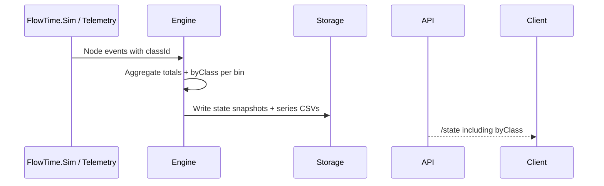

# CL-M-04.02 — Engine & State Aggregation for Classes

**Status:** 📋 Planned  
**Dependencies:** ✅ CL-M-04.01 (Schema & Template Enablement)  
**Target:** Extend FlowTime Engine, synthetic telemetry, and `/state` APIs to emit class-aware node metrics without breaking existing consumers.

---

## Overview

With schema support in place, the engine must propagate class information through the Loop. This milestone updates the aggregation pipeline so every node/time bin reports totals and per-class breakdowns, the `/state` and `/state_window` endpoints expose `byClass`, and synthetic telemetry bundles include `(nodeId, timeBin, classId)` rows. Delivering these changes unlocks UI filters (CL-M-04.03) and telemetry parity (CL-M-04.04).

### Strategic Context
- **Motivation:** Provide trustworthy per-class metrics directly from the engine so downstream services stop approximating flows.
- **Impact:** API consumers, CLI tools, and diagnostic scripts can request per-class data using the existing endpoints.
- **Dependencies:** Requires CL-M-04.01 DTOs to ensure classes are declared before aggregation.

---

## Scope

### In Scope ✅
1. Engine runtime tracking of class identifiers per simulated/telemetry item.
2. Aggregation logic that rolls up `(nodeId, classId, timeBin)` metrics alongside total node metrics.
3. REST API contract updates for `/v1/runs/{id}/state` and `/v1/runs/{id}/state_window` to include `nodes[<nodeId>].byClass` blocks.
4. Synthetic telemetry CSV/manifest updates to persist per-class rows.
5. Consistency checks ensuring per-class sums equal total node counts.

### Out of Scope ❌
- ❌ UI rendering of the new data (CL-M-04.03).
- ❌ TelemetryLoader input contract (CL-M-04.04).
- ❌ Edge-level per-class analytics (future EdgeTimeBin epic).

### Future Work
- TelemetryLoop equivalence tests (CL-M-04.04).
- UI filters (CL-M-04.03).

---

## Requirements

### Functional Requirements

#### FR1: Engine Aggregation
**Description:** During simulation or telemetry ingestion, the engine aggregates per-node metrics split by class.

**Acceptance Criteria:**
- [ ] Internal data structures store `ClassMetrics` (arrivals, served, errors, queueDepth, latency sums/counts).
- [ ] Aggregations respect conservation: totals equal the sum over `byClass` within ±1 due to rounding, with warnings when violated.
- [ ] Missing class data defaults to the wildcard `"*"` bucket.

#### FR2: `/state` & `/state_window` Contract
**Description:** API responses include the optional `byClass` object per node.

**Acceptance Criteria:**
- [ ] `GET /v1/runs/{id}/state` returns:
```jsonc
"nodes": {
  "ingest": {
    "arrivals": 125,
    "byClass": {
      "Order": { "arrivals": 100, "served": 96, "errors": 4 },
      "Refund": { "arrivals": 25, "served": 24, "errors": 1 }
    }
  }
}
```
- [ ] `state_window` streams per-bin entries with the same shape.
- [ ] Existing consumers can omit `byClass` without errors (property is optional).

#### FR3: Synthetic Telemetry Output
**Description:** `series/*.csv` and `model/telemetry/manifest.json` include class data.

**Acceptance Criteria:**
- [ ] CSV columns add `classId` and per-class metrics.
- [ ] Manifest enumerates available classes and describes the per-class grain.
- [ ] CLI diagnostics (`flowtime runs inspect`) display class data when present.

#### FR4: Validation & Diagnostics
**Description:** Provide visibility when class data is missing or inconsistent.

**Acceptance Criteria:**
- [ ] Engine emits warnings in logs and run manifest metadata when telemetry lacks per-class metrics.
- [ ] `/state` response metadata lists `classCoverage: full|partial|missing`.

### Non-Functional Requirements

#### NFR1: Performance
- Per-class aggregation must keep `/state` latency within +10% of current baseline when fewer than 8 classes exist.

#### NFR2: Backward Compatibility
- Clients ignoring `byClass` must see identical responses as before (field omitted entirely when no classes declared).

---

## Technical Design

### Data Flow


### Architecture Decisions
- **Decision:** Store per-class metrics alongside existing node entries rather than in a separate collection.
- **Rationale:** Keeps `/state` payloads backward compatible and avoids extra round trips.
- **Alternative:** New endpoint `/state/classes` (rejected due to added complexity and caching implications).

---

## Implementation Plan

### Phase 1: Domain & DTO Updates
**Goal:** Introduce engine data structures for class metrics.

**Tasks:**
1. RED: Add failing unit tests around `NodeMetricsAggregator` verifying per-class buckets.
2. GREEN: Update domain models/DTOs in `FlowTime.Core` with `Dictionary<string, ClassMetrics>`.
3. REFACTOR: Ensure serialization helpers share code between totals and class entries.

### Phase 2: Persistence & Telemetry Output
**Goal:** Write per-class metrics to canonical artifacts.

**Tasks:**
1. RED: Add failing regression tests around `series/*.csv` generation.
2. GREEN: Extend CSV writers + manifest builder to iterate classes.
3. GREEN: Annotate `run.json` metadata with `classCoverage`.

### Phase 3: API Surface & Diagnostics
**Goal:** Surface data through `/state` endpoints and metadata.

**Tasks:**
1. RED: Add API integration tests for `/state` and `/state_window` verifying `byClass` payloads.
2. GREEN: Update controllers, mappers, and swagger docs.
3. GREEN: Implement coverage metadata + warning propagation.

---

## Test Plan

### TDD Strategy
Every change begins with failing tests per phase. Integration tests use `TestWebApplicationFactory` with synthetic runs containing multiple classes.

### Test Categories

#### Unit Tests
- `tests/FlowTime.Core.Tests/Aggregation/ClassMetricsAggregatorTests.cs`
  1. `Aggregator_Tracks_PerClassCounts()`
  2. `Aggregator_Defaults_ToWildcard()`
  3. `Aggregator_Flags_InconsistentTotals()`

#### Integration Tests
- `tests/FlowTime.Api.Tests/State/ClassStateEndpointTests.cs`
  1. `StateEndpoint_Returns_ByClass_Block()`
  2. `StateWindowEndpoint_Streams_ByClass()`
  3. `StateEndpoint_Omits_ByClass_WhenMissing()`

#### Telemetry Snapshot Tests
- `tests/FlowTime.Tests/Telemetry/SyntheticTelemetryWriterTests.cs`
  1. `TelemetryCsv_Includes_ClassIdColumn()`
  2. `TelemetryManifest_Lists_Classes()`

### Coverage Goals
- Cover conservation logic, serialization, and API response shaping.

---

## Success Criteria
- [ ] Aggregator + serialization unit tests pass.
- [ ] `/state` & `/state_window` integration tests pass with multi-class fixtures.
- [ ] Synthetic telemetry CSV/manifest golden files updated and validated.
- [ ] Engine emits warnings for partial coverage and records metadata.
- [ ] Manual smoke test verifies CLI can display per-class summaries.

---

## File Impact Summary

### Major Changes
- `src/FlowTime.Core/*` — Aggregation models, DTOs, CSV writers.
- `src/FlowTime.API/Controllers/StateController.cs` and helpers — API payload updates.
- `src/FlowTime.Engine/*` or equivalent aggregator services — runtime tracking.
- `docs/reference/state-endpoints.md` (if present) — document new payloads.

### Minor Changes
- `src/FlowTime.Cli/Commands/RunsInspectCommand.cs` — optional display updates.
- `docs/architecture/classes/README.md` — reference new contract.

---

## Migration Guide

### Breaking Changes
None. `byClass` is optional. Clients must tolerate the new property.

### Backward Compatibility
- When runs lack class data, `byClass` is omitted entirely, preserving legacy JSON shape.
- Telemetry CSV files still provide aggregate rows; new rows are additive.

### Adoption Notes
- Consumers that need class data should detect `nodes.*.byClass != null` and fall back to totals otherwise.
