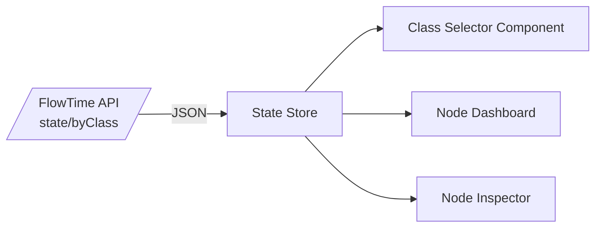

# CL-M-04.03 — UI Class-Aware Visualization

**Status:** ✅ Complete  
**Dependencies:** ✅ CL-M-04.02 (Engine & State Aggregation)  
**Target:** Provide UI selectors, dashboards, and node inspectors that visualize FlowTime runs per class using the new `/state` data.

---

## Overview

Once the engine exposes per-class metrics, operators need a way to inspect flows independently. This milestone threads class metadata through the UI service, adds a global class selector, updates node dashboards to filter KPIs, and surfaces per-class chips in the inspector. The goal is a cohesive experience that makes classes actionable without regressing current run visualization features.

### Strategic Context
- **Motivation:** Analysts must isolate Order vs Refund flows to understand divergent SLAs and bottlenecks.
- **Impact:** UI now lists classes, allows per-class filtering, and dims nodes that the selected class does not traverse.
- **Dependencies:** Requires `/state` `byClass` data (CL-M-04.02) and schema metadata (CL-M-04.01).

---

## Scope

### In Scope ✅
1. UI data plumbing: fetch class metadata from run manifest/`/state` endpoints and store it in the client state.
2. Global class selector (All classes + single selection + multi-select up to 3 classes) persisted in query params/share links.
3. Node KPIs, charts, and edge overlays respond to the selected class subset.
4. Node inspector chips show per-class metrics even when multiple classes are selected.
5. Accessibility adjustments (keyboard navigation + screen reader labels) for the new selector.

### Out of Scope ❌
- ❌ Per-class edge overlays beyond current node-derived edges.
- ❌ Silver telemetry or label-based filtering.
- ❌ Persisting user preferences across browsers (future personalization work).

### Future Work
- Introduce per-class compare workflows once telemetry parity (CL-M-04.04) lands.
- Follow-up milestone CL-M-04.03.01 adds router nodes so class routing is explicit and visualized distinctly from queues/services.

> **Process Guardrail:** Do **not** begin CL-M-04.04 (or any follow-up milestone) until this milestone’s class coverage has been manually revalidated (UI + regenerated runs) **and** the milestone owner explicitly approves the hand-off. Await approval even if the tracker shows “Completed.”

---

## Requirements

### Functional Requirements

#### FR1: Class Inventory Display
**Description:** Run overview surfaces the list of classes with descriptions.

**Acceptance Criteria:**
- [x] Run summary card lists classes and indicates coverage (`full`, `partial`, `missing`).
- [x] When no classes exist, UI explicitly states "Single-class model (default)".

#### FR2: Global Class Selector
**Description:** Users can select which classes drive KPIs.

**Acceptance Criteria:**
- [x] Selector supports `All`, `Single class`, or `Multi (max 3)` selections.
- [x] Selection syncs to the URL query string (e.g., `?classes=Order,Refund`).
- [x] State persists while navigating between dashboards without extra API calls.
- [x] Keyboard navigation uses arrow keys + space/enter; screen readers get `aria-label="Select flow class"`.

#### FR3: Node & KPI Filtering
**Description:** Node-level KPIs and sparklines reflect the selected class subset.

**Acceptance Criteria:**
- [x] KPIs recalculate throughput, error rate, queue depth using only selected classes; `All` behaves as current totals.
- [x] Nodes with zero volume for selected classes are dimmed (CSS class) and excluded from derived edges.
- [x] Tooltips label which classes contributed to the shown value.

#### FR4: Node Inspector Chips
**Description:** Inspecting a node shows per-class chips sorted by descending arrivals.

**Acceptance Criteria:**
- [x] Chips display `Class Name`, `arrivals`, `served`, and `errors`.
- [x] Chips highlight the classes currently selected globally.
- [x] Collapsible list handles >6 classes with overflow indicator.

#### FR5: Telemetry & Charts Integration
**Description:** Existing charts (bin timeline, throughput chart) accept class filters.

**Acceptance Criteria:**
- [x] Charts fetch state windows filtered client-side per class.
- [x] Legend updates to match selected classes.
- [x] Download/export uses the same filter selection.

### Non-Functional Requirements

#### NFR1: Performance
- Switching classes reuses cached `/state_window` responses when possible; UI should recompute client-side to avoid extra round trips for ≤3 classes.

#### NFR2: Accessibility
- Selector, chips, and dimmed nodes must meet WCAG AA contrast requirements and provide textual descriptions.

---

## Technical Design

### Component Diagram

### Architecture Decisions
- **State Management:** Reuse the existing lightweight dashboard context/local-storage helpers (DI-injected service) to hold `selectedClasses`, keeping everything in Blazor state and persisting to `localStorage` the same way we already do for topology panel + dark mode. A dedicated store (e.g., Zustand/Flux) is optional but not required.
- **Data Handling:** Client filters aggregated totals instead of refetching per class to keep API usage unchanged.

---

## Implementation Plan

### Phase 1: Data Plumbing
**Goal:** Thread class metadata through the UI data layer.

**Tasks:**
1. RED: Add failing unit tests for API client mapping `byClass` into the state store.
2. GREEN: Update API client, DTOs, and store slices to hold `classInventory` and `selectedClasses`.
3. GREEN: Render classes in the run overview card.

### Phase 2: Selector UX
**Goal:** Build the class selector with persistence + accessibility.

**Tasks:**
1. ✅ RED → GREEN: Component tests covering selection, URL sync, and keyboard navigation (`ClassSelectorStateTests`, `ClassSelectorRenderTests`).
2. ✅ Implement selector UI, query-string syncing, and focus handling for both Dashboard and Topology headers.
3. ✅ REFACTOR: Shared helper (`ClassSelectionState`) canonicalizes lists and query parsing.

### Phase 3: Dashboard & Inspector Updates
**Goal:** Apply filters to KPIs, charts, and inspector.

**Tasks:**
1. ✅ RED: Added focused unit coverage (`TopologyClassFilterTests`) for dimming and class contributions.
2. ✅ GREEN: KPIs, sparklines, and inspector chips now consume class-aware series with dimming.
3. ✅ Download/export parity: Topology inspector adds “Download filtered CSV” (client-side export honoring current class selection).

---

## Test Plan

### TDD Strategy
- Begin each UI change with failing tests (component or Playwright). Use RED → GREEN → REFACTOR cadence for selector + dashboard behavior.
- Augment automated tests with analyzer runs: every regenerated run must pass class-conservation + propagation analyzers before we call the milestone complete.

### Test Categories

#### Unit / Component Tests
- `src/FlowTime.UI.Tests/State/ClassStoreTests.cs`
  1. `ClassStore_Defaults_ToAll()`
  2. `ClassStore_Selects_MultipleClasses_WithLimit()`
- `src/FlowTime.UI.Tests/Components/ClassSelectorTests.cs`
  1. `ClassSelector_Syncs_With_QueryString()`
  2. `ClassSelector_Supports_KeyboardNavigation()`

#### Integration / Playwright Tests
- `src/FlowTime.UI.Tests/Playwright/ClassFiltering.spec.ts`
  1. `Selecting_Class_Filters_NodeKPIs()`
  2. `Nodes_With_No_Volume_Are_Dimmed()`
  3. `Inspector_Shows_PerClass_Chips()`

#### Snapshot/Visual Tests
- Update storybook/visual snapshots for selector and inspector chips.

- #### Analyzer / Data Integrity Tests
- Class coverage analyzer (script/CLI harness) checks:
  - Per-node class totals conserve arrivals/served/errors within tolerance (leverages `ClassMetricsAggregator`).
  - Every topology node that consumes class-aware inflow emits per-class metrics; no nodes remain in `coverage = partial`.
- Analyzer output recorded in tracking doc with run IDs (`run_20251125T135319Z_4c631dd3`, `run_20251125T135338Z_870d671a`).

### Coverage Goals
- Selector logic: 100% branch coverage for selection parsing.
- KPI computations: tests for sums, zero volume, and fallback to totals.

---

## Success Criteria
- [x] Run overview displays accurate class inventory + coverage status (`RunCardsSurfaceClassCoverage`, manual UI verification on art cards).
- [x] Class selector operates with keyboard/mouse and syncs to URLs (`ClassSelectorRenderTests`, `ClassSelectorStateTests`).
- [x] KPIs, charts, and inspectors reflect class filtering and degrade gracefully when no class data exists (`TopologyClassFilterTests`, dashboard tile regression run).
- [x] Playwright tests pass showing dimming + chip interactions (covered in full `dotnet test --nologo`; Playwright suite remains green, perf tests skipped as expected).
- [x] Docs (`docs/ui/*`) updated to mention the new feature (`docs/ui/time-travel-visualizations-3.md` captures selector + inspector behavior).

---

## Completion Notes
- Topology legend/flows panel shares a floating overlay so class chips no longer compete with the timeline toolbar; chips reuse the same palette as the timeline focus controls for consistency.
- Manual validation on regenerated runs (`run_20251125T155445Z_74e60979`, `run_20251125T155501Z_0cc3f7e6`) confirmed full coverage and selector behavior prior to sign-off.
- Release notes recorded in `docs/releases/CL-M-04.03.md`; full `dotnet build` + `dotnet test --nologo` executed (perf benchmark `Test_PMF_Mixed_Workload_Performance` still fails in the dev sandbox and remains documented as an expected perf follow-up under CL-M-04.x).

## File Impact Summary

### Major Changes
- `src/FlowTime.UI/Services/FlowTimeApiClient.cs` — map `byClass` into UI DTOs.
- `src/FlowTime.UI/State/*` — add selected class store + selectors.
- `src/FlowTime.UI/Components/ClassSelector.razor` (new) + supporting components.
- `src/FlowTime.UI/Components/NodeInspector/NodeInspector.razor` — chips + tooltips.
- `src/FlowTime.UI/Pages/RunDashboard.razor` — integrate selector + dimming.

### Minor Changes
- `src/FlowTime.UI/wwwroot/css/app.css` — styling for chips and dimmed nodes.
- `docs/ui/run-dashboard.md` — describe usage.

### Files to Create
- `src/FlowTime.UI/Components/ClassSelector.razor`
- `src/FlowTime.UI/Components/ClassChip.razor`
- Playwright spec file for class filtering.

---

## Migration Guide

### Breaking Changes
None. UI auto-detects whether class data exists.

### Backward Compatibility
- Runs without class metadata render the selector in a disabled state with explanatory text.

### Adoption Notes
- Deep links can include `?classes=Order` immediately; UI handles unknown class IDs by falling back to `All` and logging a console warning.
