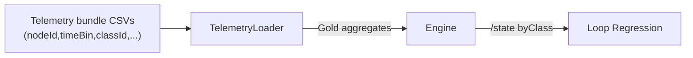

# CL-M-04.04 — Telemetry Contract & Loop Validation for Classes

**Status:** 📋 Planned  
**Dependencies:** ✅ CL-M-04.02 (Engine aggregation), 🔄 CL-M-04.03 (UI consumers optional)  
**Target:** Update TelemetryLoader contracts, capture endpoints, and Loop validation suites so telemetry-driven runs produce the same per-class node metrics as simulation-driven runs.

---

## Overview

The Loop must stay consistent once classes become part of the gold contract. This milestone refreshes telemetry capture manifests, extends TelemetryLoader to emit `(nodeId, timeBin, classId)` aggregates, and adds regression suites that compare simulation vs telemetry runs. The result is confidence that real telemetry honoring the new contract will produce the same `/state` responses as synthetic runs, unlocking mixed-mode diagnostics and onboarding external telemetry partners.

### Strategic Context
- **Motivation:** Ensure class-aware telemetry flows through the Loop without manual rework.
- **Impact:** Telemetry captures, ingestion pipelines, and validation tooling all understand the class dimension and report discrepancies early.
- **Dependencies:** Engine must already surface `byClass` data (CL-M-04.02). UI will benefit but is not required.

---

## Scope

### In Scope ✅
1. Update telemetry capture manifest (`model/telemetry/manifest.json`) and docs to declare per-class grain, plus forward-compatible schema versioning.
2. Extend TelemetryLoader (services + CLI) to parse per-class CSV rows, aggregate them, and emit `byClass` node metrics during ingestion.
3. Enhance `/v1/telemetry/captures` endpoint to validate incoming bundles for class coverage and emit warnings/errors when missing.
4. Add Loop regression tests comparing simulation and telemetry runs for the same model across multiple classes.
5. Document data producer guidance (operations guide + examples).

### Out of Scope ❌
- ❌ Silver telemetry pipelines or per-label aggregates.
- ❌ External connector SDK changes (they continue to post CSV bundles that now include classId).
- ❌ UI enhancements beyond what's already planned in CL-M-04.03.

### Future Work
- EdgeTimeBin telemetry ingestion (separate epic).

---

## Requirements

### Functional Requirements

#### FR1: Manifest & Schema Updates
**Description:** Telemetry manifests describe per-class metrics, coverage, and schema version.

**Acceptance Criteria:**
- [ ] `docs/schemas/telemetry-manifest.schema.json` (or equivalent) includes `classId` metadata and `classCoverage` flags.
- [ ] Capture manifests declare `supportsClassMetrics: true/false`.
- [ ] `docs/operations/telemetry-capture-guide.md` shows updated manifest examples.

#### FR2: TelemetryLoader Ingestion
**Description:** TelemetryLoader reads class-aware CSV bundles and produces canonical gold data.

**Acceptance Criteria:**
- [ ] `TelemetryLoader` validates that each `(nodeId, timeBin)` has either totals+classes or totals only and logs warnings otherwise.
- [ ] Aggregation writes `byClass` entries identical to engine output from CL-M-04.02.
- [ ] CLI command `flowtime telemetry ingest` prints class coverage summary.

#### FR3: Capture Endpoint Validation
**Description:** `POST /v1/telemetry/captures` enforces the new contract.

**Acceptance Criteria:**
- [ ] Requests missing `classId` column are rejected unless `supportsClassMetrics=false`.
- [ ] Response metadata includes `classCoverage` and `warnings` arrays.
- [ ] When `captureKey`/`directory` is specified, engine stores class manifests alongside totals.

#### FR4: Loop Regression Tests
**Description:** Automated suites compare simulation vs telemetry `/state` per class.

**Acceptance Criteria:**
- [ ] `tests/FlowTime.Integration.Tests/Loop/ClassesLoopTests.cs` contains scenarios:
  - Simulation vs telemetry parity for two-class model.
  - Telemetry missing a class triggers warning + fallback.
- [ ] Tests assert that `state.nodes.*.byClass` matches between modes within tolerance.

### Non-Functional Requirements

#### NFR1: Reliability
- Ingestion should fail fast with actionable errors when class data is malformed to avoid silent mismatches.

#### NFR2: Observability
- Structured logs include `classCoverage`, `nodeId`, `timeBin` for anomalies, aiding support teams.

---

## Technical Design

### Data Flow

### Architecture Decisions
- **Validation Mode:** Loader performs schema validation before data aggregation to keep error messages focused on data shape rather than downstream failures.
- **Storage Layout:** Class-aware telemetry lives alongside existing files under `model/telemetry/`, no new directories.

---

## Implementation Plan

### Phase 1: Contract & Docs
**Goal:** Formalize manifest/schema updates and communicate to producers.

**Tasks:**
1. RED: Add failing schema tests for new manifest fields.
2. GREEN: Update schema files + docs with examples.
3. GREEN: Version manifest schema (e.g., `telemetry-manifest@2`).

### Phase 2: TelemetryLoader Enhancements
**Goal:** Parse and aggregate per-class telemetry.

**Tasks:**
1. RED: Add failing unit tests around loader parsing + aggregation.
2. GREEN: Implement CSV parsing, `byClass` aggregation, and coverage warnings.
3. GREEN: Update CLI output + logging.

### Phase 3: Capture Endpoint & Loop Tests
**Goal:** Enforce contract and validate equivalence.

**Tasks:**
1. RED: Integration tests hitting `/v1/telemetry/captures` with/without class data.
2. GREEN: Implement validation, metadata, and storage updates.
3. RED/GREEN: Build Loop regression tests comparing simulation vs telemetry outputs.

## Current Progress (2025-11-25)

- `RunArtifactWriter`/`ClassContributionBuilder` now preserve per-class series even when scalar math or `MAX/MIN` clamps collapse a node to zero. Regression coverage lives in `tests/FlowTime.Tests/RunArtifactWriterTests.cs` (`WriteArtifacts_ClassSeriesScaleThroughScalarMultipliers`).
- Demo runs with class coverage pushed through every node were regenerated for hands-on validation:
  - Supply chain: `data/run_20251125T130751Z_21597334` (template `supply-chain-multi-tier-classes`).
  - Transportation: `data/run_20251125T130822Z_91deaced` (template `transportation-basic-classes`).
- These runs keep `classCoverage: "full"` and surface class chips past DLQ/returns queues, so Time Travel UI selectors now render meaningful data all the way through the topology.

---

## Test Plan

### TDD Strategy
- Schema changes tested first (RED) before code updates.
- Loader + API work follows RED → GREEN → REFACTOR with integration suites ensuring end-to-end parity.

### Test Categories

#### Schema Tests
- `tests/FlowTime.Tests/Schemas/TelemetryManifestSchemaTests.cs`
  1. `ManifestSchema_Requires_ClassColumns_WhenSupported()`
  2. `ManifestSchema_Allows_LegacyMode_WhenFlagFalse()`

#### Loader Unit Tests
- `tests/FlowTime.Tests/Telemetry/TelemetryLoaderByClassTests.cs`
  1. `Loader_Aggregates_ByClassMetrics()`
  2. `Loader_Warns_On_MissingClassRows()`
  3. `Loader_FallsBack_ToTotals_WhenFlagFalse()`

#### API Integration Tests
- `tests/FlowTime.Api.Tests/Telemetry/CapturesControllerClassTests.cs`
  1. `CaptureEndpoint_Rejects_MissingClassColumn_WhenRequired()`
  2. `CaptureEndpoint_Returns_CoverageMetadata()`

#### Loop Regression Tests
- `tests/FlowTime.Integration.Tests/Loop/ClassesLoopTests.cs`
  1. `SimulationVsTelemetry_StateMatches_PerClass()`
  2. `TelemetryMissingClass_TriggersWarning()`

### Coverage Goals
- Loader parsing paths fully covered, including malformed CSV and partial coverage.
- API integration tests cover success + failure + warning states.

---

## Success Criteria
- [ ] Manifest/schema updates merged with documentation + examples.
- [ ] TelemetryLoader + CLI ingest multi-class bundles and emit warnings when needed.
- [ ] `/v1/telemetry/captures` validates class data and surfaces coverage metadata.
- [ ] Loop regression tests demonstrate parity between simulation and telemetry per class.
- [ ] Docs (`docs/operations/telemetry-capture-guide.md`) updated with producer guidance.

---

## File Impact Summary

### Major Changes
- `docs/schemas/telemetry-manifest.schema.json` (or equivalent) — schema updates.
- `src/FlowTime.Core/Telemetry/TelemetryLoader.cs` and helpers — parsing + aggregation.
- `src/FlowTime.API/Controllers/TelemetryCapturesController.cs` — validation + metadata.
- `tests/FlowTime.Integration.Tests/Loop/ClassesLoopTests.cs` — new parity tests.
- `docs/operations/telemetry-capture-guide.md` — documentation.

### Minor Changes
- `src/FlowTime.Cli/Commands/TelemetryIngestCommand.cs` — summary output.
- `docs/reference/api/telemetry-captures.md` — endpoint contract update.

### Files to Create
- Golden telemetry bundle fixture with multiple classes under `tests/TestSupport/TelemetryBundles/classes/`.

---

## Migration Guide

### Breaking Changes
- Telemetry producers that previously omitted class information must either:
  1. Declare `supportsClassMetrics=false` in manifest (legacy mode), or
  2. Provide the new `classId` column per row.

### Backward Compatibility
- Legacy mode remains supported but emits warnings and is slated for deprecation after the 4.x epic.
- Engine continues to ingest totals-only bundles; `byClass` is simply omitted in `/state` when not provided.

### Migration Steps for Producers
1. Add `classId` column to CSV exports and populate with the FlowTime model class IDs.
2. Update manifest to `schemaVersion: 2` and `supportsClassMetrics: true`.
3. Validate bundle locally using `flowtime telemetry validate --schema classes` (new flag).
4. Upload via `/v1/telemetry/captures`; confirm coverage status is `full`.
