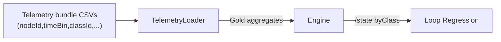

# CL-M-04.04 — Telemetry Contract & Loop Validation for Classes

**Status:** ✅ Completed  
**Dependencies:** ✅ CL-M-04.02 (Engine aggregation), 🔄 CL-M-04.03 (UI consumers optional)  
**Target:** Update TelemetryLoader contracts, capture endpoints, and Loop validation suites so telemetry-driven runs produce the same per-class node metrics as simulation-driven runs.

---

## Overview

The Loop must stay consistent once classes become part of the gold contract. This milestone refreshes telemetry capture manifests, extends TelemetryLoader to emit `(nodeId, timeBin, classId)` aggregates, and adds regression suites that compare simulation vs telemetry runs. The result is confidence that real telemetry honoring the new contract will produce the same `/state` responses as synthetic runs, unlocking mixed-mode diagnostics and onboarding external telemetry partners.

### Strategic Context
- **Motivation:** Ensure class-aware telemetry flows through the Loop without manual rework.
- **Impact:** Telemetry captures, ingestion pipelines, and validation tooling all understand the class dimension and report discrepancies early.
- **Dependencies:** Engine must already surface `byClass` data (CL-M-04.02). UI will benefit but is not required.

---

## Scope

### In Scope ✅
1. Update telemetry capture manifest (`model/telemetry/manifest.json`) and docs to declare per-class grain, plus forward-compatible schema versioning.
2. Extend TelemetryLoader (services + CLI) to parse per-class CSV rows, aggregate them, and emit `byClass` node metrics during ingestion.
3. Enhance `/v1/telemetry/captures` endpoint to validate incoming bundles for class coverage and emit warnings/errors when missing.
4. Add Loop regression tests comparing simulation and telemetry runs for the same model across multiple classes.
5. Document data producer guidance (operations guide + examples).

### Out of Scope ❌
- ❌ Silver telemetry pipelines or per-label aggregates.
- ❌ External connector SDK changes (they continue to post CSV bundles that now include classId).
- ❌ UI enhancements beyond what's already planned in CL-M-04.03.

### Future Work
- EdgeTimeBin telemetry ingestion (separate epic).

### Key Deliverables
- **Schema & Docs:** `telemetry-manifest.schema.json` v2 + updated operations guide showcasing `supportsClassMetrics`, `classCoverage`, and per-file `classId`.
- **Loader & CLI:** Class-aware ingestion, conservation warnings, and CLI coverage summaries verified via `TelemetryLoaderByClassTests`.
- **Capture Endpoint:** `/v1/telemetry/captures` returns manifest snapshots (coverage + classes) and persists class-aware manifests under `model/telemetry/`.
- **Loop Fixture:** `tests/fixtures/templates/loop-parity-template.yaml` plus `ClassesLoopTests` ensure simulation vs telemetry parity and missing-class warnings.

---

## Requirements

### Functional Requirements

#### FR1: Manifest & Schema Updates
**Description:** Telemetry manifests describe per-class metrics, coverage, and schema version.

**Acceptance Criteria:**
- [x] `docs/schemas/telemetry-manifest.schema.json` includes `classId`, `supportsClassMetrics`, and `classCoverage`.
- [x] Capture manifests declare `supportsClassMetrics` and emit coverage metadata (legacy totals still supported).
- [x] `docs/operations/telemetry-capture-guide.md` shows schemaVersion 2 manifest examples.

#### FR2: TelemetryLoader Ingestion
**Description:** TelemetryLoader reads class-aware CSV bundles and produces canonical gold data.

**Acceptance Criteria:**
- [x] `TelemetryLoader` validates totals vs classes and logs actionable warnings.
- [x] Aggregation writes `byClass` entries identical to engine output from CL-M-04.02.
- [x] CLI telemetry commands print class coverage summaries and highlight warnings.

#### FR3: Capture Endpoint Validation
**Description:** `POST /v1/telemetry/captures` enforces the new contract.

**Acceptance Criteria:**
- [x] Requests missing `classId` are only accepted when `supportsClassMetrics=false`.
- [x] Response metadata includes `supportsClassMetrics`, `classCoverage`, `classes`, and warnings.
- [x] Capture manifests (including class metadata) are persisted under `model/telemetry/`.

#### FR4: Loop Regression Tests
**Description:** Automated suites compare simulation vs telemetry `/state` per class.

**Acceptance Criteria:**
- [x] `tests/FlowTime.Integration.Tests/Loop/ClassesLoopTests.cs` includes:
  - Simulation vs telemetry parity for a two-class model.
  - Missing-class telemetry warning / partial coverage scenario.
- [x] Tests assert `state.nodes.*.byClass` matches within tolerance.

### Non-Functional Requirements

#### NFR1: Reliability
- Ingestion should fail fast with actionable errors when class data is malformed to avoid silent mismatches.

#### NFR2: Observability
- Structured logs include `classCoverage`, `nodeId`, `timeBin` for anomalies, aiding support teams.

---

## Technical Design

### Data Flow

### Architecture Decisions
- **Validation Mode:** Loader performs schema validation before data aggregation to keep error messages focused on data shape rather than downstream failures.
- **Storage Layout:** Class-aware telemetry lives alongside existing files under `model/telemetry/`, no new directories.

---

## Implementation Plan

### Phase 1: Contract & Docs
- SchemaVersion 2 manifests, schema tests, and producer docs landed.
- Operations guide now references class-aware manifests (with forward/backward compatibility guidance).

### Phase 2: TelemetryLoader Enhancements
- Loader ingests class CSVs, validates conservation, and surfaces warnings; CLI emits coverage summaries.
- Fixture-backed `TelemetryLoaderByClassTests` keep behavior locked.

### Phase 3: Capture Endpoint & Loop Tests
- `/v1/telemetry/captures` exposes class metadata and writes manifests for UI/CLI.
- `ClassesLoopTests` ensure simulation vs telemetry parity + missing-class warnings using the new fixture template.

## Completion Summary (2025-11-27)

- Engine artifacts and CLI ingestion now emit/consume per-class CSVs for every topology node; conservation mismatches trigger actionable warnings.
- Telemetry captures store schemaVersion 2 manifests (with class metadata) and `/v1/telemetry/captures` returns `supportsClassMetrics`, `classCoverage`, and warning summaries.
- Loop parity suite, powered by `loop-parity-template`, guarantees simulation vs telemetry `/state` parity and validates missing-class fallbacks.
- Docs (schemas, operations guide, reference) describe the enhanced contract; milestone tracker/logs capture run IDs and fixture locations for reproducibility.

## Test Plan

### TDD Strategy
- Schema changes tested first (RED) before code updates.
- Loader + API work follows RED → GREEN → REFACTOR with integration suites ensuring end-to-end parity.

### Test Categories

#### Schema Tests
- `tests/FlowTime.Tests/Schemas/TelemetryManifestSchemaTests.cs`
  1. `ManifestSchema_Requires_ClassColumns_WhenSupported()`
  2. `ManifestSchema_Allows_LegacyMode_WhenFlagFalse()`

#### Loader Unit Tests
- `tests/FlowTime.Tests/Telemetry/TelemetryLoaderByClassTests.cs`
  1. `Loader_Aggregates_ByClassMetrics()`
  2. `Loader_Warns_On_MissingClassRows()`
  3. `Loader_FallsBack_ToTotals_WhenFlagFalse()`

#### API Integration Tests
- `tests/FlowTime.Api.Tests/Telemetry/CapturesControllerClassTests.cs`
  1. `CaptureEndpoint_Rejects_MissingClassColumn_WhenRequired()`
  2. `CaptureEndpoint_Returns_CoverageMetadata()`

#### Loop Regression Tests
- `tests/FlowTime.Integration.Tests/Loop/ClassesLoopTests.cs`
  1. `SimulationVsTelemetry_StateMatches_PerClass()`
  2. `TelemetryMissingClass_TriggersWarning()`

### Coverage Goals
- Loader parsing paths fully covered, including malformed CSV and partial coverage.
- API integration tests cover success + failure + warning states.

---

## Success Criteria
- [ ] Manifest/schema updates merged with documentation + examples.
- [ ] TelemetryLoader + CLI ingest multi-class bundles and emit warnings when needed.
- [ ] `/v1/telemetry/captures` validates class data and surfaces coverage metadata.
- [ ] Loop regression tests demonstrate parity between simulation and telemetry per class.
- [ ] Docs (`docs/operations/telemetry-capture-guide.md`) updated with producer guidance.

---

## File Impact Summary

### Major Changes
- `docs/schemas/telemetry-manifest.schema.json` (or equivalent) — schema updates.
- `src/FlowTime.Core/Telemetry/TelemetryLoader.cs` and helpers — parsing + aggregation.
- `src/FlowTime.API/Controllers/TelemetryCapturesController.cs` — validation + metadata.
- `tests/FlowTime.Integration.Tests/Loop/ClassesLoopTests.cs` — new parity tests.
- `docs/operations/telemetry-capture-guide.md` — documentation.

### Minor Changes
- `src/FlowTime.Cli/Commands/TelemetryIngestCommand.cs` — summary output.
- `docs/reference/api/telemetry-captures.md` — endpoint contract update.

### Files to Create
- Golden telemetry bundle fixture with multiple classes under `tests/TestSupport/TelemetryBundles/classes/`.

---

## Migration Guide

### Breaking Changes
- Telemetry producers that previously omitted class information must either:
  1. Declare `supportsClassMetrics=false` in manifest (legacy mode), or
  2. Provide the new `classId` column per row.

### Backward Compatibility
- Legacy mode remains supported but emits warnings and is slated for deprecation after the 4.x epic.
- Engine continues to ingest totals-only bundles; `byClass` is simply omitted in `/state` when not provided.

### Migration Steps for Producers
1. Add `classId` column to CSV exports and populate with the FlowTime model class IDs.
2. Update manifest to `schemaVersion: 2` and `supportsClassMetrics: true`.
3. Validate bundle locally using `flowtime telemetry validate --schema classes` (new flag).
4. Upload via `/v1/telemetry/captures`; confirm coverage status is `full`.
