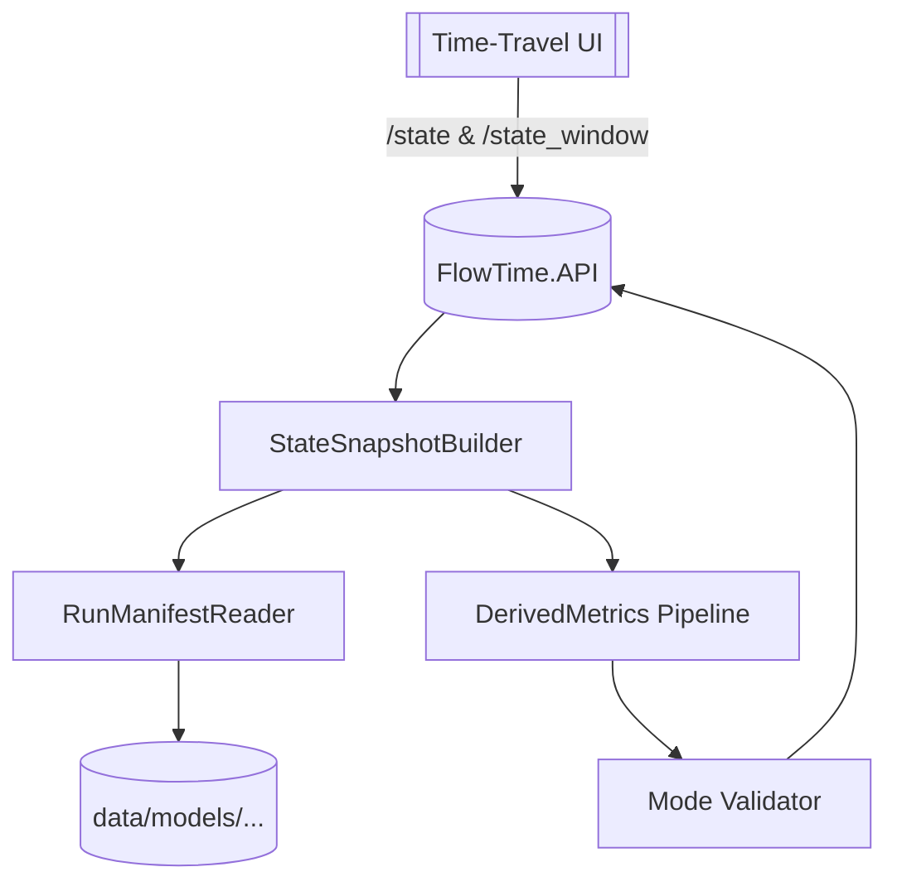
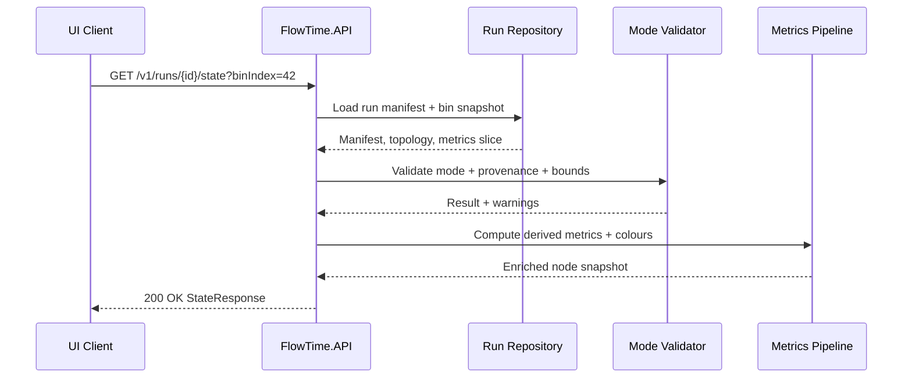

# M-03.01 — Time-Travel State APIs

**Status:** 📋 Planned  
**Dependencies:** M-03.00 (Engine Foundation + Fixtures), SIM-M-03.00 (Template Provenance & Telemetry Schema)  
**Target:** Ship mode-aware `/state` and `/state_window` responses that surface schema metadata, provenance hashes, and derived node metrics required by the time-travel UI.

---

## Overview

M-03.01 turns the Engine into a consumable source of time-travel state by layering API handlers, contracts, and validation on top of the canonical run artifacts produced in SIM-M-03.00. The milestone wires storage manifests to response DTOs, enforces per-mode validation rules, and emits a consistent metadata envelope so the UI and downstream tooling can reason about run provenance, schema compatibility, and derived metrics without reverse-engineering YAML templates.

### Strategic Context
- **Motivation:** The roadmap (`docs/architecture/time-travel/time-travel-planning-roadmap.md`) calls for Engine-owned `/state` and `/state_window` endpoints before UI work can progress.
- **Impact:** Centralising derived metrics (utilisation, Little’s Law latency, saturation colours) keeps telemetry replay and simulation parity, avoiding duplicated logic across clients.
- **Dependencies:** Requires M-03.00 fixture topology/window support and SIM-M-03.00 provenance metadata (mode/schema/hash) to be available in storage.

---

## Scope

### In Scope ✅
1. Implement `GET /v1/runs/{runId}/state?binIndex={n}` returning a single-bin snapshot with metadata, derived metrics, and provenance hashes.
2. Implement `GET /v1/runs/{runId}/state_window?startBin={a}&endBin={b}` returning multi-bin series with aligned timestamps.
3. Mode-aware validation that applies stricter failure rules for `simulation` runs and warning aggregation for `telemetry` runs.
4. Metadata envelope that echoes schema id/version, template mode, provenance hash, and storage path identifiers.
5. Unit, integration, and golden contract tests covering payload shape, error handling, and provenance enforcement.
6. Persist canonical artifact bundles (`model/model.yaml`, `metadata.json`, `provenance.json`) when `/v1/run` executes so `/state` can replay engine-generated runs.

### Out of Scope ❌
- TelemetryLoader ingestion of live CSVs (Engine M-03.02).
- Warning surface area in API payloads (structured warning payload deferred to M-03.03).
- UI changes, CLI support, or SDK integrations.
- Pagination or chunked streaming (`startBin`/`endBin` guardrails only).

### Future Work
- Integrate TelemetryLoader and live telemetry URIs (Engine M-03.02).
- Graduated warning/error policy and UI surfacing (Engine M-03.03).
- Performance tuning for very wide topologies (>100 nodes) if needed.

---

## Requirements

### Functional Requirements

#### FR1: `/state` Response Contract
**Description:** Provide a single-bin snapshot containing metadata, timestamps, per-node metrics, derived utilisation/latency/throughput, and telemetry provenance.

**Acceptance Criteria:**
- [ ] Responds `200 OK` with the JSON contract below when `runId` and `binIndex` are valid.
- [ ] Embeds `metadata.schema`, `metadata.mode`, and `metadata.provenanceHash` sourced from the run manifest.
- [ ] Includes `bin.startUtc`, `bin.endUtc`, and `bin.index` computed from the window grid.
- [ ] Returns `404` for unknown `runId`, `400` for out-of-range `binIndex`, and `422` when required topology/window metadata is missing.

**Example (`StateResponse`):**
```json
{
  "metadata": {
    "runId": "order-system-run",
    "templateId": "order-system",
    "schema": { "id": "time-travel/v1", "hash": "sha256-9f...", "version": "1.0.0" },
    "mode": "simulation",
    "provenanceHash": "sha256-c302...",
    "storage": "data/models/order-system/schema-time-travel-v1/mode-simulation/sha256-c302/model.yaml"
  },
  "bin": {
    "index": 42,
    "startUtc": "2025-10-07T03:30:00Z",
    "endUtc": "2025-10-07T03:35:00Z",
    "durationMinutes": 5
  },
  "nodes": [
    {
      "id": "OrderService",
      "kind": "service",
      "metrics": {
        "arrivals": 120,
        "served": 118,
        "capacity": 150,
        "queue": 8
      },
      "derived": {
        "utilization": 0.79,
        "latencyMinutes": 0.34,
        "throughputRatio": 0.98,
        "color": "yellow"
      },
      "telemetry": {
        "sources": ["file://examples/http-demo/order-service-served.csv"],
        "warnings": []
      }
    }
  ]
}
```

**Error Cases:**  
`GET /state` MUST return JSON:API-style error objects detailing parameter issues, missing metadata, or provenance mismatches.

#### FR2: `/state_window` Response Contract
**Description:** Provide a bounded slice of consecutive bins with aligned timestamp arrays and per-node series metrics.

**Acceptance Criteria:**
- [ ] Supports `startBin` and `endBin` inclusive, enforcing `0 <= startBin <= endBin < window.bins`.
- [ ] Returns `series.timestampsUtc[]` with length `endBin - startBin + 1`.
- [ ] Emits per-node arrays for `arrivals`, `served`, `capacity`, `queue`, and derived metrics aligned with timestamps.
- [ ] Returns `400` for inverted ranges or slices exceeding the configured maximum window length (default 288 bins).

**Example (`StateWindowResponse` excerpt):**
```json
{
  "metadata": { "...": "see FR1" },
  "window": {
    "startBin": 36,
    "endBin": 43,
    "timestampsUtc": [
      "2025-10-07T03:00:00Z",
      "2025-10-07T03:05:00Z",
      "2025-10-07T03:10:00Z"
    ]
  },
  "nodes": [
    {
      "id": "OrderQueue",
      "series": {
        "queue": [6, 8, 9],
        "arrivalRate": [124, 128, 133],
        "utilization": [0.62, 0.74, 0.81],
        "latencyMinutes": [0.29, 0.34, 0.38],
        "color": ["green", "yellow", "yellow"]
      }
    }
  ],
  "warnings": []
}
```

#### FR3: Mode-Aware Validation & Provenance Guardrails
**Description:** Ensure responses reflect template provenance and enforce per-mode expectations.

**Acceptance Criteria:**
- [ ] Responses include `metadata.mode` (`simulation` or `telemetry`) and optional `metadata.telemetrySourcesResolved` boolean.
- [ ] Simulation runs return `422` on missing metrics that violate schema, while telemetry runs aggregate missing/zero data into `warnings[]`.
- [ ] Provenance hash from storage must match the requested `runId`; mismatches trigger `409` with expected hash information.
- [ ] Validation failures emit structured error codes (`mode_validation_failed`, `provenance_mismatch`, etc.) documented for client consumption.

### Non-Functional Requirements

#### NFR1: Performance & Payload Size
**Target:** Handle slices up to 288 bins × 50 nodes with median response time ≤150 ms under local disk storage.  
**Validation:** Benchmark using fixture runs; document guardrails for larger slices.

#### NFR2: Forward-Only Compatibility
**Target:** The API only supports runs emitted by the M-03.00+ schema; legacy artifacts may be rejected immediately with a deterministic error.  
**Validation:** Integration test using a pre-M-03.00 manifest returns a `409 forward_incompatible` error without additional shims.

#### NFR3: Observability
**Target:** Emit structured logs for every request capturing runId, mode, slice size, and validation outcome; expose counters for provenance mismatches.  
**Validation:** Manual verification via integration tests + log snapshots.

---

## Inputs, Outputs & Schemas

### Inputs
- **Run manifest** (`data/models/{templateId}/schema-{schema}/mode-{mode}/{hash}/model.yaml`): Provides canonical YAML with `window`, `topology`, `telemetry` provenance.
- **Node telemetry snapshots** (materialised metric series per bin) stored alongside the manifest.
- **Request parameters:** `runId`, `binIndex`, `startBin`, `endBin`.

### Outputs

| Field | Type | Description |
|-------|------|-------------|
| `metadata.schema` | object | `{ id, version, hash }` describing the canonical schema emitted by TemplateService. |
| `metadata.mode` | string | `simulation` or `telemetry`, mapped from provenance metadata. |
| `metadata.provenanceHash` | string | SHA-256 hash of canonical YAML + fixtures; used to detect drift. |
| `bin` / `window` blocks | object | Captures temporal bounds and bin duration derived from the grid. |
| `nodes[].metrics` | object | Raw per-bin metrics (arrivals, served, queue, capacity, latency inputs). |
| `nodes[].derived` / `nodes[].series` | object | Computed values (utilisation, Little’s Law latency, throughput ratio, colour). |
| `nodes[].telemetry` | object | Optional `{ sources[], warnings[] }` describing resolved telemetry URIs and mode-specific warnings. |
| `warnings[]` | array | Validation messages (telemetry mode only) with `{ code, message, nodeId }`. |

### Schema References
- `docs/architecture/time-travel/time-travel-architecture-ch4-data-flows.md` — expected data contracts for UI.
- `docs/templates/fixtures.md` — lists telemetry fixtures referenced in metadata.
- `docs/schemas/time-travel-state.schema.json` (to be created if not present) — optional JSON Schema for responses (drafted in Phase 1).

---

## Technical Design

### Architecture Decisions
- **Minimal API Handlers:** Extend existing minimal APIs in `FlowTime.API` for consistent routing and dependency injection.
- **StateSnapshotBuilder:** Introduce a core service responsible for loading run manifests, resolving provenance, and feeding derived metrics.
- **Mode Validator Pipeline:** Implement a validation pipeline that executes mode-specific rules before serialising responses.
- **Contracts in `FlowTime.Contracts`:** Define DTOs for responses to ensure UI and tests share canonical shapes.
- **Integration via Fixture Storage:** Reuse M-03.00 fixtures for deterministic integration tests and golden responses.

### Component Diagram



### Data Flow



---

## Implementation Plan

### Phase 1: Contracts & Metadata Plumbing
**Goal:** Define DTOs, schema references, and manifest readers required by both endpoints.

**Tasks:**
1. Draft `StateResponse` / `StateWindowResponse` DTOs in `FlowTime.Contracts`, including metadata structures.
2. Implement `RunManifestReader` that loads canonical YAML, extracts schema id/hash, mode, and provenance.
3. Author JSON schema or Markdown contract reference for responses (adds to `docs/schemas/` if needed).

**Deliverables:**
- DTO classes with serialization attributes.
- Unit tests verifying manifest parsing and schema metadata extraction.
- Draft JSON Schema or Markdown table documenting response structure.

**Success Criteria:**
- [ ] Contracts serialise/deserialise round-trip in unit tests.
- [ ] Manifest reader resolves mode/hash for simulation and telemetry fixtures.

### Phase 2: Endpoint & Validation Pipeline
**Goal:** Implement `/state` and `/state_window` handlers with mode-aware validation.

**Tasks:**
1. Implement `StateSnapshotBuilder` to assemble per-bin node data and derived metrics.
2. Add validation pipeline enforcing mode-specific rules and provenance hash checks.
3. Wire minimal API endpoints and register services in `Program.cs`.

**Deliverables:**
- Handlers returning fully populated responses for fixture runs.
- Validation error objects and telemetry warning aggregation.

**Success Criteria:**
- [ ] `/state` returns expected payload for fixture run (`dotnet test` integration suite).
- [ ] `/state_window` returns aligned series for slice and rejects invalid ranges.
- [ ] Provenance mismatches surface as `409` with detailed error body.

### Phase 3: Testing, Observability & Docs
**Goal:** Lock in behaviour with comprehensive tests and documentation updates.

**Tasks:**
1. Add integration tests under `tests/FlowTime.API.Tests/StateEndpoints` covering happy paths and error cases.
2. Create golden snapshot tests for canonical fixture run responses.
3. Update docs (`FlowTime.API.http`, roadmap references) and add logging instrumentation.

**Deliverables:**
- Passing integration tests and golden files.
- Updated `.http` samples hitting new endpoints.
- Observability checks (structured logging assertions or manual verification notes).

**Success Criteria:**
- [ ] Golden tests detect schema changes.
- [ ] `.http` samples render full metadata envelope.
- [ ] Logs include run id, mode, slice size, and validation outcome.

---

## Test Plan

### Test-Driven Development Approach
Adopt RED → GREEN → REFACTOR by authoring failing unit tests for manifest parsing and derived metric helpers, then expanding to integration tests that fail until endpoints return the documented payloads. Golden snapshots lock stable responses before refactoring.

### Test Categories

#### Unit Tests
**Focus:** Manifest parsing, metadata extraction, derived metric calculations, validation helpers.  
**Key Test Cases:**
1. `RunManifestReaderTests.ReadAsync_ReturnsModeSchemaAndHash()`  
2. `DerivedMetricsTests.Utilization_CalculatesExpectedRatio()`  
3. `ModeValidatorTests.TelemetryMissingSeries_EmitsWarning()`  
4. `ModeValidatorTests.SimulationMissingSeries_ThrowsValidationException()`

#### Integration Tests
**Focus:** End-to-end API behaviour with fixture runs via `WebApplicationFactory<Program>`.  
**Key Test Cases:**
1. `StateEndpointTests.GetState_ReturnsSnapshotWithMetadata()`  
   - Setup: Load `order-system` fixture run; request `/state?binIndex=42`.  
   - Assert: Metadata fields populated; derived metrics match expected values.  
2. `StateEndpointTests.GetState_InvalidBin_Returns400()`  
3. `StateWindowEndpointTests.GetWindow_ReturnsAlignedSeries()`  
4. `StateWindowEndpointTests.ProvenanceMismatch_Returns409()`

#### Golden/Contract Tests
**Focus:** Snapshot responses compared against approved JSON.  
**Key Test Cases:**
1. `StateEndpointGoldenTests.FixtureRun_StateResponse_MatchesApprovedJson()`  
2. `StateWindowEndpointGoldenTests.FixtureRun_WindowResponse_MatchesApprovedJson()`

#### Observability Tests
**Focus:** Logging and metrics hooks.  
**Key Test Cases:**
1. `StateEndpointTests.LogsValidationOutcome()` (assert log events contain expected fields).

### Test Coverage Goals
- **Unit Tests:** Cover all derived metric branches, mode validation paths, and manifest parsing fallbacks.  
- **Integration Tests:** Cover happy paths for both endpoints, invalid parameter handling, provenance mismatch, and legacy manifest error.  
- **Golden Tests:** Lock canonical responses for at least one simulation and one telemetry fixture.

---

## Success Criteria

### Milestone Complete When
- [ ] `/state` and `/state_window` endpoints implemented with documented payloads and guardrails.
- [ ] Mode-aware validation differentiates simulation vs telemetry behaviours.
- [ ] Provenance hashes validated and surfaced in metadata + error responses.
- [ ] Unit, integration, and golden tests passing (`dotnet test FlowTime.sln`).
- [ ] Documentation (`FlowTime.API.http`, roadmap references) reflects new endpoints and payloads.
- [ ] Logging/observability requirements verified.

### Phase Completion
- **Phase 1 ✅**: Contracts serialise, manifest reader resolves metadata, schema documentation published.  
- **Phase 2 ✅**: Handlers return correct payloads, validation pipeline enforces mode/provenance, error handling verified.  
- **Phase 3 ✅**: Tests + docs updated, logging confirmed, milestone ready for execution tracking.

---

## File Impact Summary

### Files to Create
- `src/FlowTime.Contracts/TimeTravel/StateResponse.cs` — DTO for single-bin snapshot.
- `src/FlowTime.Contracts/TimeTravel/StateWindowResponse.cs` — DTO for window slice responses.
- `src/FlowTime.Core/TimeTravel/RunManifestReader.cs` — Loads metadata and provenance from canonical YAML.
- `src/FlowTime.Core/TimeTravel/DerivedMetrics.cs` — Utilisation, Little’s Law latency, colouring helpers.
- `src/FlowTime.API/TimeTravel/StateSnapshotBuilder.cs` — Aggregates node data for responses.
- `tests/FlowTime.Core.Tests/TimeTravel/DerivedMetricsTests.cs` — Unit coverage for metrics.
- `tests/FlowTime.API.Tests/TimeTravel/StateEndpointTests.cs` — Integration coverage.
- `tests/FlowTime.API.Tests/TimeTravel/StateWindowEndpointTests.cs` — Window slice coverage.
- `tests/FlowTime.API.Tests/TimeTravel/ApprovedResponses/` — Golden JSON fixtures.
- `docs/schemas/time-travel-state-response.schema.json` — Optional JSON Schema (if created in Phase 1).

### Files to Modify (Major)
- `src/FlowTime.API/Program.cs` — Register new endpoints and services.
- `src/FlowTime.API/FlowTime.API.csproj` — Add contract/core references as needed.
- `src/FlowTime.Core/FlowTime.Core.csproj` — Include new time-travel helpers.
- `src/FlowTime.Contracts/FlowTime.Contracts.csproj` — Register DTO namespace.
- `tests/FlowTime.API.Tests/FlowTime.API.Tests.csproj` — Wire golden fixture support.
- `docs/architecture/time-travel/time-travel-planning-roadmap.md` — Update milestone status references.
- `src/FlowTime.API/FlowTime.API.http` & `src/FlowTime.Sim.Service/FlowTime.Sim.Service.http` — Add request examples.

### Files to Modify (Minor)
- `docs/architecture/time-travel/time-travel-planning-decisions.md` — Cross-reference validation decisions if phrasing changes.
- `docs/templates/README.md` — Ensure metadata references align with emitted responses.
- `.editorconfig` or logging configuration if structured logging needs adjustments.

### Optional
- Golden fixtures under `tests/FlowTime.API.Tests/TimeTravel/Fixtures/`.

---

## References
- `docs/architecture/time-travel/time-travel-planning-roadmap.md`
- `docs/architecture/time-travel/time-travel-planning-decisions.md`
- `docs/architecture/time-travel/time-travel-architecture-ch4-data-flows.md`
- `docs/milestones/M-03.00.md`, `docs/milestones/SIM-M-03.00.md`
- `docs/templates/fixtures.md`
