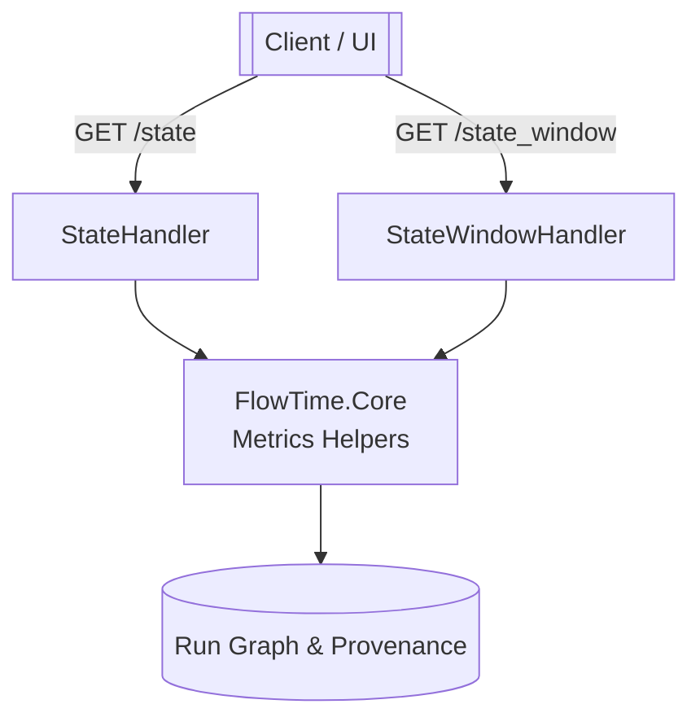

# M-03.01 — Time-Travel APIs

**Status:** 📋 Planned  
**Dependencies:** M-03.00 (Foundation + Fixtures), M-03.00.01 (Shared Expression Validation Library)  
**Target:** Deliver `/state` and `/state_window` endpoints that expose per-bin node metrics, derived utilization/latency data, and node-coloring signals required by the time-travel UI.

---

## Overview

M-03.01 implements the backend surface that powers the time-travel experience. Using the fixtures and schema work completed in M-03.00, the Engine will expose REST endpoints that return bin-level snapshots and time slices, compute derived metrics centrally, and apply the node-coloring contract defined in the time-travel architecture chapters.

### Strategic Context
- **Motivation:** The UI requires precise bin snapshots and series slices to drive scrubber interactions (`time-travel-planning-roadmap.md`).  
- **Impact:** Backend-derived utilization/latency keeps business logic consistent across telemetry replay and simulation comparisons (`time-travel-planning-decisions.md` Q1/Q5).  
- **Dependencies:** M-03.00 supplied window/topology semantics and fixtures; M-03.00.01 ensures Engine and FlowTime.Sim share expression validation before consuming these APIs.

---

## Scope

### In Scope ✅
1. Implement `GET /v1/runs/{runId}/state?binIndex=` returning a single bin snapshot (window metadata, timestamps, node metrics, derived utilization/latency, node colors).
2. Implement `GET /v1/runs/{runId}/state_window?startBin=&endBin=` returning a multi-bin slice with aligned timestamp series.
3. Add derived metric computations (utilization, Little’s Law latency, throughput ratios) and node-coloring rules per service/queue SLA thresholds.
4. Graceful handling of missing data (null capacity, zero served, queue absent).
5. Unit, integration, and golden tests covering contract shape, metric math, and error cases.

### Out of Scope ❌
- TelemetryLoader integration or ADX ingestion (M-03.02).
- UI changes (covered in UI milestones).
- Advanced pagination or streaming (follow-ups if needed).

### Future Work
- Pagination and large-response optimisations if UI demands (post M-03.01).
- Configurable coloring thresholds beyond SLA defaults.

---

## Requirements

### Functional Requirements

#### FR1: `/state` endpoint
- Returns run metadata, window/grid info, bin timestamps, node metrics, derived utilization/latency/throughput, and node colors.
- Supports provenance-driven mode field (`simulation`/`telemetry` from M-03 fixtures).
- Handles invalid `runId`/`binIndex` with informative errors.

#### FR2: `/state_window` endpoint
- Returns slice metadata (`startBin`, `endBin`, `timestamps`) plus per-node series arrays for required metrics.
- Validates window bounds and ensures timestamps align to bin size.

#### FR3: Derived Metrics & Coloring
- Utilization: `served / capacity` when capacity provided; null otherwise.
- Latency (Little’s Law): `(queue / served) * binMinutes`, null when served is 0.
- Throughput ratio: `served / arrivals`.
- Coloring rules per roadmap (services: green <0.7, yellow 0.7‑0.9, red ≥0.9; queues via SLA ratios; gray when metrics unavailable).

### Non-Functional Requirements

#### NFR1: Backward Compatibility
- Runs lacking window/topology semantics return appropriate 4xx with clear messaging (leveraging M-03.00 fixtures).

#### NFR2: Performance & Response Size
- Responses should be efficient for typical slices (≤288 bins × ≤50 nodes); guardrails (e.g., bin count limits) documented if necessary.

#### NFR3: Observability
- Log requests, derived metric anomalies (e.g., missing capacity) and coloring decisions for debugging.

---

## Technical Design

### Architecture Decisions
- Implement endpoints using the existing Minimal API pattern (no controllers) to stay consistent with current Engine surface.
- Follow roadmap deliverables for metrics/coloring logic (`time-travel-planning-roadmap.md` M-03.01, `time-travel-planning-decisions.md` Q1/Q5).
- Introduce dedicated metric helpers (Utilization/Latency/Coloring) under `FlowTime.Core` to keep API handlers thin and reusable.
- Add contracts in `FlowTime.Contracts` so both Engine and UI consume strongly-typed responses.
- Use existing fixture runs from M-03.00 for integration/golden tests to avoid external dependencies.

### Component Diagram (conceptual)

---

## Implementation Plan

### Phase 1: Contracts & Metrics
1. Add response DTOs (`StateResponse`, `StateWindowResponse`, `NodeState`, etc.) under `FlowTime.Contracts`.
2. Implement metric helpers (`UtilizationComputer`, `LatencyComputer`, `ColoringRules`) under `FlowTime.Core`.
3. Unit-test derived metric logic and color thresholds.

### Phase 2: API Handlers
1. Add new handlers (e.g., `StateHandler`, `StateWindowHandler`) and wire endpoints in `FlowTime.API`.
2. Implement retrieval workflow: load run metadata (fixtures), compute timestamps, call metric helpers, assemble responses.
3. Handle validation (invalid run, bin out-of-range, missing topology/window).

### Phase 3: Testing & Docs
1. Integration tests hitting the new endpoints with M-03.00 fixtures (success + error cases).
2. Golden tests verifying deterministic responses for known fixture runs.
3. Update developer docs (if required) to point to new endpoints and contracts.

---

## Test Plan

### TDD Approach
1. Start with unit tests for metric/coloring logic (utilization, latency, null handling) and run them red → green.
2. Add API contract tests for `/state` and `/state_window`, ensuring they fail before implementation and pass after.
3. Create golden tests using fixture runs to lock response shape/values, following the red/green workflow.

### Test Cases
- Utilization/latency calculations across various scenarios (capacity present/missing, zero queue/served).
- Coloring thresholds for services and queues, including gray fallback.
- `/state` happy path and invalid inputs.
- `/state_window` with varying slice sizes, bounds, and error handling.
- Golden snapshot verifying consistent outputs for fixture run `run_abc123`.

---

## Success Criteria
- [ ] `/state` endpoint returns expected payload for fixture run (unit + integration tests passing).
- [ ] `/state_window` endpoint returns aligned timestamped series for given slices.
- [ ] Derived metrics and coloring apply correctly across services and queues, including null scenarios.
- [ ] Full test suite (`dotnet test FlowTime.sln`) passes with new projects referenced.
- [ ] Documentation/tests updated to cover new endpoints and contracts.

---

## File Impact Summary

### Files to Modify
- `FlowTime.sln`
- `src/FlowTime.API/Program.cs` (endpoint registration)
- `src/FlowTime.API/*` (new handlers and wiring)
- `src/FlowTime.Core/FlowTime.Core.csproj`
- `src/FlowTime.Core/*` (metrics helpers)
- `tests/FlowTime.API.Tests/*`

### Files to Create
- `src/FlowTime.API/Handlers/StateHandler.cs`
- `src/FlowTime.API/Handlers/StateWindowHandler.cs`
- `src/FlowTime.Contracts/StateResponse.cs`
- `src/FlowTime.Contracts/StateWindowResponse.cs`
- `src/FlowTime.Contracts/NodeState.cs`
- `src/FlowTime.Core/Metrics/UtilizationComputer.cs`
- `src/FlowTime.Core/Metrics/LatencyComputer.cs`
- `src/FlowTime.Core/Metrics/ColoringRules.cs`
- `tests/FlowTime.API.Tests/StateEndpointTests.cs`
- `tests/FlowTime.API.Tests/StateWindowEndpointTests.cs`
- `tests/FlowTime.Core.Tests/MetricsTests.cs`
- Optional: golden fixtures under `tests/FlowTime.API.Tests/Fixtures/`.

---

## References
- `docs/architecture/time-travel/time-travel-planning-roadmap.md` (M-03.01 deliverables, ACs, test plan)
- `docs/architecture/time-travel/time-travel-planning-decisions.md` (Q1/Q5 decisions about /state priority, null handling)
- `docs/architecture/time-travel/time-travel-architecture-ch4-data-flows.md` (UI/data flow expectations)
- `docs/milestones/M-03.00.md`, `docs/milestones/M-03.00.01.md` (prerequisite work)
