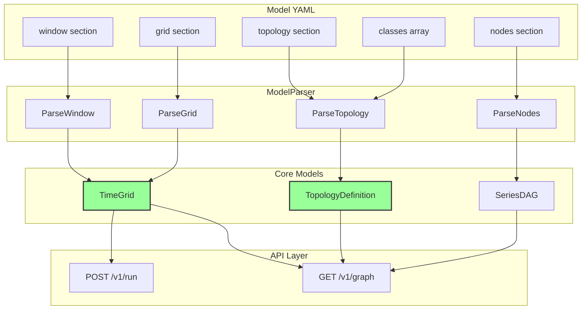
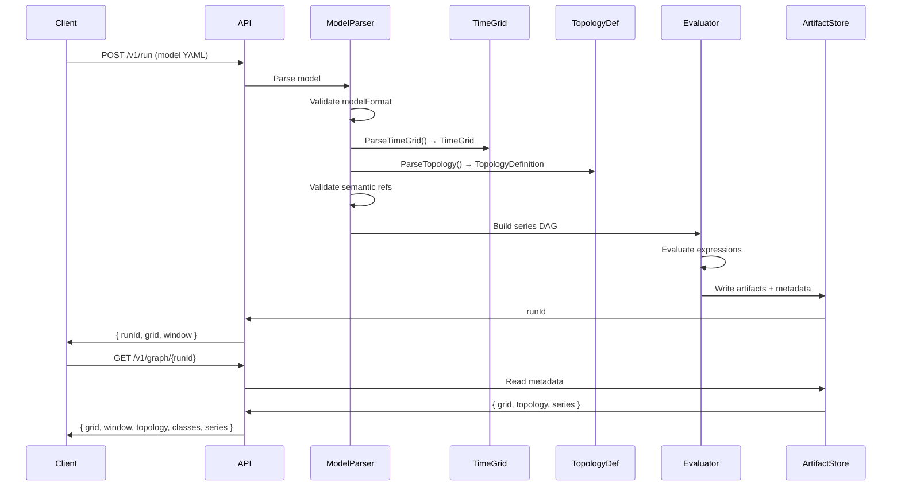

# M3.0 — Time-Travel Foundation (Window + Topology Schema)

**Status:** 📋 Planned  
**Dependencies:** ✅ M2.9 (Schema Evolution), ✅ M2.10 (Provenance Query)  
**Target:** Extend model schema to support absolute time and topology/semantics layer

---

## Overview

M3.0 establishes the foundation for time-travel functionality by adding absolute time anchoring (window) and topology/semantics layer to the model schema. This enables the engine to map bin indices to UTC timestamps and understand which series represent "queue" vs "arrivals" vs "capacity", preparing for time-series state APIs in M3.1.

### Strategic Context

- **Motivation**: Without absolute time, engine can't answer "what was the state at 2PM on Oct 7?" Without topology/semantics, engine doesn't know which series represent queues, arrivals, or capacity.
- **Impact**: Schema becomes time-travel ready. Models can express both time dimensions and logical flow structure.
- **Dependencies**: Builds on M2.9's schema evolution infrastructure (`modelFormat` versioning)
- **Gold-First Alignment**: This milestone establishes the **unified schema** that serves both:
  - **Gold Snapshot Mode**: Topology semantics map to `const *_gold` series (from Gold MVs)
  - **Model-Only Mode**: Topology semantics map to `expr` or `pmf` series (from Sim/templates)
  - Same API, same Engine evaluation, different data sources

---

## Scope

### In Scope ✅

1. **Schema Extensions** (Backward Compatible)
   - Add `window` section (start time, timezone, end time derivation)
   - Add `topology` section (nodes, edges, semantics)
   - Add `classes` top-level field (flow classes, single-class for M3.0)
   - Add `modelFormat: "1.1"` versioning

2. **Core Engine Changes**
   - Extend `TimeGrid` with `StartTimeUtc` property (internal) and `GetBinTimeUtc(index)` helper
   - Add Topology model classes (`TopologyDefinition`, `TopologyNode`, `TopologyEdge`, `SemanticMapping`)
   - Update `ModelParser` to parse and validate window + topology sections
   - Implement strict validation for `modelFormat: "1.1"` models

3. **API Enhancements**
   - Extend `POST /v1/run` response with `window` object
   - Extend `GET /v1/graph` response with `window`, `topology`, and `classes`
   - Ensure `binMinutes` appears in all API responses (derived from `binSize` × `binUnit`)
   - Note: `window.start` is the authoritative timestamp source (no redundant `grid.startTimeUtc`)

4. **Validation Rules**
   - Strict mode for `modelFormat: "1.1"` (reject malformed window/topology)
   - Lenient mode for `modelFormat: "1.0"` or absent (defaults + warnings)
   - Semantic reference validation (topology.semantics.* must reference existing nodes)
   - Topology DAG validation (no cycles in edges)

5. **Backward Compatibility**
   - Models without `window`/`topology` continue to work (legacy mode)
   - Default `window.start` to epoch (1970-01-01T00:00:00Z) when absent
   - Default `classes` to `["*"]` (single-class) when absent

6. **Sample Model Files**
   - Create example models in `examples/m3/` demonstrating new schema

### Out of Scope ❌

- ❌ **Gold Adapter** (GoldToModel transformation) - Deferred to M3.2
- ❌ **State APIs** (`/state`, `/state_window`) - Deferred to M3.1
- ❌ **Queue expressions with SHIFT** - Deferred to M3.1
- ❌ **Latency derivation** - Deferred to M3.1
- ❌ `oldest_age_s` calculation - Deferred (always `null` in M3.0, schema placeholder only)
- ❌ **Multi-class flows** - Deferred to M4.0+
- ❌ **Router nodes** - Deferred to M3.3
- ❌ **Overlay scenarios** (Gold + modeled) - Deferred to M3.4
- ❌ **UI integration** - Separate UI milestone

### Future Work

- **M3.1**: State APIs + Queue expressions with SHIFT
- **M3.2**: Latency + Capacity metrics
- **M3.3**: Routing + Conservation validation
- **M4.0+**: Multi-class flows, Router nodes, Age tracking

---

## Requirements

### Functional Requirements

#### FR1: Window Section Schema

**Description:** Models can specify absolute time window for simulation

**Schema:**

```yaml
window:
  start: "2025-10-07T00:00:00Z"  # ISO-8601 UTC (bin 0 timestamp)
  timezone: "UTC"                 # MUST be "UTC" when present
  # end is derived: start + (bins × binSize × binUnit)
```

**Acceptance Criteria:**
- [ ] `window.start` parsed as ISO-8601 UTC DateTime
- [ ] `window.timezone` validated to be "UTC" (reject others)
- [ ] `window.end` derived from `start + (bins × binSize × binUnit)`
- [ ] Missing `window` section defaults to epoch (1970-01-01T00:00:00Z) in lenient mode
- [ ] `modelFormat: "1.1"` with missing/malformed `window` rejected (strict mode)

**Examples:**

```yaml
# Valid: 7 days of hourly data starting Oct 7, 2025
window:
  start: "2025-10-07T00:00:00Z"
  timezone: "UTC"

grid:
  bins: 168
  binSize: 1
  binUnit: "hours"
# Derived: end = "2025-10-14T00:00:00Z"
```

**Error Cases:**
- ❌ `window.start` not ISO-8601 → Validation error
- ❌ `window.timezone` != "UTC" → Validation error
- ❌ `modelFormat: "1.1"` with missing `window` → Validation error

---

#### FR2: Topology Section Schema

**Description:** Models can define logical topology (nodes, edges, semantics)

**Schema:**

```yaml
topology:
  nodes:
    - id: "OrderService"           # Logical node name
      kind: "service"              # {service|queue|router|external}
      group: "Orders"              # OPTIONAL: UI grouping
      ports: ["in", "out"]         # OPTIONAL: UI hint
      ui:                          # OPTIONAL: UI coordinates
        x: 120
        y: 260
      semantics:                   # Map meaning → series id
        arrivals: "orders_arrivals"    # REQUIRED for service/queue
        capacity: "orders_capacity"    # REQUIRED for service
        served: "orders_served"        # REQUIRED for service/queue
        errors: "orders_errors"        # OPTIONAL
        queue: null                    # null for service, REQUIRED for queue
        latency_min: null              # OPTIONAL (engine derives if absent)
        replicas: null                 # OPTIONAL (for autoscale later)
        sla_min: 5.0                   # OPTIONAL constant SLA target (minutes)
        oldest_age_s: null             # OPTIONAL (always null in M3.0 - not implemented)
    
    - id: "OrderQueue"
      kind: "queue"
      group: "Orders"
      semantics:
        arrivals: "queue_inflow"
        served: "queue_outflow"
        queue: "queue_backlog"       # REQUIRED for queue kind
        q0: 0                        # OPTIONAL: initial queue state (default 0)
        oldest_age_s: null           # OPTIONAL (deferred - not implemented in M3.0)
  
  edges:
    - id: "e1"
      from: "OrderService:out"
      to: "OrderQueue:in"
```

**Acceptance Criteria:**
- [ ] `topology.nodes[*].kind` validated to be {service, queue, router, external}
- [ ] `topology.nodes[kind=service]` must have: arrivals, capacity, served semantics
- [ ] `topology.nodes[kind=queue]` must have: arrivals, served, queue semantics
- [ ] `topology.nodes[*].semantics.*` must reference existing `nodes[*].id`
- [ ] `topology.edges[*].from/to` must reference existing topology nodes
- [ ] No cycles in topology edges (DAG validation)
- [ ] Missing `topology` section skips topology validation (legacy mode)
- [ ] `oldest_age_s` always returns `null` in API responses (not calculated in M3.0)

**Examples:**

```yaml
# Valid: Service with capacity
topology:
  nodes:
    - id: "OrderService"
      kind: "service"
      semantics:
        arrivals: "orders_arrivals"
        capacity: "orders_capacity"
        served: "orders_served"
```

**Error Cases:**
- ❌ `kind=service` missing `capacity` semantic → Validation error
- ❌ `kind=queue` missing `queue` semantic → Validation error
- ❌ `semantics.arrivals` references non-existent node → Validation error
- ❌ Cycle in edges (e.g., A→B→C→A) → Validation error

---

#### FR3: Flow Classes Schema

**Description:** Models can specify flow classes (single-class in M3.0)

**Schema:**

```yaml
classes: ["*"]  # Single-class for M3.0, multi-class later
```

**Acceptance Criteria:**
- [ ] `classes` field parsed as array of strings
- [ ] Default to `["*"]` when absent
- [ ] M3.0 only supports single-class (validate length == 1)
- [ ] Multi-class deferred to M4.0+ (reject if length > 1)

**Examples:**

```yaml
# Valid: Single-class
classes: ["*"]

# Invalid in M3.0: Multi-class (deferred)
classes: ["Order", "Refund"]  # Rejected in M3.0
```

---

#### FR4: TimeGrid Extensions

**Description:** TimeGrid tracks absolute start time and provides UTC timestamp helpers

**Changes:**

```csharp
public class TimeGrid
{
    public int Bins { get; }
    public int BinSize { get; }
    public string BinUnit { get; }
    public int BinMinutes { get; }  // Derived: binSize × toMinutes(binUnit)
    
    // NEW: Internal property (NOT exposed in API responses - use window.start instead)
    public DateTime? StartTimeUtc { get; }  // null for legacy models
    
    // NEW: Helper for internal calculations
    public DateTime? GetBinTimeUtc(int binIndex)
    {
        if (StartTimeUtc == null) return null;
        return StartTimeUtc.Value.AddMinutes(binIndex * BinMinutes);
    }
}
```

**Design Note:** `StartTimeUtc` is an internal property used for calculations within the engine. API responses expose `window.start` as the authoritative timestamp source to avoid redundancy.

**Acceptance Criteria:**
- [ ] `StartTimeUtc` populated from `window.start` when present
- [ ] `StartTimeUtc` is `null` for legacy models (no window section)
- [ ] `GetBinTimeUtc(index)` returns correct UTC timestamp
- [ ] `GetBinTimeUtc(0)` returns `window.start`
- [ ] `GetBinTimeUtc(bins-1)` returns last bin start (not end)
- [ ] `BinMinutes` correctly derived for all units (minutes/hours/days/weeks)
- [ ] API responses use `window.start` (not `grid.startTimeUtc`)

**Examples:**

```csharp
// Model with window.start = "2025-10-07T00:00:00Z", binSize=1, binUnit="hours"
var grid = timeGrid;
Assert.Equal(60, grid.BinMinutes);  // 1 hour = 60 minutes
Assert.Equal(new DateTime(2025, 10, 7, 0, 0, 0, DateTimeKind.Utc), grid.StartTimeUtc);
Assert.Equal(new DateTime(2025, 10, 7, 14, 0, 0, DateTimeKind.Utc), grid.GetBinTimeUtc(14));

// Legacy model (no window)
var legacyGrid = timeGridLegacy;
Assert.Null(legacyGrid.StartTimeUtc);
Assert.Null(legacyGrid.GetBinTimeUtc(14));
```

---

#### FR5: Topology Model Classes

**Description:** New classes to represent topology structure

**Classes:**

```csharp
public class TopologyDefinition
{
    public List<TopologyNode> Nodes { get; set; } = new();
    public List<TopologyEdge> Edges { get; set; } = new();
    public List<string> Classes { get; set; } = new() { "*" };
}

public class TopologyNode
{
    public string Id { get; set; } = string.Empty;
    public NodeKind Kind { get; set; }
    public string? Group { get; set; }
    public List<string>? Ports { get; set; }
    public UiCoordinates? Ui { get; set; }
    public SemanticMapping Semantics { get; set; } = new();
}

public class TopologyEdge
{
    public string Id { get; set; } = string.Empty;
    public string From { get; set; } = string.Empty;
    public string To { get; set; } = string.Empty;
}

public class SemanticMapping
{
    public string? Arrivals { get; set; }
    public string? Capacity { get; set; }
    public string? Served { get; set; }
    public string? Errors { get; set; }
    public string? Queue { get; set; }
    public double? Q0 { get; set; }  // Initial queue state
    public string? LatencyMin { get; set; }
    public string? Replicas { get; set; }
    public double? SlaMin { get; set; }
    public string? OldestAgeS { get; set; }  // Always null in M3.0 (placeholder)
}

public enum NodeKind
{
    Service,
    Queue,
    Router,
    External
}

public class UiCoordinates
{
    public double X { get; set; }
    public double Y { get; set; }
}
```

**Acceptance Criteria:**
- [ ] All classes serialize/deserialize to/from YAML correctly
- [ ] `TopologyNode.Kind` enum maps to string values (service, queue, router, external)
- [ ] `SemanticMapping.OldestAgeS` always `null` (not calculated in M3.0)
- [ ] Optional fields (Group, Ports, Ui) handle null correctly

---

#### FR6: ModelParser Updates

**Description:** ModelParser extracts and validates window + topology sections

**Changes:**

```csharp
public class ModelParser
{
    // NEW:
    public TopologyDefinition? Topology { get; private set; }
    
    // UPDATED:
    public TimeGrid ParseTimeGrid(YamlDocument doc)
    {
        var window = doc.GetOptionalSection("window");
        DateTime? startTimeUtc = null;
        
        if (window != null)
        {
            startTimeUtc = ParseIso8601Utc(window["start"]);
            ValidateTimezone(window["timezone"]); // Must be "UTC"
        }
        else if (modelFormat == "1.1")
        {
            throw new ValidationException("modelFormat 1.1 requires window section");
        }
        
        return new TimeGrid(bins, binSize, binUnit, startTimeUtc);
    }
    
    // NEW:
    public TopologyDefinition? ParseTopology(YamlDocument doc)
    {
        var topologySection = doc.GetOptionalSection("topology");
        if (topologySection == null) return null;
        
        var topology = DeserializeTopology(topologySection);
        ValidateTopology(topology);  // Semantic refs, DAG check, required fields
        return topology;
    }
}
```

**Acceptance Criteria:**
- [ ] `ParseTimeGrid()` extracts `window.start` when present
- [ ] `ParseTimeGrid()` defaults to `null` startTimeUtc for legacy models
- [ ] `ParseTimeGrid()` throws for `modelFormat: "1.1"` with missing window
- [ ] `ParseTopology()` returns `null` for models without topology section
- [ ] `ParseTopology()` validates semantic references
- [ ] `ParseTopology()` validates required semantics per node kind
- [ ] `ParseTopology()` performs DAG cycle detection on edges

---

#### FR7: API Response Extensions

**Description:** API responses include window, topology, and binMinutes

**POST /v1/run Response:**

```json
{
  "runId": "run_20251007T143000Z_abc123",
  "status": "completed",
  "grid": { 
    "bins": 168, 
    "binSize": 1, 
    "binUnit": "hours",
    "binMinutes": 60  // NEW: Derived for timestamp calculations
  },
  "window": {         // NEW: Absolute time bounds
    "start": "2025-10-07T00:00:00Z",
    "end": "2025-10-14T00:00:00Z",
    "timezone": "UTC"
  },
  "outputs": ["orders_arrivals", "queue_backlog"]
}
```

**GET /v1/graph Response:**

```json
{
  "grid": { 
    "bins": 168, 
    "binSize": 1, 
    "binUnit": "hours",
    "binMinutes": 60  // NEW: Derived for timestamp calculations
  },
  "window": {         // NEW: Absolute time bounds
    "start": "2025-10-07T00:00:00Z",
    "end": "2025-10-14T00:00:00Z",
    "timezone": "UTC"
  },
  "classes": ["*"],   // NEW
  "topology": {                                // NEW
    "nodes": [
      {
        "id": "OrderService",
        "kind": "service",
        "group": "Orders",
        "ports": ["in", "out"],
        "ui": { "x": 120, "y": 260 },
        "semantics": {
          "arrivals": "orders_arrivals",
          "capacity": "orders_capacity",
          "served": "orders_served",
          "sla_min": 5.0,
          "oldest_age_s": null
        }
      }
    ],
    "edges": [
      { "id": "e1", "from": "OrderService:out", "to": "OrderQueue:in" }
    ]
  },
  "series": {                                  // EXISTING: Series DAG
    "nodes": ["orders_arrivals", "orders_served"],
    "order": ["orders_arrivals", "orders_capacity", "orders_served"],
    "edges": [
      { "id": "orders_served", "inputs": ["orders_arrivals", "orders_capacity"] }
    ]
  }
}
```

**Acceptance Criteria:**
- [ ] `POST /v1/run` includes `grid.binMinutes` in response
- [ ] `POST /v1/run` includes `window` object when model has window
- [ ] `GET /v1/graph` includes `window` when model has window
- [ ] `GET /v1/graph` includes `topology` when model has topology
- [ ] `GET /v1/graph` includes `classes` array
- [ ] `GET /v1/graph` includes `binMinutes` in grid object
- [ ] Legacy models (no window/topology) return appropriate defaults/nulls
- [ ] `oldest_age_s` always `null` in responses (not calculated)
- [ ] Clients use `window.start` (not `grid.startTimeUtc`) for timestamp calculations

---

#### FR8: binMinutes Derivation

**Description:** Engine derives and exposes `binMinutes` for client ergonomics

**Derivation Formula:**

```
binMinutes = binSize × toMinutes(binUnit)

where toMinutes(binUnit):
  "minutes" → 1
  "hours"   → 60
  "days"    → 1440
  "weeks"   → 10080
```

**Rationale:**
1. **Timestamp arithmetic**: Clients compute `timestamp = window.start + (binIndex × binMinutes)` without unit logic
2. **Latency derivation**: Little's Law requires `latency_min = (queue / throughput) × binMinutes`
3. **Rate normalization**: Convert bin-level counts to per-minute rates: `rate = count / binMinutes`
4. **Avoid unit bugs**: Single integer scalar prevents float drift and enum-to-minutes errors in 3+ client implementations

**Acceptance Criteria:**
- [ ] `binMinutes` correctly derived for `binUnit="minutes"` (binSize × 1)
- [ ] `binMinutes` correctly derived for `binUnit="hours"` (binSize × 60)
- [ ] `binMinutes` correctly derived for `binUnit="days"` (binSize × 1440)
- [ ] `binMinutes` correctly derived for `binUnit="weeks"` (binSize × 10080)
- [ ] `binMinutes` appears in `/v1/run` response
- [ ] `binMinutes` appears in `/v1/graph` response
- [ ] `binMinutes` used internally for TimeGrid calculations

**Examples:**

```yaml
# 5-minute bins
binSize: 5, binUnit: "minutes" → binMinutes: 5

# 1-hour bins
binSize: 1, binUnit: "hours"   → binMinutes: 60

# 1-day bins
binSize: 1, binUnit: "days"    → binMinutes: 1440

# 2-hour bins
binSize: 2, binUnit: "hours"   → binMinutes: 120
```

---

### Non-Functional Requirements

#### NFR1: Backward Compatibility

**Target:** Models without window/topology continue to work

**Validation:**
- [ ] Legacy models (schemaVersion="1.0", no window/topology) evaluate successfully
- [ ] Legacy models default to epoch start time (1970-01-01T00:00:00Z) internally
- [ ] Legacy models return `null` or omit `window` in API responses
- [ ] Legacy models return empty/null `topology` in `/v1/graph`
- [ ] Warnings logged for missing window/topology in lenient mode

---

#### NFR2: Strict Validation for modelFormat 1.1

**Target:** `modelFormat: "1.1"` models strictly validated

**Validation:**
- [ ] Reject if `window` section missing or malformed
- [ ] Reject if `window.timezone` != "UTC"
- [ ] Reject if `topology` present but malformed
- [ ] Reject if semantic references are invalid
- [ ] Reject if required semantics missing per node kind
- [ ] No defaulting or lenient fallback for 1.1 models

---

#### NFR3: Performance

**Target:** Parsing overhead minimal

**Validation:**
- [ ] Topology parsing adds < 5ms to model parsing time (typical model)
- [ ] No impact on series evaluation performance
- [ ] Memory footprint increase < 10% for models with topology

---

## Technical Design

### Architecture Decisions

**Decision:** Use optional sections with strict/lenient modes

**Rationale:** 
- Allows backward compatibility (legacy models work)
- Enables gradual migration (`modelFormat: "1.0"` → `"1.1"`)
- Strict mode (`"1.1"`) prevents ambiguity for time-travel models

**Alternatives Considered:**
- ❌ Require window/topology for all models (breaks backward compat)
- ❌ No validation modes (too permissive, hard to debug)

---

**Decision:** Topology is passive metadata (not executable)

**Rationale:**
- Engine evaluates series DAG (expressions), not topology
- Topology provides semantic meaning for API queries (M3.1+)
- Keeps engine pure (spreadsheet-like)

**Alternatives Considered:**
- ❌ Topology drives evaluation (too complex, abandons series-first principle)

---

**Decision:** `binMinutes` derived and exposed (not stored)

**Rationale:**
- Single scalar simplifies client timestamp math
- Avoids unit conversion bugs in UI/CLI
- Consistent with Gold table conventions (discrete bins)

**Alternatives Considered:**
- ❌ Clients recompute from `binUnit` (error-prone, inconsistent)

---

### Component Diagram



---

### Data Flow



---

## Implementation Plan

### Phase 1: Core Schema & Validation

**Goal:** Add schema classes and validation logic

**Tasks:**
1. **Create Topology model classes**
   - [ ] Write test: `Test_TopologyNode_Serializes_ToYaml`
   - [ ] Write test: `Test_SemanticMapping_Handles_OptionalFields`
   - [ ] Implement: `TopologyDefinition`, `TopologyNode`, `TopologyEdge`, `SemanticMapping`
   - [ ] Implement: `NodeKind` enum
   - [ ] Verify: Tests pass

2. **Extend TimeGrid with StartTimeUtc**
   - [ ] Write test: `Test_TimeGrid_With_StartTimeUtc`
   - [ ] Write test: `Test_TimeGrid_GetBinTimeUtc_Returns_CorrectTimestamp`
   - [ ] Write test: `Test_TimeGrid_Legacy_Returns_Null_StartTime`
   - [ ] Implement: Add `StartTimeUtc` property
   - [ ] Implement: Add `GetBinTimeUtc(int index)` method
   - [ ] Verify: Tests pass

3. **Update ModelParser for window section**
   - [ ] Write test: `Test_ParseWindow_ValidIso8601Utc`
   - [ ] Write test: `Test_ParseWindow_RejectsNonUtcTimezone`
   - [ ] Write test: `Test_ParseWindow_DefaultsToEpoch_LenientMode`
   - [ ] Write test: `Test_ParseWindow_Rejects_Missing_StrictMode`
   - [ ] Implement: `ParseWindow()` method
   - [ ] Implement: ISO-8601 parsing + timezone validation
   - [ ] Verify: Tests pass

4. **Update ModelParser for topology section**
   - [ ] Write test: `Test_ParseTopology_ValidServiceNode`
   - [ ] Write test: `Test_ParseTopology_ValidQueueNode`
   - [ ] Write test: `Test_ParseTopology_RejectsInvalidSemanticRef`
   - [ ] Write test: `Test_ParseTopology_RejectsMissingRequiredSemantic`
   - [ ] Write test: `Test_ParseTopology_DetectsCycle`
   - [ ] Implement: `ParseTopology()` method
   - [ ] Implement: Semantic reference validation
   - [ ] Implement: DAG cycle detection
   - [ ] Verify: Tests pass

**Deliverables:**
- All model classes implemented and tested
- ModelParser extracts window + topology
- Validation rules enforced

**Success Criteria:**
- [ ] All unit tests passing (100% coverage of new code)
- [ ] Schema validation prevents invalid models

---

### Phase 2: API Integration

**Goal:** Expose window/topology in API responses

**Tasks:**
1. **Extend POST /v1/run response**
   - [ ] Write test: `Test_RunEndpoint_Returns_Window_When_Present`
   - [ ] Write test: `Test_RunEndpoint_Omits_Window_Legacy`
   - [ ] Write test: `Test_RunEndpoint_Includes_BinMinutes`
   - [ ] Implement: Add `window` to response DTO
   - [ ] Implement: Ensure `binMinutes` in grid response
   - [ ] Verify: Integration tests pass

2. **Extend GET /v1/graph response**
   - [ ] Write test: `Test_GraphEndpoint_Returns_Window_When_Present`
   - [ ] Write test: `Test_GraphEndpoint_Returns_Topology_When_Present`
   - [ ] Write test: `Test_GraphEndpoint_Returns_Classes`
   - [ ] Write test: `Test_GraphEndpoint_Omits_Topology_Legacy`
   - [ ] Write test: `Test_GraphEndpoint_Includes_BinMinutes`
   - [ ] Write test: `Test_Clients_Use_Window_Start_For_Timestamps`
   - [ ] Implement: Add `window` to response DTO
   - [ ] Implement: Add `topology` to response DTO
   - [ ] Implement: Add `classes` to response
   - [ ] Implement: Ensure `binMinutes` in grid response
   - [ ] Verify: Integration tests pass

**Deliverables:**
- API responses include new fields
- Legacy models handled gracefully

**Success Criteria:**
- [ ] All API integration tests passing
- [ ] `.http` examples updated and working
- [ ] Backward compatibility verified

---

### Phase 3: Sample Models & Documentation

**Goal:** Create example models demonstrating new schema

**Tasks:**
1. **Create sample models**
   - [ ] Create: `examples/m3/simple-service.yaml` (service with window)
   - [ ] Create: `examples/m3/service-with-queue.yaml` (topology with semantics)
   - [ ] Create: `examples/m3/legacy-compat.yaml` (no window/topology - still works)
   - [ ] Verify: All samples parse and run successfully

2. **Update documentation**
   - [ ] Update: `docs/schemas/model.schema.md` (add window/topology sections)
   - [ ] Create: `docs/concepts/time-travel-foundation.md` (explain M3.0 additions)
   - [ ] Update: `docs/api/endpoints.md` (document new response fields)
   - [ ] Update: Migration guide for existing models

**Deliverables:**
- Working sample models in `examples/m3/`
- Complete schema documentation
- Migration guide for users

**Success Criteria:**
- [ ] Sample models run end-to-end
- [ ] Documentation is clear and complete
- [ ] Migration path documented

---

## Test Plan

### Test-Driven Development Approach

**Strategy:** RED → GREEN → REFACTOR

All implementation follows strict TDD:
1. **RED**: Write failing test first
2. **GREEN**: Implement minimal code to pass
3. **REFACTOR**: Clean up while keeping tests green

### Test Categories

#### Unit Tests

**Focus:** Validate individual components in isolation

**Key Test Cases:**

1. **TimeGrid Tests** (`tests/FlowTime.Core.Tests/TimeGrid/TimeGridTests.cs`)
   - `Test_TimeGrid_BinMinutes_Derived_Minutes()` - binUnit="minutes" → binSize × 1
   - `Test_TimeGrid_BinMinutes_Derived_Hours()` - binUnit="hours" → binSize × 60
   - `Test_TimeGrid_BinMinutes_Derived_Days()` - binUnit="days" → binSize × 1440
   - `Test_TimeGrid_BinMinutes_Derived_Weeks()` - binUnit="weeks" → binSize × 10080
   - `Test_TimeGrid_StartTimeUtc_Populated_When_Window_Present()` - Sets StartTimeUtc
   - `Test_TimeGrid_StartTimeUtc_Null_When_Window_Absent()` - Legacy mode
   - `Test_TimeGrid_GetBinTimeUtc_Returns_CorrectTimestamp()` - Bin 0 → start time
   - `Test_TimeGrid_GetBinTimeUtc_Returns_Null_Legacy()` - Legacy returns null

2. **Topology Model Tests** (`tests/FlowTime.Core.Tests/Topology/TopologyModelTests.cs`)
   - `Test_TopologyNode_Serializes_ToYaml()` - Round-trip YAML serialization
   - `Test_TopologyNode_Deserializes_FromYaml()` - Parse from YAML
   - `Test_SemanticMapping_Handles_OptionalFields()` - Nulls don't break
   - `Test_NodeKind_Enum_Maps_ToStrings()` - service/queue/router/external
   - `Test_OldestAgeS_Always_Null()` - Not calculated in M3.0

3. **Window Parsing Tests** (`tests/FlowTime.Core.Tests/Parsing/WindowParsingTests.cs`)
   - `Test_ParseWindow_ValidIso8601Utc()` - "2025-10-07T00:00:00Z" parsed
   - `Test_ParseWindow_RejectsNonIso8601()` - "10/7/2025" rejected
   - `Test_ParseWindow_RejectsNonUtcTimezone()` - timezone="PST" rejected
   - `Test_ParseWindow_StrictMode_RejectsMissing()` - modelFormat="1.1" strict
   - `Test_ParseWindow_LenientMode_DefaultsToEpoch()` - modelFormat="1.0" defaults
   - `Test_ParseWindow_DerivesEndTime()` - end = start + bins × binMinutes

4. **Topology Parsing Tests** (`tests/FlowTime.Core.Tests/Parsing/TopologyParsingTests.cs`)
   - `Test_ParseTopology_ValidServiceNode()` - Service with required semantics
   - `Test_ParseTopology_ValidQueueNode()` - Queue with required semantics
   - `Test_ParseTopology_RejectsInvalidSemanticRef()` - arrivals="nonexistent" rejected
   - `Test_ParseTopology_RejectsMissingRequiredSemantic()` - service missing capacity
   - `Test_ParseTopology_DetectsCycle()` - A→B→C→A rejected
   - `Test_ParseTopology_ReturnsNull_WhenAbsent()` - Legacy mode

5. **Validation Tests** (`tests/FlowTime.Core.Tests/Validation/SchemaValidationTests.cs`)
   - `Test_Validation_Accepts_ModelFormat_1_1_Valid()` - Strict mode accepts valid
   - `Test_Validation_Rejects_ModelFormat_1_1_MalformedWindow()` - Strict rejects
   - `Test_Validation_Accepts_ModelFormat_1_0_Missing_Window()` - Lenient accepts
   - `Test_Validation_Warns_ModelFormat_1_0_Missing_Window()` - Lenient warns
   - `Test_Validation_Rejects_Service_Missing_Capacity()` - Required semantic
   - `Test_Validation_Rejects_Queue_Missing_Queue()` - Required semantic
   - `Test_Validation_Rejects_Topology_Cycle()` - DAG validation

#### Integration Tests

**Focus:** Validate end-to-end workflows with real engine

**Key Test Cases:**

1. **API Integration Tests** (`tests/FlowTime.API.Tests/TimeTravel/M3_0_IntegrationTests.cs`)
   - `Test_RunEndpoint_Returns_Window_When_Present()` - POST /v1/run response includes window
   - `Test_RunEndpoint_Omits_Window_Legacy()` - Legacy model omits window
   - `Test_RunEndpoint_Includes_BinMinutes()` - Derived field present in grid
   - `Test_GraphEndpoint_Returns_Window_When_Present()` - GET /v1/graph response includes window
   - `Test_GraphEndpoint_Returns_Topology_When_Present()` - GET /v1/graph response includes topology
   - `Test_GraphEndpoint_Returns_Classes()` - classes array present
   - `Test_GraphEndpoint_Omits_Topology_Legacy()` - Legacy model omits topology
   - `Test_GraphEndpoint_Includes_BinMinutes()` - Derived field present in grid
   - `Test_Clients_Use_Window_Start_For_Timestamps()` - Verify window.start is authoritative

2. **Sample Model Tests** (`tests/FlowTime.Core.Tests/Samples/M3_SampleTests.cs`)
   - `Test_SimpleService_Parses_And_Runs()` - examples/m3/simple-service.yaml
   - `Test_ServiceWithQueue_Parses_And_Runs()` - examples/m3/service-with-queue.yaml
   - `Test_LegacyCompat_Parses_And_Runs()` - examples/m3/legacy-compat.yaml

3. **Backward Compatibility Tests** (`tests/FlowTime.Core.Tests/Compatibility/BackwardCompatTests.cs`)
   - `Test_Legacy_Model_Evaluates_Successfully()` - No window/topology
   - `Test_Legacy_Model_Omits_Window_In_Response()` - Window not in API response
   - `Test_Legacy_Model_Logs_Warning()` - Lenient mode warns

### Test Coverage Goals

- **Unit Tests:** 100% coverage of new code (TimeGrid, Topology models, parsing, validation)
- **Integration Tests:** All API endpoints return correct new fields (window is authoritative, no redundant grid.startTimeUtc)
- **Sample Tests:** All example models parse and run successfully
- **Backward Compat:** Legacy models continue to work without errors

---

## Success Criteria

### Milestone Complete When:

- [ ] All functional requirements implemented
- [ ] All tests passing (unit + integration + sample)
  - [ ] TimeGrid tests (8 tests)
  - [ ] Topology model tests (5 tests)
  - [ ] Window parsing tests (6 tests)
  - [ ] Topology parsing tests (6 tests)
  - [ ] Validation tests (8 tests)
  - [ ] API integration tests (9 tests)
  - [ ] Sample model tests (3 tests)
  - [ ] Backward compatibility tests (3 tests)
- [ ] Documentation updated
  - [ ] Schema documentation
  - [ ] Concept documentation
  - [ ] API documentation
  - [ ] Migration guide
- [ ] Sample models working
  - [ ] `examples/m3/simple-service.yaml`
  - [ ] `examples/m3/service-with-queue.yaml`
  - [ ] `examples/m3/legacy-compat.yaml`
- [ ] Backward compatibility verified
  - [ ] Legacy models run without errors
  - [ ] Appropriate warnings logged
- [ ] API responses include new fields
  - [ ] `binMinutes` in all responses (grid object)
  - [ ] `window` in POST /v1/run and GET /v1/graph
  - [ ] `topology` in GET /v1/graph
  - [ ] No redundant `grid.startTimeUtc` (use `window.start` instead)
- [ ] Build passes, no regressions

---

## File Impact Summary

### Files to Create

**Core:**
- `src/FlowTime.Core/Topology/TopologyDefinition.cs` - Main topology model
- `src/FlowTime.Core/Topology/TopologyNode.cs` - Node model
- `src/FlowTime.Core/Topology/TopologyEdge.cs` - Edge model
- `src/FlowTime.Core/Topology/SemanticMapping.cs` - Semantic mapping model
- `src/FlowTime.Core/Topology/NodeKind.cs` - Node kind enum
- `src/FlowTime.Core/Topology/UiCoordinates.cs` - UI coordinate model

**Tests:**
- `tests/FlowTime.Core.Tests/TimeGrid/TimeGridTests.cs` - TimeGrid tests
- `tests/FlowTime.Core.Tests/Topology/TopologyModelTests.cs` - Topology model tests
- `tests/FlowTime.Core.Tests/Parsing/WindowParsingTests.cs` - Window parsing tests
- `tests/FlowTime.Core.Tests/Parsing/TopologyParsingTests.cs` - Topology parsing tests
- `tests/FlowTime.Core.Tests/Validation/SchemaValidationTests.cs` - Validation tests
- `tests/FlowTime.API.Tests/TimeTravel/M3_0_IntegrationTests.cs` - API integration tests
- `tests/FlowTime.Core.Tests/Samples/M3_SampleTests.cs` - Sample model tests
- `tests/FlowTime.Core.Tests/Compatibility/BackwardCompatTests.cs` - Backward compat tests

**Samples:**
- `examples/m3/simple-service.yaml` - Simple service with window
- `examples/m3/service-with-queue.yaml` - Service + queue with topology
- `examples/m3/legacy-compat.yaml` - Legacy model (no window/topology)

**Documentation:**
- `docs/concepts/time-travel-foundation.md` - Concept documentation
- `docs/architecture/m3-window-topology.md` - Architecture notes

### Files to Modify (Major Changes)

**Core:**
- `src/FlowTime.Core/TimeGrid.cs` - Add StartTimeUtc, GetBinTimeUtc(), BinMinutes derivation
- `src/FlowTime.Core/Parsing/ModelParser.cs` - Add ParseWindow(), ParseTopology()
- `src/FlowTime.Core/Validation/ModelValidator.cs` - Add window/topology validation

**API:**
- `src/FlowTime.API/Models/RunResponseDto.cs` - Add window object
- `src/FlowTime.API/Models/GraphResponseDto.cs` - Add window, topology, classes
- `src/FlowTime.API/Endpoints/RunEndpoint.cs` - Populate window in response
- `src/FlowTime.API/Endpoints/GraphEndpoint.cs` - Populate window, topology, classes in response

**Documentation:**
- `docs/schemas/model.schema.md` - Add window, topology, classes sections
- `docs/api/endpoints.md` - Document new response fields
- `README.md` - Update with M3.0 status

### Files to Modify (Minor Changes)

- `src/FlowTime.API/FlowTime.API.http` - Add examples using new schema
- `docs/ROADMAP.md` - Update with M3.0 completion status

---

## Migration Guide

### For Existing Models

**No action required** - existing models continue to work in legacy mode.

**Optional migration** to enable time-travel features:

**Step 1:** Add `modelFormat` and `window` section:

```yaml
schemaVersion: "1.0"
modelFormat: "1.1"  # Enable strict validation

window:
  start: "2025-10-07T00:00:00Z"
  timezone: "UTC"

grid:
  bins: 168
  binSize: 1
  binUnit: "hours"
```

**Step 2:** Add `classes` array (single-class for now):

```yaml
classes: ["*"]
```

**Step 3:** Add `topology` section (optional but recommended):

```yaml
topology:
  nodes:
    - id: "MyService"
      kind: "service"
      semantics:
        arrivals: "my_arrivals"
        capacity: "my_capacity"
        served: "my_served"
```

**Step 4:** Test model:

```bash
# Should parse without errors
curl -X POST http://localhost:8080/v1/run \
  -H "Content-Type: text/plain" \
  --data-binary @my-model.yaml

# Check response includes window and topology
curl http://localhost:8080/v1/graph/{runId}
```

### For API Clients

**New fields available** in responses:

- `grid.binMinutes` - Use for timestamp calculations and Little's Law latency
- `window.start` - Bin 0 timestamp (authoritative source, not duplicated in grid)
- `window.end` - Derived end timestamp
- `topology` - Logical node/edge structure (null for legacy models)
- `classes` - Flow classes array

**Timestamp calculation pattern:**
```javascript
// Compute timestamp for bin index
const timestamp = new Date(window.start).getTime() + (binIndex * grid.binMinutes * 60 * 1000);
```

**Backward compatible** - existing API clients ignore new fields.

---

## Notes

### Design Rationale

1. **Why separate window and grid?**
   - `grid` describes discrete structure (bins, size, unit)
   - `window` anchors grid to absolute time
   - Separation allows models with grid but no time anchor (legacy)

2. **Why topology as passive metadata?**
   - Engine evaluates series DAG (expressions), not topology
   - Topology provides semantic meaning for APIs (M3.1 state queries)
   - Keeps engine pure (spreadsheet-like, no hidden logic)

3. **Why no `grid.startTimeUtc` in API responses?**
   - Redundant with `window.start` (single source of truth)
   - TimeGrid internally has `StartTimeUtc` property for calculations
   - API exposes `window.start` as authoritative timestamp
   - Eliminates confusion about which field to use

4. **Why `oldest_age_s` in schema but always null?**
   - Schema placeholder for future enhancement (age tracking)
   - M3.0 only tracks queue depth via Little's Law latency
   - Deferring age tracking avoids premature complexity

5. **Why strict/lenient validation modes?**
   - Enables gradual migration (1.0 → 1.1)
   - Strict mode prevents ambiguity for time-travel models
   - Lenient mode maintains backward compatibility

### Related Milestones

- **M2.9**: Schema evolution infrastructure (modelFormat versioning)
- **M3.1**: State APIs + Queue expressions with SHIFT
- **M3.2**: Latency + Capacity metrics
- **M3.3**: Routing + Conservation validation
- **M4.0+**: Multi-class flows, Router nodes

---

## Appendix: Complete Example Model

```yaml
schemaVersion: "1.0"
modelFormat: "1.1"

# Absolute time window
window:
  start: "2025-10-07T00:00:00Z"
  timezone: "UTC"

# Discrete time grid
grid:
  bins: 168
  binSize: 1
  binUnit: "hours"

# Flow classes (single-class for M3.0)
classes: ["*"]

# Logical topology
topology:
  nodes:
    - id: "OrderService"
      kind: "service"
      group: "Orders"
      ui: { x: 100, y: 200 }
      semantics:
        arrivals: "orders_arrivals"
        capacity: "orders_capacity"
        served: "orders_served"
        sla_min: 5.0
    
    - id: "OrderQueue"
      kind: "queue"
      group: "Orders"
      ui: { x: 300, y: 200 }
      semantics:
        arrivals: "queue_inflow"
        served: "queue_outflow"
        queue: "queue_backlog"
        q0: 0
        oldest_age_s: null  # Not calculated in M3.0
  
  edges:
    - id: "e1"
      from: "OrderService:out"
      to: "OrderQueue:in"

# Series definitions
nodes:
  - id: orders_arrivals
    kind: const
    values: [100, 120, 150, 140, ...]
  
  - id: orders_capacity
    kind: const
    values: [200, 200, 200, 200, ...]
  
  - id: orders_served
    kind: expr
    expr: "MIN(orders_arrivals, orders_capacity)"
  
  - id: queue_inflow
    kind: expr
    expr: "MAX(0, orders_arrivals - orders_capacity)"
  
  - id: queue_backlog
    kind: const  # Will use expr with SHIFT in M3.1
    values: [0, 0, 0, 0, ...]
  
  - id: queue_outflow
    kind: const
    values: [0, 0, 0, 0, ...]

outputs:
  - orders_arrivals
  - orders_served
  - queue_backlog
  - queue_outflow

provenance:
  generatedAt: "2025-10-07T14:30:00Z"
  generator: "flowtime-sim"
  version: "0.9.0"
```
