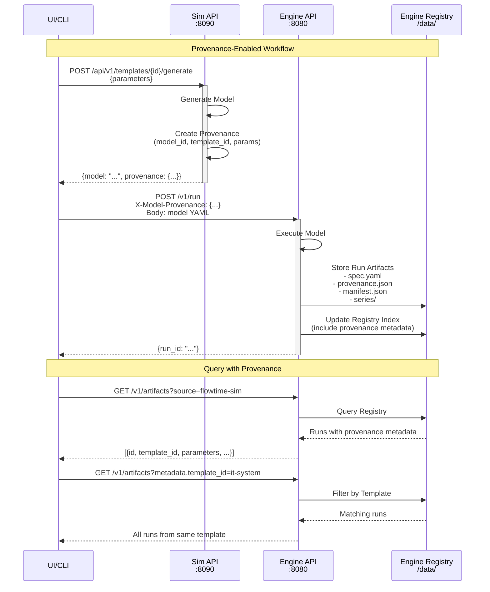

# SIM-M2.7 — Model Provenance Integration

**Status:** 📋 Planned  
**Dependencies:** SIM-M2.6.1 (Schema Evolution), Engine M2.9 (Provenance Acceptance)  
**Target:** Complete provenance traceability from template to run  
**Version:** 0.5.0 → 0.6.0 (minor feature addition)  
**Date:** 2025-10-22

---

## Goal

Enable **complete provenance traceability** by having Sim generate provenance metadata that Engine stores with run artifacts. Every run can be traced back to its source template and parameter values.

**Architecture Principle**: Sim is stateless. Engine owns the registry. UI orchestrates.

---

## Context

### The Provenance Problem

When Engine executes a Sim-generated model, we currently lose the trail:
- Which template generated this model?
- What parameter values were used?
- Can we reproduce this exact model?
- Which runs came from the same template?

**Solution**: Sim generates provenance metadata, UI passes it to Engine, Engine stores it with run artifacts.
### KISS Architecture

**Service Separation**:
- **Sim**: Generates models + provenance (stateless, no storage)
- **Engine**: Executes models + stores everything (single source of truth)
- **UI**: Orchestrates workflow (calls Sim, then Engine)

**Critical Rule**: Sim and Engine DO NOT talk to each other directly. UI is the orchestrator.

---

## Functional Requirements

### FR-SIM-M2.7-1: Provenance Metadata Generation

Sim generates provenance for every model.

**Provenance Schema** (JSON):
- source: "flowtime-sim"
- model_id: "model_{timestamp}_{hash}"
- template_id: string
- template_version: string
- template_title: string
- parameters: object
- generated_at: ISO8601 timestamp
- sim_version: string
- schema_version: string

**Model ID Generation**:
- Format: model_{timestamp}_{hash}
- Deterministic: Same template + parameters = reproducible hash
- Unique: Timestamp ensures global uniqueness

**Acceptance**:
- Every generated model has unique model_id
- model_id is deterministic for reproducibility
- Provenance includes all template and parameter information
- Provenance serializes to JSON correctly

---

### FR-SIM-M2.7-2: Enhanced /api/v1/templates/{id}/generate Endpoint

Return both model and provenance from generate endpoint.

**Enhanced Response** (SIM-M2.7):
{
  "model": "schemaVersion: 1\n...",
  "provenance": {...}
}

**Query Parameter**:
- `?embed_provenance=true` - Embeds provenance in model YAML (see FR-SIM-M2.7-5)
- Default (false) - Returns provenance separately

**Backward Compatibility**: Existing callers can ignore provenance field.

**Acceptance**:
- /generate returns both model and provenance
- Supports both separate and embedded provenance modes
- Backward compatible (additive change)
- API documentation updated

---

### FR-SIM-M2.7-3: Engine Provenance Acceptance

**Coordinate with Engine Team**: Engine must accept and store provenance metadata.

**Engine /v1/run Enhancement**:
POST /v1/run with X-Model-Provenance header (JSON string)

**Engine Storage**:
/data/run_*/provenance.json

**Engine Registry Integration**:
- Include template_id, model_id in registry metadata
- Support queries by source, template_id

**Note**: This is Engine-side implementation. SIM-M2.7 provides the provenance format specification.

**Acceptance** (Engine validation):
- Engine accepts X-Model-Provenance header
- Engine stores provenance.json in run artifacts
- Engine registry includes provenance metadata
- Engine queries support template/model filtering

---

### FR-SIM-M2.7-4: CLI Provenance Output

CLI can save provenance to file for template development workflows.

**Usage**:
flowtime-sim generate --template it-system --params bins=12 --output model.yaml --provenance provenance.json

**Use Case**: Template authors developing without Engine running.

**Acceptance**:
- CLI --provenance flag saves metadata to file
- Provenance file format matches API response

---

### FR-SIM-M2.7-5: Embedded Provenance Support

Support embedding provenance directly in model YAML as alternative to separate delivery.

**Motivation**: Self-contained model files for file-based workflows (CLI, scripts, sharing).

**Embedded Format**:
```yaml
schemaVersion: 1

# Optional provenance section
provenance:
  source: flowtime-sim
  model_id: model_20250925T120000Z_abc123def
  template_id: it-system-microservices
  template_version: "1.0"
  template_title: "IT System - Microservices"
  generated_at: "2025-09-25T12:00:00Z"
  generator: "flowtime-sim/0.5.0"
  schema_version: "1"
  parameters:
    bins: 12
    binSize: 1
    binUnit: hours
    loadBalancerCapacity: 300

# Execution spec follows
grid:
  bins: 12
  binSize: 1
  binUnit: hours
nodes:
  # ...
```

**API Support**:
```bash
POST /api/v1/templates/{id}/generate?embed_provenance=true
```

**CLI Support**:
```bash
flowtime-sim generate --template it-system --output model.yaml --embed-provenance
```

**Benefits**:
- Self-contained model files (provenance travels with model)
- Simpler file-based workflows
- No header coordination needed
- Engine supports both embedded and header delivery

**Acceptance**:
- API `?embed_provenance=true` returns model with embedded provenance
- CLI `--embed-provenance` flag embeds provenance in output file
- Provenance section placed after schemaVersion, before grid
- Engine successfully extracts embedded provenance
- Backward compatible (provenance section is optional)

---

## Integration Points

### Integration Architecture



### Engine M2.9 Coordination

**Dependency**: Engine must implement provenance acceptance in parallel.

**Interface Contract**:
- Header: X-Model-Provenance (JSON string)
- Storage: provenance.json in run artifacts
- Registry: Include provenance in metadata

**Timeline**: Parallel development with SIM-M2.7.

---

### UI Orchestration

**UI Workflow**:
1. Call Sim: POST /api/v1/templates/{id}/generate
2. Receive: {model, provenance}
3. Call Engine: POST /v1/run with model body + provenance header
4. Display: Show provenance in run details

**Query Capabilities** (via Engine registry):
- Find all runs from specific template
- Compare runs with different parameters
- Filter by model_id for exact reproducibility

**Note**: UI-side implementation. SIM-M2.7 provides the provenance data.

---

### Template System

**No Changes Required**: Templates already contain all information needed for provenance.

---

## Technical Architecture

### Provenance Service

**Responsibilities**:
- Generate unique model_id
- Create provenance metadata structure
- Serialize to JSON

**Model ID Algorithm**:
1. Create content string: {templateId}:{parametersJson}
2. Compute SHA-256 hash
3. Take first 8 characters of hash (hex lowercase)
4. Format: model_{timestamp}_{hash}

**Determinism**: Same inputs → same hash portion. Timestamp ensures uniqueness.

---

### API Response Enhancement

**Minimal Change**: Add provenance field to existing response.

**Implementation**:
1. Generate model (existing logic)
2. Create provenance (new service)
3. Return both in response object

---

## Acceptance Criteria

### Provenance Generation
- Unique model_id for every generated model
- Deterministic hash for reproducibility
- All template and parameter data captured
- JSON serialization correct

### API Enhancement
- /generate returns model + provenance
- Backward compatible
- API documentation complete

### Engine Integration
- Provenance format spec documented
- Interface contract clear
- Integration tested end-to-end

### CLI Support
- CLI outputs provenance to separate file (--provenance)
- CLI embeds provenance in model file (--embed-provenance)
- File formats match API response

### Embedded Provenance
- API supports ?embed_provenance=true query parameter
- CLI supports --embed-provenance flag
- Provenance section correctly positioned in YAML
- Engine extracts embedded provenance successfully
- Backward compatible (optional feature)

### Testing
- Unit tests for provenance service
- Unit tests for provenance embedding
- API integration tests (separate and embedded modes)
- CLI tests (both flag options)
- Model ID determinism tests
- End-to-end validation with Engine

---

## Implementation Plan

### Phase 1: Provenance Service (Week 1)

**Files to Create**:
- src/FlowTime.Sim.Core/Models/ProvenanceMetadata.cs
- src/FlowTime.Sim.Core/Services/IProvenanceService.cs
- src/FlowTime.Sim.Core/Services/ProvenanceService.cs

**Deliverable**: Working provenance service with tests

---

### Phase 2: API Enhancement (Week 1)

**Files to Modify**:
- src/FlowTime.Sim.Service/Program.cs (minimal API endpoints)
- src/FlowTime.Sim.Core/Services/ModelGenerator.cs (add embedding logic)
- tests/FlowTime.Sim.Tests/Api/TemplatesEndpointTests.cs

**Tasks**:
1. Add provenance embedding method to ModelGenerator
2. Add `?embed_provenance` query parameter to /generate endpoint
3. Return embedded or separate provenance based on parameter
4. Add API tests for both modes

**Deliverable**: Enhanced API endpoint with embedded provenance support

---

### Phase 3: CLI Support (Week 1)

**Files to Modify**:
- src/FlowTime.Sim.Cli/Commands/GenerateCommand.cs
- tests/FlowTime.Sim.Tests/Cli/GenerateCommandTests.cs

**Tasks**:
1. Add `--provenance <file>` option for separate file output
2. Add `--embed-provenance` flag for embedded mode
3. Mutual exclusivity: Can't use both flags together
4. Add CLI tests for both modes

**Deliverable**: CLI with --provenance and --embed-provenance flags

---

### Phase 4: Documentation (Week 1-2)

**Documents to Update**:
- API documentation
- CLI documentation
- Integration guide for Engine team

**Deliverable**: Complete documentation

---

### Phase 5: Engine Coordination (Week 2)

**Activities**:
- Share provenance schema with Engine team
- Review Engine implementation
- Integration testing
- Resolve any issues

**Deliverable**: Validated end-to-end integration

---

## Breaking Changes

**None**. This is an additive change.

**Version**: 0.5.0 → 0.6.0 (minor version bump for new feature)

---

## Risk Mitigation

### Risk: Engine M2.9 Delayed

**Mitigation**: Define clear interface contract early. Can release Sim-side independently.

### Risk: Provenance Schema Changes

**Mitigation**: Version provenance schema. Review with Engine team early.

### Risk: Model ID Collisions

**Mitigation**: Timestamp + hash ensures uniqueness. Test collision resistance.

---

## Success Metrics

- 100% of Sim-generated runs have provenance
- All runs traceable to source template
- Zero Sim storage (stateless)
- Single source of truth (Engine)

---

## Related Documents

- Architecture: docs/architecture/registry-integration.md
- Schema Evolution: docs/milestones/SIM-M2.6.1.md

---

## Next Steps

**After SIM-M2.7**:
1. SIM-M2.8: Template enhancements
2. SIM-M3.0: Charter-aligned model authoring

---

## Revision History

| Date | Change | Author |
|------|--------|--------|
| 2025-10-01 | Created with KISS architecture and provenance focus | Assistant |

---

**Milestone**: SIM-M2.7  
**Status**: Planned  
**Priority**: Medium  
**Effort**: 1-2 weeks  
**Impact**: Additive (no breaking changes)
