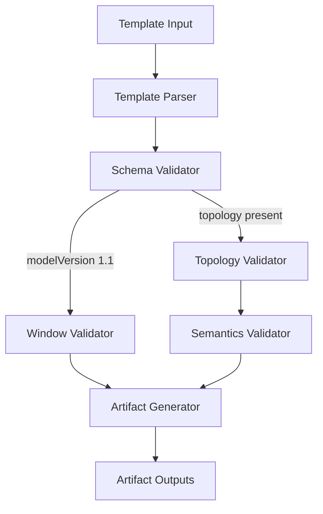
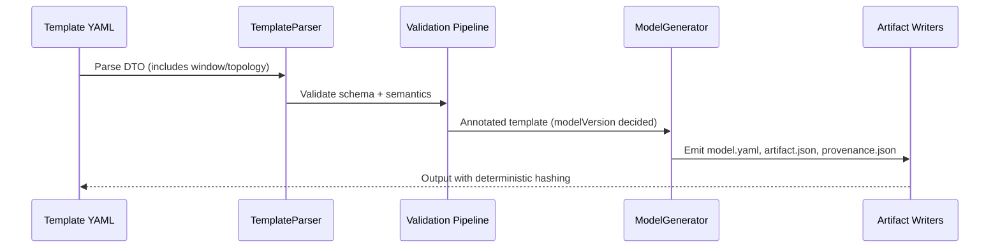

# SIM-M3.0 — Time-Travel Foundations for FlowTime-Sim

**Status:** 📋 Planned  
**Dependencies:** SIM-M2.6.1 (Template Schema Hardening), SIM-M2.7 (Registry Preparation)  
**Target:** FlowTime-Sim generates and validates model artifacts with window and topology semantics (modelVersion 1.1) while remaining backward compatible.

---

## Overview

This milestone equips FlowTime-Sim with the schema and validation primitives required for time-travel scenarios. Templates, generators, and artifacts gain awareness of absolute time windows, logical topology, and semantic mappings so that FlowTime Engine M3.x can reconstruct timelines, connect queues and services, and expose replay APIs.

### Strategic Context
- **Motivation:** Time-travel features in FlowTime Engine expect window anchoring, topology graphs, and semantic roles that FlowTime-Sim does not yet emit.
- **Impact:** Template authors can produce model artifacts that are immediately consumable by the engine’s time-travel surfaces without hand editing.
- **Dependencies:** Prior milestones hardened template parsing and registry integration; this work builds atop those contracts.

---

## Scope

### In Scope ✅
1. Extend template schema and DTOs to capture `window`, `modelVersion`, `classes`, and `topology` sections.
2. Update generation pipeline so emitted YAML artifacts persist the new sections with correct parameter substitution.
3. Introduce validation covering window semantics, topology structure, semantic mappings, and backward compatibility rules.
4. Surface schema and validation updates through CLI/service outputs and documentation.

### Out of Scope ❌
- ❌ Template catalog expansion beyond existing five exemplars.
- ❌ Engine-side replay APIs or UI time-scrubber implementation.
- ❌ Live telemetry ingestion or streaming replay pipelines.

### Future Work
- Extend templates with richer topology motifs (routers, fan-out) in M3.1+.
- Full validation framework with 29 error codes tracked in M3.3.
- Integration and performance testing against FlowTime Engine in M3.4.

---

## Requirements

### Functional Requirements

#### FR1: Model Schema Extension

**Description:** Templates and emitted models MUST support the new schema elements needed for time-travel while remaining backward compatible.

**Acceptance Criteria:**
- [ ] Template DTOs accept `window.start` (ISO-8601 UTC), optional `window.timezone` (defaults to `UTC`), and optional `classes` array.
- [ ] `modelVersion` defaults to `1.0`; generator sets `1.1` whenever `window` or `topology` is present.
- [ ] Generated YAML preserves insertion order and formatting consistent with existing artifacts.
- [ ] Parameter substitution functions correctly in nested objects (e.g., `${startTimestamp}` inside `window.start`).

**Example (expected artifact fragment):**

```yaml
schemaVersion: 1
modelVersion: 1.1
window:
  start: "{{ISO8601-UTC-START}}"
  timezone: "UTC"
classes:
  - "*"
```

**Error Cases:**
- Missing `window.start` when `topology` references `queue` semantics ⇒ validation error `Window.MissingStart`.
- Non-UTC timezone provided ⇒ validation error `Window.UnsupportedTimezone`.

#### FR2: Topology and Semantics Mapping

**Description:** Logical nodes and edges describe how series relate, and semantics map to data-series identifiers.

**Acceptance Criteria:**
- [ ] Topology nodes support fields `id`, `kind`, `group`, `ports`, `ui`, and `semantics`.
- [ ] Required semantics per node kind:  
  - `service`: `arrivals`, `capacity`, `served`  
  - `queue`: `arrivals`, `served`, `queue`  
  - `router`: `arrivals`, `served`  
- [ ] Optional semantics (`errors`, `latency_min`, `sla_min`, `replicas`, etc.) are allowed but not required.
- [ ] Topology edges validate `from` and `to` references using `NodeId:PortId` syntax; missing ports surface `Topology.InvalidPortReference`.
- [ ] Generator preserves semantics ordering and omits null-valued properties in YAML output.

**Example Node Definition:**

```yaml
topology:
  nodes:
    - id: "OrderQueue"
      kind: "queue"
      group: "Orders"
      ports: ["in", "out", "queue"]
      semantics:
        arrivals: "orders_inflow"
        served: "orders_outflow"
        queue: "orders_backlog"
        q0: 0
```

**Error Cases:**
- `queue` node missing `queue` semantic ⇒ `Semantics.QueueSeriesMissing`.
- Edge referencing unknown node ⇒ `Topology.UnknownNode`.

#### FR3: Artifact Generation & Registry Alignment

**Description:** CLI/service outputs and artifact manifests include the new metadata without disrupting existing consumers.

**Acceptance Criteria:**
- [ ] `flowtime-sim templates generate` emits `modelVersion` and `window` sections within `/out/models/{template}/{timestamp}/model.yaml`.
- [ ] Artifact manifest JSON (`artifact.json`) includes `modelVersion` and lists topology presence in metadata.
- [ ] Regression target: legacy templates without topology continue to produce `modelVersion: 1.0` artifacts identical to pre-M3.0 output (byte-for-byte aside from new metadata keys).
- [ ] Provenance metadata records `window.start` and `modelVersion` for downstream auditing.

**Example Manifest Snippet:**

```json
{
  "kind": "ModelArtifact",
  "schemaVersion": 1,
  "modelVersion": "1.1",
  "hasTopology": true,
  "window": {
    "start": "{{ISO8601-UTC-START}}"
  }
}
```

**Error Cases:**
- Missing manifest update ⇒ CLI regression test fails with diff on expected JSON.
- Provenance metadata lacking `modelVersion` ⇒ `Provenance.ModelVersionMissing`.

#### FR4: Validation Pipeline Enhancements

**Description:** Validation framework enforces window semantics, topology integrity, and semantic completeness.

**Acceptance Criteria:**
- [ ] Validation entry point determines active checks based on `modelVersion` and presence of `topology`.
- [ ] Window validator covers: start format, timezone, future-proof reserved keys.
- [ ] Topology validator covers: duplicate IDs, edge references, cycles without delays, invalid node kinds.
- [ ] Semantic validator ensures every required role maps to an existing series node ID defined under `nodes`.
- [ ] Validation results surface deterministic error codes aligned with architecture plan (e.g., `Topology.DuplicateNodeId`, `Semantics.UnknownSeriesId`).

**Example Validation Flow (mermaid):**



**Error Cases:**
- Cycle without delay ⇒ `Topology.UndelayedCycle`.
- Semantic reference to missing node ID ⇒ `Semantics.UnknownSeriesId`.

### Non-Functional Requirements

#### NFR1: Backward Compatibility

**Target:** Legacy templates (no topology) produce artifacts identical to M2.7 output except for additive metadata fields declared in this milestone.  
**Validation:** Binary diff tests against golden YAML/JSON fixtures; unit tests verifying `modelVersion` remains `1.0`.

#### NFR2: Deterministic Generation

**Target:** Parameter substitution and YAML serialization remain deterministic across runs for the same inputs.  
**Validation:** Snapshot-based tests and hashing of artifact payloads.

#### NFR3: Documentation Currency

**Target:** Template authoring guide and API usage docs describe the new sections with examples.  
**Validation:** Documentation build/test pipeline renders without warnings; reviewers confirm coverage.

---

## Technical Design

### Architecture Decisions

**Decision:** Introduce `modelVersion` as semantic version while keeping `schemaVersion` at `1`.  
**Rationale:** Maintains compatibility with engine parsers expecting schema 1 while signalling time-travel readiness.  
**Alternatives Considered:** Bumping schemaVersion to `1.1` (rejected to avoid forcing immediate upgrades).

**Decision:** Treat topology node IDs as logical identifiers distinct from data-series IDs.  
**Rationale:** Allows multiple semantics to reference shared series and keeps computational graph independent.  
**Alternatives Considered:** Reusing series IDs as topology IDs (rejected due to collision risk and UI ergonomics).

### Data Contracts

```yaml
topology:
  nodes:
    - id: "<LogicalNodeId>"
      kind: "service|queue|router|external"
      group: "<GroupingLabel?>"
      ports: ["in", "out"]
      ui:
        x: 120
        y: 240
      semantics:
        arrivals: "<SeriesId>"
        served: "<SeriesId>"
        capacity: "<SeriesId?>"
        queue: "<SeriesId?>"
        latency_min: "<SeriesId?>"
  edges:
    - id: "<EdgeId>"
      from: "<NodeId>:<Port>"
      to: "<NodeId>:<Port>"
```

### Serialization Flow



---

## Implementation Plan

### Phase 1: Schema & DTO Extensions

**Goal:** Capture new sections in template models with parameter substitution support.

**Tasks:**
1. Add DTOs for `Window`, `TopologyNode`, `TopologyEdge`, and `SemanticMappings`.
2. Update template parser to hydrate new DTOs (including nested substitution).
3. Document schema changes in architecture references and template authoring guides.

**Deliverables:**
- Updated template/DTO classes.
- YAML schema examples for authors.
- Parser unit tests covering happy-path and failure scenarios.

**Success Criteria:**
- [ ] Parser successfully loads sample template containing window and topology.
- [ ] Invalid schema triggers precise validation error codes.

### Phase 2: Generation & Artifact Updates

**Goal:** Persist new sections through generation pipeline and manifests.

**Tasks:**
1. Update generator to emit `modelVersion`, `window`, `classes`, and `topology`.
2. Ensure parameter substitution applies before serialization (including default values).
3. Extend provenance and manifest writers with new metadata keys.

**Deliverables:**
- Sample generated artifact set demonstrating topology.
- Snapshot tests for YAML and JSON outputs.

**Success Criteria:**
- [ ] CLI command outputs new sections when template defines them.
- [ ] Legacy template regression tests remain green.

### Phase 3: Validation Enhancements

**Goal:** Enforce correctness of new schema elements.

**Tasks:**
1. Implement window-specific validation (format, timezone, bounds).
2. Implement topology structural validation (node uniqueness, edge references, cycles).
3. Implement semantic validation linking to existing series.
4. Wire validators into CLI/service workflows with actionable error reporting.

**Deliverables:**
- Validator modules with unit tests.
- Integration test covering full template → artifact pipeline with topology defects.

**Success Criteria:**
- [ ] Validation prevents generation when required semantics missing.
- [ ] Error messages reference deterministic error codes aligned with documentation.

---

## Test Plan

### Test-Driven Development Approach

**Strategy:** RED → GREEN → REFACTOR for each validator and serialization path; write failing tests for new schema cases before implementation.

### Test Categories

#### Unit Tests
**Focus:** DTO parsing, parameter substitution, validator rules.

**Key Test Cases:**
1. `TemplateParser_WithWindowAndTopology_LoadsModelVersion11()`  
   - **Setup:** Template YAML with window/topology.  
   - **Action:** Parse template.  
   - **Assert:** DTO contains populated fields; modelVersion inference is `1.1`.
2. `TopologyValidator_QueueWithoutQueueSeries_FailsWithExpectedCode()`  
   - **Setup:** Template DTO missing `queue` semantic.  
   - **Action:** Run validator.  
   - **Assert:** Error code `Semantics.QueueSeriesMissing`.
3. `WindowValidator_NonUtcTimezone_ProducesUnsupportedTimezoneError()`  
   - **Setup:** Window timezone set to `PST`.  
   - **Action:** Validate window.  
   - **Assert:** Error code `Window.UnsupportedTimezone`.
4. `ManifestWriter_LegacyTemplate_PreservesModelVersion10()`  
   - **Setup:** Template without window/topology.  
   - **Action:** Generate artifact.  
   - **Assert:** Manifest contains `"modelVersion": "1.0"`.

#### Integration Tests
**Focus:** End-to-end CLI/service pipeline with topology-enabled template.

**Key Test Cases:**
1. `TemplateGenerateCli_WithTopology_WritesModelVersion11Artifact()`  
   - **Setup:** CLI invocation using fixture template.  
   - **Action:** Run generator.  
   - **Assert:** Output directory contains expected YAML/JSON with topology.
2. `TemplateGenerateCli_InvalidEdgeReference_ShowsTopologyUnknownNodeError()`  
   - **Setup:** Template referencing missing node.  
   - **Action:** Run generator.  
   - **Assert:** CLI exits non-zero; stderr contains `Topology.UnknownNode`.

#### Snapshot / Regression Tests
**Focus:** Guarantee deterministic serialization.

**Key Test Cases:**
1. `GeneratedModel_WithTopology_MatchesGoldenSnapshot()`  
   - **Setup:** Fixture with window/topology.  
   - **Action:** Run generation; compare to golden snapshot.  
   - **Assert:** Hash matches; diff empty.

### Test Coverage Goals
- **Unit Tests:** All validator branches and DTO parsing paths exercised.  
- **Integration Tests:** At least one successful and one failing CLI run covering topology semantics.  
- **Snapshot Tests:** Golden artifact comparison for new schema ensuring determinism.

---

## Success Criteria

### Milestone Complete When:
- [ ] All functional requirements FR1–FR4 satisfied with passing tests.
- [ ] New validator error codes documented in architecture references.
- [ ] CLI/service behavior verified for both topology-enabled and legacy templates.
- [ ] Documentation updates merged alongside code changes.
- [ ] Regression tests confirm backward compatibility for legacy templates.

### Per-Phase Criteria

#### Phase 1 Complete ✅
- [ ] DTOs and parser handle new schema sections.
- [ ] Unit tests cover parsing and substitution errors.

#### Phase 2 Complete ✅
- [ ] Generated artifacts include new metadata.
- [ ] Snapshot tests updated and passing.

#### Phase 3 Complete ✅
- [ ] Validation blocks invalid templates with clear error codes.
- [ ] Integration tests cover success and failure flows.

---

## File Impact Summary

### Files to Create
- `docs/milestones/tracking/M3.0-tracking.md` — Tracking document activated when implementation begins.
- `tests/FlowTime.Sim.Tests/Templates/Fixtures/time_travel_topology_template.yaml` — Fixture powering snapshot and regression tests.

### Files to Modify (Major Changes)
- `src/FlowTime.Sim.Core/Templates/Template.cs` — Extend template DTOs with window/topology structures.
- `src/FlowTime.Sim.Core/Templates/TemplateParser.cs` — Parse new sections and integrate parameter substitution.
- `src/FlowTime.Sim.Core/Templates/ParameterSubstitution.cs` — Support nested substitution in complex objects.
- `src/FlowTime.Sim.Core/Services/NodeBasedTemplateService.cs` — Propagate modelVersion and topology through generation.
- `src/FlowTime.Sim.Core/Services/ProvenanceService.cs` — Capture new metadata fields.
- `src/FlowTime.Sim.Cli/Commands/TemplatesGenerateCommand.cs` — Surface validation errors and ensure CLI outputs updated metadata.
- `docs/guides/template-authoring.md` — Document new schema elements and usage patterns.

### Files to Modify (Minor Changes)
- `tests/FlowTime.Sim.Tests/Service/TemplateGenerateProvenanceTests.cs` — Extend assertions for new metadata keys.
- `tests/FlowTime.Sim.Tests/Templates/TemplateParserTests.cs` — Add coverage for window/topology parsing.
- `tests/FlowTime.Sim.Tests/Templates/TemplateValidationTests.cs` — Add validator scenarios.

### Files to Deprecate/Delete
- None.

---

## Migration Guide

### Breaking Changes
1. **Topology Validation Activation**
   - **Old Behavior:** Templates lacking topology were silently accepted even when partially defined.  
   - **New Behavior:** Any template providing topology must satisfy full semantic requirements; partial definitions fail fast.  
   - **Migration Path:** Either supply complete topology/semantic data or remove the partial topology section.

### Backward Compatibility
- Templates without topology remain valid with `modelVersion: 1.0`.
- Existing CLI workflows and artifact paths remain unchanged.
