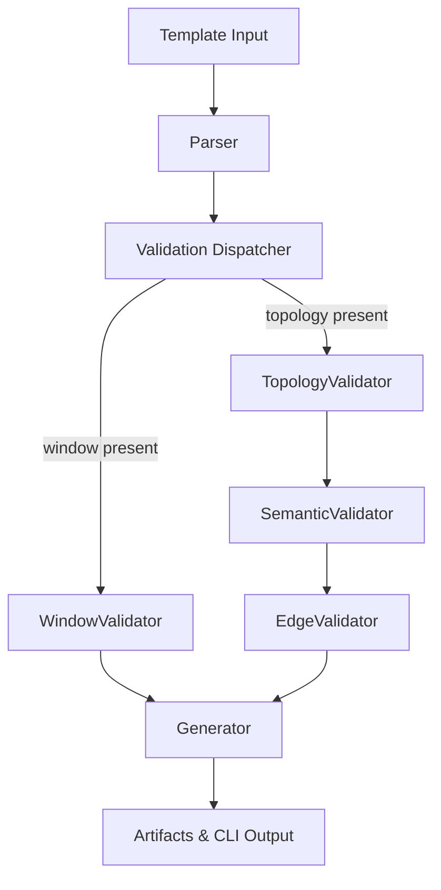

# SIM-M3.0 — Time-Travel Foundations for FlowTime-Sim

**Status:** 📋 Planned  
**Dependencies:** SIM-M2.6.1 (Template Schema Hardening), SIM-M2.7 (Registry Preparation)  
**Target:** FlowTime-Sim emits time-travel-ready model artifacts (modelVersion 1.1) with absolute window and topology metadata while keeping schemaVersion 1 backward compatible.

---

## Overview

This milestone anchors FlowTime-Sim templates with the absolute window and topology metadata defined in the time-travel architecture so FlowTime Engine M3.x can reconstruct real timelines without manual edits. The work keeps schemaVersion at 1 while adding modelVersion 1.1 semantics, enabling template authors to opt into time-travel behavior without breaking existing consumers.

### Strategic Context
- **Motivation:** Engine M3.x expects window anchoring, topology graphs, and semantic mappings exactly as described in the KISS plan (Chapters 1–6).
- **Impact:** Template authors can generate artifacts that unlock time-travel scrubbing and replay while legacy templates continue to run unchanged.
- **Dependencies:** Prior schema hardening and registry milestones supply stable parsing and publishing surfaces that this milestone extends.

---

## Scope

### In Scope ✅
1. Implement `TemplateWindow`, `TemplateTopology`, `TopologyNode`, `NodeSemantics`, `TopologyEdge`, and `UIHint` data models with parser support.
2. Infer `modelVersion` (1.0 vs 1.1) during generation while keeping `schemaVersion: 1` as mandated by the architecture summary.
3. Propagate window/topology metadata through model YAML, manifests, provenance, and CLI output.
4. Deliver window, topology, semantic, and edge validators with deterministic `WIN`, `TOP`, `SEM`, and `EDG` error codes.

### Out of Scope ❌
- ❌ Authoring new templates beyond the five shipped exemplars.
- ❌ FlowTime Engine or UI time-travel surface work.
- ❌ Schema 1.1 enforcement (topology required) or new error catalogs beyond those listed for M3.0.

### Future Work
- Schema 1.1 promotion with required topology and the full 29-error validation catalog (M3.3).
- Integration and performance benchmarking against Engine M3.x (M3.4).
- Documentation packaging and release ceremony updates (M3.5).

---

## Requirements

### Functional Requirements

#### FR1: Window Metadata & Model Version

**Description:** Templates and emitted models must support the architecture’s window structure while signalling time-travel readiness via modelVersion 1.1.

**Acceptance Criteria:**
- [ ] `TemplateWindow` stores `start` as ISO-8601 UTC (`...Z`) and `timezone` fixed to `"UTC"`.
- [ ] Parser rejects empty or non-UTC inputs with `WIN001`–`WIN004`; bin alignment errors raise `WIN005`.
- [ ] Generator defaults `modelVersion` to `"1.0"` and switches to `"1.1"` when window or topology is present.
- [ ] Generated YAML preserves existing ordering and includes the window block only when supplied.

**Example Artifact Fragment:**
```yaml
schemaVersion: 1
modelVersion: "1.1"
window:
  start: "{WINDOW_START_UTC}"
  timezone: "UTC"
```

**Error Cases:**
- `window.start: ""` ⇒ `WIN001`.
- `timezone: "PST"` ⇒ `WIN004`.

#### FR2: Topology & Semantics Data Model

**Description:** Logical nodes, edges, and semantics must follow the architecture’s structure so Engine M3.x can reconstruct system topology.

**Acceptance Criteria:**
- [ ] `TopologyNode` exposes `id`, `kind`, optional `group`, optional `ui`, and a `NodeSemantics` object.
- [ ] Kind-specific requirements raise `TOP005`–`TOP013` (service arrivals/served, queue arrivals/served/queue, router arrivals/served, external external_demand).
- [ ] Edge validation produces `EDG001`–`EDG005` for unknown references, self-loops, undelayed cycles, and weight issues.
- [ ] Semantic references validate against `nodes[*].id` and raise `SEM001` with suggestions for unknown series.

**Example Topology Snippet:**
```yaml
topology:
  nodes:
    - id: "OrderQueue"
      kind: "queue"
      group: "Orders"
      ui:
        x: 120
        y: 240
      semantics:
        arrivals: "orders_inflow"
        served: "orders_outflow"
        queue: "orders_backlog"
        q0: 0
  edges:
    - from: "OrderService:out"
      to: "OrderQueue:in"
      weight: 1.0
```

**Error Cases:**
- Queue missing `semantics.queue` ⇒ `TOP010`.
- Edge referencing unknown node ⇒ `EDG001`.

#### FR3: Artifact & Registry Output

**Description:** CLI and service generation must emit window/topology metadata without disrupting legacy artifacts.

**Acceptance Criteria:**
- [ ] `flowtime-sim templates generate` writes `modelVersion`, `window`, and `topology` blocks into `/out/models/.../model.yaml` when present.
- [ ] `artifact.json` and provenance metadata include `modelVersion`, `window.start`, and `hasTopology`.
- [ ] Legacy templates lacking window/topology produce byte-identical artifacts to pre-M3.0 outputs (except for additive metadata).
- [ ] CLI displays validation summaries including new error codes when generation fails.

**Example Manifest Fragment:**
```json
{
  "kind": "ModelArtifact",
  "schemaVersion": 1,
  "modelVersion": "1.1",
  "hasTopology": true,
  "window": {
    "start": "{WINDOW_START_UTC}"
  }
}
```

**Error Cases:**
- Missing manifest field ⇒ regression test failure with diff.
- Provenance missing `modelVersion` ⇒ validation/test failure.

#### FR4: Validation Pipeline Integration

**Description:** Validation orchestrates window, topology, semantic, and edge checks exactly as defined in the architecture.

**Acceptance Criteria:**
- [ ] Validation entry point routes templates with `modelVersion "1.1"` or topology to `WindowValidator`, `TopologyValidator`, `SemanticValidator`, and `EdgeValidator`.
- [ ] Validators accumulate errors/warnings instead of failing fast, returning deterministic `ValidationResult`.
- [ ] CLI and service surfaces print error code, path, message, and suggestion content.
- [ ] Undelayed cycles without SHIFT raise `EDG004`; missing series references raise `SEM001`.

**Validation Flow:**


**Error Cases:**
- Cycle lacking delay ⇒ `EDG004`.
- Semantic reference to unknown node ⇒ `SEM001`.

### Non-Functional Requirements

#### NFR1: Backward Compatibility
**Target:** Legacy templates without window/topology continue to emit identical artifacts (hash and content) with `modelVersion` remaining `"1.0"`.  
**Validation:** Golden snapshot diff tests and manifest assertions.

#### NFR2: Deterministic Serialization
**Target:** Parameter substitution and YAML/JSON serialization remain deterministic across runs.  
**Validation:** Snapshot hashing per `docs/development/testing.md`.

#### NFR3: Actionable Validation Feedback
**Target:** Every failure includes error code, path, message, and suggestion per architecture Chapter 5.  
**Validation:** Unit tests assert populated `ValidationError` fields and aggregated results.

#### NFR4: Documentation Alignment
**Target:** Template authoring and milestone docs describe window/topology usage with architecture-aligned examples.  
**Validation:** Documentation review and formatting check.

---

## Implementation Plan

### Phase 1: Schema & Parser Foundations
- Add `TemplateWindow`, `TemplateTopology`, `TopologyNode`, `NodeSemantics`, `TopologyEdge`, `UIHint` with nullable integration in `Template`.
- Extend parser and DTO mappers to hydrate new sections and preserve defaults, covering round-trip serialization tests.

### Phase 2: Generation & Metadata Propagation
- Infer `modelVersion` during generation, write window/topology blocks to model YAML, manifest, and provenance.
- Update parameter substitution to handle nested objects and optional values; refresh snapshots for deterministic ordering.

### Phase 3: Validation & CLI Integration
- Implement `WindowValidator`, `TopologyValidator`, `SemanticValidator`, `EdgeValidator` with `WIN/TOP/SEM/EDG` codes and aggregation.
- Wire validators into CLI/service workflows, surface formatted error output, and document new schema elements.

---

## Test Plan

**TDD Discipline:** For each requirement, start with a RED test (new failing case), implement code to reach GREEN, then refactor while keeping tests passing.

### Unit Tests
- Parser round-trip with window/topology populates DTOs and infers `modelVersion "1.1"`.
- Window validation rejects `timezone: "EST"` with `WIN004`.
- Topology validator flags queue missing `semantics.queue` (`TOP010`) and router missing `semantics.served` (`TOP012`).
- Semantic validator reports `SEM001` for unknown series with suggestion text.
- Edge validator raises `EDG004` for undelayed cycles.

### Integration Tests
- CLI generation with topology-enabled fixture writes `model.yaml`, `artifact.json`, and provenance containing window/topology data.
- CLI generation with invalid edge exits non-zero and prints `EDG001` with path detail.

### Snapshot & Regression Tests
- Golden artifact snapshot covering window/topology template ensures deterministic serialization.
- Legacy template snapshot confirms outputs unchanged and `modelVersion` stays `"1.0"`.

### Additional Checks
- Validation aggregation test ensures all errors returned in one pass (no fail-fast).
- Documentation lint/build passes after updating authoring guide.

---

## Success Criteria

- [ ] FR1–FR4 validated by passing unit and integration tests.
- [ ] NFR1–NFR4 confirmed through snapshots, validator assertions, and documentation review.
- [ ] CLI/service generation demonstrates both success and failure paths with expected error codes.
- [ ] Architecture references updated with new validator coverage.
- [ ] Tracking doc for SIM-M3.0 created when implementation begins (per milestone rules).

---

## File Impact Summary

### Files to Create
- `docs/milestones/tracking/SIM-M3.0-tracking.md` — Activated when work starts.
- `tests/FlowTime.Sim.Tests/Templates/Fixtures/time_travel_topology_template.yaml` — Fixture for CLI and snapshot tests.

### Files to Modify (Major)
- `src/FlowTime.Sim.Core/Templates/Template.cs`
- `src/FlowTime.Sim.Core/Templates/TemplateParser.cs`
- `src/FlowTime.Sim.Core/Templates/ParameterSubstitution.cs`
- `src/FlowTime.Sim.Core/Services/NodeBasedTemplateService.cs`
- `src/FlowTime.Sim.Core/Services/ProvenanceService.cs`
- `src/FlowTime.Sim.Core/Validation/*`
- `src/FlowTime.Sim.Cli/Commands/TemplatesGenerateCommand.cs`
- `docs/guides/template-authoring.md`

### Files to Modify (Minor)
- `tests/FlowTime.Sim.Tests/Templates/TemplateParserTests.cs`
- `tests/FlowTime.Sim.Tests/Templates/TemplateValidationTests.cs`
- `tests/FlowTime.Sim.Tests/Service/TemplateGenerateProvenanceTests.cs`
- `docs/ROADMAP.md`

### Files to Deprecate/Delete
- None.
