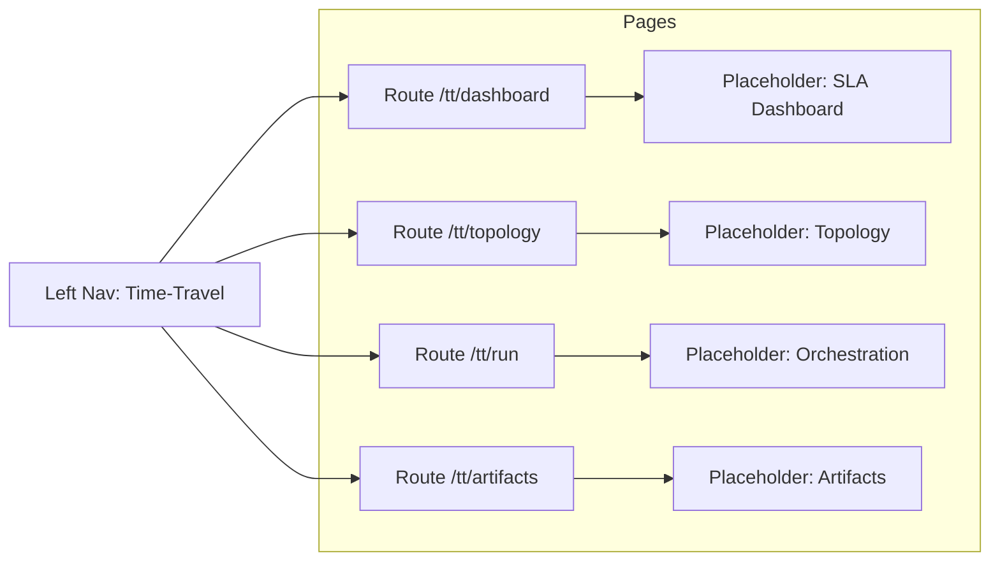

# UI-M-03.10 — UI Baseline & Build Health

**Status:** 📋 Planned  
**Dependencies:** ✅ M-03.00 (time-travel foundations), ✅ M-03.02 (telemetry capture + bundling), ✅ M-03.04 (run packaging/state window)  
**Target:** Ensure the MudBlazor UI builds, boots, and renders core layout with placeholder routes for the Time‑Travel area. Remove or hide broken surfaces. No new charts yet.

---

## Overview

This milestone restores the UI to a healthy baseline post‑M3 refactors. It introduces placeholder navigation for the new Time‑Travel area (Dashboard, Topology, Run Orchestration, Artifacts) without implementing functionality. The outcome is a bootable app with a stable shell and no runtime exceptions, ready for subsequent feature work.

### Strategic Context
- Motivation: Reduce iteration friction by stabilizing the UI shell and routes before feature development.
- Impact: Developers can navigate the app, verify layout, and stub views with confidence; broken pages are either hidden or clearly marked as placeholders.
- Dependencies: Engine/sim produces gold artifacts; however, this milestone does not consume them yet.

---

## Scope

### In Scope ✅
1. Left‑nav structure with a new “Time‑Travel” group and placeholder pages: Dashboard, Topology, Run Orchestration, Artifacts.
2. Hide or disable legacy/broken pages in Analyze/Simulate that are incompatible with M3.
3. App boot health: no startup exceptions, no critical console errors, minimal warnings.
4. Shared top bar layout visible (range/scrubber placeholders are acceptable for now).

### Out of Scope ❌
- ❌ Data loading from gold artifacts (deferred to later milestones).
- ❌ Any real charts or canvas/SVG rendering.
- ❌ Restoring Artifacts listing logic (handled by UI‑M‑03.11).

### Future Work (linked)
- UI‑M‑03.11: Restore Artifacts Page (gold bundle listing/open).
- UI‑M‑03.14: Time‑Travel routes with basic skeleton components.
- UI‑M‑03.15: Gold data access adapter.

---

## Requirements

### Functional Requirements

#### FR1: Navigation Shell
**Description:** Add the “Time‑Travel” parent item to the left menu with four children (Dashboard, Topology, Run Orchestration, Artifacts). Pages render a placeholder title.

**Acceptance Criteria:**
- [ ] Clicking each item navigates to its route and renders a placeholder heading.
- [ ] Current section is visually highlighted in the left nav.

#### FR2: Legacy Page Hygiene
**Description:** Disable or hide legacy routes known to break under M3 changes (Analyze API stubs, outdated Simulate pages) and replace with a neutral placeholder or “Temporarily unavailable” message.

**Acceptance Criteria:**
- [ ] App boots without exceptions.
- [ ] Navigating legacy menus does not crash the app.
- [ ] Placeholder text clearly indicates temporary status.

#### FR3: Build Health
**Description:** Ensure solution builds cleanly and app starts locally with minimal runtime warnings.

**Acceptance Criteria:**
- [ ] Build completes without errors.
- [ ] No uncaught exceptions in the browser console during a complete nav pass.
- [ ] Known warnings are documented (if any) with rationale.

### Non‑Functional Requirements

#### NFR1: Accessibility Baseline
**Target:** Keyboard focus is visible across nav; left nav items are reachable via Tab; placeholder pages have landmarks/headings.
**Validation:** Manual pass; check focus ring and aria‑labels on the nav container.

#### NFR2: Observability
**Target:** Console emits a single startup line including app version and branch information.
**Validation:** Manual inspection.

---

## Technical Design (Skeleton)

### Route & Nav Linking

### Error Handling Policy
- Replace broken pages with placeholders rather than surfacing runtime errors.
- Log a single structured warning in console for any suppressed legacy feature.

---

## Implementation Plan

### Tasks
1. Add “Time‑Travel” group and four child routes (placeholders only).
2. Hide/disable broken Analyze/Simulate routes; add placeholders.
3. Verify build and run; address startup exceptions.
4. Add simple startup log for environment/version.
5. Update in‑app Help/README link to the new roadmap.

### Deliverables
- Nav structure in place; placeholder pages for each Time‑Travel view.
- Legacy routes no longer break the app.
- Documented warnings (if any).

### Success Criteria
- [ ] App boots and navigates all main sections without errors.
- [ ] Time‑Travel menu present with four working placeholder routes.
- [ ] Legacy breakages removed or guarded.

---

## Test Plan

### TDD Approach
- Start with a smoke checklist (manual) for nav routing and build output, then add lightweight component tests if available.

### Test Cases
- Nav Routing
  - Setup: Build and run app.
  - Action: Click each Time‑Travel menu item.
  - Assert: Placeholder title renders, URL matches expected route.
- Legacy Guarding
  - Action: Navigate to Analyze/Simulate legacy items.
  - Assert: Placeholder loads; no console errors.
- Build Health
  - Action: Full solution build.
  - Assert: No build errors; warnings noted.

---

## Success Criteria
- [ ] Navigation skeleton added and functional.
- [ ] App build + boot passes; no runtime exceptions on nav pass.
- [ ] Placeholders protect legacy areas.

---

## File Impact Summary

### Files to Modify (Major)
- `ui/FlowTime.UI/Layout/ExpertLayout.razor` — Add Time‑Travel menu group and children (placeholders)

### Files to Create (Placeholders)
- `ui/FlowTime.UI/Pages/TimeTravel/Dashboard.razor`
- `ui/FlowTime.UI/Pages/TimeTravel/Topology.razor`
- `ui/FlowTime.UI/Pages/TimeTravel/RunOrchestration.razor`
- `ui/FlowTime.UI/Pages/TimeTravel/Artifacts.razor`

### Files to Modify (Minor)
- `ui/FlowTime.UI/Pages/Analyze/*.razor` — hide/guard
- `ui/FlowTime.UI/Pages/Simulate/*.razor` — hide/guard

---

## References
- docs/architecture/time-travel/ui-m3-roadmap.md
- docs/development/milestone-documentation-guide.md
- docs/development/milestone-rules-quick-ref.md
