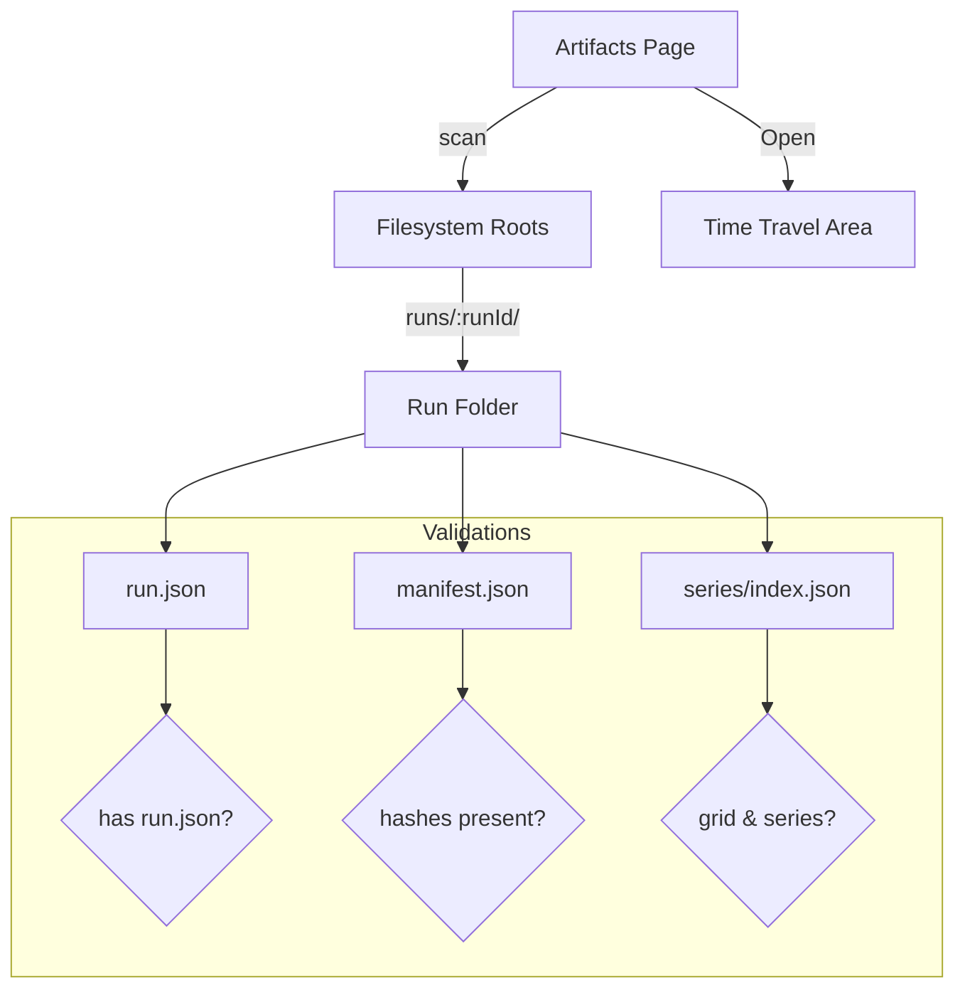

# UI-M-03.11 — Artifacts Page Restoration

**Status:** 📋 Planned  
**Dependencies:** ✅ UI-M-03.10 (UI Baseline & Build Health), ✅ M-02.07 (Artifacts Registry), ✅ M-03.04 (run packaging/state window)  
**Target:** Restore the Artifacts page to list available runs (gold bundles) and open them into Time‑Travel views. Operates on local file artifacts; no REST dependency.

---

## Overview

This milestone re-enables the Artifacts experience in the UI by reading canonical run artifacts written by the engine/sim. It lists runs, displays key metadata, and provides an “Open in Time‑Travel” action that deep-links to Dashboard/Topology with the selected `runId`.

### Strategic Context
- Motivation: Artifacts are the source of truth for M3; users must be able to browse and open runs without waiting for APIs.
- Impact: Establishes a reliable entry point for the new Time‑Travel UI and validates contracts against real bundles.
- Dependencies: UI baseline exists (UI‑M‑03.10); engine produces run directories with JSON contracts.

---

## Scope

### In Scope ✅
1. Discover run bundles under configured root(s) and list them with metadata.
2. Show per-run key fields: `runId`, `source`, `createdUtc`, `grid`, warnings, and artifact presence.
3. Provide an “Open” action that navigates to Time‑Travel pages with `runId` set.
4. Handle missing/partial artifacts gracefully (empty states, warnings).

### Out of Scope ❌
- ❌ Rendering charts or time‑series (handled by later milestones).
- ❌ Upload/import flows.
- ❌ REST integration (file-backed adapter only for this milestone).

### Future Work
- Add search/filter and pagination.
- Add run tagging and favorites.

---

## Requirements

### Functional Requirements

#### FR1: Run Discovery
**Description:** Load run directories from one or more roots (e.g., `data/runs/`). Each run must contain the canonical JSON artifacts.

**Acceptance Criteria:**
- [ ] A configured file root is scanned recursively for `runs/<runId>/`.
- [ ] For each candidate, presence of `run.json` is required; `manifest.json` and `series/index.json` are optional but reported.
- [ ] Runs missing `run.json` are excluded and surfaced as diagnostics.

#### FR2: Metadata Display
**Description:** For each run, show a concise row/card including essential metadata.

**Acceptance Criteria:**
- [ ] Display: `runId`, `source`, `createdUtc`, `grid.bins/binMinutes`, warning count, artifact presence flags.
- [ ] Rows with warnings show a badge; hover reveals the first warning message.

#### FR3: Open in Time‑Travel
**Description:** Allow opening a selected run into the Time‑Travel area (Dashboard/Topology).

**Acceptance Criteria:**
- [ ] Clicking Open navigates to `/tt/dashboard?runId=<id>` (or Topology) with run context available.
- [ ] If the target page cannot find required artifacts, show an inline error with a “Back to Artifacts” link.

#### FR4: Error/Empty States
**Description:** Gracefully handle no runs found, corrupt runs, or access issues.

**Acceptance Criteria:**
- [ ] No runs → Render guidance to create or simulate a run.
- [ ] Partial bundles → Display row with warnings and disable Open if critical files are missing.

### Non‑Functional Requirements

#### NFR1: Robustness
**Target:** Scanning/reporting handles 100+ run folders without UI lock-ups.
**Validation:** Manual runs on a directory with many small runs; ensure UI remains responsive.

#### NFR2: Accessibility
**Target:** Keyboard navigation across rows; focus indicators; table semantics for screen readers.
**Validation:** Manual pass.

---

## Data Contracts (Gold Artifacts)

### run.json (summary, series listing)
Reference: docs/reference/contracts.md
```json
{
  "schemaVersion": 1,
  "runId": "sim_2025-09-01T18-30-12Z_a1b2c3d4",
  "engineVersion": "sim-0.1.0",
  "source": "sim",
  "grid": { "bins": 288, "binMinutes": 5, "timezone": "UTC", "align": "left" },
  "createdUtc": "2025-09-01T18:30:12Z",
  "warnings": [],
  "series": [ { "id":"arrivals@COMP_A", "path":"series/arrivals@COMP_A.csv", "unit":"entities/bin" } ]
}
```

### manifest.json (determinism & integrity)
```json
{
  "schemaVersion": 1,
  "scenarioHash": "sha256:…",
  "seriesHashes": { "arrivals@COMP_A": "sha256:…" },
  "createdUtc": "2025-09-01T18:30:12Z"
}
```

### series/index.json (discovery, units, grid)
```json
{
  "schemaVersion": 1,
  "grid": { "bins": 288, "binMinutes": 5, "timezone": "UTC" },
  "series": [ { "id":"arrivals@COMP_A", "path":"series/arrivals@COMP_A.csv", "points": 288 } ]
}
```

### Derived Time‑Travel artifacts (preview only; not required for this milestone)
- `graph.json`, `state_window.json`, `metrics.json` (as per UI time‑travel v3 spec) for later milestones.

---

## Technical Design

### Component Flow


### Discovery Inputs
- Configured roots: e.g., `data/runs/`, env var or app settings.
- Folder pattern: `runs/<runId>/`.

### Outputs
- Rows/cards with: `runId`, `source`, `createdUtc`, `grid.summary`, `warnings.count`, presence flags.
- Navigation link to Time‑Travel.

### Error Policy
- Missing `run.json` → exclude from list; add to diagnostics panel.
- Missing `manifest.json`/`series/index.json` → list with warnings; allow Open with caution.

---

## Implementation Plan

### Tasks
1. Implement file-backed run discovery (adapter) with pluggable root(s).
2. Parse `run.json`; optionally probe `manifest.json`, `series/index.json`.
3. Render runs in a simple table or card grid with presence/warning badges.
4. Add Open action that routes to Time‑Travel with `runId` as query parameter.
5. Add diagnostics panel for excluded/invalid runs.

### Deliverables
- Artifacts page populated from disk; Open action bridges to Time‑Travel routes.
- Diagnostics available for invalid runs.

### Success Criteria
- [ ] Runs appear with expected metadata.
- [ ] Open action navigates with `runId`.
- [ ] Missing/invalid runs do not crash the page; warnings shown.

---

## Test Plan

### TDD Approach
- Start with sample directories in `fixtures/` or `data/runs/` and build adapter/unit tests first; then integration checks for UI rendering.

### Test Cases
- Valid Run Listing
  - Setup: One folder with all three artifacts.
  - Assert: Row shows runId, grid, zero warnings, all presence flags.
- Partial Run Listing
  - Setup: Missing `manifest.json`.
  - Assert: Row shows warning badge; Open enabled.
- Invalid Run Exclusion
  - Setup: Folder missing `run.json`.
  - Assert: Not listed; diagnostic entry explains exclusion.
- Open Navigation
  - Action: Click Open.
  - Assert: Route includes `runId`; Time‑Travel page receives context.

---

## File Impact Summary

### Files to Create
- `ui/FlowTime.UI/Pages/Artifacts/ArtifactsPage.razor` — restored view using file-backed adapter
- `ui/FlowTime.UI/Services/ArtifactsDiscovery.cs` — discover + parse run.json, probe optional files
- `ui/FlowTime.UI/Models/ArtifactRun.cs` — view model

### Files to Modify (Minor)
- `ui/FlowTime.UI/Layout/ExpertLayout.razor` — ensure Artifacts route appears under Time‑Travel group

---

## References
- docs/reference/contracts.md
- docs/architecture/time-travel/ui-m3-roadmap.md
- docs/operations/telemetry-capture-guide.md
- docs/development/milestone-documentation-guide.md
- docs/development/milestone-rules-quick-ref.md
