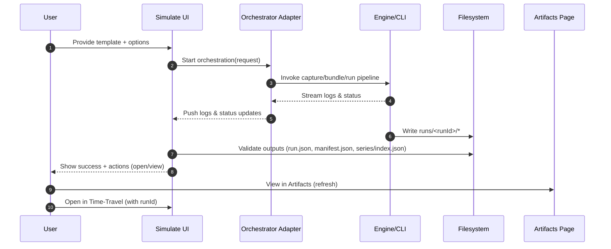

# UI-M-03.12 — Simulate → Gold Run Integration

**Status:** 📋 Planned  
**Dependencies:** ✅ UI-M-03.10 (UI Baseline & Build Health), ✅ UI-M-03.11 (Artifacts Page Restoration), ✅ M-03.02 (Telemetry capture + bundling), ✅ M-03.04 (Run packaging, state window)  
**Target:** From the Simulate section, run an orchestration that produces a canonical gold run bundle under `runs/<runId>/` so the new run immediately appears in Artifacts and can be opened in Time‑Travel views.

---

## Overview

This milestone connects the Simulate experience to the M3 time‑travel workflow. Operators can choose a template (and optional options), kick off an orchestration that generates artifacts, watch progress logs, and finish with a discoverable `runId`. The output follows the contracts required by the Artifacts page and the minimal time‑travel UI, enabling a tight iterate → view loop without depending on REST endpoints.

### Strategic Context
- Motivation: Unify “simulate” and “time‑travel” by emitting the same gold bundle used by analysis UIs.
- Impact: One‑click path from Simulate → Artifacts → Time‑Travel; reduces friction and demos well.
- Dependencies: The engine/CLI orchestration (capture + bundling + run) completes locally and writes canonical artifacts.

---

## Scope

### In Scope ✅
1. Simulate form to select a template and required options (minimal: template id, optional parameters, output root).
2. Orchestration kickoff and progress display (logs + status), with safe cancel.
3. Validation of outputs: presence of `run.json`; optional presence badges for `manifest.json`, `series/index.json`.
4. Completion state with `runId`, “Open in Time‑Travel” and “View in Artifacts” actions.
5. Artifacts refresh so the new run shows up without app restart.

### Out of Scope ❌
- ❌ Advanced parameterization UIs (keep to essential controls).
- ❌ REST orchestration; this milestone is file‑backed.
- ❌ Generation of derived time‑travel JSON (`graph.json`, `state_window.json`, `metrics.json`) — optional if available.

### Future Work
- Integrate orchestration into a shared “Run Orchestration” page (UI‑M‑03.16) for non‑Sim use cases.
- Add preset scenarios and environment validation helpers.

---

## Requirements

### Functional Requirements

#### FR1: Simulate Start Form
- Description: Page under Simulate captures minimal inputs to start an orchestration.
- Acceptance Criteria:
  - [ ] Inputs support: template id (required), output root (defaults to `data/runs/`), optional parameters text (JSON or key=val), and an optional friendly label.
  - [ ] “Start” is disabled until required fields are valid; “Cancel” returns to Simulate home.

#### FR2: Orchestration Execution + Logs
- Description: Start orchestration; stream progress to the UI.
- Acceptance Criteria:
  - [ ] UI renders log lines with leveled coloring (info/warn/error) and a rolling buffer.
  - [ ] Exposes current status (queued/running/succeeded/failed/canceled).
  - [ ] Cancel stops further steps and records final status.

#### FR3: Output Validation
- Description: On success, validate outputs and compute `runId`.
- Acceptance Criteria:
  - [ ] Locate `runs/<runId>/` and confirm `run.json` is present and valid JSON.
  - [ ] If present, detect `manifest.json` and `series/index.json` and expose presence flags.
  - [ ] Show a summary (createdUtc, grid summary, warning count) from `run.json`.

#### FR4: Completion Actions
- Description: Provide immediate navigation hooks.
- Acceptance Criteria:
  - [ ] “Open in Time‑Travel” navigates to `/time-travel/dashboard?runId=<runId>`.
  - [ ] “View in Artifacts” navigates to Artifacts with the run highlighted; Artifacts refreshes to include the new run.

#### FR5: Error Paths
- Description: Gracefully handle failed orchestration or partial outputs.
- Acceptance Criteria:
  - [ ] Failure shows a friendly message, last 100 log lines, and guidance.
  - [ ] Partial outputs are diagnosed (missing `run.json` blocks Open; still list under diagnostics).

### Non‑Functional Requirements

#### NFR1: Determinism & Contracts
- Target: Artifacts follow contracts in docs/reference/contracts.md (run.json/manifest.json/series/index.json); repeated runs of the same spec produce consistent bundle shapes.
- Validation: JSON parsing + schema spot‑checks in the adapter; hashes optional.

#### NFR2: Responsiveness
- Target: Log UI remains responsive during long runs; no UI thread blocking.
- Validation: Manual run with large templates; verify no freezes.

---

## Data Contracts (Outputs)

The orchestration must produce a run directory compatible with the Artifacts and Time‑Travel UI flows.

### Directory Layout
```
runs/<runId>/
  run.json
  manifest.json
  series/
    <seriesId>.csv
  gold/                 # optional for analytics (not required by this milestone)
```

### run.json (required)
- Fields used by the UI in this milestone: `runId`, `source`, `createdUtc`, `grid` (`bins`, `binMinutes`, `timezone`), `warnings[]`.

### manifest.json (optional)
- If present, show presence and a count of `seriesHashes` keys as an integrity hint.

### series/index.json (optional)
- If present, show presence and a count of `series[].points` as a discovery hint.

---

## Interaction & Flow



---

## Implementation Plan

### Phase 1: Orchestrator Adapter
- Tasks:
  1. Define an interface for orchestration requests (templateId, outputRoot, parameters, label).
  2. Implement file‑backed adapter to execute the local pipeline and stream logs to UI.
  3. Add rudimentary cancel support (best effort).
- Deliverables: Adapter returning status/log stream, final result with `runId`.
- Success Criteria:
  - [ ] Manual test writes a run directory and streams logs without freezing UI.

### Phase 2: Simulate UI Integration
- Tasks:
  1. Build the start form (validate required fields; disabled Start until valid).
  2. Add live log viewer; surface statuses (queued/running/succeeded/failed/canceled).
  3. On success, validate outputs and show summary + actions.
- Deliverables: Operable Simulate page producing bundles.
- Success Criteria:
  - [ ] Run completes and new run is visible in Artifacts.

### Phase 3: Diagnostics & Refresh
- Tasks:
  1. Handle failed/partial outputs with friendly diagnostics.
  2. Trigger an Artifacts refresh after success and highlight new run (if feasible).
- Deliverables: Resilient UX; tighter loop to Artifacts/Time‑Travel.
- Success Criteria:
  - [ ] Partial outputs don’t crash; helpful messages shown; Artifacts reflects the new run.

---

## Test Plan

### TDD Approach
- Start adapter unit tests for validation and `run.json` parsing; then end‑to‑end smoke with a small template.

### Test Categories & Cases
- Unit Tests
  - Validate request model (templateId required, sane defaults for output root).
  - Parse `run.json` and compute summary (bins, binMinutes, warnings count).
- Integration Tests
  - Orchestrator writes a run folder and yields a plausible `runId`.
  - Simulate page renders logs and final success card with actions.
- E2E (manual)
  - Trigger a run, observe logs, validate run appears in Artifacts, open Time‑Travel.

### Coverage Goals
- Unit: Request/validation and `run.json` parsing.
- Integration: Happy path from Simulate → Files → Artifacts.

---

## Success Criteria
- [ ] Simulate start form collects minimal inputs and starts orchestration.
- [ ] Logs stream without blocking; cancel works.
- [ ] `run.json` is produced and parsed; presence flags surfaced for optional files.
- [ ] New run appears in Artifacts and opens in Time‑Travel.

---

## File Impact Summary

### Files to Modify (Major)
- `ui/FlowTime.UI/Pages/Simulate/*.razor` — Replace outdated flows with orchestration form and log viewer

### Files to Create
- `ui/FlowTime.UI/Services/Orchestration/SimOrchestrator.cs` — file‑backed adapter interface + implementation
- `ui/FlowTime.UI/Models/OrchestrationRequest.cs` — request model (templateId, outputRoot, parameters, label)
- `ui/FlowTime.UI/Models/OrchestrationResult.cs` — result model (status, runId, logs summary)

### Files to Modify (Minor)
- `ui/FlowTime.UI/Layout/ExpertLayout.razor` — ensure Simulate routes point to the new page
- `ui/FlowTime.UI/Pages/Artifacts/ArtifactsPage.razor` — add refresh/highlight new run (if feasible)

---

## References
- docs/operations/telemetry-capture-guide.md
- docs/reference/contracts.md
- docs/architecture/time-travel/ui-m3-roadmap.md
- docs/development/milestone-documentation-guide.md
- docs/development/milestone-rules-quick-ref.md
