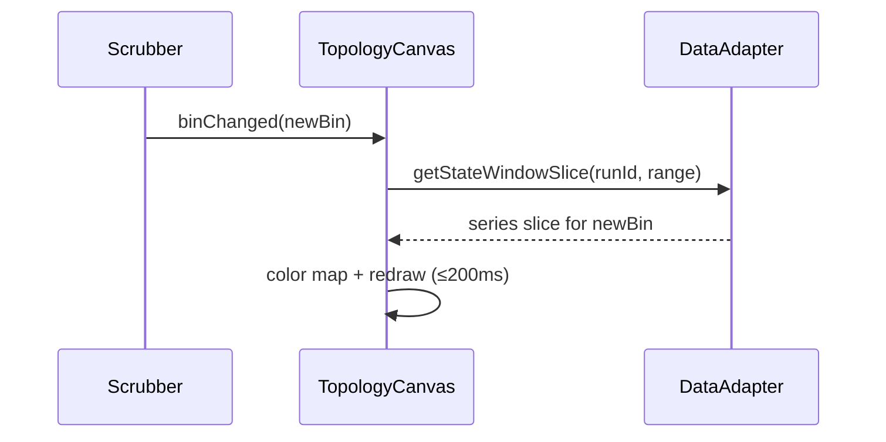

# UI-M-03.22 — Topology Canvas (Graph + Coloring)

**Status:** 🚧 In Progress  
**Dependencies:** UI‑M‑03.20 (SLA Dashboard), UI‑M‑03.21 (Global Top Bar + Range + Scrubber), UI‑M‑03.21.01 (Artifacts UX Refresh)  
**Target:** Render the full run graph on a performant canvas, color nodes by live scrubbed metrics, and support smooth pan/zoom with accessible interaction.

---

## Overview

This milestone delivers the first production-ready topology view for time‑travel runs. The entire run graph renders on a high‑performance surface and responds to the global scrubber. Coloring communicates health at the current bin (SLA/util thresholds), while interactions (hover/focus/select) surface node metrics without leaving the view. The implementation reuses existing contracts (`graph`, `state_window`) and integrates with the M3 scrubber state.

### Strategic Context
- **Motivation:** Provide a whole‑flow view that answers “where is it failing right now?”
- **Impact:** Operators can quickly spot hot nodes, pan/zoom around the flow, and drill into details next milestone.
- **Dependencies:** SLA Dashboard tiles and global scrubber provide run context and current bin; data adapter exposes `graph` and `state_window` slices.

---

## Scope

### In Scope ✅
1. Canvas‑based topology renderer (nodes + edges) with pan/zoom.
2. Node coloring by current bin health (SLA/util thresholds); gray when no data.
3. Node hover/focus tooltip with key metrics (name, SLA%, util, last timestamp).
4. Keyboard navigation between nodes; visible focus state; aria labels.
5. Scrubber integration: redraw on bin change (≤200 ms update budget).
6. Minimal legend + quick help inline.

### Out of Scope ❌
- ❌ Node detail side panel (UI‑M‑03.23)
- ❌ Advanced edge weighting/animations
- ❌ Forecasting or historical overlays
- ❌ Multi‑run comparison

### Future Work (Optional)
- Edge thickness by flow, per‑kind icons, selection persistence across routes.
- Optional node labels/overlays and edge badges once design ships guidance.

### Follow‑up Milestone
- See UI‑M‑03.22.1 — Topology LOD + Feature Bar: docs/milestones/UI-M-03.22.1.md
  - Adds LOD overlays, Feature Bar, sparklines, edge shares, Full DAG mode.
  - Tracks open bug: topology tooltips not working (hover/focus).

---

## Requirements

### Functional Requirements

#### FR1: Render Graph on Canvas
**Description:** Draw all nodes and edges for the selected run using a canvas layer. Maintain smooth pan/zoom.
**Acceptance Criteria:**
- [ ] Graph displays with correct node count and connectivity.
- [ ] Panning and zooming keep visuals crisp (no blurry text/lines).
- [ ] Layout stays stable across redraws.

#### FR2: Color Nodes by Health at Current Bin
**Description:** Apply color scale to nodes based on SLA/util thresholds derived from `state_window` at the active bin.
**Acceptance Criteria:**
- [ ] Healthy nodes (within SLA) display in success color.
- [ ] Warning/near‑limit nodes display in warning color.
- [ ] Breach nodes display in error color.
- [ ] Nodes with no data display in neutral/gray.

#### FR3: Hover/Focus Tooltips
**Description:** Show a compact tooltip with key metrics on hover and keyboard focus.
**Acceptance Criteria:**
- [ ] Tooltip shows node id/name, SLA%, util, time.
- [ ] Tooltip positions near node and avoids clipping.
- [ ] Tooltip hides on blur/esc.

#### FR4: Keyboard Navigation + A11y
**Description:** Users can tab/arrow between nodes; focused node has visible ring; nodes expose aria‑label with health.
**Acceptance Criteria:**
- [ ] Tab/Shift+Tab cycles focus; arrow keys move to nearest neighbor.
- [ ] Enter selects node; Esc clears selection.
- [ ] A11y audit: role/presentation for canvas + fallback labels on nodes.

#### FR5: Scrubber Redraw Integration
**Description:** On scrubber bin change, recolor nodes efficiently.
**Acceptance Criteria:**
- [ ] Update completes in ≤200 ms for 20‑node flow.
- [ ] No frame jank while scrubbing.

### Non‑Functional Requirements

#### NFR1: Performance
**Target:** Redraw ≤200 ms on bin change, pan/zoom ≥ 45 fps on typical graphs (≈20 nodes).  
**Validation:** Manual perf tracing; stopwatch tests around color update path.

#### NFR2: Accessibility
**Target:** Keyboard path for all hover actions; colorblind‑safe palette; aria labels.  
**Validation:** Axe/lighthouse a11y pass + manual keyboard checks.

---

## Technical Design

### Architecture Decisions
- **Canvas over SVG:** Canvas is chosen for predictable performance on repeated redraws and simpler pan/zoom transforms.
- **Layout:** Start with a deterministic layout (e.g., layered grid based on order) to avoid bringing in heavy force‑layout libs this milestone.
- **Coloring:** Centralize thresholds and palette for reuse (and theme alignment) across canvas and legend.

### Data Flow

---

## Implementation Plan

### Phase 1: Test Harness + Contracts (RED → GREEN)
**Goal:** Establish tests and scaffolding for data mapping and coloring.
**Tasks:**
1. Unit: `GraphMapperTests` for mapping API `graph` to internal nodes/edges (RED → GREEN).
2. Unit: `ColorScaleTests` for SLA/util → color mapping (RED → GREEN).
3. Unit: `TooltipFormatterTests` for metrics string shape (RED → GREEN).
**Deliverables:** mapping/color/tooltip helpers with tests.
**Success Criteria:**
- [ ] All helper tests pass; no UI yet.

### Phase 2: Canvas Component + Static Render (RED → GREEN)
**Goal:** Render a static graph with pan/zoom.
**Tasks:**
1. Render tests: component mounts, draws expected node count (RED).
2. Implement canvas draw; basic pan/zoom; a11y focus ring (GREEN).
3. Refactor: extract layout math; keep draw loop clean (REFACTOR).
**Deliverables:** `TopologyCanvas.razor` + `.ts`/interop if needed.
**Success Criteria:**
- [ ] Render tests pass; pan/zoom works locally.

### Phase 3: Coloring + Scrubber Integration (RED → GREEN)
**Goal:** Live recolor on bin change.
**Tasks:**
1. Render test: stub bin change triggers color changes (RED).
2. Wire to scrubber state; fast color updates (GREEN).
3. Refactor: memoize per‑bin values (REFACTOR).
**Deliverables:** color update path; scrubber handler.
**Success Criteria:**
- [ ] Recolor ≤200 ms; tests pass.

### Phase 4: Hover/Focus Tooltips + Keyboard (RED → GREEN)
**Goal:** Accessible hover/focus with tooltips.
**Tasks:**
1. Render test: tooltip appears on focus/hover; hides on blur/esc (RED).
2. Implement hit‑testing + tooltip placement (GREEN).
3. Refactor: unify pointer/keyboard paths (REFACTOR).
**Deliverables:** tooltip service; keyboard nav.
**Success Criteria:**
- [ ] A11y smoke passes; render tests green.

---

## Test Plan

### Test‑Driven Development Approach
Strategy: Write unit/render tests first (RED), implement minimal code to pass (GREEN), then clean up (REFACTOR). Keep visual logic in testable helpers.

### Test Categories

#### Unit Tests
- `GraphMapperTests`: maps `graph` → internal model; preserves order/connectivity.
- `ColorScaleTests`: thresholds → colors; gray on missing.
- `TooltipFormatterTests`: produces compact, localized strings.

#### Render Tests (bUnit + JS interop stubs)
- Mount canvas component; assert node count drawn.
- Simulate bin change; assert recolor path called.
- Focus/hover events; assert tooltip content toggles.

### Test Coverage Goals
- Unit: helper logic and thresholds fully covered.
- Render: core flows (mount, recolor, tooltip) covered.

---

## Success Criteria

### Milestone Complete When:
- [ ] FR1–FR5 implemented and validated
- [ ] All unit and render tests passing
- [ ] Docs updated (milestone + tracker)
- [ ] Example graph loads from a real run
- [ ] No regressions to dashboard/scrubber behavior

### Per‑Phase Criteria
- Phase 1: all helper tests green
- Phase 2: static render + pan/zoom verified
- Phase 3: recolor on scrub under budget
- Phase 4: tooltips + keyboard a11y verified

---

## File Impact Summary

### Files to Create
- `src/FlowTime.UI/Components/Topology/TopologyCanvas.razor` — canvas host + a11y scaffolding
- `src/FlowTime.UI/Components/Topology/TopologyCanvas.razor.ts` — optional interop for high‑perf pan/zoom
- `src/FlowTime.UI/Components/Topology/ColorScale.cs` — thresholds → colors
- `src/FlowTime.UI/Components/Topology/GraphMapper.cs` — API → internal
- `tests/FlowTime.UI.Tests/TimeTravel/TopologyCanvasRenderTests.cs` — render tests
- `tests/FlowTime.UI.Tests/TimeTravel/TopologyHelpersTests.cs` — unit tests (mapper/color/tooltip)

### Files to Modify (Major)
- `src/FlowTime.UI/Pages/TimeTravel/Topology.razor` — route + wire to canvas and scrubber

### Files to Modify (Minor)
- `src/FlowTime.UI/wwwroot/css/app.css` — lightweight styles for legend and focus ring

---

## References
- docs/architecture/time-travel/ui-m3-roadmap.md
- docs/architecture/time-travel/time-travel-architecture-ch2-data-contracts.md
- docs/development/milestone-documentation-guide.md
- docs/development/milestone-rules-quick-ref.md
