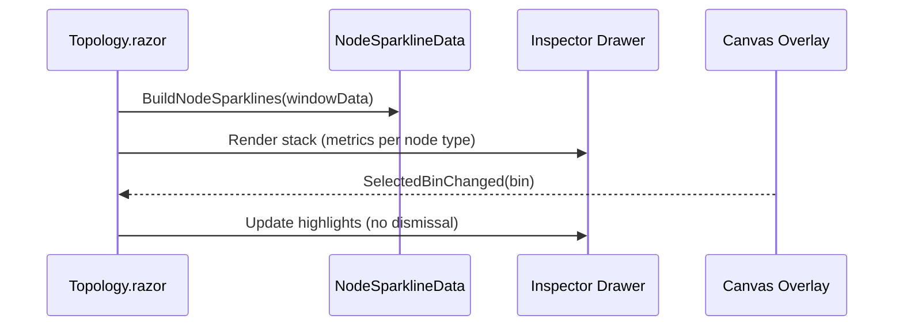

# UI-M-03.23 — Node Detail Panel Refresh

**Status:** 📋 Planned  
**Dependencies:** ✅ UI-M-03.22.2 (Topology Canvas Polish), ✅ UI-M-03.21 (Global Top Bar & Scrubber)  
**Target:** Replace the legacy multi-chart inspector with the new sparkline-based node detail panel that stays open until dismissed, surfaces all relevant node metrics, and remains scrubber-synchronized.

---

## Overview

UI-M-03.23 modernizes the node inspector drawer in the Time-Travel topology view. The refreshed panel keeps node details visible while analysts scrub through time, swaps the MudChart stack for the lightweight sparkline blueprint introduced in UI-M-03.22.2, and presents a consistent metric set for each node category. Computed nodes gain clearer explanations of their available values, queues surface all operational series simultaneously, and missing data is communicated with explicit messaging. This delivers the “simple lines” experience defined in the Phase 2 roadmap without sacrificing the newly refined hover/tooltip polish.

### Strategic Context
- **Motivation:** Analysts currently lose the inspector when interacting with the canvas or scrubber, and the legacy charts are heavy, inconsistent, and ambiguous for computed nodes.
- **Impact:** Persistent, lightweight detail panel aligned with global scrubber state; improved comprehension of queue/computed metrics; reduced UI weight.
- **Dependencies:** Requires the scrubber + topology plumbing from UI-M-03.21 and the inspector sparkline foundation from UI-M-03.22.2.

---

## Scope

### In Scope ✅
1. Keep the node detail drawer open until the user explicitly dismisses it; interactions with the canvas or scrubber must not close it automatically.
2. Replace existing MudChart-based metric visualizations with reusable SVG sparklines (using the updated padding) that stack all applicable series for the current node.
3. Display the full metric set for each node category:
   - Service/operational: Success rate, utilization, latency, error rate.
   - Queue: Queue depth, latency, arrivals, served.
   - Computed (expr/const/pmf): Output/values, success rate/error rate if present, PMF distribution, any other series exposed for the node.
4. Show a muted “Model does not include series data” message for each missing chart instead of silently omitting it.
5. Maintain bin highlight and stroke color synchronization with the global scrubber and color-basis overlays.
6. Update milestone tracking, tests, and documentation to reflect the new panel behavior.

### Out of Scope ❌
- ❌ New modal or overlay behaviour; the inspector remains a drawer.
- ❌ SQL/API changes beyond surfacing existing `state_window` series.
- ❌ Tooltip or canvas restructuring beyond what is necessary for persistence.

### Future Work
- Potential responsive layouts for narrow viewports (folding or tabbing metrics) — defer until UI-M-03.25 (Performance + A11y).
- Additional per-node annotations (alerts, playbooks) — consider after Phase 2 stabilization.

---

## Requirements

### Functional Requirements

#### FR1: Persistent Inspector Drawer
**Description:** The node detail drawer stays open while the user interacts with the canvas, timeline, or scrubber until the user dismisses it.

**Acceptance Criteria:**
- [ ] Clicking the scrubber, zoom controls, or canvas should not close the drawer.
- [ ] The drawer dismisses only via explicit close action (icon button, Escape) or selecting a different node (which swaps content, not dismissal).
- [ ] State remains consistent after viewport restore or mode toggles.

#### FR2: Sparkline Metric Stack by Node Type
**Description:** The panel renders a stack of SVG sparkline charts (with increased side padding) for the correct metric set per node category.

**Acceptance Criteria:**
- [ ] Service nodes show success rate, utilization, latency, error rate sparklines simultaneously.
- [ ] Queue nodes show queue depth, latency, arrivals, served sparklines simultaneously.
- [ ] Computed nodes show output/values (or distribution) plus any additional series available (e.g., success rate, error rate) in the panel.
- [ ] Each sparkline uses the updated padding (≥28 px left/right) and shows the selected bin highlight dot.
- [ ] Titles and ordering follow the spec; no legends are rendered.

#### FR3: Graceful Missing-Series Messaging
**Description:** When a required series is absent from `state_window`, show a muted notice instead of omitting the chart.

**Acceptance Criteria:**
- [ ] Each missing metric renders a placeholder line reading “Model does not include series data.”
- [ ] Placeholder respects spacing and does not collapse adjacent charts.
- [ ] Warning is logged once per node kind for missing expected series.

#### FR4: Computed Node Value Context
**Description:** Computed nodes (expr/const/pmf) include all available series in the inspector to clarify their meaning beyond the canvas glyphs.

**Acceptance Criteria:**
- [ ] Expression/const nodes show output, success rate/error rate if available.
- [ ] PMF nodes show distribution sparkline plus any scalar series, along with the bin(t) value label.
- [ ] Tooltip text / inspector labels remain synchronized with sparkline data.

### Non-Functional Requirements

#### NFR1: Performance
**Target:** Inspector redraw (when scrubbing or switching nodes) completes within 8 ms on reference hardware.  
**Validation:** Profile using browser dev tools on a 20-node graph while scrubbing continuously.

#### NFR2: Accessibility
**Target:** Drawer remains keyboard accessible with tab order preserved; sparkline titles and placeholders exposed to screen readers.  
**Validation:** Keyboard walkthrough + aria-label verification.

---

## Technical Design

### Architecture Decisions
- **Decision:** Reuse `TopologyInspectorSparkline` for all charts, extending helper plumbing to expose additional series slices.  
  **Rationale:** Maintains consistent styling and highlight behavior while avoiding new chart dependencies.  
  **Alternatives Considered:** Embedding a separate chart library (heavier, conflicts with Phase 2 simplicity).

- **Decision:** Track inspector-open state separately from canvas focus to prevent auto-dismiss on blur.  
  **Rationale:** Canvas interactions currently trigger focus loss; explicit state ensures persistence.

### Data Flow

---

## Implementation Plan

### Phase 1: Inspector State Persistence (RED → GREEN → REFACTOR)

**Goal:** Prevent auto-dismiss when interacting with the canvas or scrubber.

**Tasks:**
1. RED: Add unit/component test ensuring inspector stays open during scrubber click.
2. GREEN: Introduce explicit `isInspectorPinned` state and adjust event handlers.
3. REFACTOR: Remove redundant close triggers; ensure Escape/Close button operate as expected.

**Deliverables:**
- Updated `Topology.razor` inspector state logic.
- Passing persistence test.

**Success Criteria:**
- [ ] Test proving inspector persists passes.
- [ ] Manual run confirms panel stays open across interactions.

### Phase 2: Metric Stack Rendering (RED → GREEN → REFACTOR)

**Goal:** Render updated sparkline stack with category-specific metrics and padding.

**Tasks:**
1. RED: Tests validating expected sparkline sections for service/queue/computed nodes.
2. GREEN: Extend `BuildInspectorSparkline` and panel layout to emit all required charts with new padding.
3. REFACTOR: Share helper logic for metric ordering and placeholder rendering.

**Deliverables:**
- Updated inspector markup (no MudCharts).
- Helper functions for node-type metric selection.

**Success Criteria:**
- [ ] All RED tests pass.
- [ ] Visual inspection confirms ordering/padding/highlight behavior.

### Phase 3: Missing-Series Messaging & Logging (RED → GREEN → REFACTOR)

**Goal:** Show “Model does not include series data” placeholders and log once per node.

**Tasks:**
1. RED: Test ensuring placeholder text renders when series absent.
2. GREEN: Implement placeholder rendering and log deduping.
3. REFACTOR: Consolidate warning logic with existing `nodesMissingSparkline` tracking.

**Deliverables:**
- Placeholder styling snippet.
- Logger entries confirming message.

**Success Criteria:**
- [ ] Placeholder tests pass.
- [ ] No duplicate warning spam in console logs during manual run.

---

## Testing Strategy

- **Unit/Component Tests:**  
  - Inspector persistence on scrubber interaction.  
  - Metric stack contents for service/queue/computed nodes.  
  - Placeholder rendering for missing series.  
- **Integration Tests:** High-level scrubber interaction test ensuring highlights follow selected bin (existing coverage extended if necessary).  
- **Manual Validation:**  
  - Scrub while inspector open.  
  - Load a run lacking queue series to confirm placeholder messaging.  
  - Confirm tooltip and inspector agree on current values.

---

## Open Questions

1. Should we collapse sparkline sections behind disclosure panels on very small screens? (Default decision: stack vertically; revisit in UI-M-03.25.)
2. Do we display percentile or aggregated stats in addition to sparklines? (Deferred — milestone focuses on time-series lines only.)

---

## References
- docs/development/milestone-documentation-guide.md
- docs/development/TEMPLATE-tracking.md
- docs/architecture/time-travel/ui-m3-roadmap.md (Phase 2, UI-M-03.23 entry)
- docs/milestones/UI-M-03.22.2.md (preceding polish milestone)
