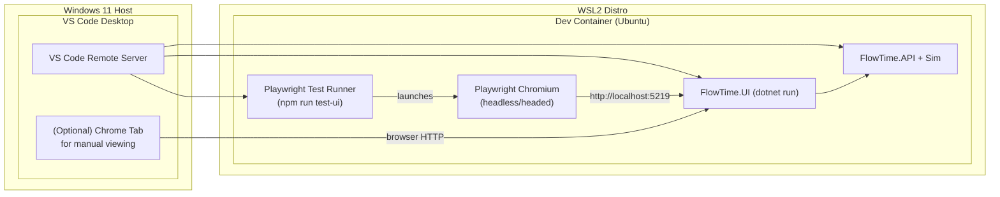

# FT-M-05.07 Playwright Automation Plan

Task 1.2 of FT-M-05.07 requires an automated hover/pan/scrub validation that fails when the topology UI exceeds the latency budgets defined in `work/epics/completed/ui-perf/spec.md`. This document captures the proposed tooling and scenarios before we add code.

## Objectives

1. **Hover/Pan Budget Guardrails** – Assert pointer INP < 200 ms, overlay updates ≤ 1 per frame, and pointer queue drops ≤ 5 % while hovering/panning the transportation-class run.
2. **Scrubber Responsiveness** – Ensure the scrubber applies a new selection within 500 ms and scene rebuild count remains 0 during manual scrubs.
3. **Operational Toggle Regression** – When operational-only mode is active, verify we still meet the hover/pan budget with inspector both closed and open.

## Environment Assumptions

- Tests run inside the FlowTime dev container (Linux, Chrome stable available). Node 18+ and npm are already present (`npm --version` → 10.8.2).
- The FlowTime stack (API, Sim, UI) is running locally via the standard developer workflow (`dotnet run` / VS Code task). The Playwright harness only drives the browser; it does **not** boot services.
- Diagnostics HUD upload is enabled with `diagnosticsUploadUrl` pointing to the local FlowTime.API `/v1/diagnostics/hover` endpoint, or we call `window.FlowTime.TopologyCanvas.dumpHoverDiagnostics` to capture local stats.

## Proposed File/Folder Layout

```
package.json                 # npm metadata + playwright scripts (test-ui, test-ui:debug)
tests/ui/playwright.config.ts
tests/ui/helpers/flowtime-hud.ts    # utilities for diagnostics polling
tests/ui/specs/topology-latency.spec.ts
docs/performance/FT-M-05.07/playwright-plan.md  # (this file)
docs/performance/FT-M-05.07/captures/*.json     # HUD dumps captured during CI
```

### Scripts

| Script | Command | Purpose |
|--------|---------|---------|
| `npm run test-ui` | `playwright test --config tests/ui/playwright.config.ts` | Headless suite used in CI. |
| `npm run test-ui:debug` | `playwright test --debug --headed --config tests/ui/playwright.config.ts` | Local debugging with inspector. |
| `npm run test-ui:install` | `playwright install --with-deps chromium` | One-time install for CI/devcontainer. |

## Test Data & Fixture Setup

1. Use the transportation multi-class bundle produced in FT-M-05.06 (`run_transportation-basic-classes_*`). Ensure it exists under `data/runs` so the topology page can load it.
2. For operational-mode checks, toggle “Operational Only” inside the UI; the Playwright script will drive the chip and wait for the overlay spinner to complete.
3. When the inspector scenario is required, the script presses the inspector toggle hotkey (or clicks the UI button) to ensure inspector-specific work is active.

## Metrics Collection Strategy

The tests rely on diagnostics already surfaced in Task 1.1:

- `sceneRebuilds`, `overlayUpdates`
- `layoutReads`
- `pointerInpSampleCount`, `pointerInpAverageMs`, `pointerInpMaxMs`
- Pointer queue stats (`pointerEventsReceived`, `pointerQueueDrops`, `pointerIntentSkips`)
- Drag stats for scrubber runs

We collect metrics via `page.evaluate`:

```ts
await page.evaluate(async () => {
  const canvas = document.querySelector('canvas[data-topology-canvas]');
  return window.FlowTime.TopologyCanvas.dumpHoverDiagnostics(canvas);
});
```

For canvas stats, we call `getCanvasDiagnostics` (a thin wrapper around the internal builder) so the CSV writer and HUD stay consistent.

## Scenarios & Thresholds

| Scenario | Steps | Metrics | Threshold |
|----------|-------|---------|-----------|
| Hover (full graph) | Load run → wait for topology → move pointer along a fixed path for 5 s. | `pointerInpAverageMs`, `sceneRebuilds`, `overlayUpdates`, `pointerQueueDrops / pointerEventsReceived` | INP avg ≤ 200 ms, rebuilds = 0, overlayUpdates ≤ frames, drop rate ≤ 5 %. |
| Hover (operational only) | Toggle operational view → repeat hover path. | Same as above plus `dragFrameCount` (should stay 0). | Same thresholds; overlay updates allowed to spike to 2/frame during toggle, but test measures steady-state. |
| Scrubber | Click scrubber dial to multiple bins (≥5 jumps). | `dragTotalDurationMs`, `dragFrameCount`, `sceneRebuilds`. | Each bin change applies within 500 ms (drag avg ≤ 5 ms, scene rebuilds remain 0). |
| Inspector open | Run hover scenario with inspector visible. | INP avg ≤ 250 ms (slightly higher to allow UI work), overlay updates ≤ 1.2/frame. |

Each scenario writes the hover payload JSON to `docs/performance/FT-M-05.07/captures/<scenario>-<timestamp>.json` for manual inspection.

## Failure Behavior

- If any threshold is exceeded, the Playwright test throws with a descriptive error (e.g., `expect(pointerInpAvg).toBeLessThanOrEqual(200)`).
- The script logs the offending diagnostics payload to the Playwright artifact folder so CI retains the evidence.

## CI Considerations

- Add a lightweight GitHub Actions job (or Azure DevOps pipeline stage) that installs Playwright, boots the FlowTime stack via `dotnet run --project src/FlowTime.API`, `FlowTime.Sim.Service`, and `FlowTime.UI`, waits for readiness, then executes `npm run test-ui`.
- Keep the suite short (< 3 minutes) by reusing the same browser context and only running the three scenarios described above.
- CI environments without GPU acceleration should set `PLAYWRIGHT_BROWSERS_PATH=0` and run Chromium headless.

## Developer Environment Topology (WSL + Dev Container + Desktop Chrome)



**Legend**
- VS Code (desktop) attaches to the dev container via Remote Containers. When you start the UI task (dotnet run) from VS Code, it runs inside the container and listens on port 5219.
- Playwright spawns its own Chromium instance (headless by default, headed in `test-ui:debug`) inside the container, so it exercises the UI without touching your desktop Chrome.
- The optional desktop Chrome tab connects via VS Code port-forwarding; it’s purely for manual verification and not part of the automated chain.

## Next Steps

1. Add `package.json` + Playwright dependencies (Task 1.2 RED step).
2. Scaffold `tests/ui/playwright.config.ts` and helper utilities to locate the topology canvas and issue diagnostics requests.
3. Implement the three scenarios with failing assertions (thresholds enforced but code still hitting older hover metrics). Once input/overlay work lands, rerun to turn suite green.
4. Document the commands in `docs/performance/FT-M-05.07/README.md` and the main tracking doc so developers know how to execute the tests locally.
