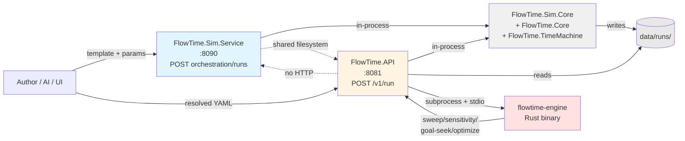

# Executive Overview

This bundle of documents (`research/architecture-as-of-2026-05-06/`) is the code-grounded substrate for an upcoming architectural redesign. It exists because before redesigning, we wanted to know what FlowTime *actually* is today — not what `docs/` says it is, not what `CLAUDE.md` describes, but what the code does.

The investigation was performed by four parallel agents, each focused on a coherent slice of the codebase. Their findings were synthesized into `10-doc-drift.md` (consolidated drift) and `11-redesign-substrate.md` (architectural seams). This overview is written *after* reading their outputs, not before.

**Code is treated as truth throughout.** Where docs disagree, docs are flagged as drift. Schemas under `docs/schemas/` turn out to be effectively historical reference — no test validates writer output against them.

## TL;DR

FlowTime ships **two HTTP services, two CLIs, two UIs, and a Rust engine subprocess**, but the architecture underneath is more unified than the surfaces suggest:

- **The two services don't talk to each other over HTTP.** Both link the same in-process libraries (`FlowTime.Sim.Core`, `FlowTime.Core`, `FlowTime.TimeMachine`). The "Sim vs Engine" framing is a deployment split, not an architectural one. Their only inter-service contract is a shared `data/runs/` filesystem.
- **Parameter substitution happens at the YAML *text* level**, before the engine sees the model. `${splitAirport}` is replaced by `0.3` via raw string substitution in `TemplateService.SubstituteParameters`. By the time validators or evaluators run, parameter names are gone. This is the central cost driver for AI-authoring feedback, validation diagnostics, and time-machine ergonomics.
- **The C# `FlowTime.Core` evaluator is authoritative for the basic `POST /v1/run` path.** The Rust engine (`engine/`, ~218 tests) is invoked as a subprocess for analysis modes — sweep, sensitivity, goal-seek, multi-parameter optimize via Nelder-Mead — all of which already work today (E-0018 done).
- **Telemetry-mode runs work by pre-baking captured CSV data into const-node values.** No live telemetry feed exists. External telemetry ingestion is E-0015, which is `proposed` and unimplemented. The capture-then-bundle direction works (`POST /v1/telemetry/captures`); the live-source direction does not.
- **Run artifacts are the canonical external contract.** Every entry point routes through `RunArtifactWriter`. The artifact directory shape is the *de facto* contract; the schemas under `docs/schemas/` claim to define it but no test validates writer output against them.

The redesign question isn't "should we merge Sim and Engine" — for most architectural purposes, they're already merged. The question is: **how do we surface that truth, and what do we change about parameter handling so the engine sees what the author meant?**

## The eight findings that matter most for the redesign

1. **The Sim/Engine HTTP split is incidental, not load-bearing.** Both services link identical libraries and share filesystem state. There is no security boundary, no scaling boundary, no team boundary. Merging is structurally simple; even keeping them split, the "they're separate domains" framing should be retired.

2. **Parameter substitution is YAML-text-level, not AST-level.** `string.Replace` over the raw YAML cache, applied before parsing. Parameter names are lost at the engine boundary. This is the root architectural problem driving this redesign.

3. **`FlowTime.Sim.Core` is a misnamed core library.** Engine API depends on it, TimeMachine depends on it, both CLIs depend on it. It's not "Sim's core" — it's "everyone's core for templates and provenance."

4. **The expression evaluator already supports the redesign target shape.** `ExprNode` resolves references via `getInput(NodeId) → Series` from a memoised dictionary. Promoting parameters to `kind: const` (or new `kind: parameter`) nodes works through the same path with no evaluator changes.

5. **Telemetry-as-const-injection is the same pattern parameter-as-node would use.** Telemetry runs already pre-bake CSV data into const-node values. Value parameters would do the same with author-supplied scalars. The redesign aligns with how telemetry already works.

6. **Sweep/sensitivity/goal-seek/optimize already exist and would simplify under the redesign.** All shipped (E-0018 done). They re-evaluate models with edited parameter axes via the Rust engine. With parameters as nodes, "vary parameter X" becomes "edit a const node value, re-evaluate" — drastically simpler.

7. **The validation tier model has real gaps that affect M-0069.** The most consequential: `edge_flow_mismatch_*` warnings — which M-0069 is supposed to extend — only fire in the artifact-write path, not from `POST /v1/validate?tier=analyse`. The tier-3 validator passes `edgeSeries=null` and the warnings are unreachable. Plus `ValidationWarning` strips half the diagnostic richness (`Severity`, `Bins`, `Value`, `EdgeIds`) at the boundary. M-0069 needs both fixed before its `val-warn` gate is meaningful.

8. **Schemas under `docs/schemas/*.schema.json` are not validated against writer output anywhere.** The schemas drift from reality on every canonical artifact (`run.json`, `manifest.json`, `series-index.json`). They function as historical reference, not active contract. This needs to be either fixed (schemas catch up; tests enforce) or stated explicitly (move to archive).

## Reading order

For a redesign-oriented read, in 30 minutes:
1. **`00-overview.md`** (this file) — context.
2. **`11-redesign-substrate.md`** — what's load-bearing vs. incidental, where the seams are.
3. **`10-doc-drift.md`** — the cleanup ledger.
4. Selected sections of `01`–`09` as needed.

For a full architectural understanding, ~2 hours:
1. `00-overview.md`.
2. `01-process-and-deployment.md` — what runs as what.
3. `02-code-graph.md` — project dependencies, library boundaries.
4. `03-template-pipeline.md` — how a template becomes a model.
5. `06-run-lifecycle.md` — end-to-end flows for each entry point.
6. `04-engine-runtime.md` — evaluator, node kinds, expression model.
7. `05-validation-stack.md` — validators and analysers.
8. `07-storage-and-artifacts.md` — what gets persisted.
9. `08-telemetry-and-time-machine.md` — adjacent surfaces.
10. `09-rust-engine.md` — Rust workspace, parity.
11. `10-doc-drift.md`, `11-redesign-substrate.md` — synthesis.

For an engine-internals deep dive:
- `04-engine-runtime.md` → `05-validation-stack.md` → `06-run-lifecycle.md` (sections (a) and (c)) → `09-rust-engine.md`.

For a Sim-pipeline deep dive:
- `03-template-pipeline.md` → `06-run-lifecycle.md` (sections (b), (d), (e)) → `07-storage-and-artifacts.md`.

For a "what's broken" read:
- `10-doc-drift.md` end-to-end.

## Key facts — at-a-glance

| Concern | Status today |
|---|---|
| Engine evaluator (basic `POST /v1/run`) | C# `FlowTime.Core`, authoritative |
| Analysis modes (sweep, sensitivity, goal-seek, optimize) | Rust engine subprocess, shipped (E-0018 done) |
| Parameter substitution | YAML-text-level `string.Replace` in Sim, before engine |
| Sim ↔ Engine HTTP coupling | None |
| Sim ↔ Engine library coupling | Both link `FlowTime.Sim.Core` + `FlowTime.Core` |
| Sim ↔ Engine filesystem coupling | Shared `data/runs/` directory |
| Telemetry capture (run → bundle) | Shipped |
| Telemetry-mode runs (bundle → engine) | Shipped, via pre-baked const-nodes |
| External telemetry ingestion (live source) | E-0015, proposed, not implemented |
| Time machine (fit, chunked eval, Pipeline SDK) | E-0022, proposed, not implemented |
| Rust engine parity for basic run | C# remains authoritative; Rust used for analysis only (G-0016 gap) |
| Rust in CI | Not present |
| Production deployment | None — Dockerfiles referenced in docs don't exist |

## What this substrate enables next

The redesign proposal (next document, not in this bundle) will use this substrate to answer:

1. **The parameter-as-node move.** What changes in `SimModelBuilder`, `TemplateService`, `ModelDefinition`. The code surface is bounded — `11-redesign-substrate.md` walks it. The benefits cascade through the validation stack, the time-machine machinery (which already exists), and the AI authoring feedback loop.

2. **The service-boundary decision.** Keep two, merge to one, or recut along a different axis. The investigation finds no production reason to keep two — there's no deployment, no scaling story, no security boundary. The decision is mostly about migration cost vs. surface clarity.

3. **The cleanup that rides along.** 41 drift items catalogued; 13 cleanup opportunities flagged in the substrate doc. Most cost very little when bundled with a redesign.

4. **What stays out of scope.** Rust parity (G-0016), external telemetry ingestion (E-0015), Time-Machine fit (E-0022), CI test discipline (E-0026 already drafted). These are independent.

## Investigation methodology

Four parallel general-purpose agents, each scoped to a coherent slice:

- **Agent A** — static structure (process topology, deployment, code graph, library surface boundaries).
- **Agent B** — engine internals (evaluator, node kinds, expression model, validators, analysers).
- **Agent C** — pipelines and lifecycle (template → resolved model, end-to-end run sequences for each entry point, run artifacts and storage).
- **Agent D** — adjacent surfaces (`FlowTime.Adapters.Synthetic`, telemetry, time machine, Rust engine).

Each agent operated independently with no awareness of the others' findings. Their summaries were reconciled against each other in the synthesis docs (`10`, `11`, this overview). Cross-confirmations were strong: e.g., both Agent A and Agent D independently flagged that `FlowTime.Adapters.Synthetic` is misnamed.

The investigations took ~12-16 minutes each in wall-clock time, ~700K total tokens. The synthesis took ~30 minutes of close reading plus writing.

If this substrate misses something material, the gap is most likely in: (a) UI internals — neither investigation looked deeply at the Blazor or Svelte UI runtime; (b) production-deployment intent — there's nothing to investigate, but the *intent* may live somewhere off-tree; (c) any feature flag or configuration knob that materially changes runtime behavior — only those that surfaced naturally were captured.
