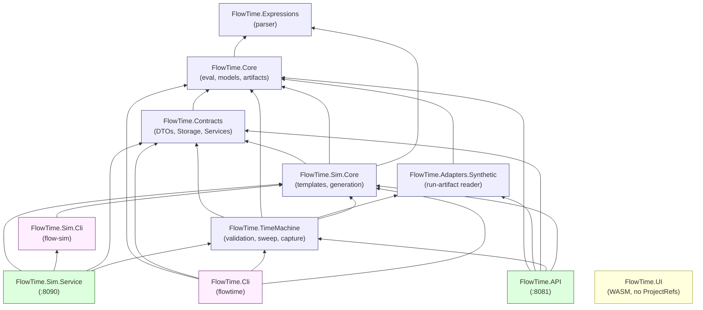

# Code Graph

This document is the static dependency graph of the .NET solution: which projects reference which, what surface each library exposes, and where boundaries hold versus where they leak. Code is treated as truth.

## 1. Project dependency graph

Each row below is one `<ProjectReference>` line in a `*.csproj` file. The arrows in the diagram point from the consumer to the consumed library. Test projects are shown but de-emphasized.

### Source-side ProjectReferences

| From | → To | Citation |
|---|---|---|
| `FlowTime.Core` | `FlowTime.Expressions` | `src/FlowTime.Core/FlowTime.Core.csproj:17` |
| `FlowTime.Contracts` | `FlowTime.Core` | `src/FlowTime.Contracts/FlowTime.Contracts.csproj:19-20` |
| `FlowTime.Adapters.Synthetic` | `FlowTime.Core` | `src/FlowTime.Adapters.Synthetic/FlowTime.Adapters.Synthetic.csproj:11` |
| `FlowTime.TimeMachine` | `FlowTime.Contracts`, `FlowTime.Core`, `FlowTime.Adapters.Synthetic`, `FlowTime.Sim.Core` | `src/FlowTime.TimeMachine/FlowTime.TimeMachine.csproj:18-21` |
| `FlowTime.Sim.Core` | `FlowTime.Contracts`, `FlowTime.Core`, `FlowTime.Expressions` | `src/FlowTime.Sim.Core/FlowTime.Sim.Core.csproj:15-17` |
| `FlowTime.Sim.Cli` | `FlowTime.Sim.Core` | `src/FlowTime.Sim.Cli/FlowTime.Sim.Cli.csproj:12` |
| `FlowTime.Sim.Service` | `FlowTime.Sim.Core`, `FlowTime.Sim.Cli`, `FlowTime.Contracts`, `FlowTime.TimeMachine` | `src/FlowTime.Sim.Service/FlowTime.Sim.Service.csproj:32-35` |
| `FlowTime.Cli` | `FlowTime.Core`, `FlowTime.Contracts`, `FlowTime.TimeMachine`, `FlowTime.Sim.Core` | `src/FlowTime.Cli/FlowTime.Cli.csproj:4-7` |
| `FlowTime.API` | `FlowTime.Core`, `FlowTime.Adapters.Synthetic`, `FlowTime.Contracts`, `FlowTime.TimeMachine`, `FlowTime.Sim.Core` | `src/FlowTime.API/FlowTime.API.csproj:38-45` |
| `FlowTime.UI` | *(no ProjectReferences)* | `src/FlowTime.UI/FlowTime.UI.csproj:10-16` lists only PackageReferences (MudBlazor, AspNetCore.Components.WebAssembly, YamlDotNet, Microsoft.Extensions.Http). |
| `FlowTime.Expressions` | *(no ProjectReferences)* | `src/FlowTime.Expressions/FlowTime.Expressions.csproj` is bare. |

Notable PackageReferences:
- `FlowTime.Core`: `YamlDotNet 17.0.1`, `JsonSchema.Net 5.5.1`, `Microsoft.Extensions.Logging.Abstractions 9.0.12` (`FlowTime.Core.csproj:11-13`).
- `FlowTime.API`: `Microsoft.AspNetCore.OpenApi 9.0.12`, `Parquet.Net 5.4.0`, `YamlDotNet 17.0.1` (`FlowTime.API.csproj:32-34`); embeds git hash + build time as assembly attributes (`FlowTime.API.csproj:12-29`).
- `FlowTime.Sim.Service`: same git-hash trick (`FlowTime.Sim.Service.csproj:12-29`).
- `FlowTime.Adapters.Synthetic`: only the project ref to `FlowTime.Core`; no package deps.
- `FlowTime.UI`: `MudBlazor 8.15.0`, `Microsoft.AspNetCore.Components.WebAssembly 9.0.12`, `YamlDotNet 17.0.1`.
- `FlowTime.Cli`: `JsonSchema.Net`, `Microsoft.Extensions.Configuration[.Abstractions]`, `Microsoft.Extensions.Logging[.Abstractions]` (no YAML dep — comes through `FlowTime.Core`).
- `FlowTime.TimeMachine`: `MessagePack 3.1.4` (`FlowTime.TimeMachine.csproj:10`). Used by `SessionModelEvaluator` for the Rust session protocol.
- `FlowTime.Sim.Core`: `YamlDotNet`, `Microsoft.Extensions.Logging.Abstractions`.

### Test-side ProjectReferences (summary)

| Test project | References |
|---|---|
| `FlowTime.Core.Tests` | `FlowTime.Core`, `FlowTime.Expressions`, `FlowTime.Contracts` (`tests/FlowTime.Core.Tests/FlowTime.Core.Tests.csproj:23-25`) |
| `FlowTime.Expressions.Tests` | `FlowTime.Expressions`, `FlowTime.Core` (`tests/FlowTime.Expressions.Tests/FlowTime.Expressions.Tests.csproj:22-23`) |
| `FlowTime.Tests` | `FlowTime.Core`, `FlowTime.Contracts`, `FlowTime.Sim.Core`; excludes `ApiIntegrationTests.cs` and `Legacy/**` (`tests/FlowTime.Tests/FlowTime.Tests.csproj:25-33`) |
| `FlowTime.Adapters.Synthetic.Tests` | `FlowTime.Adapters.Synthetic`, `FlowTime.Core` |
| `FlowTime.Api.Tests` | `FlowTime.API`, `FlowTime.Core`, `FlowTime.TimeMachine` (`tests/FlowTime.Api.Tests/FlowTime.Api.Tests.csproj:25-27`); shares `tests/TestSupport/TelemetryRunFactory.cs` via `<Compile Include …>`. |
| `FlowTime.Cli.Tests` | `FlowTime.Cli`, `FlowTime.Core`, `FlowTime.API` (with `<Aliases>global,FlowTimeApi</Aliases>`), `FlowTime.TimeMachine`, `FlowTime.Sim.Service` (with `<Aliases>global,SimService</Aliases>`) — `tests/FlowTime.Cli.Tests/FlowTime.Cli.Tests.csproj:24-32`. The aliases let one test process bring up both `Program` types via `WebApplicationFactory<>`. |
| `FlowTime.Sim.Tests` | `FlowTime.Sim.Core`, `FlowTime.Sim.Cli`, `FlowTime.Sim.Service`, `FlowTime.Expressions`, `FlowTime.Core`, `FlowTime.Contracts` |
| `FlowTime.Integration.Tests` | every source project except `FlowTime.UI` and `FlowTime.Expressions` (`tests/FlowTime.Integration.Tests/FlowTime.Integration.Tests.csproj:24-30`) |
| `FlowTime.UI.Tests` | `FlowTime.UI`, plus `bunit 1.40.0` for component tests |
| `FlowTime.TimeMachine.Tests` | `FlowTime.TimeMachine`, `FlowTime.Sim.Core`, `FlowTime.API` (`tests/FlowTime.TimeMachine.Tests/FlowTime.TimeMachine.Tests.csproj:23-25`); also has `<InternalsVisibleTo Include="FlowTime.TimeMachine.Tests" />` from `src/FlowTime.TimeMachine/FlowTime.TimeMachine.csproj:14`. |

### Dependency diagram



Read this diagram bottom-up: `FlowTime.Expressions` and `FlowTime.Core` are the foundations; `FlowTime.Contracts`, `FlowTime.Adapters.Synthetic`, `FlowTime.Sim.Core`, and `FlowTime.TimeMachine` build on them; the four executable surfaces (`FlowTime.Cli`, `FlowTime.API`, `FlowTime.Sim.Cli`, `FlowTime.Sim.Service`) sit at the top.

`FlowTime.UI` is intentionally orphaned in the dependency graph: it has **zero ProjectReferences** to other FlowTime projects (`src/FlowTime.UI/FlowTime.UI.csproj:10-16`) and zero `using FlowTime.{Core|Contracts|Sim|TimeMachine|Adapters|Expressions}` directives in its source (verified via `grep -rh "FlowTime\.(Core|Contracts|Sim|TimeMachine|Adapters|Expressions)" src/FlowTime.UI/`). The Blazor UI is HTTP-coupled only.

## 2. Library surface boundaries

### 2.1 `FlowTime.Core` — engine evaluation core

**Conceptual role:** the model graph, evaluator, expression model, RNG, run artifact writer, Rust engine bridge, validation primitives.

**Top-level namespaces** (verified via `grep -h "^namespace " src/FlowTime.Core/**/*.cs | sort -u`):
- `FlowTime.Core` — entry types (e.g., `Graph`).
- `FlowTime.Core.Analysis` — `InvariantAnalyzer`, `InvariantWarning`.
- `FlowTime.Core.Artifacts` — `RunArtifactWriter`, `IArtifactRegistry` consumers.
- `FlowTime.Core.Compiler`, `FlowTime.Core.Configuration`, `FlowTime.Core.Constraints`, `FlowTime.Core.DataSources`, `FlowTime.Core.Dispatching`, `FlowTime.Core.Execution`, `FlowTime.Core.Expressions` (note: distinct from `FlowTime.Expressions` — see drift below), `FlowTime.Core.Fixtures`, `FlowTime.Core.Metrics`, `FlowTime.Core.Models`, `FlowTime.Core.Nodes`, `FlowTime.Core.Pmf`, `FlowTime.Core.Routing`, `FlowTime.Core.Services`, `FlowTime.Core.TimeTravel`, `FlowTime.Core.Validation`.

**Boundary in practice:** This is the most-depended-on project. All four executable surfaces (`FlowTime.API`, `FlowTime.Cli`, `FlowTime.Sim.Service`/`Cli` indirectly via `Sim.Core`/`TimeMachine`) link it. The boundary holds in the sense that `FlowTime.Core` references nothing FlowTime-internal except `FlowTime.Expressions`.

> **Drift:** Two namespaces collide: `FlowTime.Core.Expressions` (inside `src/FlowTime.Core`) and `FlowTime.Expressions` (a separate project at `src/FlowTime.Expressions`). The latter contains `ExpressionParser`, `ExpressionNodes`, `ExpressionSemanticValidator`. The former contains additional expression types defined inside `FlowTime.Core`. This is a real-but-confusing split — the parser is its own assembly, but expression-related types still live in Core.

### 2.2 `FlowTime.Sim.Core` — template authoring + model generation

**Conceptual role:** templates (parameter schemas, default values, parameter substitution), generation of Engine YAML, template-side invariant analyzer.

**Top-level namespaces:**
- `FlowTime.Sim.Core`
- `FlowTime.Sim.Core.Analysis` — `TemplateInvariantAnalyzer`.
- `FlowTime.Sim.Core.Hashing`
- `FlowTime.Sim.Core.Models`
- `FlowTime.Sim.Core.Services` — `TemplateService`, `ITemplateService`.
- `FlowTime.Sim.Core.Templates`, `FlowTime.Sim.Core.Templates.Exceptions`, `FlowTime.Sim.Core.Templates.Profiles`.

**Boundary in practice:** The conceptual story is "Sim authors models, Engine evaluates them". In practice:
- `FlowTime.Sim.Core` depends on `FlowTime.Core` (for `ModelDefinition`, dispatch schedule, etc.) and `FlowTime.Contracts` (for `ModelDto`/`ModelService`).
- `FlowTime.TimeMachine` (Engine-side) depends on `FlowTime.Sim.Core` — specifically for `RunOrchestrationService` and template-aware orchestration.
- `FlowTime.API` (Engine API) directly imports `FlowTime.Sim.Core.Services.TemplateService` and serves a template-refresh endpoint (`src/FlowTime.API/Program.cs:20-21,95-110,215-220`).

So the conceptual Sim/Engine split is **not** a hard boundary in code: both Engine API and Engine CLI link Sim core.

> **Drift:** `CLAUDE.md` describes Sim and Engine as two surfaces. In practice the Engine API embeds the Sim template service in-process and the Engine CLI links Sim core directly. The Sim Service is the only place where the boundary is strict (it does not depend on `FlowTime.API` or `FlowTime.Core`-via-engine entry points). See §3 below.

### 2.3 `FlowTime.Contracts` — DTOs and shared services

**Conceptual role:** "Shared contracts" — DTOs that cross HTTP and CLI boundaries.

**Namespaces:**
- `FlowTime.Contracts.Dtos` — `ModelDtos.cs`.
- `FlowTime.Contracts.TimeTravel` — `GraphContracts`, `StateContracts`, `MetricsContracts`, `RunContracts`, `DispatchScheduleDescriptor`, `QueueLatencyStatusDescriptor`.
- `FlowTime.Contracts.Storage` — `IStorageBackend`, `StorageBackendFactory`, `StorageBackendOptions`, `SqliteStorageIndexStore`.
- `FlowTime.Contracts.Services` — `IArtifactRegistry`, `FileSystemArtifactRegistry`, `ModelService`, `ArtifactModels`.

**Boundary in practice:** The name "Contracts" implies leaf-position (interfaces only, references nothing in the solution). Reality: `FlowTime.Contracts` **depends on `FlowTime.Core`** (`src/FlowTime.Contracts/FlowTime.Contracts.csproj:19-20`), used for `FlowTime.Core.Models` types in `Dtos/ModelDtos.cs:3` and `Services/ModelService.cs:4`. It also pulls in `Microsoft.Data.Sqlite` (for `SqliteStorageIndexStore`).

> **Drift:** "Contracts" as a name suggests pure-DTO leaf-position. In code it depends on `FlowTime.Core` and pulls in SQLite. It is more of a "shared services + DTOs" project than a contracts surface.

### 2.4 `FlowTime.Expressions` — expression parser

**Top-level namespace:** `FlowTime.Expressions` (only).

**Files (verified):**
- `ExpressionParser.cs`
- `ExpressionNodes.cs`
- `ExpressionSemanticValidator.cs`

**Boundary in practice:** truly a leaf — no `ProjectReference`, no `PackageReference` (`FlowTime.Expressions.csproj:1-8` is bare). Owns the parser AST and semantic validator only. Note the namespace overlap with `FlowTime.Core.Expressions` (see §2.1).

### 2.5 `FlowTime.TimeMachine` — validation orchestration / sweep / capture

**Conceptual role:** Per `CLAUDE.md`: "validation orchestration." In code, it spans more surface than the name implies:
- `Validation/TimeMachineValidator.cs` — multi-tier validator (schema/compile/analyze).
- `Sweep/SweepRunner.cs`, `Sweep/SensitivityRunner.cs`, `Sweep/GoalSeeker.cs`, `Sweep/Optimizer.cs` — Time-Machine sweep entry points.
- `Sweep/IModelEvaluator.cs`, `RustModelEvaluator.cs`, `SessionModelEvaluator.cs` — abstractions and Rust subprocess strategies.
- `Capture/RunArtifactReader.cs` — telemetry capture file reader.
- `Telemetry/{ITelemetrySource, FileCsvSource, CanonicalBundleSource}.cs` — telemetry sources.
- `Orchestration/RunOrchestrationService.cs` — orchestration.
- `Processing/GapInjector.cs` — gap injection.
- `Models/*.cs` — Time-Machine domain models.
- `Artifacts/CaptureManifestWriter.cs`.

**Boundary in practice:** Holds. `TimeMachine` consumes `Core`, `Contracts`, `Synthetic`, `Sim.Core` and is consumed by both executable surfaces (`API` and `Cli`). It is the meeting point between Engine-side and Sim-side abstractions.

`InternalsVisibleTo("FlowTime.TimeMachine.Tests")` is set (`FlowTime.TimeMachine.csproj:14`) — only project doing so.

### 2.6 `FlowTime.Adapters.Synthetic` — run-artifact reader

**Top-level namespace:** `FlowTime.Adapters.Synthetic` (only, flat).

**Files:** `FileSeriesReader.cs`, `RunArtifactAdapter.cs`, `ISeriesReader.cs`, `SeriesIndex.cs`, `RunManifest.cs`.

**Boundary in practice:** Reads run artifacts off disk and exposes a `RunManifest` / `SeriesIndex` view. Used by `FlowTime.API` (`Services/MetricsService.cs:7`, `Services/ParquetExporter.cs:2`, `Services/AggregatesCsvExporter.cs:3`, `Services/NdjsonExporter.cs:4`, `Program.cs:27`) and `FlowTime.TimeMachine`. The "Synthetic" name suggests it serves synthetic test data, but in reality it is the canonical reader for live Engine API run output as well.

> **Drift:** The name `FlowTime.Adapters.Synthetic` and `CLAUDE.md`'s description ("synthetic data adapters") imply this is a synthetic-only/test-only adapter. In practice, the Engine API uses it as its primary way to read run artifacts off disk. It is core path, not a synthetic stub.

## 3. Cross-boundary couplings worth flagging

### 3.1 `FlowTime.API` → `FlowTime.Sim.Core`

**Citation:** `src/FlowTime.API/FlowTime.API.csproj:45`:
```xml
<ProjectReference Include="..\..\src\FlowTime.Sim.Core\FlowTime.Sim.Core.csproj" />
```

**Usage:** `src/FlowTime.API/Program.cs:20-21,95-110`. The Engine API constructs `FlowTime.Sim.Core.Services.TemplateService` directly and exposes `POST /v1/templates/refresh` to drive it. This means a deployment of FlowTime.API needs the templates directory and behaves as a partial template host.

**Why it's notable:** "Engine API" and "Sim Service" are described as separate surfaces; in code, the Engine API embeds the Sim core's template loader. There is no Engine-API → Sim-Service HTTP edge — when the Engine API needs templates, it loads them from disk via Sim core in the same process.

### 3.2 `FlowTime.TimeMachine` → `FlowTime.Sim.Core`

**Citation:** `src/FlowTime.TimeMachine/FlowTime.TimeMachine.csproj:21`:
```xml
<ProjectReference Include="../FlowTime.Sim.Core/FlowTime.Sim.Core.csproj" />
```

**Usage:** `RunOrchestrationService` (`Orchestration/RunOrchestrationService.cs`) and validation machinery use Sim core to apply templates during orchestrated runs.

**Why it's notable:** `TimeMachine` lives on the Engine side (consumed by Engine API and Engine CLI). It pulls Sim core in. So any Engine surface that uses TimeMachine transitively links Sim core.

### 3.3 `FlowTime.Cli` → `FlowTime.Sim.Core`

**Citation:** `src/FlowTime.Cli/FlowTime.Cli.csproj:7`.

**Usage:** Engine CLI's `run --template-id ... --mode simulation|telemetry` path goes through orchestration in `TelemetryRunCommand` and consumes Sim core directly.

### 3.4 `FlowTime.Sim.Service` → `FlowTime.TimeMachine`

**Citation:** `src/FlowTime.Sim.Service/FlowTime.Sim.Service.csproj:35`.

**Usage:** `Program.cs:23-24,59-60` registers `TelemetryBundleBuilder` (TimeMachine type) and uses `RunOrchestrationService`. So the Sim Service depends on Engine-side orchestration code — a reverse direction from the conceptual "Sim authors, Engine evaluates" split.

### 3.5 `FlowTime.Sim.Service` → `FlowTime.Sim.Cli`

**Citation:** `src/FlowTime.Sim.Service/FlowTime.Sim.Service.csproj:33`:
```xml
<ProjectReference Include="../FlowTime.Sim.Cli/FlowTime.Sim.Cli.csproj" />
```

**Why it's notable:** A long-running web service references a CLI executable project. This is unusual; typically CLI projects depend on libraries, not the other way. This effectively means the Sim Service binary set includes `flow-sim.dll` at runtime.

### 3.6 `FlowTime.Sim.Service` excludes legacy template repository files

**Citation:** `src/FlowTime.Sim.Service/FlowTime.Sim.Service.csproj:38-44`:
```xml
<!-- Exclude legacy files from compilation (pending physical deletion) -->
<ItemGroup>
  <Compile Remove="FileSystemTemplateRepository.cs" />
  <Compile Remove="ITemplateRepository.cs" />
  <Compile Remove="NodeBasedTemplateRepositoryAdapter.cs" />
  <Compile Remove="TemplateRegistry.cs" />
</ItemGroup>
```

The files are excluded from compilation but still on disk. This is in-progress dead-code removal; per `CLAUDE.md` Truth Discipline, this would normally be flagged.

### 3.7 `FlowTime.Tests` removes legacy

**Citation:** `tests/FlowTime.Tests/FlowTime.Tests.csproj:31-33`:
```xml
<Compile Remove="ApiIntegrationTests.cs" />
<Compile Remove="Legacy\**\*.cs" />
```

A `Legacy/` test tree exists but is excluded from the build.

### 3.8 `FlowTime.Cli.Tests` extern aliases

**Citation:** `tests/FlowTime.Cli.Tests/FlowTime.Cli.Tests.csproj:26-32`:
```xml
<ProjectReference Include="..\..\src\FlowTime.API\FlowTime.API.csproj">
  <Aliases>global,FlowTimeApi</Aliases>
</ProjectReference>
<ProjectReference Include="..\..\src\FlowTime.Sim.Service\FlowTime.Sim.Service.csproj">
  <Aliases>global,SimService</Aliases>
</ProjectReference>
```

The aliases let the same test process reference both `Program` types (one from `FlowTime.API`, one from `FlowTime.Sim.Service`) — both are `public partial class Program` in the global namespace and would collide otherwise. This implies the CLI tests bring up both services in-process via `WebApplicationFactory<>` — confirmed by `tests/FlowTime.Cli.Tests/TelemetryRunCommandTests.cs:35` (`WebApplicationFactory<SimProgram>`).

## 4. Test project mirror

Per `CLAUDE.md`: "`tests/` mirrors project names." Verifying:

| Source project | Expected test project | Present? |
|---|---|---|
| `FlowTime.Core` | `FlowTime.Core.Tests` | yes |
| `FlowTime.Contracts` | `FlowTime.Contracts.Tests` | **NO** — coverage rolls into `FlowTime.Core.Tests` and `FlowTime.Tests` |
| `FlowTime.Expressions` | `FlowTime.Expressions.Tests` | yes |
| `FlowTime.Adapters.Synthetic` | `FlowTime.Adapters.Synthetic.Tests` | yes |
| `FlowTime.TimeMachine` | `FlowTime.TimeMachine.Tests` | yes |
| `FlowTime.Sim.Core` | `FlowTime.Sim.Core.Tests` | **NO** — covered by `FlowTime.Sim.Tests` (combines Core + Cli + Service) |
| `FlowTime.Sim.Cli` | `FlowTime.Sim.Cli.Tests` | **NO** — same combined `FlowTime.Sim.Tests` |
| `FlowTime.Sim.Service` | `FlowTime.Sim.Service.Tests` | **NO** — same combined `FlowTime.Sim.Tests` |
| `FlowTime.Cli` | `FlowTime.Cli.Tests` | yes |
| `FlowTime.API` | `FlowTime.Api.Tests` | yes (lowercase `Api` per file) |
| `FlowTime.UI` | `FlowTime.UI.Tests` | yes |
| *(no source)* | `FlowTime.Tests` | "engine integration" tests — references `Core`, `Contracts`, `Sim.Core` |
| *(no source)* | `FlowTime.Integration.Tests` | broad-stroke integration tests, references most projects |

Shared test infrastructure lives at `tests/TestSupport/` (`TelemetryRunFactory.cs`, `ListLogger.cs`) and is included via `<Compile Include="..\TestSupport\..." Link="..." />` from multiple csproj files (e.g., `tests/FlowTime.Api.Tests/FlowTime.Api.Tests.csproj:31`, `tests/FlowTime.Cli.Tests/FlowTime.Cli.Tests.csproj:36`, `tests/FlowTime.Integration.Tests/FlowTime.Integration.Tests.csproj:34`, `tests/FlowTime.TimeMachine.Tests/FlowTime.TimeMachine.Tests.csproj:29-30`).

UI testing infrastructure at `tests/ui/` (Playwright + helpers) — separate from the .NET test mirror.

> **Drift:** The "tests mirrors project names" rule is broken three ways: (1) `FlowTime.Contracts.Tests` doesn't exist; (2) the entire Sim surface is collapsed into one `FlowTime.Sim.Tests`; (3) two extra test projects (`FlowTime.Tests`, `FlowTime.Integration.Tests`) have no source counterpart.

## 5. Notable namespaces

A condensed map of who owns what (full list verified by `grep -h "^namespace " src/**/*.cs | sort -u`):

| Namespace | Owning project | Owns |
|---|---|---|
| `FlowTime.Core.*` | FlowTime.Core | DAG eval, models, RNG, artifacts, RustEngineRunner, validation, expressions (some). |
| `FlowTime.Expressions` | FlowTime.Expressions | parser, AST, semantic validator. Note collision with `FlowTime.Core.Expressions`. |
| `FlowTime.Contracts.{Dtos,TimeTravel,Storage,Services}` | FlowTime.Contracts | DTOs + storage backends + artifact registry + ModelService. |
| `FlowTime.Adapters.Synthetic` | FlowTime.Adapters.Synthetic | Run-artifact adapter (live + synthetic). |
| `FlowTime.Sim.Core.*` | FlowTime.Sim.Core | Templates, parameter substitution, generation, hashing. |
| `FlowTime.Sim.Cli` | FlowTime.Sim.Cli | `flow-sim` CLI. |
| `FlowTime.Sim.Service.{Services,Extensions}` | FlowTime.Sim.Service | Sim API host + endpoint extensions. |
| `FlowTime.TimeMachine.{Sweep,Validation,Capture,Telemetry,Orchestration,Processing,Models,Artifacts}` | FlowTime.TimeMachine | TM analyses, validators, telemetry capture, run orchestration. |
| `FlowTime.Cli.{Commands,Configuration,Formatting}` | FlowTime.Cli | Engine CLI. |
| `FlowTime.API.{Endpoints,Models,Services}` | FlowTime.API | Engine API hosts + endpoint groups. |
| `FlowTime.UI.{Components,Configuration,Data,Pages,Services,TimeTravel,Components.Topology,Pages.TimeTravel,Services.Interface}` | FlowTime.UI | Blazor UI. |

## 6. Drift findings

Aggregated `> **Drift:**` callouts from the document plus additional findings:

- **`FlowTime.UI` is HTTP-only.** `CLAUDE.md`'s project layout description says "Blazor WebAssembly UI". The csproj has zero ProjectReferences (`src/FlowTime.UI/FlowTime.UI.csproj:10-16`), and there are zero `using FlowTime.{Core|Contracts|Sim|TimeMachine|Adapters|Expressions}` directives in the source. This is good architectural hygiene but worth noting because the Blazor UI cannot share strongly-typed DTOs with the API — it re-derives them.
- **The conceptual Sim/Engine boundary leaks twice.** `FlowTime.API` references `FlowTime.Sim.Core` directly (`FlowTime.API.csproj:45`); `FlowTime.TimeMachine` (Engine-side) references `FlowTime.Sim.Core` (`FlowTime.TimeMachine.csproj:21`). This makes the Sim Service one of three places where Sim core executes, not the canonical authority for templates.
- **`FlowTime.Sim.Service` references `FlowTime.Sim.Cli` (the Exe project).** `FlowTime.Sim.Service.csproj:33`. Unusual layering — services typically don't depend on CLI executables.
- **`FlowTime.Contracts` is not contract-pure.** Depends on `FlowTime.Core` and pulls in SQLite. The name overpromises.
- **`FlowTime.Adapters.Synthetic` is not synthetic-only.** Used by `FlowTime.API` services as the live run-artifact reader.
- **`FlowTime.Expressions` vs `FlowTime.Core.Expressions`.** Two namespaces split between two projects, though both are about expressions.
- **Test mirror is partial.** No `FlowTime.Contracts.Tests`; Sim core/cli/service collapsed to one test project; two extra non-mirroring test projects exist.
- **Excluded legacy files still on disk.** `FlowTime.Sim.Service.csproj:38-44` removes four `.cs` files from compilation but does not delete them. Same shape in `tests/FlowTime.Tests/FlowTime.Tests.csproj:31-33` for `Legacy/**` and `ApiIntegrationTests.cs`.
- **`docs/architecture/` does not contain a `code-graph.md` or equivalent.** Listing in `docs/architecture/` (per §0 in `01-process-and-deployment.md`) shows individual decision/design docs but no project-graph doc to compare against.
- **`CLAUDE.md` listing of `src/FlowTime.UI.Tests` is wrong.** `CLAUDE.md` says "`src/FlowTime.UI`, `src/FlowTime.UI.Tests`" — but the test project is at `tests/FlowTime.UI.Tests`, not `src/FlowTime.UI.Tests`. (Verified: no `src/FlowTime.UI.Tests` directory exists.)
