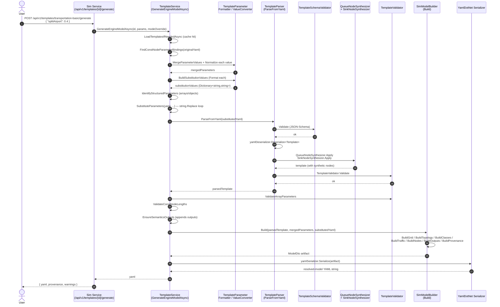

# Template pipeline

How a YAML template under `templates/` becomes a resolved engine model artifact (a `ModelDto` serialized as YAML). The whole pipeline lives in `FlowTime.Sim.Core` and is driven by `TemplateService.GenerateEngineModelAsync` at `src/FlowTime.Sim.Core/Services/TemplateService.cs:122`.

## Template inputs

### Where templates live

Production templates ship under `templates/*.yaml` at the solution root. The Sim service resolves the directory via `Program.ServiceHelpers.TemplatesRoot` (`src/FlowTime.Sim.Service/Program.cs:1775`) which checks, in order:

1. `FLOWTIME_SIM_TEMPLATES_DIR` env var
2. `FlowTimeSim:TemplatesDir` configuration key
3. fallback `<cwd>/../../templates`

The Engine API uses a sibling resolver in `Program.cs:95-110` that prefers `TemplatesDirectory` config or the solution root's `templates/` folder.

A second authoring directory `templates-draft/` is resolved by `ServiceHelpers.DraftTemplatesRoot` (`src/FlowTime.Sim.Service/Program.cs:1812`). Drafts are addressed by content (inline) or by id under that directory; they share the same parser pipeline (see `/api/v1/drafts/generate` and `/api/v1/drafts/run` endpoints in `src/FlowTime.Sim.Service/Program.cs:396-565`).

### Template document shape

The on-disk template is a YAML document deserialised into `Template` (`src/FlowTime.Sim.Core/Templates/Template.cs:14`). The top-level fields are:

| Field | Required | Notes |
|---|---|---|
| `schemaVersion` | yes (const `1`) | `Template.SchemaVersion`, line 17 |
| `generator` | yes | Must start with `flowtime-sim` (validated `TemplateValidator.ValidateGenerator`, line 39) |
| `mode` | no, default `simulation` | `simulation` or `telemetry`; carries `TemplateMode` |
| `metadata` | yes | `id`, `title`, `version`; optional `description`, `narrative`, `tags`, `captureKey` |
| `window` | yes | `start` (ISO 8601 UTC), `timezone` (must equal `UTC`) |
| `parameters` | no | List of `TemplateParameter` (see below) |
| `grid` | yes | `bins`, `binSize`, `binUnit` (`minutes`/`hours`/`days`); optional `start` |
| `rng` | no | `kind`, `seed` |
| `topology` | no but commonly present | `nodes`, `edges`, optional `constraints` |
| `classes` | no | Class metadata (id, displayName) |
| `traffic` | no | Class-aware arrival patterns |
| `nodes` | yes | The node-graph computation (`const`, `pmf`, `expr`, `serviceWithBuffer`, `router`, …) |
| `outputs` | yes | List of series-as-CSV directives |
| `provenance` | no | Authoring provenance — overridden by builder at emission time |

`TemplateParameter` has the shape `{ name, type, title?, description?, default?, min?/minimum?, max?/maximum?, arrayOf? }` (`Template.cs:69-87`). Both `min`/`minimum` and `max`/`maximum` are accepted as aliases.

### Schema document

`docs/schemas/template.schema.json` describes the same shape (Draft-07). Shape highlights:

- `parameters[].type` enum: `integer`, `number`, `boolean`, `string`, `array` (line 42).
- Parameterised numeric fields use `anyOf [ number | string matching ^\$\{...\}$ ]` so unresolved `${...}` placeholders pass schema validation in the unresolved YAML (e.g. `grid.bins`, `grid.binSize`, `traffic.arrivals[].pattern.ratePerBin`, `dispatchSchedule.periodBins`). See lines 86-99, 130-143, 199-217.
- Top-level `nodes[].kind` enum: `const`, `pmf`, `expr`, `serviceWithBuffer`, `router` (line 272).
- `additionalProperties: false` at the root (line 7).

> **Drift:** the schema enumerates `kind: "boolean"` parameters (line 42), but no shipped template uses one and `TemplateParameterValueConverter` (referenced from `TemplateService.cs:319,326`) does not have a special boolean path beyond `JsonValueKind.True/False` formatting. Boolean parameters work end-to-end via formatting, but they aren't exercised in production.

> **Drift:** the top-level `nodes[].kind` schema enum omits `queue`, `dlq`, `service`, `sink`, etc. that appear in `topology.nodes[].kind` (the topology kind is intentionally a free-form string). This is correct — `nodes[]` are computational; `topology.nodes[]` are wiring — but a casual reader confuses them. The synthesizers (below) bridge the two.

### Differences between template-shape and engine-model-shape

The template document and the engine-model document share most fields but differ in three meaningful ways:

| Concern | Template (input) | Engine model (output, `ModelDto`) |
|---|---|---|
| Top-level `metadata`, `window`, `mode`, `generator`, `parameters` | Present at root | Dropped at the root. Mode + generator survive inside `provenance`. The window's `start` collapses into `grid.start` (`SimModelBuilder.BuildGrid`, `SimModelBuilder.cs:44`). |
| `nodes[].source` (telemetry URI, `${telemetryDemandNorthSource}` etc.) | Authoring-only field | Dropped from emission per `D-m-E24-02-01` (`SimModelBuilder.cs:18-22`). Engine reconstructs telemetry sources via `TelemetrySourceMetadataExtractor` over the wire YAML. |
| `provenance` block | Optional authoring placeholder | **Always materialised** by `SimModelBuilder.BuildProvenance` (`SimModelBuilder.cs:390`) with `generator`, `generatedAt`, `templateId`, `templateVersion`, `mode`, `modelId` (sha256 of post-substitution YAML), and the merged `parameters` snapshot. |
| Synthetic queue/sink nodes | Not authored | Injected by `QueueNodeSynthesizer.Apply` and `SinkNodeSynthesizer.Apply` during parsing (`TemplateParser.cs:57-58`). |
| Outputs auto-added for semantics | Optional | `EnsureSemanticsOutputs` walks `topology.nodes[].semantics` and adds an `OutputDto` for any referenced series that the author didn't list (`TemplateService.cs:523-575`). |
| PMF node with builtin profile | `kind: pmf` + `profile.name` | Lowered to `kind: const` with weights * expected-value, plus `metadata.origin.kind = "pmf"` (`SimModelBuilder.BuildProfiledConstNode`, line 225). |

## Parameter taxonomy

What follows is an inventory of every parameter type used in the shipped templates under `templates/`, observed via `grep`/file inspection.

### Time-grid parameters

The grid scalars `bins` and `binSize` are always parameterised with `${bins}`/`${binSize}` placeholders.

```yaml
# templates/transportation-basic.yaml:16-29
- name: bins
  type: integer
  default: 288
  minimum: 12
  maximum: 288
- name: binSize
  type: integer
  default: 5
  minimum: 5
  maximum: 60
```

These get raw value injection at `grid.bins: ${bins}` (`templates/transportation-basic.yaml:70`). The resulting YAML reads `grid.bins: 288` (a plain integer). `binUnit` is never parameterised in shipped templates and is always a literal (`minutes`, `hours`, `days`).

### Numeric value parameters (split rates, retry rates, capacities, multipliers)

The dominant category. Every template carries 3-15 of these. They drive expression weights inside `nodes[].expr`.

```yaml
# templates/transportation-basic.yaml:30-57
- name: splitAirport
  type: number
  default: 0.3
  minimum: 0.0
  maximum: 1.0
- name: hubRetryRate
  type: number
  default: 0.12
  minimum: 0.0
  maximum: 1.0
```

Used inside expressions as `${splitAirport}` (line 393): the entire expression string is the placeholder host:

```yaml
# transportation-basic.yaml:391-393
- id: hub_dispatch_airport
  kind: expr
  expr: "hub_dispatch * ${splitAirport}"
```

After substitution: `expr: "hub_dispatch * 0.3"`. Note the value is dropped into the quoted string verbatim — no requoting.

Other numeric parameters control structural numbers, e.g. `wavePeriodBins: integer` is a structural integer in `dispatchSchedule.periodBins` (`templates/warehouse-picker-waves.yaml`). The schema accepts both raw integers and `${...}` strings for these structural slots (template.schema.json:204-214).

### String / telemetry-source parameters

Every template that supports telemetry ingestion declares `string` parameters with empty defaults:

```yaml
# templates/transportation-basic.yaml:58-67
- name: telemetryDemandNorthSource
  type: string
  default: ""
- name: telemetryDemandSouthSource
  type: string
  default: ""
```

They appear in `nodes[].source: ${telemetryDemandNorthSource}` (line 263). When the orchestrator runs in telemetry mode, it injects `file://...` URIs into these parameters via `BuildParameters`/`TelemetryBindings` (`RunOrchestrationService.cs:208-248`), then substitution rewrites `nodes[].source` in the final YAML.

In simulation mode, the empty-string default substitutes as an empty string and `nodes[].source` becomes `source: ""` — which the engine ignores because `nodes[].source` is dropped from `NodeDto` emission anyway (`SimModelBuilder.cs:18-22`).

### Array parameters

Used for hand-authored time-series defaults:

```yaml
# templates/warehouse-picker-waves.yaml
- name: inboundPattern
  type: array
  arrayOf: number
  default: [120, 135, 150, 190, 210, 220, 205, 185, 170, 160, 150, 140]
- name: intakeCapacity
  type: array
  arrayOf: number
  default: [130, 150, 160, 200, 210, 210, 195, 185, 175, 165, 155, 150]
```

Substituted as `"${inboundPattern}"` inside a `const` node's `values:` field. Because the value is a YAML/JSON array literal, it's classified as a structured parameter; see *Substitution mechanics* below.

`TemplateValidator.ValidateArrayParameters` (`TemplateValidator.cs:853`) walks every array parameter, ensures the element type matches `arrayOf`, and applies the parameter's `min`/`max` to each element. `TemplateService.ValidateConstNodeLengths` (`TemplateService.cs:492`) then enforces that arrays bound to `const` node `values:` match `grid.bins` exactly.

### Boolean parameters

Allowed by the schema (template.schema.json:42). Not used in any shipped template. The runtime path through `TemplateParameterFormatter.FormatForSubstitution` would render `true`/`false` (`TemplateParameterFormatter.cs:15`) and the substitution would land an unquoted YAML boolean.

### Enum-style strings

Not modelled separately. The schema's `parameters[].type: "string"` is the only string variant; there is no per-parameter `enum` constraint slot. Authors can simulate enums with `min`/`max` only for numeric types.

## Substitution mechanics

`TemplateService.SubstituteParameters` at `src/FlowTime.Sim.Core/Services/TemplateService.cs:375` is the production path. It works on the raw YAML string (the cached `originalYaml`), not on a parsed object graph. The public regex is `parameterPlaceholderRegex = new(@"\$\{([^}]+)\}", ...)` (line 25).

### Inputs

The pipeline at `GenerateEngineModelAsync` (line 122) builds three structures before substitution:

1. `parameterizedConstNodes = FindConstNodeParameterBindings(originalYaml)` (line 139) — a line-based pre-pass that scans `nodes:` for entries with `kind: const` and a `values: ${param}` binding. Used later for length checks against `grid.bins`.
2. `mergedParameters = MergeParameterValues(template, parameters)` (line 140) — defaults from the template's parameter list, overridden by request parameters. Each value passes through `TemplateParameterValueConverter.Normalize` (line 319, 326).
3. `substitutionValues = BuildSubstitutionValues(mergedParameters)` (line 141) — every value is rendered to a string via `TemplateParameterFormatter.FormatForSubstitution`. Numbers use invariant culture; booleans become `true`/`false`; arrays render as `[a, b, c]`; strings get quoted only when ambiguous (`TemplateParameterFormatter.cs:36-50`).
4. `structuredParameters = IdentifyStructuredParameters(mergedParameters)` (line 142) — set of parameter names whose runtime value is an array/object (rather than a scalar/string). For these names the substitution also strips surrounding quotes.

### The substitution loop

```csharp
// TemplateService.cs:375-389
foreach (var kvp in substitutions)
{
    var placeholder = $"${{{kvp.Key}}}";
    if (structuredParameters.Contains(kvp.Key))
    {
        result = result.Replace($"\"{placeholder}\"", kvp.Value);
        result = result.Replace($"'{placeholder}'", kvp.Value);
    }
    result = result.Replace(placeholder, kvp.Value);
}
```

Properties of this implementation:

- **String-level, not parser-aware.** The placeholder can sit anywhere — inside a YAML key, a value, an expression literal — and it's replaced by raw string substitution.
- **Quote stripping for structured params** is critical: `values: "${inboundPattern}"` becomes `values: [120, 135, ...]` (a real YAML array), not `values: "[120, 135, ...]"` (a string).
- **Ordering**: the loop iterates the substitution dictionary in dictionary order. Because all placeholders are simple `${name}` tokens with no recursion (the values themselves don't contain placeholders for other params in normal use), order doesn't matter. Two placeholders with the same prefix don't clash because the regex shape forces full `${name}` boundaries.
- **No escape syntax.** A literal `${foo}` cannot be authored — every match is replaced if the name is known.
- **Idempotency / referential transparency.** Each call to `GenerateEngineModelAsync` re-fetches the original cached YAML and re-substitutes; substitution does not mutate the cache (line 143 produces `substitutedYaml`).

### Failure modes

| Failure | Behaviour |
|---|---|
| `${foo}` references an unknown parameter | The placeholder is left untouched in `substitutedYaml`. The downstream `TemplateParser.ParseFromYaml` then sees a literal `${foo}` and most schema slots reject it (e.g. `grid.bins` rejects non-integer non-`${...}` strings). The user sees a `TemplateValidationException` from schema validation, not from substitution. |
| Parameter value is `null` | Rendered as the string `null` (`TemplateParameterFormatter.cs:14`). |
| Array parameter substituted into a non-list slot | The downstream parser will fail on the malformed YAML. No substitution-time check. |
| Cycle (param value contains `${otherParam}`) | The loop runs once per param. Because values come from the request/defaults dictionary, this is a non-issue in practice — values are scalars/arrays from JSON, never templates. |
| Malformed regex match | Not possible with the current pattern. |
| Const-node array length mismatches `grid.bins` | Caught after parsing by `ValidateConstNodeLengths` (TemplateService.cs:492-521) which uses the pre-substitution `parameterizedConstNodes` map and the post-substitution `parsedTemplate.Grid.Bins`. |

`ParameterSubstitution` (`src/FlowTime.Sim.Core/Templates/ParameterSubstitution.cs`) is a parallel object-level implementation. It is **not used by production code paths** — only by tests under `tests/FlowTime.Sim.Tests/NodeBased/`. The production single-source-of-truth is the YAML-level substitution above.

## Template parsing

After substitution the result is parsed by `TemplateParser.ParseFromYaml` (`src/FlowTime.Sim.Core/Templates/TemplateParser.cs:25`).

```csharp
public static Template ParseFromYaml(string yaml)
{
    if (string.IsNullOrWhiteSpace(yaml)) throw new TemplateParsingException(...);
    var schemaResult = TemplateSchemaValidator.Validate(yaml);
    if (!schemaResult.IsValid) throw new TemplateValidationException(...);

    var template = yamlDeserializer.Deserialize<Template>(yaml);
    QueueNodeSynthesizer.Apply(template);
    SinkNodeSynthesizer.Apply(template);
    TemplateValidator.Validate(template);
    return template;
}
```

The deserializer is YamlDotNet with `CamelCaseNamingConvention.Instance` and `IgnoreUnmatchedProperties` (TemplateParser.cs:13-16).

### Schema validation — `TemplateSchemaValidator.Validate`

`src/FlowTime.Sim.Core/Templates/TemplateSchemaValidator.cs:1` runs the JSON-Schema check against `docs/schemas/template.schema.json`. This is the strict gate: required fields, type constraints, allowed enums.

### Synthesizers — `QueueNodeSynthesizer`, `SinkNodeSynthesizer`

`QueueNodeSynthesizer.Apply` (`src/FlowTime.Sim.Core/Templates/QueueNodeSynthesizer.cs:18`) walks `topology.nodes[]` looking for `serviceWithBuffer`, `queue`, or `dlq` kinds (line 11-16). For each one whose `semantics.queueDepth` is missing, equal to `"self"`, or references a node that doesn't exist in the `nodes[]` list, it appends a synthetic `serviceWithBuffer` computational node:

```csharp
template.Nodes.Add(new TemplateNode
{
    Id = queueNodeId,
    Kind = "serviceWithBuffer",
    Inflow = ...,         // resolved from semantics.arrivals
    Outflow = ...,        // resolved from semantics.served / dispatch
    Loss = ...,
    DispatchSchedule = ...,
    Metadata = { ["graph.hidden"] = "true" }
});
```

This is how the `transportation-basic.yaml` template's `topology.nodes[id=HubQueue]` (kind `serviceWithBuffer`, `semantics.queueDepth: self`) ends up with a real computational node that the engine can evaluate.

`SinkNodeSynthesizer.Apply` (`src/FlowTime.Sim.Core/Templates/SinkNodeSynthesizer.cs`) injects pass-through `expr` nodes for topology nodes with `kind: sink` so the topology has a computational endpoint.

### Validation — `TemplateValidator.Validate`

`src/FlowTime.Sim.Core/Templates/TemplateValidator.cs:23` runs after synthesis:

- `ValidateGenerator` — must start with `flowtime-sim`.
- `ValidateMetadata` — `id`, `title`, `version` non-empty; version is semver.
- `ValidateWindow` — `start` parses as ISO 8601; offset is zero; `timezone == "UTC"`.
- `ValidateGrid` — `bins > 0`, `binSize > 0`.
- `ValidateNodes` — node id uniqueness; expression validation via `FlowTime.Expressions`; PMF probability sums (delegates to `PmfValidator`); class-aware shape rules.
- `ValidateOutputs` — every referenced series is a known node id (or a wildcard).
- `ValidateTopology` — every topology node references known computational nodes via semantics; mode-specific gates.
- `ValidateClassesAndTraffic`, `ValidateRng`.

`PmfValidator` (`src/FlowTime.Sim.Core/Templates/PmfValidator.cs`) ensures `probabilities.length == values.length`, all probabilities in `[0, 1]`, and the sum is `1.0` ± `1e-10`.

## Model building — `SimModelBuilder.Build`

After parsing + validation, control returns to `TemplateService.GenerateEngineModelAsync:170`:

```csharp
EnsureSemanticsOutputs(parsedTemplate);
var artifact = SimModelBuilder.Build(parsedTemplate, mergedParameters, substitutedYaml);
var yaml = yamlSerializer.Serialize(artifact);
return yaml;
```

`SimModelBuilder.Build` at `src/FlowTime.Sim.Core/Templates/SimModelBuilder.cs:25` produces a `ModelDto` (defined in `src/FlowTime.Contracts/Dtos/ModelDtos.cs:20`).

### Field-by-field projection

- `SchemaVersion` ← `template.SchemaVersion` (line 31).
- `Grid` ← `BuildGrid(template.Grid, template.Window)` — copies `bins`/`binSize`/`binUnit` and uses `grid.start ?? window.start` (line 44-54). The standalone `window:` block is dropped from emission.
- `Topology` ← `BuildTopology` (line 56-119) — copies nodes/edges/constraints. Semantics are normalised via `BuildSemantics` (line 121-150).
- `Classes` ← copy.
- `Traffic` ← `BuildTraffic` (line 160-196) — only emitted if there are arrivals. Validates that any class reference matches declared classes.
- `Nodes` ← `BuildNodes` (line 198-223). For each `TemplateNode`:
  - If `kind == pmf` and a `profile` resolves via `TemplateProfileResolver`, the builder lowers it to a `const` node with values `expectedValue * profileWeights[i]` plus `metadata.origin.kind=pmf` (`BuildProfiledConstNode`, line 225-249).
  - Otherwise, `BuildDefaultNode` (line 310-339) writes through the kind-specific subset (e.g. `inflow`/`outflow`/`loss` only for `servicewithbuffer`, `inputs`/`routes` only for `router`).
  - `nodes[].source` is **not** copied — it stays a template-only field per the comment block at lines 18-22.
- `Outputs` ← `BuildOutputs` (line 341-349).
- `Provenance` ← `BuildProvenance(template, parameterValues, substitutedYaml)` (line 390-427):
  - `Generator` — uses any provided `template.Provenance.Generator` else `"<template.Generator>/<assembly version>"`.
  - `GeneratedAt` — UTC ISO 8601 now (or the template's pre-set value).
  - `TemplateId` ← `template.Metadata.Id`.
  - `TemplateVersion` ← provenance override or `metadata.version`.
  - `Mode` ← provenance override or the run-time mode.
  - `ModelId` ← `sha256` of `substitutedYaml`, lower-hex (line 444-450).
  - `Parameters` ← merged `parameterValues` snapshot.

### YAML serialization

The serializer is built once in `CreateYamlSerializer` (`TemplateService.cs:69`). It uses:

- `CamelCaseNamingConvention`.
- `FlowSequenceEventEmitter` (`src/FlowTime.Sim.Core/Templates/FlowSequenceEventEmitter.cs`) — keeps short numeric arrays inline as `[a, b, c]` rather than block scalars.
- `QuotedAmbiguousStringEmitter` (line 87) — forces double-quoted emission for strings whose literal text would re-resolve as a YAML 1.2 plain scalar (closing the round-trip asymmetry described at lines 78-83). The note at lines 76-77 confirms this guards `expr: "0"` from re-parsing as integer `0`.
- `OmitNull | OmitEmptyCollections` default-handling, with the explicit caveat (lines 71-77) that `OmitDefaults` is **not** enabled because zero is a real value (e.g. `binSize: 0` would round-trip wrong).

The result is a YAML string matching the engine model schema (`docs/schemas/model.schema.yaml` — the canonical engine wire shape).

## Pre-engine validators (between substitution and engine handoff)

After the parsed template has been re-validated by `TemplateValidator.Validate`, two additional validators run inside `GenerateEngineModelAsync` (lines 161-162):

1. **`TemplateValidator.ValidateArrayParameters(parsedTemplate, mergedParameters)`** (`TemplateValidator.cs:853`) — given the parameter declarations, ensures every `type: array` parameter actually got an array-shaped value, that elements are numeric (or match `arrayOf`), and that each element falls within `[min, max]`.
2. **`ValidateConstNodeLengths(parsedTemplate, mergedParameters, parameterizedConstNodes)`** (`TemplateService.cs:492-521`) — for each `const` node whose `values:` was bound to a parameter (recorded by the line-based `FindConstNodeParameterBindings` pre-pass before substitution), verifies the array length equals `grid.bins`. Throws `TemplateValidationException` on mismatch.

`EnsureSemanticsOutputs` (line 169, definition at 523-575) is technically also a pre-build mutation rather than a validator: it walks every topology node's semantics and appends an `OutputDto` for any series referenced by semantics that the author hadn't explicitly listed under `outputs:`.

The Engine itself runs no template-level validation. Once `SimModelBuilder.Build` returns, the YAML is the canonical engine input. The Engine's own validators (`ModelSchemaValidator`, `ModelCompiler`, `InvariantAnalyzer`) operate on this YAML — see `06-run-lifecycle.md` for that flow.

## Sequence diagram — full template-to-resolved-model flow

User submits a template id (e.g. `transportation-basic`) plus parameter overrides via `POST /api/v1/templates/{id}/generate` on the Sim service.



## Data shape summary — template vs. resolved model

| Aspect | Template (input) | Resolved engine model (output ModelDto) |
|---|---|---|
| Schema | `docs/schemas/template.schema.json` | `docs/schemas/model.schema.yaml` |
| Top-level keys | `schemaVersion`, `generator`, `mode`, `metadata`, `window`, `parameters`, `grid`, `rng`, `topology`, `classes`, `traffic`, `nodes`, `outputs`, `provenance` | `schemaVersion`, `grid`, `classes`, `traffic`, `nodes`, `outputs`, `rng`, `topology`, `provenance` |
| Generator/mode | At root | Inside `provenance.generator`, `provenance.mode` |
| Window | `window: { start, timezone }` separate block | Collapsed: `grid.start` (timezone is implicitly UTC) |
| Parameters | Authoring schema in `parameters:` | Captured snapshot in `provenance.parameters` |
| Metadata | `metadata: { id, title, version, ... }` | Not preserved on `ModelDto`; `templateId`, `templateVersion` survive in `provenance` |
| `${param}` placeholders | Allowed in any string field | Fully resolved; literal values |
| Nodes | Author-listed `const`/`pmf`/`expr`/`serviceWithBuffer`/`router` | Same kinds plus synthesized queue/sink nodes injected by synthesizers |
| `nodes[].source` | Authored telemetry URI hint | **Dropped** from emission (per D-m-E24-02-01) |
| PMF + builtin profile | `kind: pmf` with `profile.kind: builtin, name: ...` | Lowered to `kind: const` with weighted values + `metadata.origin.kind=pmf` |
| Outputs | Authored list | Authored list, plus auto-added entries for any series referenced by topology semantics (`EnsureSemanticsOutputs`) |
| Provenance | Optional authoring sketch | Always materialised: `generator`, `generatedAt`, `templateId`, `templateVersion`, `mode`, `modelId` (sha256 of substituted YAML), `parameters` snapshot |

> **Note on round-trip:** the engine never re-parses the resolved YAML through the template pipeline. Validation on the engine side is `ModelSchemaValidator` + `ModelCompiler` + `InvariantAnalyzer`, all in `FlowTime.Core` — see `04-engine-runtime.md` and `05-validation-stack.md` (Agent B's documents).
