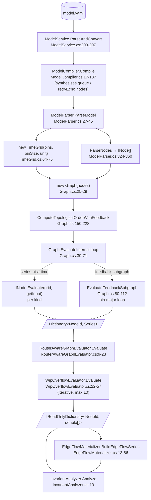
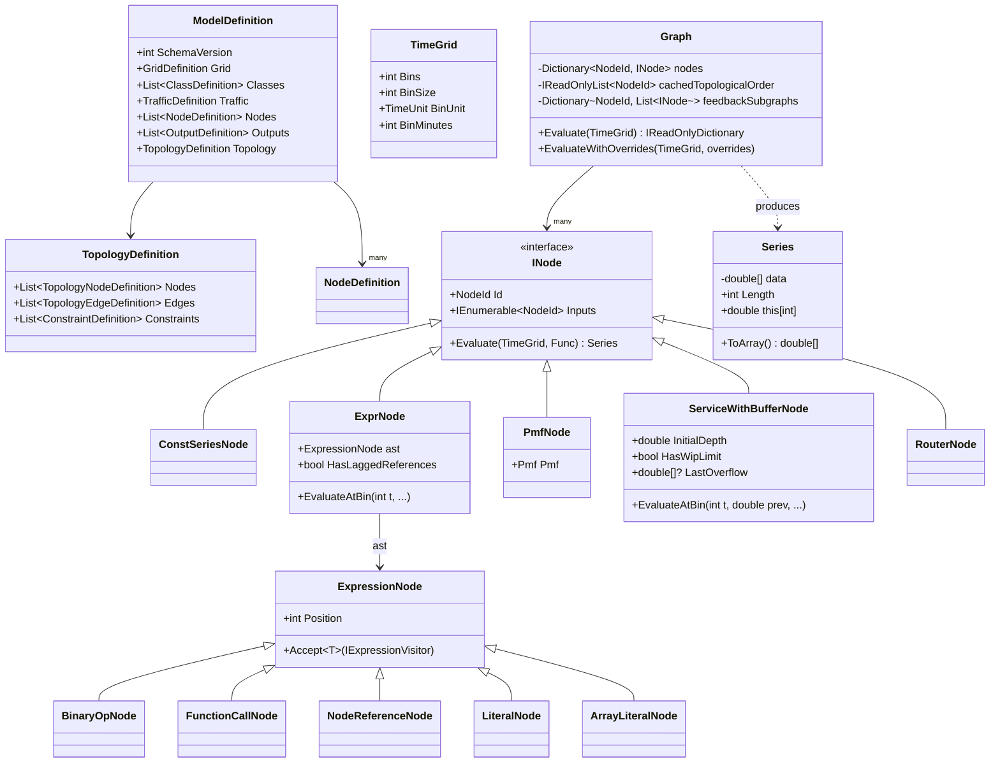

# Engine Runtime

How the C# engine actually evaluates a resolved model, as static structures. The pipeline view (entry points, callers) is owned by Agent C; this document focuses on data shapes and execution model.

The matrix-engine Rust crate (`engine/`) is documented in `09-rust-engine.md`. Where C# and Rust differ, this document describes C#.

## Resolved model shape

The model the engine receives after YAML deserialisation and DTO conversion is `ModelDefinition`, declared at `src/FlowTime.Core/Models/ModelParser.cs:535-544`. Its top-level fields are:

| Field | Type | Source line |
|---|---|---|
| `SchemaVersion` | `int` | `ModelParser.cs:537` |
| `Grid` | `GridDefinition?` | `ModelParser.cs:538` |
| `Classes` | `List<ClassDefinition>` | `ModelParser.cs:539` |
| `Traffic` | `TrafficDefinition?` | `ModelParser.cs:540` |
| `Nodes` | `List<NodeDefinition>` | `ModelParser.cs:541` |
| `Outputs` | `List<OutputDefinition>` | `ModelParser.cs:542` |
| `Topology` | `TopologyDefinition?` | `ModelParser.cs:543` |

Adjacent types in the same file:

- `GridDefinition` — `Bins`, `BinSize`, `BinUnit`, optional `Start` (`ModelParser.cs:572-578`).
- `NodeDefinition` — superset of fields covering every kind: `Id`, `Kind`, `Values` (const), `Expr` (expr), `Pmf` (pmf), `Inflow`/`Outflow`/`Loss`/`DispatchSchedule`/`WipLimit`/`WipLimitSeries`/`WipOverflow` (serviceWithBuffer), `Router` (router), plus a free-form `Metadata` map (`ModelParser.cs:580-601`).
- `TopologyDefinition` — `Nodes` (`TopologyNodeDefinition[]`), `Edges` (`TopologyEdgeDefinition[]`), `Constraints` (`ConstraintDefinition[]`) at `ModelParser.cs:641-646`.
- `TopologyNodeDefinition` — `Id`, `Kind` (default "service" injected at `ModelParser.cs:124`), `NodeRole`, `Group`, `Ui`, `Constraints`, `Semantics`, `InitialCondition`, `DispatchSchedule`, `WipLimit`, `WipLimitSeries`, `WipOverflow` (`ModelParser.cs:648-665`).
- `TopologyNodeSemanticsDefinition` — string-typed series bindings (`Arrivals`, `Served`, `Errors`, `Attempts`, `Failures`, `ExhaustedFailures`, `RetryEcho`, `RetryBudgetRemaining`, `ExternalDemand`, `QueueDepth`, `Capacity`, `ProcessingTimeMsSum`, `ServedCount`) plus typed coefficients (`SlaMin`, `MaxAttempts`, `RetryKernel`, `Parallelism`) and free-form `Aliases`/`Metadata` maps (`ModelParser.cs:667-690`).
- `TopologyEdgeDefinition` — `Source`, `Target`, `Weight` (default 1.0), optional `Id`, `Type`, `Measure`, `Multiplier`, `Lag` (`ModelParser.cs:706-716`). Note: the on-the-wire DTO names these `from`/`to` (`src/FlowTime.Contracts/Dtos/ModelDtos.cs:181-182`); they are renamed at convert time (`ModelService.cs:174-175`).
- `ClassDefinition` — `Id`, `DisplayName`, `Description` (`ModelParser.cs:546-551`).
- `TrafficDefinition` / `ArrivalDefinition` / `ArrivalPatternDefinition` — describes class arrivals; consumed by `ClassAssignmentMapBuilder` (`ModelParser.cs:553-570`).
- `OutputDefinition` — `Series`, `As` (`ModelParser.cs:635-639`).

Parameters (template `${name}` placeholders) do not survive into the engine. Substitution happens text-first in `TemplateService.SubstituteParameters` (Sim side, before YAML parsing), so `ModelDefinition` only sees concrete numbers and strings. The model text is the post-substitution unified model described in `docs/schemas/model.schema.yaml`.

A second runtime-only model surface lives next to this:

- `ModelMetadata` (`ModelParser.cs:729-733`): `Window` + an analytical-rich `Topology` (`src/FlowTime.Core/Models/Topology.cs:7-55`) where each `Node` carries a precompiled `RuntimeAnalyticalDescriptor` (`src/FlowTime.Core/Models/Node.cs:3-15`). This is built by `ModelParser.ParseMetadata` (`ModelParser.cs:47-87`) on demand and is what the metrics / analytics passes consume — the evaluator graph itself uses the leaner `INode` types described below.

## Node kinds enumeration

The kind is dispatched as a lower-cased string in `ModelParser.ParseSingleNode` (`src/FlowTime.Core/Models/ModelParser.cs:365-387`):

```
"const"             → ParseConstNode               → ConstSeriesNode
"expr"              → ParseExprNode                → ExprNode
"pmf"               → ParsePmfNode                 → PmfNode
"servicewithbuffer" → ParseServiceWithBufferNode   → ServiceWithBufferNode
"router"            → ParseRouterNode              → RouterNode
_                   → throw ModelParseException("Unknown node kind: ...")
```

There is no C# enum for kinds; dispatch is by a `switch` on a normalised string. Kind matching is case-insensitive (`ParseSingleNode` lower-cases before switching) but the schema enum uses canonical camelCase: `const`, `expr`, `pmf`, `serviceWithBuffer`, `router` (`docs/schemas/model.schema.yaml:493-498`).

Per-kind required and optional fields, as enforced by the parser:

### `const`

- Defined: `ConstSeriesNode` at `src/FlowTime.Core/Nodes/ConstSeriesNode.cs:6-23`.
- Semantic: a literal `double[]` aligned to the time grid.
- Required: `values` (length must equal `grid.bins`, enforced at evaluation in `ConstSeriesNode.cs:20-21`; also adjunct-validated in `ModelSchemaValidator.ValidateConstNodeValueCount`).
- Optional: `metadata`, `dispatchSchedule` (per schema arm `docs/schemas/model.schema.yaml:692-701`, but `dispatchSchedule` has no engine effect on a const node).
- No inputs (`ConstSeriesNode.Inputs = Array.Empty<NodeId>()`).

### `expr`

- Defined: `ExprNode` at `src/FlowTime.Core/Expressions/ExprNode.cs:17-37`. Built by `ExpressionCompiler.Compile` (`src/FlowTime.Core/Expressions/ExpressionCompiler.cs:19-28`).
- Semantic: an arithmetic expression tree, using node references as series operands.
- Required: `expr` (string, `minLength: 1`). Parsed by `FlowTime.Expressions.ExpressionParser`.
- Optional: `metadata`.
- Inputs: same-bin node references discovered by `ExpressionCompiler.FindClassifiedReferences` (`ExpressionCompiler.cs:35-44`) — references inside `SHIFT(x, lag>=1)` are classified as lagged and excluded from the topological-sort dependency edges.

### `pmf`

- Defined: `PmfNode` at `src/FlowTime.Core/Pmf/PmfNode.cs:11-79`. Wraps an `Pmf` (`src/FlowTime.Core/Pmf/Pmf.cs:9`).
- Semantic: a discrete distribution surfaced as a constant series at its expected value (`PmfNode.cs:46-52`). The engine path is deterministic — sampling lives in `PmfCompiler` (`src/FlowTime.Core/Pmf/PmfCompiler.cs:121`), which is invoked in different paths (e.g., from the Rust engine compile path), not from the standard graph evaluator.
- Required: `pmf.values`, `pmf.probabilities` (same length, no duplicates, sum to 1±1e-4 — enforced in `ParsePmfNode` at `ModelParser.cs:415-447` plus `Pmf` ctor invariants).
- Optional: `metadata`.
- No inputs (`PmfNode.Inputs => Enumerable.Empty<NodeId>()`).

### `serviceWithBuffer`

- Defined: `ServiceWithBufferNode` at `src/FlowTime.Core/Nodes/ServiceWithBufferNode.cs:11-234`.
- Semantic: a stateful queue: `Q[t] = max(0, Q[t-1] + inflow[t] - outflow[t] - loss[t])`, optionally with a WIP-limit clamp and overflow tracking.
- Required: `inflow` (NodeId), `outflow` (NodeId).
- Optional: `loss` (NodeId), `dispatchSchedule`, `wipLimit` (scalar), `wipLimitSeries` (NodeId — takes precedence over `wipLimit`), `wipOverflow` (`"loss"` or another node id), `metadata`.
- Initial seed: not on the node literal — it comes via `topology.nodes[].initialCondition.queueDepth` and is patched in by `ModelParser.ParseNodes` after construction (`ModelParser.cs:329-355`).

### `router`

- Defined: `RouterNode` at `src/FlowTime.Core/Nodes/RouterNode.cs:6-24`.
- Semantic: a passthrough at the graph layer (it returns its single queue input verbatim — `RouterNode.cs:20-23`). The actual flow split happens **after** initial graph evaluation, in `RouterAwareGraphEvaluator.Evaluate` + `RouterFlowMaterializer` (see "Special node behaviors" below).
- Required: `inputs.queue` (NodeId), at least one entry in `routes`.
- Each route: `target` (required), plus either `classes[]` or positive `weight` (enforced at `ModelParser.cs:477-488`).

Other top-level kinds appear only in the schema or topology layer, not in the runtime node switch:

- `topology.nodes[].kind` accepts `service`, `serviceWithBuffer`, `queue`, `dlq` (and others). `ModelCompiler.IsQueueLikeKind` recognises `serviceWithBuffer`/`queue`/`dlq` and synthesises a `serviceWithBuffer` `NodeDefinition` for each (`src/FlowTime.Core/Compiler/ModelCompiler.cs:10-15`). The schema does not enum-restrict `topology.nodes[].kind` — it documents the default as `"service"` with no enum (`docs/schemas/model.schema.yaml:139-142`).
- `pcg32` appears only as the RNG kind in provenance / `kind: pcg32` examples (`docs/schemas/model.schema.yaml:1181`); it is not a node kind.

> **Drift:** The schema enum `[const, expr, pmf, serviceWithBuffer, router]` (`model.schema.yaml:493-498`) is canonical for `nodes[].kind`. The C# parser accepts the same set but compares case-insensitively (`ModelParser.cs:376`), so `Const` or `EXPR` would parse but fail schema validation. The schema is stricter, which is the correct direction.

## Execution model

Evaluation is **node-major**, **topologically ordered**, with a special **bin-by-bin** mode for feedback subgraphs.

The entry point is `Graph.Evaluate(TimeGrid)` at `src/FlowTime.Core/Execution/Graph.cs:31-32`, which delegates to `EvaluateInternal` (`Graph.cs:39-71`). The dispatch is:

1. Compute (or reuse cached) topological order and feedback partition (`Graph.cs:150-228`). This uses Kahn's algorithm on each `INode.Inputs` list (`Graph.cs:154-176`); a same-bin cycle is fatal (`throw new InvalidOperationException("Graph has a cycle...")` at `Graph.cs:176`).
2. Walk the cached order, evaluating each node once for the entire grid, in series order (`Graph.cs:43-69`).
3. Per node, call `INode.Evaluate(grid, getInput)` where `getInput` looks up the already-computed `Series` for an input node from the `memo` dictionary.
4. Memoise the produced `Series` keyed by `NodeId` (`Graph.cs:68`).

So most node kinds are **series-at-a-time** (`Evaluate(TimeGrid, Func<NodeId, Series>) → Series`): they build the full `double[]` for all bins in one call. `ConstSeriesNode`, `PmfNode`, `RouterNode`, plus the series-mode path of `ExprNode` (`ExprNode.Evaluate` at `ExprNode.cs:152-156`) all behave this way. `ServiceWithBufferNode.Evaluate` (`ServiceWithBufferNode.cs:80-142`) likewise produces the whole series in one pass (a single `for t in 0..bins` loop with mutable queue-depth state inside the call).

### Feedback subgraphs

The `ExpressionCompiler` partitions each `ExprNode`'s references into "same-bin" and "lagged" (lagged = inside a `SHIFT(_, lag>=1)`). When an `ExprNode` has a lagged reference to a node that comes **after** it in topo order, it forms a feedback cycle that cannot be evaluated series-at-a-time (`Graph.cs:178-226`). The graph collapses such regions into a contiguous **feedback subgraph** spanning from the lagging `ExprNode` to its furthest lagged target (inclusive) and switches to a **bin-major** evaluator for that span (`Graph.EvaluateFeedbackSubgraph` at `Graph.cs:80-112`). The outer-loop is bins, the inner loop is nodes-in-subgraph-topo-order; columns are kept as mutable `double[]` per node and each bin reads from already-written entries via `EvaluateNodeAtBin` (`Graph.cs:114-142`).

Inside the subgraph, only `ExprNode.EvaluateAtBin` (`ExprNode.cs:44-150`) and `ServiceWithBufferNode.EvaluateAtBin` (`ServiceWithBufferNode.cs:172-218`) are recognised; any other node kind in a feedback subgraph throws `InvalidOperationException("Unsupported node type in feedback subgraph: ...")` at `Graph.cs:139-141`.

So:

- `const`, `pmf` evaluate **once for the whole grid** and never appear inside a feedback subgraph.
- `expr` evaluates whole-series in normal flow; bin-by-bin inside a feedback subgraph.
- `serviceWithBuffer` always evaluates bin-by-bin internally (it has to — its state is a recurrence). In normal flow this happens inside its own `Evaluate`; in a feedback subgraph it is driven externally by the subgraph evaluator.
- `router` is a passthrough at the graph layer; the routing semantics are applied in a post-evaluation pass (next section).

## Expression evaluator surface

The expression library is `src/FlowTime.Expressions/`:

- `ExpressionParser` (`ExpressionParser.cs:32-371`) — recursive-descent parser, grammar declared at `ExpressionParser.cs:23-31`:
  ```
  Expression  = Term (('+' | '-') Term)*
  Term        = Factor (('*' | '/') Factor)*
  Factor      = Number | Array | NodeRef | FunctionCall | '(' Expression ')'
  FunctionCall = Identifier '(' (Expression (',' Expression)*)? ')'
  NodeRef     = Identifier
  Array       = '[' (Number (',' Number)*)? ']'
  ```
- AST nodes (`ExpressionNodes.cs:8-95`):
  - `BinaryOpNode` — `Operator: BinaryOperator`, `Left`, `Right`. Operator enum: `Add`, `Subtract`, `Multiply`, `Divide` (`ExpressionNodes.cs:89-95`).
  - `FunctionCallNode` — `FunctionName: string`, `Arguments: List<ExpressionNode>`.
  - `NodeReferenceNode` — `NodeId: string`. References resolve by name match against another node's `Id` in the `ModelDefinition.Nodes` list. There is no scoping or alias layer — a bare identifier is a node reference.
  - `LiteralNode` — `Value: double`.
  - `ArrayLiteralNode` — `Values: IReadOnlyList<double>` (used only as a `CONV` kernel literal).
- Visitor: `IExpressionVisitor<T>` (`ExpressionNodes.cs:24-31`), with five `Visit*` methods. Used by `ExpressionCompiler.ClassifiedRefFinder` (`ExpressionCompiler.cs:56-103`), `ExpressionCompiler.NodeRefFinder` (`ExpressionCompiler.cs:105-133`), `ModelSchemaValidator.NodeReferenceCollector` (`ModelSchemaValidator.cs:869-900`), and `ExpressionSemanticValidator.SelfShiftDetector` (`ExpressionSemanticValidator.cs:48-100`).

The function set is closed and dispatched by uppercased `FunctionName` in two parallel switches:

- Series-mode (`ExprNode.EvaluateFunctionCall` at `ExprNode.cs:199-216`): `SHIFT`, `CONV`, `MIN`, `MAX`, `CLAMP`, `MOD`, `FLOOR`, `CEIL`, `ROUND`, `STEP`, `PULSE`. Unknown function → `ArgumentException`.
- Bin-mode (`ExprNode.EvaluateBinFunctionCall` at `ExprNode.cs:76-94`): same set.

Both modes share the same parsed AST. References resolve to other model nodes by `id`; identifiers are case-insensitive at the reference-collection layer (`ExpressionCompiler.cs:58-59` uses `StringComparer.OrdinalIgnoreCase`) but case-sensitive in the parser (it only reads characters; comparison happens later).

`ExpressionSemanticValidator.HasSelfReferencingShift` (`ExpressionSemanticValidator.cs:11-22`) inspects the AST to detect `SHIFT(self, n>0)` and emits a single error code `SELF_SHIFT_REQUIRES_INITIAL_CONDITION` when the corresponding topology node lacks an `initialCondition.queueDepth`. This is invoked from `ModelParser.ValidateInitialConditions` (`ModelParser.cs:260-319`) and reused in the schema adjunct (`ModelSchemaValidator.cs:574-618`).

## Per-bin runtime data structures

The hand-off between nodes is `Series` (`src/FlowTime.Core/Execution/Series.cs:8-21`):

- Wraps a `double[]`, copy-on-construct (`Series.cs:13-16`) and copy-on-`ToArray()` (`Series.cs:20`).
- Indexer is read-only (`this[int t]` returns a `double`).
- `Length` is fixed at construction.

The evaluator-level container is `IReadOnlyDictionary<NodeId, Series>` (`Graph.cs:31`). After `RouterAwareGraphEvaluator` it is also flattened to `IReadOnlyDictionary<NodeId, double[]>` (`RouterAwareGraphEvaluator.cs:25-34`) — that's the shape `InvariantAnalyzer.Analyze` consumes (`InvariantAnalyzer.cs:21`).

Time-series semantics:

- **Every bin is always populated.** Series length always equals `grid.Bins` — `ConstSeriesNode` enforces this (`ConstSeriesNode.cs:20-21`), `ExprNode` allocates the result by `grid.Bins` (`ExprNode.cs:182, :243, :269, etc.`), `ServiceWithBufferNode` allocates by `grid.Bins` (`ServiceWithBufferNode.cs:107, :109`).
- **Missing data is zero.** Any out-of-bounds read inside a feedback subgraph returns `0.0` (`Graph.cs:124, :126, :129`). `Series` itself doesn't have a sparse representation — it is always a `double[]`.
- **Non-finite values are tolerated through the analyser.** Pre-evaluation, `Safe(double)` and `SafeDouble(double)` in `ServiceWithBufferNode` (`ServiceWithBufferNode.cs:220-233`) coerce non-finite to `0`. `InvariantAnalyzer.CheckNonNegative` (`InvariantAnalyzer.cs:760-787`) does explicit `< -tolerance` checks; division-by-zero in `ExprNode` is silently coerced to `0` (`ExprNode.cs:71, :191`).

There is no formal "missing" sentinel. The convention is "always-populated, zero-padded".

## Edge model at runtime

Edges are first-class data on the topology, not derived from references:

- `TopologyEdgeDefinition` (`ModelParser.cs:706-716`): `Source`, `Target`, `Weight`, optional `Id`, `Type`, `Measure`, `Multiplier`, `Lag`. There is also a runtime-only typed mirror `Edge` (`src/FlowTime.Core/Models/Edge.cs:3-13`) materialised via `ModelParser.ConvertEdge` (`ModelParser.cs:143-159`).
- The producer-consumer relationship at runtime is **not** the edge list. Producer-consumer is the implicit graph formed by each node's `Inputs` (its same-bin dependency list). Edges are an analytical / display overlay, consumed by:
  - `EdgeFlowMaterializer.BuildEdgeFlowSeries` (`src/FlowTime.Core/Routing/EdgeFlowMaterializer.cs:13-86`) — computes per-edge `flowVolume` series after evaluation, factoring in router class assignments and edge weights.
  - `InvariantAnalyzer` — reads incoming/outgoing edge maps to do conservation checks (`InvariantAnalyzer.cs:79-103, :307-336`).
- The per-edge `flowVolume` series is **materialised post-evaluation**, not during. `RunArtifactWriter.EdgeSeriesInput` (`src/FlowTime.Core/Artifacts/RunArtifactWriter.cs:46-52`) is the carrier shape (`EdgeId`, `Metric`, `Values`, optional `ClassId`); the analyser reads these from a separate `edgeSeries` parameter (`InvariantAnalyzer.cs:23, :104-114`) and rebuilds an edge-id keyed lookup. So yes — by the time the analyser runs, `flowVolume` is a real `double[]` per edge.

`Edge.Lag` is documented as a per-edge bin lag, but `EdgeFlowMaterializer` applies it during materialisation; the analyser additionally emits an `edge_behavior_violation_lag` warning whenever any edge has positive lag (`InvariantAnalyzer.cs:82-102`), suggesting lag-on-edges is policy-discouraged.

## Special node behaviors

### `serviceWithBuffer`

Stateful — carries queue depth across bins. Recurrence:

```
Q[0]    = max(0, initialDepth + inflow[0] - outflow[0] - loss[0])
Q[t]    = max(0, Q[t-1]      + inflow[t] - outflow[t] - loss[t])
```

(`ServiceWithBufferNode.cs:110, :125`).

After the recurrence the WIP limit is enforced (`ServiceWithBufferNode.cs:112-120, :127-135`): if `Q[t] > limit`, the excess is recorded in `LastOverflow[t]` and `Q[t]` is clamped. The limit may be a scalar (`wipLimit`) or a per-bin series (`wipLimitSeries` — takes precedence).

If `dispatchSchedule` is set, the outflow series is gated/capped before the recurrence by `DispatchScheduleProcessor.ApplySchedule` (`ServiceWithBufferNode.cs:90-100`). The bin-mode equivalent (`EvaluateAtBin`, `ServiceWithBufferNode.cs:172-218`) zeroes outflow on non-dispatch bins inline.

It is **not a pure function of inputs**: it carries `LastOverflow` (mutable `double[]?`, `ServiceWithBufferNode.cs:41`) which is later read by `WipOverflowEvaluator` (`src/FlowTime.Core/Execution/WipOverflowEvaluator.cs:59-96`) to inject overflow into the target queue's inflow on a subsequent re-evaluation pass — up to `MaxIterations = 10` iterations until the override map converges (`WipOverflowEvaluator.cs:39-56`).

### `router`

`RouterNode.Evaluate` is a no-op: it returns its single queue input unchanged (`RouterNode.cs:20-23`). The actual routing happens **after** the initial graph evaluation, in two stages:

1. `RouterFlowMaterializer.ComputeOverrides` (`src/FlowTime.Core/Routing/RouterFlowMaterializer.cs:12-86`) walks router specifications and computes per-target overrides — class-bound routes route 100% of named classes; weight-bound routes split the residual proportionally.
2. `RouterAwareGraphEvaluator.Evaluate` (`src/FlowTime.Core/Routing/RouterAwareGraphEvaluator.cs:9-23`) runs the graph once, reads the router specs, builds overrides, and re-runs `Graph.EvaluateWithOverrides` if any overrides were computed. The `OverridesApplied` flag distinguishes pristine from re-evaluated runs (`RouterAwareGraphEvaluator.cs:36-39`).

Routers therefore introduce a second graph evaluation pass orthogonal to the per-node loop.

### `pmf`

In the engine path (`PmfNode.Evaluate`, `PmfNode.cs:46-52`), a PMF emits a constant series at its expected value `Σ p_i · v_i`. There is no sampling, no per-bin variation. Sampling is implemented in `PmfCompiler.SampleFromPmf` (`PmfCompiler.cs:143-159`) using `Pcg32`, but `PmfCompiler` is invoked from non-engine paths (e.g., the Rust-engine ingest path does its own sampling — see `09-rust-engine.md`). Inside the C# graph, PMF nodes are deterministic.

### `const`, `expr`

Pure functions of their inputs. No persistent state. The `expr` evaluator does carry per-call state inside the visitor pattern but nothing leaks across `Evaluate` calls.

## Time grid

The grid is established once, per evaluation, in `ModelParser.ParseModel` (`ModelParser.cs:34-39`):

```
unit  = TimeUnitExtensions.Parse(model.Grid.BinUnit)   // minutes|hours|days|weeks
grid  = new TimeGrid(model.Grid.Bins, model.Grid.BinSize, unit)
```

`TimeGrid` is a `readonly record struct` (`src/FlowTime.Core/Models/TimeGrid.cs:55-76`) with `Bins`, `BinSize`, `BinUnit`, and a precomputed `BinMinutes` field. Validation is in the constructor: `bins ∈ [1, 10000]`, `binSize ∈ [1, 1000]`. The grid is passed by value to every `INode.Evaluate(TimeGrid, ...)` call.

Nodes cannot have different grids. There is one grid per `Graph` evaluation; nodes only see `grid.Bins`. Multi-grid models are not representable in the current type system.

The optional `grid.start` (ISO-8601 timestamp, `ModelParser.cs:572-578`) is parsed by `ParseStartTime` (`ModelParser.cs:246-258`) into a `DateTime?` on `Window` / `ModelMetadata` but never feeds the evaluator — it's metadata-only.

`TimeUnit` (`TimeGrid.cs:6-12`) is a closed enum: `Minutes`, `Hours`, `Days`, `Weeks`. Anything else fails parsing at `TimeUnitExtensions.Parse` (`TimeGrid.cs:34-49`).

## Determinism

The C# engine evaluation path is **fully deterministic** for a fixed `ModelDefinition`:

- `ConstSeriesNode` clones a fixed array (`ConstSeriesNode.cs:22`).
- `ExprNode` is pure arithmetic on known operands.
- `PmfNode.Evaluate` returns expected value, no RNG.
- `ServiceWithBufferNode.Evaluate` is deterministic recurrence.
- `RouterFlowMaterializer.ComputeOverrides` is deterministic on the inputs.

The only RNG entry points are:

- `Pcg32` (`src/FlowTime.Core/Rng/Pcg32.cs`) — seeded; same seed → same sequence (PCG-XSH-RR variant).
- `PmfCompiler.Compile` (`src/FlowTime.Core/Pmf/PmfCompiler.cs:121`) — uses `new Pcg32(options.Seed)` to draw a sampled series. Used **outside** the standard graph evaluator path (e.g., by Rust-engine ingest); the in-graph `PmfNode.Evaluate` does not use `Pcg32`.

So the in-process engine evaluator is deterministic without any seed bookkeeping; introducing per-bin sampling would require a new node kind or evaluator pass. The `RngSeed` field on `RunArtifactWriter.WriteRequest` (`RunArtifactWriter.cs:36`) and the `defaultSeed = 123` (`RunArtifactWriter.cs:25`) are wired through to artifact provenance and PMF compilation when applicable, not to the live evaluator.

## Diagrams




