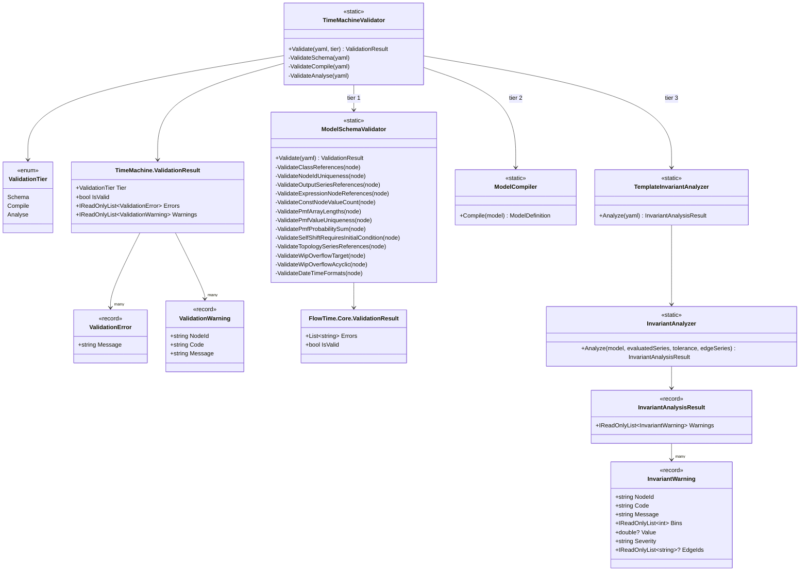
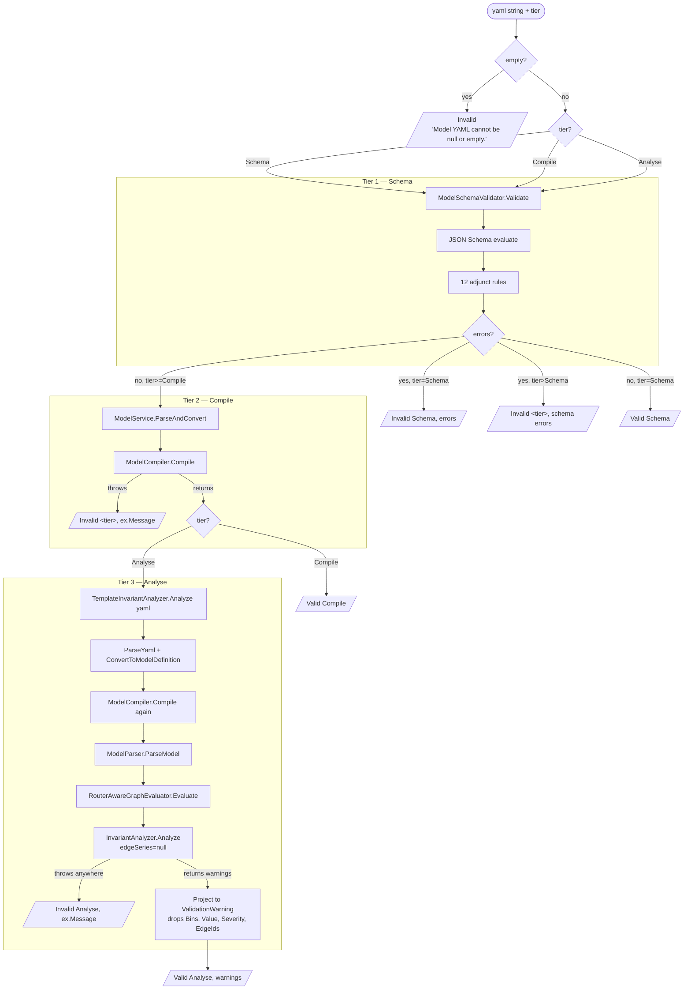

# Validation Stack

The three-tier validation architecture as static structures. The pipeline view (which caller invokes which tier when) is owned by Agent C; this document focuses on what the validators are, what they check, and what they return.

## Tier model

`ValidationTier` is an `enum` declared at `src/FlowTime.TimeMachine/Validation/ValidationTier.cs:7-26` with three values:

| Value | Stated intent (per code XML doc) | What it actually does |
|---|---|---|
| `Schema` | "YAML parses + JSON schema validates + class references resolve. Cheap — no compile, no evaluation." (`ValidationTier.cs:9-13`) | Runs `ModelSchemaValidator.Validate(yaml)` only (`TimeMachineValidator.cs:48`). That validator parses YAML, walks the JSON schema, and runs all 12 adjunct rules — including ones that parse expression ASTs and walk topology references. So tier 1 is "schema + adjuncts", which exceeds the docstring claim of "cheap". |
| `Compile` | "Schema (tier 1) + model compiles into a Graph. Catches structural errors: unresolved node references, expression parse failures." (`ValidationTier.cs:15-19`) | Runs tier 1, then `ModelService.ParseAndConvert` + `ModelCompiler.Compile` (`TimeMachineValidator.cs:70-71`). It does **not** call `ModelParser.ParseModel`, so expression parse failures are not actually caught at tier 2 (they'd fire only when `ModelParser.ParseSingleNode` runs — which is a tier-3 path). |
| `Analyse` | "Compile (tier 2) + deterministic evaluation + invariant checks. Catches semantic issues: conservation violations, capacity/utilization breaches." (`ValidationTier.cs:21-25`) | Runs tier 1 + 2, then `TemplateInvariantAnalyzer.Analyze(yaml)` (`TimeMachineValidator.cs:93`), which re-parses the YAML, recompiles, parses to graph, runs `RouterAwareGraphEvaluator.Evaluate`, and calls `InvariantAnalyzer.Analyze` on the resulting context. |

Tiers cumulate: the implementation calls `ValidateCompile → ValidateSchema` and `ValidateAnalyse → ValidateCompile` (`TimeMachineValidator.cs:61-62, :84-85`), and an early-return on the inner tier preserves its errors at the outer tier (`TimeMachineValidator.cs:64, :87`).

> **Drift:** The tier-3 path re-parses YAML and reruns compilation a second time inside `TemplateInvariantAnalyzer.Analyze` even after `ValidateCompile` has already done it once. This is documented nowhere; it's a side-effect of the tier-3 entry point being the same `Analyze(yaml)` used by Sim service callers (`src/FlowTime.Sim.Cli/Program.cs:309`, `src/FlowTime.Sim.Service/Program.cs:101, :377, :439`).

## `TimeMachineValidator` orchestration

Single static class at `src/FlowTime.TimeMachine/Validation/TimeMachineValidator.cs:17-104`. The public surface is one method:

```
public static ValidationResult Validate(string yaml, ValidationTier tier)
```

(`TimeMachineValidator.cs:25-39`).

Behaviour:

1. Empty YAML short-circuits with `ValidationResult.Invalid(tier, ["Model YAML cannot be null or empty."])` (`TimeMachineValidator.cs:27-30`).
2. Dispatches by tier with a `switch` (`TimeMachineValidator.cs:32-38`); unknown tier throws `ArgumentOutOfRangeException`.
3. Each tier method catches `Exception` and converts to a `ValidationResult.Invalid` with the exception message (e.g., `TimeMachineValidator.cs:73-76, :99-102`). This is broad — there is no error-class taxonomy at this layer; YAML-parse, compile-throw, and analyse-throw all surface as a single string error.
4. Returns are HTTP 200-shaped: errors live in the result, not in status codes (per the XML comment at `TimeMachineValidator.cs:21-22`).

The tier methods are:

- `ValidateSchema` (`TimeMachineValidator.cs:41-56`) — calls `ModelSchemaValidator.Validate`, copies its `Errors` into a tier-1 result.
- `ValidateCompile` (`TimeMachineValidator.cs:58-79`) — runs tier 1, then `ModelService.ParseAndConvert(yaml)` followed by `ModelCompiler.Compile(model)`. Throws are caught and converted.
- `ValidateAnalyse` (`TimeMachineValidator.cs:81-103`) — runs tier 2, then `TemplateInvariantAnalyzer.Analyze(yaml)` and projects each `InvariantWarning` to a `ValidationWarning(NodeId, Code, Message)`. The richer fields (`Bins`, `Value`, `Severity`, `EdgeIds`) on `InvariantWarning` are dropped at this projection (`TimeMachineValidator.cs:94-96`).

## Schema tier — `ModelSchemaValidator`

Single static class at `src/FlowTime.Core/Models/ModelSchemaValidator.cs:14-995`. The public surface is `Validate(string yaml) → ValidationResult` (`ModelSchemaValidator.cs:22-95`); test-only entry points (`CollectErrorsForTests`, `SynthesizePathOnlyErrorForTests`) at `:213-222`.

Internal sequence:

1. Empty-YAML short-circuit (`:26-30`).
2. Lazy schema load (`:32-39, :97-130`). The schema is read from `docs/schemas/model.schema.yaml` via `DirectoryProvider.FindSolutionRoot` (`:101-108`) and `JsonEverything.JsonSchema.FromText` (`:117-123`). A failed load surfaces as a single error string.
3. YAML→JSON conversion (`:43, :902-994`). `ParseScalar` (`:963-994`) honours YAML 1.2's quoted-vs-plain typing rule (m-E24-04 / ADR-E-0024-04).
4. Schema evaluation (`:46`) with `OutputFormat.Hierarchical`.
5. Error collection (`:48-62`) — `CollectErrors` walks the evaluation tree (`:132-154`); `SynthesizePathOnlyError` (`:165-171`) is a fallback for the JsonEverything silent-error class D3 (a subtree marked invalid with no leaf message).
6. Adjunct rules (`:64-83`) — 12 named methods, all returning `IEnumerable<string>` and concatenated onto the running error list.

The original adjunct is `ValidateClassReferences` (`:224-268`); the 12 m-E23-01 adjuncts that sit "alongside" it are listed below.

### The 12 adjunct rule methods

Each is invoked from the orchestrator block at `ModelSchemaValidator.cs:64-83`. "Structural" = could in principle be expressed as JSON Schema. "Semantic" = requires cross-field, cross-array, or AST inspection that JSON Schema draft-07 cannot represent.

| # | Method | Lines | What it checks | Class |
|---|---|---|---|---|
| 1 | `ValidateNodeIdUniqueness` | `:291-313` | Every `nodes[].id` must be unique within the array. | Structural (array-of-object uniqueness on a single field) — schema cannot express via draft-07. |
| 2 | `ValidateOutputSeriesReferences` | `:321-348` | Every `outputs[].series` must match a declared `nodes[].id` or be `*`. | Semantic (cross-array reference). |
| 3 | `ValidateExpressionNodeReferences` | `:358-406` | Every node reference inside an `expr` formula must resolve to a declared `nodes[].id`. Walks the AST via `ExpressionParser` and `NodeReferenceCollector` (`:869-900`). Unparseable expressions silently skipped (deferred to `ModelParser`). | Semantic (cross-field + AST inspection). |
| 4 | `ValidateConstNodeValueCount` | `:415-450` | `const` nodes' `values` length must equal `grid.bins`. | Semantic (cross-array length to a scalar elsewhere). |
| 5 | `ValidatePmfArrayLengths` | `:457-483` | `pmf.values` length == `pmf.probabilities` length. | Semantic (cross-array length within sibling). |
| 6 | `ValidatePmfValueUniqueness` | `:490-522` | No duplicate value in `pmf.values`. | Structural (array-of-number uniqueness). |
| 7 | `ValidatePmfProbabilitySum` | `:530-565` | `Σ pmf.probabilities` ≈ 1.0 (tolerance 1e-4). | Semantic (numeric aggregation). |
| 8 | `ValidateSelfShiftRequiresInitialCondition` | `:574-618` | When `expr` uses `SHIFT(self, n>0)`, `topology.nodes[id].initialCondition.queueDepth` must be set. Reuses `ExpressionSemanticValidator.Validate` (`:605`). | Semantic (cross-section: nodes ↔ topology; AST inspection). |
| 9 | `ValidateTopologySeriesReferences` | `:627-678` | Each topology semantics binding (13 explicit fields including `arrivals`, `served`, `errors`, `attempts`, `failures`, `exhaustedFailures`, `retryEcho`, `retryBudgetRemaining`, `externalDemand`, `queueDepth`, `capacity`, `processingTimeMsSum`, `servedCount`) must resolve to a declared `nodes[].id`. Honours `self`, `file:`, `series:` prefix, `@classId` suffix. | Semantic (cross-section reference). |
| 10 | `ValidateWipOverflowTarget` | `:686-719` | A topology node's `wipOverflow` must be `"loss"` or another topology node id. | Semantic (cross-array reference within topology). |
| 11 | `ValidateWipOverflowAcyclic` | `:727-764` | The `wipOverflow` graph must be acyclic. | Semantic (graph cycle detection). |
| 12 | `ValidateDateTimeFormats` | `:773-786` | `grid.start` and `provenance.generatedAt`, when present, must parse as ISO-8601. (Draft-07's `format: date-time` is annotation-only in JsonEverything.) | Structural in principle; defaulted to imperative because the JSON-Schema engine treats it as advisory. |

Expression-AST inspection points: rule #3 (`ValidateExpressionNodeReferences`, lines 383-405) and rule #8 (`ValidateSelfShiftRequiresInitialCondition`, lines 601-617). Both go through `ExpressionParser.Parse()` and silently skip on parse failure — the parser failure is owned by `ModelParser`/`ExpressionCompiler` downstream.

### Helpers

- `CollectNodeIds` (`:790-804`) — extracts the set of `nodes[].id`.
- `CollectTopologyInitialIds` (`:806-831`) — set of topology ids whose `initialCondition` is supplied (plus their `semantics.queueDepth` series id).
- `IsPmfNode` (`:833-837`).
- `TryGetGridBins` (`:839-853`).
- `TryParseIsoDateTime` (`:855-862`).
- `NodeReferenceCollector` private visitor (`:869-900`).
- YAML→JSON conversion (`:902-994`), with `ParseScalar` honouring quote style.

The result type is the Core-layer `ValidationResult` (`src/FlowTime.Core/Models/ValidationResult.cs:6-15`) — a thin holder of `List<string> Errors`. This is **different** from the `TimeMachine` `ValidationResult` (see "Validator results").

## Compile tier — `ModelCompiler`

Single static class at `src/FlowTime.Core/Compiler/ModelCompiler.cs:8-425`. Public surface is `Compile(ModelDefinition, ILogger?) → ModelDefinition` (`:17`).

What it transforms:

- **Synthetic queue nodes.** For each topology node whose `Kind` is `serviceWithBuffer`, `queue`, or `dlq` (`:10-15` `queueLikeKinds`), if no producer node already exists for the queue's `semantics.queueDepth` series, the compiler appends a synthesised `serviceWithBuffer` `NodeDefinition` with `inflow=semantics.arrivals`, `outflow=semantics.served || semantics.capacity`, optional `loss=semantics.errors`, propagated `dispatchSchedule`, `wipLimit`/`wipLimitSeries`/`wipOverflow`, and metadata flags `graph.hidden=true` + `series.origin=derived` (`:36-73`). The new node id comes from `DetermineQueueNodeId` (`:175-203`), defaulting to `<topo-id>_queue` (snake-cased).
- **Synthetic retry-echo nodes.** If a topology node's `semantics.retryEcho` resolves to a series that has no producer and a kernel/failures pair is available, an `expr`-kind node is synthesised with `expr = CONV(<failures>, [kernel...])` (`:77-117`). The retry kernel is normalised by `RetryKernelPolicy.Apply` (`:90-91`).
- **Reference resolution for `wipOverflow`.** Two-pass: first the queue nodes are synthesised (`:29-117`), then `ResolveWipOverflowTargets` (`:352-388`) translates each generated `serviceWithBuffer` node's `wipOverflow` from the topology-node id to the corresponding queue-node id, validating the routing graph for cycles before resolving (`:365-366, :390-424`).

Error model: **throws** on validation failures during compile.

- `RequireSeries` (`:149-157`) throws `InvalidOperationException` when an arrivals binding is missing.
- `ResolveQueueOutflow` (`:159-173`) throws `InvalidOperationException` when neither `served` nor `capacity` is set on a topology node.
- `ResolveWipOverflowTargets` (`:379-384`) throws `InvalidOperationException` when a `wipOverflow` target doesn't match a topology node with a queue-depth series.
- `ValidateNoOverflowCycles` (`:394-424`) throws `InvalidOperationException` on a cycle.
- `ParseModel` (the next stage, called only at tier 3) throws `ModelParseException` on per-node failures (`ModelParser.cs:526-530`).

`ModelCompiler.Compile` returns the original `ModelDefinition` unchanged when there's no topology to expand (`:21-22`) or when no synthesis happened (`:119-122`).

What is **not** in `ModelCompiler`:

- **Fan-out routing-authority detection** — confirmed absent. Routing is a node kind (`router`) that is dispatched at parse time and materialised post-evaluation by `RouterFlowMaterializer`; the compiler does no routing-authority computation.
- **Expression parsing or expression-reference resolution** — those happen later in `ModelParser.ParseSingleNode` → `ExpressionParser` (`ModelParser.cs:402-405`), invoked only at tier 3.
- **Graph topological sort** — that's `Graph.ComputeTopologicalOrderWithFeedback` (`Graph.cs:150-228`), tier 3.
- **Outputs validation** — outputs are propagated unchanged (`:134`).

## Analyse tier — `InvariantAnalyzer`

Single static class at `src/FlowTime.Core/Analysis/InvariantAnalyzer.cs:15`. Public surface:

```
public static InvariantAnalysisResult Analyze(
    ModelDefinition model,
    IReadOnlyDictionary<NodeId, double[]> evaluatedSeries,
    double tolerance = 1e-6,
    IReadOnlyList<RunArtifactWriter.EdgeSeriesInput>? edgeSeries = null)
```

(`:19-23`).

Shape:

- One ~1864-line static method body. The outer foreach loop iterates `model.Topology.Nodes` (`:123`); for each topology node it pulls its semantics-bound series from `evaluatedSeries` via local helpers (`:147-186`), runs a sequence of checks, and appends to a single `List<InvariantWarning>` (`:28`).
- Three trailing top-level passes (`:585-587`):
  - `AppendRouterDiagnostics` — runs the `ClassContributionBuilder` and surfaces router-level diagnostics as `router_diagnostics` warnings, plus a fallback `router_diagnostics_failed` if the builder throws (`:1421-1469`).
  - `AppendServiceWithBufferClassCoverageWarnings` (`:1471-1512`) — checks per-class coverage for serviceWithBuffer nodes.
  - `AppendTopologyClassCoverageWarnings` (`:1514-1559`) — same for topology nodes.
- A pre-loop pass `AppendPostEvalInjectionWarnings` (`:1824-1852`) emits a single `post_eval_injection` warning when `evaluatedSeries` contains node ids absent from `model.Nodes`.

The warning families it emits (codes are stable strings, used by callers and UI):

- **Conservation / non-negativity.** `arrivals_negative`, `served_negative`, `errors_negative`, `attempts_negative`, `failures_negative`, `exhausted_failures_negative`, `queue_negative`, `retry_echo_negative`, `retry_budget_negative` (`:232-240`); `served_exceeds_arrivals`, `served_exceeds_capacity`, `errors_exceed_arrivals`, `attempts_below_arrivals`, `failures_exceed_attempts`, `exhausted_exceeds_failures`, `exhausted_exceeds_errors` (`:245-292`); `queue_depth_mismatch` (`:871`).
- **Edge conservation.** `edge_flow_mismatch_outgoing`, `edge_flow_mismatch_incoming` (`:315, :329`); `edge_class_mismatch`, `edge_class_partial_coverage` (`:1003, :1119`); `edge_behavior_violation_lag` (`:95`).
- **Constraint coverage.** `constraint_missing_arrivals`, `constraint_missing_served` (`:206, :216`).
- **Missing-series infos.** `missing_capacity_series`, `missing_exhausted_failures_series`, `missing_retry_budget_series`, `capacity_all_zero`, `missing_dependency_arrivals`, `missing_dependency_served`, `missing_served_series`, `dependency_missing_effort_edges`, `dependency_retry_pressure_missing`, `missing_queue_depth_series`, `missing_processing_time_series`, `missing_served_count_series` (`:377-531`).
- **Latency.** `queue_latency_gate_closed`, `queue_latency_unreported` (`:564-565`).
- **DLQ topology.** `dlq_non_terminal_inbound`, `dlq_non_terminal_outbound` (`:1154, :1172`).
- **Dispatch schedule.** `dispatch_capacity_missing`, `dispatch_missing_served_series`, `dispatch_never_releases` (`:1211, :1222, :1246`).
- **Router diagnostics.** `router_diagnostics`, `router_diagnostics_failed` (`:1462, :1463`).
- **Class coverage.** `class_coverage_failed`, `topology_class_coverage_failed`, `class_series_missing_<label>`, `class_series_partial_<label>` (`:1506, :1553, :1746-1762`).
- **Post-evaluation injection.** `post_eval_injection` (`:1847`).

Total distinct codes seen by grep: ~48, plus the `class_series_missing_<label>` / `class_series_partial_<label>` family which are computed at runtime.

`InvariantWarning` record shape (`:1855-1862`):

```
public sealed record InvariantWarning(
    string NodeId,
    string Code,
    string Message,
    IReadOnlyList<int> Bins,
    double? Value,
    string Severity = "warning",
    IReadOnlyList<string>? EdgeIds = null);
```

Field population varies by emitter:

- `Bins` is populated by the per-bin offenders for negative/exceedance checks (`CheckNonNegative` at `:780-786`, `CheckDiff` at `:821-826`, `ValidateQueue` at `:867-874`, latency at `:570-576`). It is `Array.Empty<int>()` for "missing series" and topology-shape warnings.
- `Value` carries the worst-bin value (negative checks), worst ratio (diff checks), worst diff (edge conservation), or `null` for shape warnings.
- `Severity` defaults to `"warning"`; some informational checks (e.g., `missing_capacity_series`, `dependency_missing_effort_edges`, `queue_latency_unreported`) explicitly emit `"info"` (`:381, :460, :576`).
- `EdgeIds` is populated by edge-conservation warnings (`:1054, :1138-1139`) and is `null` elsewhere.

Runtime data the analyser has access to:

- `model: ModelDefinition` — full structural model post-compile.
- `evaluatedSeries: IReadOnlyDictionary<NodeId, double[]>` — every node's full series.
- `edgeSeries: IReadOnlyList<EdgeSeriesInput>?` — per-edge / per-class flow volumes (built by `EdgeFlowMaterializer`). The analyser builds two lookup tables from these (`:104-105`, `:593-621, :624-660`).
- An on-demand `classContributions` map computed via `ClassContributionBuilder.Build` (`:113`) when class assignments exist.
- Topology lookup, constraint lookup, queue-initial map, runtime analytical descriptors (`:39-48`).

## Sim-side analyser — `TemplateInvariantAnalyzer`

Single static class at `src/FlowTime.Sim.Core/Analysis/TemplateInvariantAnalyzer.cs:10-28`. Public surface:

```
public static InvariantAnalysisResult Analyze(string modelYaml)
```

It is a thin **adapter** that does not duplicate `InvariantAnalyzer`'s logic. It:

1. Empty-YAML short-circuit returning an empty `InvariantAnalysisResult` (`:14-17`).
2. `ModelService.ParseYaml` → `ModelService.ConvertToModelDefinition` (`:19-20`).
3. `ModelCompiler.Compile` (`:21`).
4. `ModelParser.ParseModel` → `(grid, graph)` (`:22`).
5. `RouterAwareGraphEvaluator.Evaluate(compiledModel, graph, grid)` (`:23`).
6. Calls back into `InvariantAnalyzer.Analyze(compiledModel, evaluation.Context)` (`:26`).

So `TemplateInvariantAnalyzer` is the YAML-to-warnings convenience wrapper; the actual checks live in `InvariantAnalyzer`. Note it does not pass `edgeSeries`, so any edge-conservation check that depends on `edgeSeries` (the `edge_flow_mismatch_*` family at `InvariantAnalyzer.cs:307-336`) is silently inert in this code path.

> **Drift:** The Sim-side analyser does not materialise edge flow series before invoking `InvariantAnalyzer`, so `edge_flow_mismatch_outgoing`, `edge_flow_mismatch_incoming`, `edge_class_mismatch`, and `edge_class_partial_coverage` warnings are unreachable from the tier-3 validation path even though they are reachable from `RunArtifactWriter` (`src/FlowTime.Core/Artifacts/RunArtifactWriter.cs:116`, where `request.EdgeSeries` is passed in). Confirmed by reading both code paths.

## Validator results

Three different result types coexist:

### Core `ValidationResult`

Declared at `src/FlowTime.Core/Models/ValidationResult.cs:6-15`. Just `List<string> Errors` and a derived `IsValid` flag. Used by `ModelSchemaValidator.Validate` directly.

### TimeMachine `ValidationResult`

Declared at `src/FlowTime.TimeMachine/Validation/ValidationResult.cs:6-39`. Carries:

- `Tier: ValidationTier`
- `Errors: IReadOnlyList<ValidationError>` where `ValidationError(string Message)` (`:33`).
- `Warnings: IReadOnlyList<ValidationWarning>` where `ValidationWarning(string NodeId, string Code, string Message)` (`:39`).
- `IsValid` derived from `Errors.Count == 0`.

Constructed via static factories `Valid` / `Invalid` (`:23-27`).

### `InvariantAnalysisResult` and `InvariantWarning`

Declared at `src/FlowTime.Core/Analysis/InvariantAnalyzer.cs:1855-1864`.

### Information loss across boundaries

Going from `InvariantAnalyzer` → `TemplateInvariantAnalyzer` → `TimeMachineValidator` → `ValidationResult.Warnings`:

| Field on `InvariantWarning` | Carried into `ValidationWarning`? |
|---|---|
| `NodeId` | yes |
| `Code` | yes |
| `Message` | yes |
| `Bins` | **no — dropped** (`TimeMachineValidator.cs:94-96`) |
| `Value` | **no — dropped** |
| `Severity` | **no — dropped** (every warning surfaces equivalently to a tier-3 caller) |
| `EdgeIds` | **no — dropped** |

Going from `ModelSchemaValidator.ValidationResult.Errors` (a `List<string>`) → `TimeMachineValidator.ValidationResult.Errors` (a list of `ValidationError(Message)`): no loss — the strings become messages with no further structure. There is no error code on the schema-tier side, so consumers cannot distinguish a missing-required-field error from an invalid-enum error from a synthesised-path-only fallback.

There is also no carry-through of YAML line/column positions: `ModelSchemaValidator.CollectErrors` (`:132-154`) prepends an `InstanceLocation` JSON-pointer (e.g., `/nodes/2/values`) but no source-line/column. JsonEverything's `EvaluationResults` does not natively know YAML positions.

## What is NOT validated

Verified absences (each confirmed by reading the validator code and grepping for the missing concept):

1. **Expression cycle detection across non-WIP nodes.** `Graph.ComputeTopologicalOrderWithFeedback` throws on a same-bin algebraic cycle at evaluation time (`Graph.cs:175-176`), but no validator pre-empts this — a cycle in `expr → expr` survives schema and compile tiers and only fails at tier 3 with an opaque "Graph has a cycle" message. Self-shift is the only AST-level cycle pattern that the validators specifically check for (`ValidateSelfShiftRequiresInitialCondition`).
2. **Edge endpoint kind-coherence.** No layer validates that the source/target node ids on `topology.edges[]` resolve to declared nodes — only schema string-presence is enforced. `ValidateTopologySeriesReferences` (rule 9) covers semantics bindings but not edge endpoints.
3. **Edge-type enum membership.** Schema declares `type: enum [throughput, effort, terminal, dependency]` and `measure: enum [served, attempts, errors, failures, exhaustedFailures, load]` (`docs/schemas/model.schema.yaml:383, :389`) — these are caught by JSON Schema, but there is no semantic check that, e.g., `measure: served` matches a valid binding on the target.
4. **Default-substituted-model well-formedness.** Sim does parameter substitution against template text; whether the template's default values produce a schema-valid model is not validated end-to-end at the engine boundary — only the post-substitution model is validated.
5. **`outputs[].as` filename collisions.** Each `as` value is regex-validated by the schema, but there is no check that two outputs declare the same `as`.
6. **`wipLimitSeries` reference resolution.** A node id is supplied (`NodeDefinition.WipLimitSeries`, `ModelParser.cs:596`), but no adjunct validates that the referenced node exists. The parser will raise `KeyNotFoundException` from `Graph.EvaluateInternal`'s memo at tier 3.
7. **`router.routes[].target` reference resolution.** `ParseRouterNode` requires a non-empty `target` string (`ModelParser.cs:479-481`) but does not validate that it points at an existing node. `ValidateExpressionNodeReferences` only covers `expr` formulas.
8. **`router.inputs.queue` reference resolution.** Same gap — required to be non-empty (`ModelParser.cs:467-470`) but not cross-validated against `nodes[].id`.
9. **`dispatchSchedule.capacitySeries` reference resolution.** `InvariantAnalyzer` emits `dispatch_capacity_missing` at tier 3 (`InvariantAnalyzer.cs:1209-1216`) but no earlier tier catches it.
10. **`Inflow`/`Outflow`/`Loss` reference resolution for serviceWithBuffer.** `ParseServiceWithBufferNode` requires non-empty (`ModelParser.cs:454-455`) but does not check that the referenced ids exist. Failure surfaces at evaluation time as a `KeyNotFoundException` from the memo lookup.
11. **Parameter type/usage cross-checks.** The post-substitution model has no parameter concept; this falls to template-tier validation in Sim, not the engine validators.
12. **Conflict between `wipLimit` (scalar) and `wipLimitSeries` (reference).** Both can be set on the same node; the runtime silently prefers the series (`ServiceWithBufferNode.cs:104-106`). No validator flags the redundancy.

## Drift findings

1. **Tier-1 cost.** `ValidationTier.cs:9-13` claims tier 1 is "cheap — no compile, no evaluation." In reality, tier 1 runs 12 adjuncts that include AST parsing (rules 3 and 8) and graph-cycle detection over the wipOverflow graph (rule 11). It's still cheaper than tiers 2 and 3, but not free.
2. **Tier-3 double work.** `TemplateInvariantAnalyzer.Analyze` re-parses YAML and re-runs `ModelCompiler.Compile` after `ValidateCompile` already did (compare `TimeMachineValidator.cs:70-71` with `TemplateInvariantAnalyzer.cs:19-21`).
3. **Edge-flow warnings are unreachable from tier 3.** See "Sim-side analyser" drift note above.
4. **Severity / Bins / EdgeIds dropped at the TimeMachine boundary.** Tier-3 callers via `TimeMachineValidator` see only `(NodeId, Code, Message)` — the `Severity` distinction between `"warning"` and `"info"` is lost.
5. **Two `ValidationResult` types in two namespaces.** `FlowTime.Core.ValidationResult` (`src/FlowTime.Core/Models/ValidationResult.cs`) vs `FlowTime.TimeMachine.Validation.ValidationResult` (`src/FlowTime.TimeMachine/Validation/ValidationResult.cs`). These are unrelated types with the same name; a stack trace mentioning `ValidationResult` is ambiguous.
6. **DTO field rename surface.** `topology.edges[].from`/`to` (DTO + schema) becomes `Source`/`Target` on the runtime `TopologyEdgeDefinition` and `Edge`. This is an invisible rename — no validator surfaces the mismatch in error messages, and a hand-authored YAML using `source: ...` (i.e. matching the runtime type) would pass JSON Schema (since `additionalProperties: true` on edges, `model.schema.yaml:405`) but produce empty source/target ids at convert time.
7. **`edge_behavior_violation_lag` is policy, not invariant.** The warning fires whenever any edge has positive lag (`InvariantAnalyzer.cs:82-102`), regardless of correctness; the message "Model transit as an explicit node instead of edge behavior" is a style enforcement, not a correctness check.
8. **Adjunct comment block.** The header comment at `ModelSchemaValidator.cs:270-283` references `work/epics/E-0023-model-validation-consolidation/m-E23-01-rule-coverage-audit-tracking.md` as the source of truth for the cross-reference findings — that file lives only in the planning tree and is the authoritative table for what each adjunct enforces.

## Diagrams




